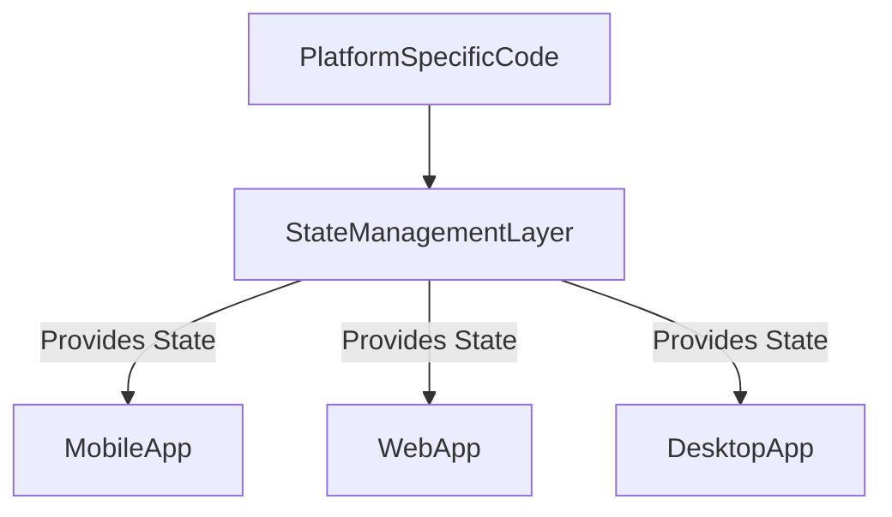

## 12.2.1 State Management for Web and Desktop

As Flutter continues to evolve, its capability to target multiple platforms—mobile, web, and desktop—presents both opportunities and challenges for developers. One of the critical areas requiring adaptation is state management. This section explores how state management approaches need to adapt when building Flutter applications for web and desktop platforms, ensuring a seamless and efficient user experience across all devices.

### Differences Between Platforms

When developing applications for different platforms, it's essential to understand the unique characteristics and user expectations associated with each. 

- **User Interactions and Expectations:**
  - **Mobile:** Users interact with mobile apps primarily through touch gestures. Mobile applications are expected to be responsive and optimized for smaller screens, with a focus on performance and battery efficiency.
  - **Web:** Web applications often involve more complex interactions, including mouse and keyboard inputs. Users expect quick load times and seamless navigation. SEO considerations are also crucial for web applications to ensure visibility and accessibility.
  - **Desktop:** Desktop applications can leverage larger screens and more powerful hardware. They often support multi-window operations and require integration with the operating system's native features, such as file systems and notifications.

- **Specific Considerations:**
  - **Screen Sizes:** Web and desktop applications must accommodate larger and variable screen sizes, requiring responsive design and flexible layouts.
  - **Input Methods:** The diversity of input methods (touch, mouse, keyboard) necessitates adaptable interaction models.
  - **Performance Constraints:** While desktops generally offer more resources, web applications must consider network latency and browser limitations.

### State Management Adjustments

Given these differences, state management solutions must be evaluated and potentially adjusted to meet the specific needs of web and desktop applications.

- **Current Solutions Evaluation:**
  - Many existing state management solutions like Provider, Riverpod, and Bloc are designed with mobile in mind but can be adapted for web and desktop.
  - **Challenges:**
    - **SEO for Web:** State management must consider server-side rendering (SSR) and hydration to improve SEO.
    - **Multi-Window Support on Desktop:** Desktop applications may require state synchronization across multiple windows or instances.

- **Potential Adjustments:**
  - Implementing SSR in web applications can involve using frameworks like Next.js with Flutter Web or integrating with backend services to pre-render content.
  - For desktop, leveraging platform-specific APIs to manage state across multiple windows or integrating with native OS features can enhance user experience.

### Cross-Platform Consistency

Maintaining consistent state management across different platforms is crucial for providing a seamless user experience.

- **Strategies for Consistency:**
  - **Platform-Agnostic Code:** Write state management logic that is independent of platform-specific details. This can be achieved by abstracting platform-specific code and using conditional imports where necessary.
  - **Shared State Management Layer:** Implement a centralized state management layer that serves all platforms, ensuring that business logic and state transitions remain consistent.

### Platform-Specific Enhancements

While consistency is essential, leveraging platform-specific features can significantly enhance the user experience.

- **Platform-Specific Tools and Patterns:**
  - **Web APIs:** Utilize web-specific APIs for features like local storage, service workers, and push notifications.
  - **Desktop Functionalities:** Integrate with desktop-specific features such as file system access, system notifications, and multi-window management.

- **Leveraging Conditional Imports:**
  - Use Dart's conditional imports to include platform-specific code only when necessary, ensuring that the core application logic remains clean and maintainable.

### Code Examples

Below are some code examples demonstrating state management in web and desktop contexts, highlighting how to handle platform-specific features.

```dart
// Example of conditional imports for platform-specific code

import 'package:flutter/foundation.dart' show kIsWeb;

void platformSpecificFunction() {
  if (kIsWeb) {
    // Web-specific code
    print('Running on the web');
  } else {
    // Desktop-specific code
    print('Running on desktop');
  }
}
```

```dart
// Example of using Provider for state management across platforms

import 'package:flutter/material.dart';
import 'package:provider/provider.dart';

void main() {
  runApp(
    ChangeNotifierProvider(
      create: (_) => CounterModel(),
      child: MyApp(),
    ),
  );
}

class CounterModel extends ChangeNotifier {
  int _count = 0;

  int get count => _count;

  void increment() {
    _count++;
    notifyListeners();
  }
}

class MyApp extends StatelessWidget {
  @override
  Widget build(BuildContext context) {
    return MaterialApp(
      home: Scaffold(
        appBar: AppBar(title: Text('Cross-Platform Counter')),
        body: Center(
          child: Consumer<CounterModel>(
            builder: (context, counter, child) {
              return Text('Count: ${counter.count}');
            },
          ),
        ),
        floatingActionButton: FloatingActionButton(
          onPressed: () => context.read<CounterModel>().increment(),
          child: Icon(Icons.add),
        ),
      ),
    );
  }
}
```

### Mermaid.js Diagrams

To visualize the state flow in a multi-platform application, consider the following diagram:



This diagram illustrates how a centralized state management layer can serve multiple platforms, with platform-specific code feeding into this layer as needed.

### Best Practices

- **Testing Across Platforms:** Ensure that state management implementations are thoroughly tested on all target platforms to identify and resolve any platform-specific issues.
- **Abstracting Platform-Specific Code:** Keep platform-specific code separate from the core state management logic to maintain clean and maintainable codebases.
- **Continuous Learning:** Stay updated with the latest developments in Flutter and state management to leverage new tools and techniques effectively.

### Conclusion

Adapting state management for web and desktop platforms in Flutter involves understanding platform-specific requirements and leveraging the right tools and strategies. By maintaining cross-platform consistency and embracing platform-specific enhancements, developers can create robust applications that deliver a seamless user experience across all devices.

## Quiz Time!



### What is a key difference in user interaction between mobile and desktop applications?

- [x] Mobile apps primarily use touch gestures, while desktop apps use mouse and keyboard inputs.
- [ ] Mobile apps use mouse inputs, while desktop apps use touch gestures.
- [ ] Both mobile and desktop apps primarily use touch gestures.
- [ ] Desktop apps do not support keyboard inputs.

> **Explanation:** Mobile applications are typically designed for touch interactions, whereas desktop applications use mouse and keyboard inputs, reflecting the different hardware and user expectations.

### Why is SEO a consideration for web applications in state management?

- [x] SEO affects visibility and accessibility, requiring server-side rendering and hydration.
- [ ] SEO is irrelevant to state management.
- [ ] SEO only affects mobile applications.
- [ ] SEO is only concerned with desktop applications.

> **Explanation:** SEO is crucial for web applications to ensure they are visible and accessible, which may require server-side rendering and hydration to optimize content for search engines.

### What is a challenge specific to desktop applications in state management?

- [x] Multi-window support and state synchronization.
- [ ] Handling touch gestures.
- [ ] SEO optimization.
- [ ] Limited screen size.

> **Explanation:** Desktop applications often require support for multiple windows, necessitating state synchronization across these windows to ensure a consistent user experience.

### How can platform-specific code be managed in a Flutter application?

- [x] Using conditional imports to separate platform-specific code.
- [ ] Writing all code in a single file.
- [ ] Avoiding platform-specific code entirely.
- [ ] Using only web-specific APIs.

> **Explanation:** Conditional imports allow developers to include platform-specific code only when necessary, keeping the core application logic clean and maintainable.

### What is a benefit of maintaining a shared state management layer across platforms?

- [x] Ensures consistent business logic and state transitions.
- [ ] Increases code duplication.
- [ ] Limits application functionality.
- [ ] Reduces application performance.

> **Explanation:** A shared state management layer ensures that business logic and state transitions remain consistent across platforms, reducing code duplication and improving maintainability.

### Which input method is primarily used in web applications?

- [x] Mouse and keyboard inputs.
- [ ] Touch gestures only.
- [ ] Voice commands.
- [ ] Stylus inputs.

> **Explanation:** Web applications typically involve mouse and keyboard inputs, reflecting the common hardware setup for web users.

### What is a strategy for ensuring cross-platform consistency in state management?

- [x] Writing platform-agnostic code.
- [ ] Using platform-specific APIs exclusively.
- [ ] Avoiding state management entirely.
- [ ] Writing separate codebases for each platform.

> **Explanation:** Writing platform-agnostic code helps maintain consistency across platforms, ensuring that state management logic is independent of platform-specific details.

### What is a key consideration for web applications that is not typically a concern for mobile apps?

- [x] SEO requirements.
- [ ] Battery efficiency.
- [ ] Touch gesture support.
- [ ] Screen size limitations.

> **Explanation:** SEO requirements are specific to web applications to ensure visibility and accessibility, which is not typically a concern for mobile apps.

### How can desktop applications leverage platform-specific functionalities?

- [x] By integrating with native OS features like file systems and notifications.
- [ ] By avoiding native OS features entirely.
- [ ] By using only web APIs.
- [ ] By limiting functionality to touch gestures.

> **Explanation:** Desktop applications can enhance user experience by integrating with native OS features, such as file systems and notifications, leveraging the capabilities of the desktop environment.

### True or False: State management solutions designed for mobile can be directly applied to web and desktop without any adjustments.

- [ ] True
- [x] False

> **Explanation:** While many state management solutions can be adapted for web and desktop, they often require adjustments to address platform-specific challenges and requirements.


