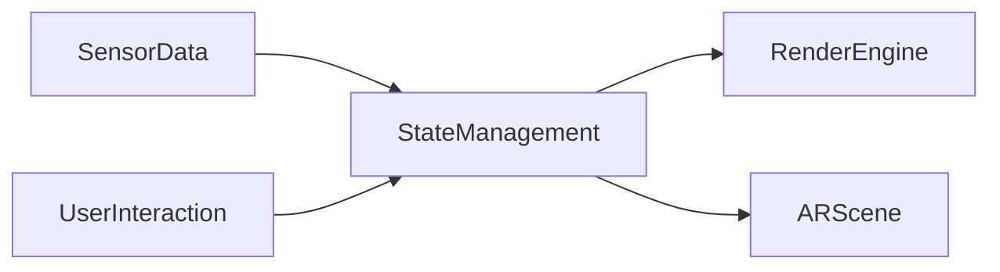

## 12.2.2 State in Augmented and Virtual Reality Apps

As augmented reality (AR) and virtual reality (VR) technologies continue to evolve, they offer exciting new possibilities for creating immersive experiences. Flutter, known for its flexibility and cross-platform capabilities, is increasingly being used to develop AR and VR applications. This section explores how state management principles apply within the context of AR/VR applications built with Flutter, focusing on unique challenges, performance optimization, and effective state synchronization.

### Overview of AR/VR in Flutter

Flutter's ability to create visually appealing and responsive applications extends into the realm of AR and VR. While Flutter is not inherently designed for AR/VR, it can be integrated with powerful plugins and external engines to achieve these capabilities.

- **Flutter’s Capabilities for AR/VR:**
  - Flutter can be used to build AR/VR applications by leveraging plugins such as `ar_flutter_plugin`, which provides a bridge to ARCore on Android and ARKit on iOS.
  - Integration with Unity or Unreal Engine can also be achieved through platform channels, allowing developers to utilize advanced 3D rendering engines while maintaining Flutter's UI capabilities.

- **Plugins and Integrations:**
  - **`ar_flutter_plugin`:** This plugin allows Flutter applications to access ARCore and ARKit functionalities, enabling features such as plane detection, object placement, and environmental understanding.
  - **Unity Integration:** By using platform channels, Flutter can communicate with Unity, enabling complex 3D scenes to be rendered alongside Flutter's UI components.

### Unique State Management Challenges

Developing AR/VR applications presents unique challenges, particularly in managing state efficiently due to the dynamic and interactive nature of these environments.

- **Real-Time 3D Rendering:**
  - AR/VR applications require continuous updates to the state as the user interacts with the virtual environment. This demands a state management solution capable of handling high-frequency updates without introducing latency.

- **High-Frequency State Updates:**
  - The need for real-time responsiveness means that state changes must be processed quickly and efficiently. This is critical for maintaining smooth interactions and avoiding lag, which can disrupt the user experience.

- **Complex User Interactions:**
  - User interactions in AR/VR are often more complex than traditional applications, involving gestures, spatial tracking, and sensor data. Managing these interactions requires a robust state management strategy that can handle multiple input sources simultaneously.

### Optimizing for Performance

Performance optimization is crucial in AR/VR applications to ensure a seamless and immersive experience. Efficient state management plays a key role in achieving this.

- **Minimizing Latency:**
  - Latency can be minimized by using efficient data structures and algorithms that reduce the overhead of state updates. Techniques such as debouncing and throttling can help manage the frequency of updates.

- **Ensuring Smooth Frame Rates:**
  - Maintaining a high frame rate is essential for a smooth AR/VR experience. This can be achieved by offloading heavy computations to background threads and using Flutter's `compute` function to handle intensive tasks without blocking the UI thread.

### State Synchronization

Synchronizing state between the virtual environment and user inputs or sensor data is a critical aspect of AR/VR applications.

- **Managing Synchronization:**
  - State synchronization involves ensuring that changes in the virtual environment are accurately reflected in response to user inputs and sensor data. This requires a state management solution that can handle asynchronous data streams effectively.

- **Examples of Handling State:**
  - Spatial tracking and gesture recognition are common in AR/VR applications. For instance, updating the position of a virtual object based on user gestures requires real-time state updates that are both accurate and efficient.

### Code Examples

Below are simplified code snippets demonstrating how to handle state updates in response to AR/VR events using Flutter.

#### Handling AR Events with Streams

```dart
import 'package:flutter/material.dart';
import 'package:ar_flutter_plugin/ar_flutter_plugin.dart';
import 'package:rxdart/rxdart.dart';

class ARStateManagement extends StatefulWidget {
  @override
  _ARStateManagementState createState() => _ARStateManagementState();
}

class _ARStateManagementState extends State<ARStateManagement> {
  final BehaviorSubject<ARObject> _arObjectStream = BehaviorSubject<ARObject>();

  @override
  void initState() {
    super.initState();
    // Simulate AR object updates
    _simulateARObjectUpdates();
  }

  void _simulateARObjectUpdates() {
    // Simulating continuous updates to AR object state
    Stream.periodic(Duration(milliseconds: 100), (count) {
      return ARObject(position: Vector3(count.toDouble(), 0, 0));
    }).pipe(_arObjectStream);
  }

  @override
  Widget build(BuildContext context) {
    return Scaffold(
      appBar: AppBar(title: Text('AR State Management')),
      body: StreamBuilder<ARObject>(
        stream: _arObjectStream,
        builder: (context, snapshot) {
          if (!snapshot.hasData) return CircularProgressIndicator();
          final arObject = snapshot.data!;
          return Center(
            child: Text('AR Object Position: ${arObject.position}'),
          );
        },
      ),
    );
  }

  @override
  void dispose() {
    _arObjectStream.close();
    super.dispose();
  }
}

class ARObject {
  final Vector3 position;
  ARObject({required this.position});
}

class Vector3 {
  final double x, y, z;
  Vector3(this.x, this.y, this.z);

  @override
  String toString() => '($x, $y, $z)';
}
```

#### Using RxDart for High-Frequency Data

```dart
import 'package:rxdart/rxdart.dart';

class ARDataHandler {
  final BehaviorSubject<Vector3> _positionSubject = BehaviorSubject<Vector3>();

  Stream<Vector3> get positionStream => _positionSubject.stream;

  void updatePosition(Vector3 newPosition) {
    _positionSubject.add(newPosition);
  }

  void dispose() {
    _positionSubject.close();
  }
}
```

### Mermaid.js Diagrams

To better understand the flow of state in an AR application, consider the following diagram:



This diagram illustrates how sensor data and user interactions feed into the state management system, which then updates the render engine and AR scene accordingly.

### Best Practices

When developing AR/VR applications, adhering to best practices in state management is essential for performance and user experience.

- **Profiling and Optimization:**
  - Regularly profile your application to identify performance bottlenecks. Use tools like Flutter's DevTools to monitor frame rates and memory usage.

- **Efficient Data Structures:**
  - Choose data structures that are optimized for the types of operations your application performs frequently. For example, use lists for sequential data and maps for associative data.

- **Algorithm Efficiency:**
  - Implement algorithms that minimize computational complexity, especially for operations that occur frequently or require real-time processing.

### Conclusion

State management in AR/VR applications built with Flutter presents unique challenges and opportunities. By leveraging efficient state management techniques, developers can create immersive and responsive experiences that take full advantage of AR/VR capabilities. As these technologies continue to evolve, staying informed about best practices and emerging tools will be crucial for building successful applications.

### References and Further Reading

- [Flutter DevTools](https://flutter.dev/docs/development/tools/devtools/overview)
- [AR Flutter Plugin](https://pub.dev/packages/ar_flutter_plugin)
- [RxDart Documentation](https://pub.dev/packages/rxdart)
- [Unity Integration with Flutter](https://flutter.dev/docs/development/platform-integration/platform-channels)

## Quiz Time!



### What is a key challenge in managing state for AR/VR applications?

- [x] Handling high-frequency state updates
- [ ] Managing low-frequency data
- [ ] Simplifying user interactions
- [ ] Reducing the number of state variables

> **Explanation:** AR/VR applications require handling high-frequency state updates due to real-time rendering and complex interactions.

### Which plugin allows Flutter to access ARCore and ARKit functionalities?

- [x] ar_flutter_plugin
- [ ] flutter_unity
- [ ] ar_kit_flutter
- [ ] vr_flutter_plugin

> **Explanation:** The `ar_flutter_plugin` provides access to ARCore and ARKit functionalities in Flutter applications.

### How can latency be minimized in AR/VR applications?

- [x] Using efficient data structures and algorithms
- [ ] Increasing the number of state updates
- [ ] Reducing the frame rate
- [ ] Simplifying the UI

> **Explanation:** Efficient data structures and algorithms help minimize latency by reducing the overhead of state updates.

### What is a common method for synchronizing state with user inputs in AR/VR?

- [x] Using streams to handle asynchronous data
- [ ] Polling for user input
- [ ] Using synchronous state updates
- [ ] Delaying state updates

> **Explanation:** Streams are commonly used to handle asynchronous data, allowing for real-time synchronization with user inputs.

### Which tool can be used to profile Flutter applications?

- [x] Flutter DevTools
- [ ] Android Studio Profiler
- [ ] Xcode Instruments
- [ ] Visual Studio Code

> **Explanation:** Flutter DevTools is a powerful tool for profiling Flutter applications, monitoring performance, and identifying bottlenecks.

### What is a benefit of using RxDart in AR/VR applications?

- [x] Handling high-frequency data streams
- [ ] Simplifying UI design
- [ ] Reducing code complexity
- [ ] Increasing application size

> **Explanation:** RxDart is beneficial for handling high-frequency data streams, which is essential in AR/VR applications.

### Why is maintaining a high frame rate important in AR/VR applications?

- [x] To ensure a smooth and immersive experience
- [ ] To reduce battery consumption
- [ ] To simplify state management
- [ ] To increase application size

> **Explanation:** A high frame rate is crucial for a smooth and immersive experience in AR/VR applications.

### What is the role of state management in AR/VR applications?

- [x] Synchronizing virtual environments with user inputs
- [ ] Simplifying application logic
- [ ] Reducing the number of state variables
- [ ] Increasing application complexity

> **Explanation:** State management is essential for synchronizing virtual environments with user inputs in AR/VR applications.

### Which of the following is a best practice for optimizing state management in AR/VR?

- [x] Profiling and optimizing code regularly
- [ ] Increasing the number of state variables
- [ ] Reducing the number of user interactions
- [ ] Simplifying the UI design

> **Explanation:** Regular profiling and optimization are best practices for ensuring efficient state management in AR/VR applications.

### True or False: AR/VR applications in Flutter can only be built using Unity.

- [ ] True
- [x] False

> **Explanation:** AR/VR applications in Flutter can be built using various plugins and integrations, not just Unity.


