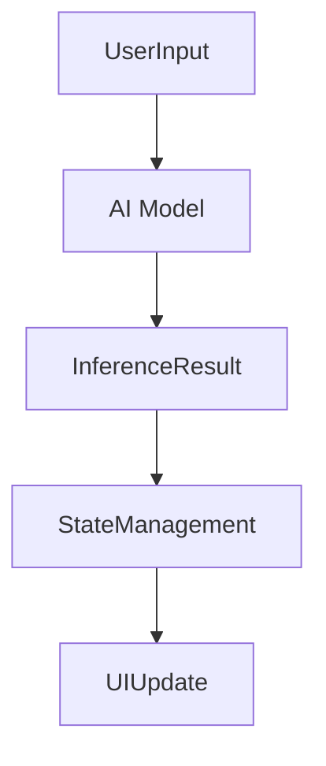

## 12.2.3 AI and Machine Learning Integration

As the demand for intelligent applications grows, integrating AI and machine learning (ML) capabilities into Flutter apps becomes increasingly relevant. This section explores how to incorporate state management strategies when embedding AI/ML features, ensuring your Flutter applications are both smart and responsive.

### AI/ML in Flutter Applications

AI and ML have transformed the way applications interact with users, offering capabilities such as:

- **Image Recognition:** Identifying objects, faces, or scenes within images.
- **Natural Language Processing (NLP):** Understanding and generating human language, including tasks like sentiment analysis and language translation.
- **Recommendation Systems:** Suggesting products, content, or actions based on user behavior and preferences.

These capabilities enhance user experience by providing personalized and context-aware interactions. However, integrating these features requires careful consideration of state management to handle the dynamic nature of AI/ML operations.

### Managing AI/ML State

Incorporating AI/ML into Flutter applications introduces unique state management challenges:

- **Model Loading States:** AI models, especially those used for complex tasks, can be large and require significant time to load. Managing the state during model loading is crucial to provide feedback to users.
- **Inference Results:** Once a model is loaded, it needs to process data and return results. Handling these inference results and updating the UI accordingly is a key aspect of state management.
- **UI Updates Based on AI Outputs:** The UI should reflect changes based on AI predictions or classifications, ensuring a seamless user experience.

### Asynchronous Operations

AI/ML tasks are inherently computationally intensive and often run asynchronously. This requires strategies to manage asynchronous state updates while keeping the UI responsive:

- **Futures and Streams:** Use Dart's `Future` and `Stream` classes to handle asynchronous operations, ensuring that the UI remains responsive while waiting for AI/ML tasks to complete.
- **State Management Solutions:** Employ state management solutions like Riverpod, Bloc, or Provider that are adept at handling asynchronous data flows.

### Integration Techniques

Integrating AI/ML into Flutter involves using platforms like TensorFlow Lite or ML Kit. Here's how you can manage state when interacting with these tools:

#### TensorFlow Lite

TensorFlow Lite is a lightweight solution for deploying machine learning models on mobile devices. Here's a basic workflow for integrating TensorFlow Lite with Flutter:

1. **Model Conversion:** Convert your TensorFlow model to a `.tflite` file.
2. **Model Loading:** Use the `tflite` Flutter plugin to load the model.
3. **Perform Inference:** Pass input data to the model and retrieve predictions.
4. **Update State:** Use a state management solution to handle the inference results and update the UI.

#### ML Kit

ML Kit offers ready-to-use APIs for common ML tasks. Integrating ML Kit involves:

1. **Setup:** Add ML Kit to your Flutter project using Firebase.
2. **Model Interaction:** Use ML Kit's APIs to perform tasks like text recognition or face detection.
3. **State Management:** Handle the results using a state management solution to ensure the UI reflects changes.

### Code Examples

Below is a code snippet demonstrating how to load a TensorFlow Lite model, perform inference, and update the state using Provider:

```dart
import 'package:flutter/material.dart';
import 'package:provider/provider.dart';
import 'package:tflite/tflite.dart';

class AIModelProvider with ChangeNotifier {
  String _result = "Loading...";
  String get result => _result;

  Future<void> loadModel() async {
    await Tflite.loadModel(
      model: "assets/model.tflite",
      labels: "assets/labels.txt",
    );
    notifyListeners();
  }

  Future<void> runInference(String input) async {
    var output = await Tflite.runModelOnImage(
      path: input,
      numResults: 1,
    );
    _result = output.isNotEmpty ? output[0]['label'] : "No result";
    notifyListeners();
  }
}

void main() {
  runApp(
    ChangeNotifierProvider(
      create: (_) => AIModelProvider()..loadModel(),
      child: MyApp(),
    ),
  );
}

class MyApp extends StatelessWidget {
  @override
  Widget build(BuildContext context) {
    return MaterialApp(
      home: Scaffold(
        appBar: AppBar(title: Text('AI Integration')),
        body: Center(
          child: Consumer<AIModelProvider>(
            builder: (context, modelProvider, child) {
              return Text(modelProvider.result);
            },
          ),
        ),
      ),
    );
  }
}
```

### Mermaid.js Diagrams

To visualize the flow of data in an AI-integrated application, consider the following diagram:



This flowchart illustrates how user input is processed by an AI model, which then produces an inference result. This result is managed by the state management layer, ultimately leading to a UI update.

### Best Practices

- **Offloading Computations:** For heavy computations, consider offloading tasks to isolates or cloud services to maintain app performance.
- **Error Handling:** Implement robust error handling and fallback mechanisms to manage scenarios where AI services are unavailable.
- **Performance Optimization:** Use techniques like lazy loading and caching to optimize performance and reduce latency in AI/ML operations.

### Conclusion

Integrating AI and machine learning into Flutter applications offers exciting possibilities but requires careful state management to ensure a seamless user experience. By leveraging appropriate state management solutions and following best practices, developers can create intelligent, responsive applications that harness the power of AI/ML effectively.

### Further Reading and Resources

- **TensorFlow Lite Documentation:** [TensorFlow Lite](https://www.tensorflow.org/lite)
- **ML Kit for Firebase:** [ML Kit](https://firebase.google.com/products/ml-kit)
- **Flutter and Dart Documentation:** [Flutter](https://flutter.dev/docs)

## Quiz Time!



### What are common AI/ML applications in Flutter?

- [x] Image recognition
- [x] Natural language processing
- [x] Recommendation systems
- [ ] Blockchain transactions

> **Explanation:** Image recognition, natural language processing, and recommendation systems are common AI/ML applications in Flutter. Blockchain transactions are not typically associated with AI/ML.

### Why is state management important in AI/ML integration?

- [x] To handle model loading states
- [x] To manage inference results
- [x] To update the UI based on AI outputs
- [ ] To increase app download speed

> **Explanation:** State management is crucial for handling model loading states, managing inference results, and updating the UI based on AI outputs. It does not directly affect app download speed.

### How can you manage asynchronous AI/ML operations in Flutter?

- [x] Using Futures and Streams
- [x] Employing state management solutions like Riverpod
- [ ] Using synchronous code execution
- [ ] Ignoring asynchronous operations

> **Explanation:** Asynchronous AI/ML operations can be managed using Futures and Streams, and state management solutions like Riverpod. Synchronous execution and ignoring async operations are not suitable approaches.

### What is TensorFlow Lite used for in Flutter?

- [x] Deploying machine learning models on mobile devices
- [ ] Creating user interfaces
- [ ] Managing app state
- [ ] Handling network requests

> **Explanation:** TensorFlow Lite is used for deploying machine learning models on mobile devices, not for creating user interfaces, managing app state, or handling network requests.

### Which Flutter plugin is used to load TensorFlow Lite models?

- [x] tflite
- [ ] provider
- [ ] bloc
- [ ] redux

> **Explanation:** The `tflite` plugin is used to load TensorFlow Lite models in Flutter applications.

### What is the purpose of ML Kit in Flutter?

- [x] Providing ready-to-use APIs for common ML tasks
- [ ] Designing app layouts
- [ ] Managing user authentication
- [ ] Handling database operations

> **Explanation:** ML Kit provides ready-to-use APIs for common ML tasks, not for designing app layouts, managing user authentication, or handling database operations.

### How can you visualize data flow in an AI-integrated application?

- [x] Using Mermaid.js diagrams
- [ ] Using plain text descriptions
- [ ] Ignoring data flow visualization
- [ ] Using only code comments

> **Explanation:** Mermaid.js diagrams are an effective way to visualize data flow in an AI-integrated application, offering a clear and structured representation.

### What is a best practice for handling heavy AI computations?

- [x] Offloading to isolates or cloud services
- [ ] Running all computations on the main thread
- [ ] Avoiding AI features
- [ ] Using synchronous operations

> **Explanation:** Offloading heavy AI computations to isolates or cloud services is a best practice to maintain app performance, rather than running them on the main thread or avoiding AI features.

### What should you implement for robust AI service management?

- [x] Error handling and fallback mechanisms
- [ ] Only synchronous operations
- [ ] Ignoring errors
- [ ] Using outdated libraries

> **Explanation:** Implementing error handling and fallback mechanisms ensures robust AI service management, unlike ignoring errors or using outdated libraries.

### Is it important to update the UI based on AI outputs?

- [x] True
- [ ] False

> **Explanation:** It is important to update the UI based on AI outputs to provide users with relevant and timely information, enhancing the overall user experience.


