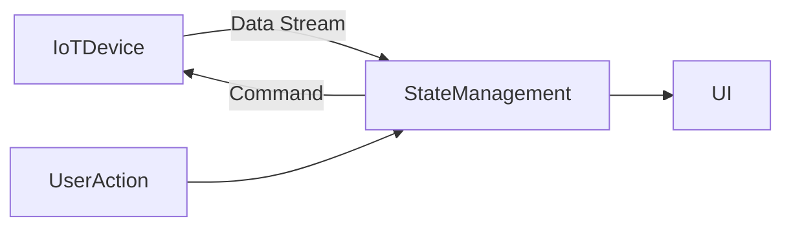

## 12.2.4 Internet of Things (IoT) Applications

The Internet of Things (IoT) represents a transformative shift in how devices interact with each other and with users. As IoT devices proliferate, the need for robust, efficient, and scalable applications to manage these devices becomes increasingly critical. Flutter, with its cross-platform capabilities and reactive framework, is well-suited for developing IoT applications that require dynamic interfaces and real-time data processing. This section delves into the integration of Flutter with IoT, focusing on state management strategies that cater to the unique challenges of IoT environments.

### Flutter and IoT Overview

Flutter provides a powerful toolkit for building user interfaces that can control and monitor IoT devices. Whether it's a smart home application, an industrial monitoring system, or a wearable device interface, Flutter's flexibility allows developers to create rich, interactive dashboards and control panels.

- **Cross-Platform Development:** Flutter enables developers to write code once and deploy it across multiple platforms, including Android, iOS, web, and desktop. This is particularly beneficial for IoT applications that require consistent user experiences across different devices.
- **Rich UI Capabilities:** With Flutter's extensive widget library, developers can create intuitive and visually appealing interfaces that enhance user interaction with IoT devices.
- **Rapid Prototyping:** Flutter's hot reload feature allows for quick iterations, making it easier to test and refine IoT application interfaces.

### Real-Time Data Handling

IoT applications often need to process real-time data streams from sensors and devices. This requires efficient state management to ensure that the application remains responsive and accurate.

- **Challenges of Real-Time Data:** Handling real-time data involves managing high-frequency updates, dealing with intermittent connectivity, and ensuring data synchronization across devices.
- **Data Stream Management:** Flutter's reactive framework is well-suited for managing data streams. By leveraging Dart's `Stream` API, developers can handle asynchronous data flows effectively.
- **Intermittent Connectivity:** IoT devices may experience connectivity issues due to network instability. Implementing robust reconnection logic and caching mechanisms can help maintain data integrity and user experience during offline periods.

### State Management Strategies

Choosing the right state management strategy is crucial for IoT applications. The following approaches are particularly effective:

- **Streams and Reactive Programming:** Utilizing streams allows for efficient handling of continuous data flows. Flutter's reactive architecture supports this model, enabling seamless integration with IoT data sources.
- **Event-Driven Architectures:** An event-driven approach can be beneficial for IoT applications, where state changes are triggered by specific events, such as sensor readings or user interactions.
- **State Notifiers and Providers:** Using state notifiers or providers can help manage complex state logic, ensuring that the application remains responsive to real-time data changes.

### Communication Protocols

The choice of communication protocol can significantly impact how state is managed in IoT applications. Common protocols include:

- **MQTT (Message Queuing Telemetry Transport):** MQTT is a lightweight protocol designed for low-bandwidth, high-latency networks. It is ideal for IoT applications that require efficient message delivery and minimal overhead.
- **WebSockets:** WebSockets provide full-duplex communication channels over a single TCP connection, making them suitable for applications that need real-time data exchange.
- **BLE (Bluetooth Low Energy):** BLE is used for short-range communication with low power consumption, making it ideal for wearable devices and other battery-powered IoT applications.

#### Example: Integrating MQTT in Flutter

```dart
import 'package:mqtt_client/mqtt_client.dart';
import 'package:mqtt_client/mqtt_server_client.dart';

void main() async {
  final client = MqttServerClient('broker.hivemq.com', '');
  client.logging(on: true);
  client.onConnected = onConnected;
  client.onDisconnected = onDisconnected;
  client.onSubscribed = onSubscribed;

  final connMessage = MqttConnectMessage()
      .withClientIdentifier('flutter_client')
      .startClean()
      .withWillQos(MqttQos.atLeastOnce);
  client.connectionMessage = connMessage;

  try {
    await client.connect();
  } catch (e) {
    print('Exception: $e');
    client.disconnect();
  }

  client.subscribe('sensor/data', MqttQos.atMostOnce);

  client.updates.listen((List<MqttReceivedMessage<MqttMessage>> c) {
    final recMess = c[0].payload as MqttPublishMessage;
    final pt =
        MqttPublishPayload.bytesToStringAsString(recMess.payload.message);

    print('Received message: $pt from topic: ${c[0].topic}>');
  });
}

void onConnected() {
  print('Connected');
}

void onDisconnected() {
  print('Disconnected');
}

void onSubscribed(String topic) {
  print('Subscribed topic: $topic');
}
```

### Best Practices

Efficient state management in IoT applications requires careful consideration of several factors:

- **Efficient Data Handling:** Minimize data processing overhead to conserve device resources. Use efficient data structures and algorithms to manage state changes.
- **Reconnection Logic:** Implement robust reconnection strategies to handle network interruptions gracefully. This ensures that the application can recover from connectivity issues without losing data.
- **State Caching:** Cache state locally to provide a seamless user experience during offline periods. This can be achieved using local storage solutions like SQLite or shared preferences.
- **Security Considerations:** Ensure that data transmitted between the app and IoT devices is secure. Use encryption protocols and authentication mechanisms to protect sensitive information.

### Practical Example: Controlling a Smart Light

Consider a Flutter application that controls a smart light bulb using MQTT. The app subscribes to the light's status updates and sends commands to change its state.

```dart
import 'package:flutter/material.dart';
import 'package:mqtt_client/mqtt_client.dart';

class SmartLightController extends StatefulWidget {
  @override
  _SmartLightControllerState createState() => _SmartLightControllerState();
}

class _SmartLightControllerState extends State<SmartLightController> {
  MqttClient client;
  bool isLightOn = false;

  @override
  void initState() {
    super.initState();
    setupMqttClient();
  }

  void setupMqttClient() async {
    client = MqttServerClient('broker.hivemq.com', '');
    client.logging(on: true);
    client.onConnected = onConnected;
    client.onDisconnected = onDisconnected;
    client.onSubscribed = onSubscribed;

    final connMessage = MqttConnectMessage()
        .withClientIdentifier('flutter_light_controller')
        .startClean()
        .withWillQos(MqttQos.atLeastOnce);
    client.connectionMessage = connMessage;

    try {
      await client.connect();
    } catch (e) {
      print('Exception: $e');
      client.disconnect();
    }

    client.subscribe('light/status', MqttQos.atMostOnce);

    client.updates.listen((List<MqttReceivedMessage<MqttMessage>> c) {
      final recMess = c[0].payload as MqttPublishMessage;
      final pt =
          MqttPublishPayload.bytesToStringAsString(recMess.payload.message);

      setState(() {
        isLightOn = pt == 'on';
      });
    });
  }

  void toggleLight() {
    final builder = MqttClientPayloadBuilder();
    builder.addString(isLightOn ? 'off' : 'on');
    client.publishMessage('light/control', MqttQos.exactlyOnce, builder.payload);
  }

  void onConnected() {
    print('Connected');
  }

  void onDisconnected() {
    print('Disconnected');
  }

  void onSubscribed(String topic) {
    print('Subscribed topic: $topic');
  }

  @override
  Widget build(BuildContext context) {
    return Scaffold(
      appBar: AppBar(
        title: Text('Smart Light Controller'),
      ),
      body: Center(
        child: Column(
          mainAxisAlignment: MainAxisAlignment.center,
          children: <Widget>[
            Text(
              'Light is ${isLightOn ? "ON" : "OFF"}',
              style: TextStyle(fontSize: 24),
            ),
            SizedBox(height: 20),
            ElevatedButton(
              onPressed: toggleLight,
              child: Text(isLightOn ? 'Turn OFF' : 'Turn ON'),
            ),
          ],
        ),
      ),
    );
  }
}
```

### Mermaid.js Diagram

To visualize the interaction between the Flutter app, state management, and IoT devices, consider the following diagram:



### Conclusion

Integrating Flutter with IoT devices opens up a world of possibilities for creating innovative applications that enhance user experiences and improve device management. By leveraging Flutter's reactive framework and adopting suitable state management strategies, developers can build efficient, responsive, and scalable IoT applications. As IoT technology continues to evolve, staying informed about the latest trends and best practices will be crucial for success in this dynamic field.

## Quiz Time!



### What is one of the main benefits of using Flutter for IoT applications?

- [x] Cross-platform development
- [ ] Limited widget library
- [ ] High power consumption
- [ ] Complex setup process

> **Explanation:** Flutter's cross-platform capabilities allow developers to write code once and deploy it across multiple platforms, making it ideal for IoT applications that require consistent user experiences.

### Which protocol is known for its lightweight nature and is ideal for IoT applications?

- [x] MQTT
- [ ] HTTP
- [ ] FTP
- [ ] SMTP

> **Explanation:** MQTT is a lightweight protocol designed for low-bandwidth, high-latency networks, making it ideal for IoT applications.

### What is a common challenge when handling real-time data in IoT applications?

- [x] Intermittent connectivity
- [ ] Excessive power supply
- [ ] Static data streams
- [ ] Limited data storage

> **Explanation:** Intermittent connectivity is a common challenge in IoT applications, requiring robust reconnection logic and data synchronization strategies.

### Which state management strategy is particularly effective for handling continuous data flows in IoT applications?

- [x] Streams and reactive programming
- [ ] Static state management
- [ ] Manual state updates
- [ ] Hardcoded state values

> **Explanation:** Streams and reactive programming are effective for handling continuous data flows, allowing for efficient management of asynchronous data.

### What is the role of state caching in IoT applications?

- [x] To provide a seamless user experience during offline periods
- [ ] To increase data processing overhead
- [ ] To complicate the user interface
- [ ] To reduce application security

> **Explanation:** State caching helps maintain a seamless user experience during offline periods by storing data locally.

### Which communication protocol provides full-duplex communication channels over a single TCP connection?

- [x] WebSockets
- [ ] MQTT
- [ ] BLE
- [ ] HTTP

> **Explanation:** WebSockets provide full-duplex communication channels over a single TCP connection, suitable for real-time data exchange.

### What should be implemented to handle network interruptions gracefully in IoT applications?

- [x] Reconnection logic
- [ ] Increased data size
- [ ] Manual data entry
- [ ] Static IP addresses

> **Explanation:** Implementing reconnection logic ensures that the application can recover from connectivity issues without losing data.

### What is a key consideration when transmitting data between the app and IoT devices?

- [x] Security considerations
- [ ] Increasing data size
- [ ] Reducing data accuracy
- [ ] Limiting data frequency

> **Explanation:** Ensuring data security is crucial when transmitting data between the app and IoT devices, using encryption and authentication mechanisms.

### How can developers ensure efficient data handling in IoT applications?

- [x] By minimizing data processing overhead
- [ ] By increasing data packet size
- [ ] By using complex algorithms
- [ ] By ignoring data synchronization

> **Explanation:** Minimizing data processing overhead helps conserve device resources and ensures efficient data handling.

### True or False: Flutter's hot reload feature is beneficial for rapid prototyping in IoT applications.

- [x] True
- [ ] False

> **Explanation:** Flutter's hot reload feature allows for quick iterations, making it easier to test and refine IoT application interfaces.


