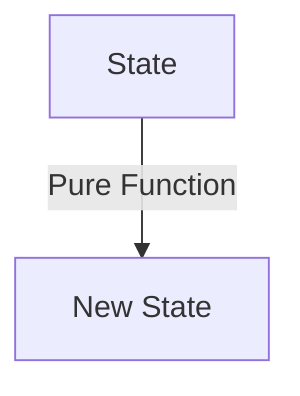

## 12.3.1 Functional Programming Approaches

Functional programming (FP) is a paradigm that treats computation as the evaluation of mathematical functions and avoids changing state or mutable data. In the context of Flutter and state management, applying functional programming principles can lead to more predictable, testable, and maintainable applications. This section explores these principles and demonstrates how they can be effectively integrated into Flutter applications.

### Functional Programming Principles

Functional programming is built on several key principles that distinguish it from other paradigms:

- **Pure Functions:** A pure function is one where the output value is determined only by its input values, without observable side effects. This means that given the same inputs, a pure function will always return the same output.

- **Immutability:** In FP, data is immutable, meaning once a data structure is created, it cannot be changed. Instead, new data structures are created from existing ones, preserving the original state.

- **Higher-Order Functions:** These are functions that can take other functions as arguments or return them as results. This allows for powerful abstractions and code reuse.

- **First-Class Functions:** Functions are treated as first-class citizens, meaning they can be assigned to variables, passed as arguments, and returned from other functions.

### Benefits for State Management

Applying functional programming principles to state management in Flutter offers several advantages:

- **Predictability:** Pure functions and immutability ensure that state transitions are predictable and consistent, reducing the likelihood of bugs.

- **Testability:** Pure functions are easier to test because they do not rely on external state. This makes unit testing more straightforward and reliable.

- **Maintainability:** FP encourages a declarative style of programming, which can lead to clearer and more maintainable codebases.

### Applying Functional Concepts in Flutter

Flutter's reactive framework naturally aligns with functional programming concepts, allowing developers to leverage these principles effectively. Here are some ways to apply functional programming in Flutter:

#### Using Functions as Building Blocks

In functional programming, functions are the primary building blocks of an application. In Flutter, this can be applied by using functions to define state transformations and UI logic.

#### Libraries Supporting Functional Paradigms

Several libraries in the Dart ecosystem support functional programming paradigms, such as `dartz` and `fpdart`. These libraries provide tools like monads, functors, and other functional constructs that can be used to manage state in a functional way.

```dart
import 'package:fpdart/fpdart.dart';

// Example of using Option from fpdart
Option<int> divide(int a, int b) {
  return b == 0 ? none() : some(a ~/ b);
}

void main() {
  final result = divide(10, 2);
  result.match(
    () => print('Division by zero'),
    (value) => print('Result: $value'),
  );
}
```

### Example Implementations

Let's explore a simple example of managing state using functional programming principles in Flutter. We'll create a counter application using pure functions and immutable state.

#### State Management with Pure Functions

```dart
class CounterState {
  final int count;

  CounterState(this.count);

  CounterState increment() => CounterState(count + 1);
  CounterState decrement() => CounterState(count - 1);
}

void main() {
  CounterState state = CounterState(0);

  // Increment state
  state = state.increment();
  print(state.count); // Output: 1

  // Decrement state
  state = state.decrement();
  print(state.count); // Output: 0
}
```

In this example, the `CounterState` class is immutable, and state transitions are handled by pure functions `increment` and `decrement`.

#### Managing State Transitions

Functional programming encourages the use of pure functions for state transitions. This approach can be visualized using the following Mermaid.js diagram:



### Best Practices

While functional programming offers many benefits, it's essential to balance functional purity with practical considerations:

- **Understand the Concepts:** Before applying functional programming, ensure you understand the underlying concepts. This will help you make informed decisions about when and how to use these principles.

- **Balance Purity and Practicality:** While pure functions and immutability are ideal, there are times when side effects are necessary (e.g., network requests). Use functional programming where it makes sense, but don't be dogmatic.

- **Leverage Libraries:** Use libraries like `dartz` and `fpdart` to take advantage of functional constructs in Dart. These libraries can simplify the implementation of functional patterns.

### Conclusion

Functional programming provides a robust framework for managing state in Flutter applications. By leveraging principles like pure functions and immutability, developers can create applications that are more predictable, testable, and maintainable. As you explore these concepts, consider how they can be integrated into your projects to improve code quality and reliability.

### Further Exploration

For those interested in diving deeper into functional programming in Flutter, consider exploring the following resources:

- **Books:** "Functional Programming in Scala" by Paul Chiusano and Runar Bjarnason, which provides a comprehensive introduction to functional programming concepts.

- **Online Courses:** Platforms like Coursera and Udemy offer courses on functional programming that can provide a more in-depth understanding.

- **Community Resources:** Engage with the Flutter and Dart communities through forums and discussion boards to learn from others' experiences and share your insights.

## Quiz Time!



### What is a pure function in functional programming?

- [x] A function that always produces the same output for the same input and has no side effects.
- [ ] A function that can modify global state.
- [ ] A function that relies on random number generation.
- [ ] A function that interacts with the file system.

> **Explanation:** A pure function is one that always produces the same output for the same input and does not cause any side effects, making it predictable and easy to test.

### Which principle of functional programming emphasizes that data should not be changed after it's created?

- [x] Immutability
- [ ] Higher-order functions
- [ ] First-class functions
- [ ] Side effects

> **Explanation:** Immutability is the principle that data should not be changed after it's created, which helps maintain consistency and predictability in applications.

### What is a higher-order function?

- [x] A function that takes other functions as arguments or returns them as results.
- [ ] A function that modifies its own code.
- [ ] A function that can only be used in recursion.
- [ ] A function that is defined at a higher level of abstraction.

> **Explanation:** Higher-order functions are functions that can take other functions as arguments or return them as results, enabling powerful abstractions and code reuse.

### How does functional programming benefit state management?

- [x] It leads to more predictable and testable state management.
- [ ] It makes state management more complex and harder to understand.
- [ ] It allows for more mutable state.
- [ ] It requires less code documentation.

> **Explanation:** Functional programming benefits state management by making it more predictable and testable, thanks to principles like pure functions and immutability.

### Which Dart library supports functional programming paradigms?

- [x] dartz
- [ ] flutter_bloc
- [ ] redux
- [ ] provider

> **Explanation:** The `dartz` library supports functional programming paradigms in Dart, providing tools like monads and functors.

### What is the main advantage of using pure functions in state management?

- [x] They ensure consistent state transitions.
- [ ] They allow for mutable global state.
- [ ] They make code harder to test.
- [ ] They require more complex syntax.

> **Explanation:** Pure functions ensure consistent state transitions because they always produce the same output for the same input, making them predictable and easy to test.

### What is a first-class function?

- [x] A function that can be assigned to variables, passed as arguments, and returned from other functions.
- [ ] A function that is always executed first in a program.
- [ ] A function that can only be used in object-oriented programming.
- [ ] A function that modifies global variables.

> **Explanation:** First-class functions are those that can be assigned to variables, passed as arguments, and returned from other functions, allowing for flexible and dynamic code.

### What does the `fpdart` library provide for Dart developers?

- [x] Functional programming constructs like monads and functors.
- [ ] A state management solution based on Redux.
- [ ] A UI component library for Flutter.
- [ ] A set of tools for asynchronous programming.

> **Explanation:** The `fpdart` library provides functional programming constructs like monads and functors, helping Dart developers implement functional patterns.

### Which of the following is NOT a principle of functional programming?

- [x] Mutable state
- [ ] Pure functions
- [ ] Immutability
- [ ] Higher-order functions

> **Explanation:** Mutable state is not a principle of functional programming; instead, FP emphasizes immutability and pure functions.

### True or False: Functional programming makes state management less predictable.

- [ ] True
- [x] False

> **Explanation:** False. Functional programming makes state management more predictable due to its reliance on pure functions and immutability.


