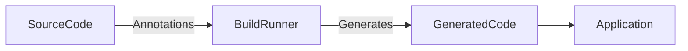

## 12.3.2 Metaprogramming and Code Generation

In the ever-evolving landscape of Flutter development, metaprogramming and code generation have emerged as powerful techniques to automate and simplify state management. These approaches not only reduce boilerplate code but also enhance the maintainability and scalability of applications. This section delves into the intricacies of metaprogramming and code generation, exploring their applications in Flutter, particularly in the context of state management.

### Understanding Metaprogramming

Metaprogramming refers to the practice of writing programs that can manipulate other programs or themselves. In the context of Dart and Flutter, metaprogramming is primarily facilitated through code generation, which involves creating code at compile time based on annotations and templates.

#### Metaprogramming in Dart

Dart supports metaprogramming through the `build_runner` package, which acts as a code generation tool. By leveraging annotation processors, developers can define metadata on classes and functions, which are then processed to generate additional code. This approach is particularly useful for repetitive tasks such as creating data classes, implementing serialization, or managing dependency injection.

```dart
// Example of using annotations for code generation
import 'package:freezed_annotation/freezed_annotation.dart';

part 'user.freezed.dart';
part 'user.g.dart';

@freezed
class User with _$User {
  const factory User({
    required String id,
    required String name,
    required String email,
  }) = _User;

  factory User.fromJson(Map<String, dynamic> json) => _$UserFromJson(json);
}
```

In this example, the `freezed` package is used to generate immutable data classes, while `json_serializable` handles JSON serialization.

### Advantages in State Management

Code generation offers several advantages in state management:

- **Reduction of Boilerplate:** By automating repetitive code tasks, developers can focus on the core logic of their applications, leading to cleaner and more maintainable codebases.
- **Error Prevention:** Generated code is less prone to human error, ensuring consistency and reliability across the application.
- **Enhanced Performance:** Code generation can optimize certain operations, such as serialization and deserialization, leading to improved runtime performance.

### Practical Applications

Several packages in the Flutter ecosystem leverage code generation to streamline state management:

- **Freezed:** Simplifies the creation of immutable data classes and union types, essential for managing state in a predictable manner.
- **Injectable:** Facilitates dependency injection by generating boilerplate code for service locators.
- **Json_serializable:** Automates the process of encoding and decoding JSON data, crucial for applications that interact with APIs.

#### Using Freezed for Data Classes

The `freezed` package is a popular choice for generating immutable data classes. It provides a concise syntax for defining classes and automatically generates the necessary boilerplate for equality checks, copy methods, and more.

```dart
// Defining a data class with Freezed
@freezed
class Todo with _$Todo {
  const factory Todo({
    required String id,
    required String title,
    required bool completed,
  }) = _Todo;
}
```

The generated code includes methods for copying and comparing instances, which are essential for managing state changes efficiently.

#### Dependency Injection with Injectable

The `injectable` package works in conjunction with `get_it` to automate dependency injection. By annotating services and repositories, developers can generate the necessary setup code, reducing manual configuration.

```dart
// Example of using Injectable for dependency injection
@injectable
class AuthService {
  // Implementation of authentication logic
}
```

### Implementing Code Generation

Setting up code generation in a Flutter project involves several steps:

1. **Add Dependencies:** Include the necessary packages in your `pubspec.yaml` file, such as `build_runner`, `freezed`, and `json_serializable`.

   ```yaml
   dependencies:
     freezed_annotation: ^0.14.0
     json_annotation: ^4.0.1

   dev_dependencies:
     build_runner: ^2.0.0
     freezed: ^0.14.0
     json_serializable: ^4.0.1
   ```

2. **Define Annotations:** Annotate your classes and methods with the appropriate metadata.

3. **Run Code Generation:** Use the `build_runner` command to generate the code.

   ```bash
   flutter pub run build_runner build
   ```

4. **Integrate Generated Code:** Import and use the generated files in your application.

#### Writing Custom Code Generators

While many packages offer pre-built solutions, there may be scenarios where custom code generators are necessary. Writing a custom generator involves creating a Dart library that processes annotations and outputs code based on templates.

### Mermaid.js Diagram of the Code Generation Process

To visualize the code generation workflow, consider the following diagram:



This diagram illustrates how source code with annotations is processed by `build_runner` to produce generated code, which is then integrated into the application.

### Best Practices

When using metaprogramming and code generation, consider the following best practices:

- **Configuration Management:** Carefully configure your code generation setup to ensure that only the necessary code is generated. This prevents bloat and potential conflicts.
- **Version Control:** Keep generated code out of version control systems like Git. This reduces repository size and avoids merge conflicts.
- **Regular Updates:** Keep your code generation tools and packages up to date to benefit from the latest features and improvements.

### Conclusion

Metaprogramming and code generation are invaluable tools in the Flutter developer's toolkit, offering significant benefits in terms of efficiency, maintainability, and performance. By automating repetitive tasks and reducing boilerplate, developers can focus on building robust and scalable applications. As Flutter continues to evolve, these techniques will play an increasingly important role in state management and beyond.

## Quiz Time!



### What is metaprogramming in the context of Dart and Flutter?

- [x] Writing programs that manipulate other programs or themselves
- [ ] A technique for optimizing runtime performance
- [ ] A method for designing user interfaces
- [ ] A way to manage network requests

> **Explanation:** Metaprogramming involves writing code that can generate or manipulate other code, often used in Dart through code generation tools like `build_runner`.

### Which package is commonly used for generating immutable data classes in Flutter?

- [x] Freezed
- [ ] Bloc
- [ ] Provider
- [ ] Redux

> **Explanation:** The `freezed` package is widely used for creating immutable data classes and reducing boilerplate in Flutter applications.

### What is the primary advantage of using code generation in state management?

- [x] Reducing boilerplate and preventing errors
- [ ] Increasing the complexity of the codebase
- [ ] Enhancing UI design capabilities
- [ ] Improving network performance

> **Explanation:** Code generation helps reduce repetitive code, minimizes errors, and enhances maintainability, especially in state management.

### How does the `injectable` package assist in Flutter development?

- [x] It automates dependency injection setup
- [ ] It provides UI components for Flutter apps
- [ ] It manages state transitions
- [ ] It handles network requests

> **Explanation:** The `injectable` package works with `get_it` to automate the setup of dependency injection, reducing manual configuration.

### What command is used to run code generation in a Flutter project?

- [x] flutter pub run build_runner build
- [ ] flutter run
- [ ] dart compile
- [ ] flutter generate code

> **Explanation:** The `flutter pub run build_runner build` command is used to execute code generation tasks in a Flutter project.

### Why should generated code be kept out of version control?

- [x] To reduce repository size and avoid merge conflicts
- [ ] To increase the complexity of the codebase
- [ ] To improve runtime performance
- [ ] To enhance UI design capabilities

> **Explanation:** Keeping generated code out of version control helps maintain a clean repository and prevents merge conflicts.

### Which package is used for automating JSON serialization in Flutter?

- [x] json_serializable
- [ ] Bloc
- [ ] Provider
- [ ] Redux

> **Explanation:** The `json_serializable` package automates the process of encoding and decoding JSON data in Flutter applications.

### What is the role of `build_runner` in code generation?

- [x] It processes annotations and generates code
- [ ] It manages state transitions
- [ ] It handles network requests
- [ ] It provides UI components

> **Explanation:** `build_runner` is a tool that processes annotations in Dart code and generates additional code based on templates.

### What is a key benefit of using the `freezed` package?

- [x] Simplifying the creation of immutable data classes
- [ ] Enhancing UI design capabilities
- [ ] Managing network requests
- [ ] Optimizing runtime performance

> **Explanation:** The `freezed` package simplifies the creation of immutable data classes, reducing boilerplate and enhancing maintainability.

### True or False: Metaprogramming can help automate the creation of state management logic in Flutter.

- [x] True
- [ ] False

> **Explanation:** Metaprogramming, through code generation, can automate repetitive tasks and simplify the creation of state management logic in Flutter applications.


