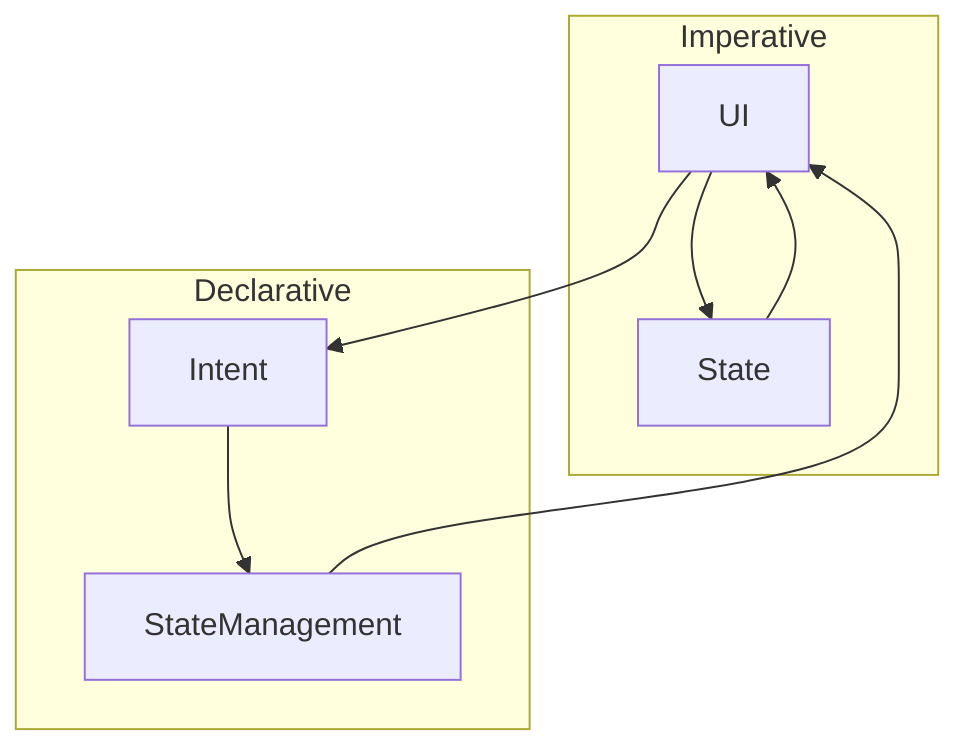

## 12.3.3 Declarative vs. Imperative State Management

In the ever-evolving landscape of software development, understanding the paradigms of declarative and imperative programming is crucial, especially within the context of state management in Flutter. These paradigms not only influence how developers write code but also impact the architecture, maintainability, and scalability of applications. This section delves into the nuances of these paradigms, comparing their roles in Flutter's state management ecosystem.

### Defining the Paradigms

#### Declarative Programming

Declarative programming is a paradigm that focuses on expressing the logic of computation without explicitly outlining the control flow. In a declarative approach, developers describe what the program should accomplish rather than detailing the steps to achieve it. This paradigm is prevalent in many modern UI frameworks, including Flutter, where the UI is described as a function of the current state.

- **Characteristics of Declarative Programming:**
  - **Descriptive:** Focuses on the "what" rather than the "how."
  - **State-Driven:** UI updates are driven by changes in state.
  - **Higher-Level Abstractions:** Often uses higher-level constructs to manage complexity.

#### Imperative Programming

Imperative programming, on the other hand, involves explicitly coding the steps required to achieve desired outcomes. This paradigm is more traditional and closely aligned with how computers execute instructions. Developers provide a sequence of commands to change the program's state.

- **Characteristics of Imperative Programming:**
  - **Procedural:** Focuses on the "how" by specifying detailed steps.
  - **Control Flow:** Emphasizes the flow of control through statements like loops and conditionals.
  - **Direct State Manipulation:** Often involves direct manipulation of state variables.

### State Management Implications

Flutter's UI framework is inherently declarative, meaning that the UI is rebuilt in response to state changes. This aligns well with state management solutions that embrace a declarative approach. However, understanding how both paradigms can be applied to state management is essential for making informed architectural decisions.

#### Declarative State Management in Flutter

In a declarative state management approach, the UI is a reflection of the current state. Changes in state automatically trigger UI updates, reducing the need for manual intervention. Solutions like `Provider`, `Bloc`, and `Riverpod` exemplify this approach by abstracting state changes and providing a more reactive model.

#### Imperative State Management in Flutter

Imperative state management involves explicitly updating the UI in response to state changes. Flutter's `setState` is a classic example of this approach, where developers manually trigger UI updates by calling `setState` whenever the state changes.

### Comparative Analysis

Let's compare how different state management solutions embody these paradigms through practical examples.

#### Imperative Example: Using `setState`

```dart
// Imperative approach
class CounterScreen extends StatefulWidget {
  @override
  _CounterScreenState createState() => _CounterScreenState();
}

class _CounterScreenState extends State<CounterScreen> {
  int counter = 0;

  void incrementCounter() {
    setState(() {
      counter++;
    });
  }

  @override
  Widget build(BuildContext context) {
    return Scaffold(
      appBar: AppBar(title: Text('Counter')),
      body: Center(
        child: Column(
          mainAxisAlignment: MainAxisAlignment.center,
          children: <Widget>[
            Text('You have pushed the button this many times:'),
            Text('$counter', style: Theme.of(context).textTheme.headline4),
          ],
        ),
      ),
      floatingActionButton: FloatingActionButton(
        onPressed: incrementCounter,
        tooltip: 'Increment',
        child: Icon(Icons.add),
      ),
    );
  }
}
```

In this imperative example, the `incrementCounter` function explicitly updates the state and triggers a UI rebuild using `setState`.

#### Declarative Example: Using `Provider`

```dart
// Declarative approach using Provider
class CounterCubit extends Cubit<int> {
  CounterCubit() : super(0);

  void increment() => emit(state + 1);
}

class CounterScreen extends StatelessWidget {
  @override
  Widget build(BuildContext context) {
    return Scaffold(
      appBar: AppBar(title: Text('Counter')),
      body: Center(
        child: Column(
          mainAxisAlignment: MainAxisAlignment.center,
          children: <Widget>[
            Text('You have pushed the button this many times:'),
            BlocBuilder<CounterCubit, int>(
              builder: (context, count) {
                return Text('$count', style: Theme.of(context).textTheme.headline4);
              },
            ),
          ],
        ),
      ),
      floatingActionButton: FloatingActionButton(
        onPressed: () => context.read<CounterCubit>().increment(),
        tooltip: 'Increment',
        child: Icon(Icons.add),
      ),
    );
  }
}
```

In this declarative example, the `CounterCubit` manages the state, and the UI automatically updates in response to state changes using `BlocBuilder`.

### Advantages and Disadvantages

#### Declarative Approach

- **Advantages:**
  - **Readability:** Code is often more readable and easier to understand.
  - **Maintainability:** Changes in state logic are isolated, making maintenance simpler.
  - **Testing:** Easier to test as state changes are more predictable and isolated.

- **Disadvantages:**
  - **Learning Curve:** May have a steeper learning curve for developers new to the paradigm.
  - **Overhead:** Some solutions may introduce additional complexity or overhead.

#### Imperative Approach

- **Advantages:**
  - **Simplicity:** Easier to grasp for developers familiar with procedural programming.
  - **Control:** Provides more direct control over state changes and UI updates.

- **Disadvantages:**
  - **Complexity:** Can lead to more complex and less maintainable codebases as applications grow.
  - **Error-Prone:** More prone to errors due to manual state and UI management.

### Mermaid.js Diagrams

To better understand the flow of data in both paradigms, consider the following diagrams:



- **Imperative Flow:** The UI directly interacts with the state, and changes are manually propagated.
- **Declarative Flow:** The UI sends intents to a state management layer, which handles state changes and updates the UI accordingly.

### Best Practices

- **Align with Flutter's Declarative Nature:** Embrace state management solutions that align with Flutter's declarative UI model to leverage its full potential.
- **Choose Based on Complexity:** For simple applications, imperative approaches like `setState` may suffice. For larger, more complex applications, consider declarative solutions like `Provider` or `Bloc`.
- **Consider Team Expertise:** Choose a paradigm that aligns with your team's expertise and experience to ensure efficient development and maintenance.

### Conclusion

Understanding the differences between declarative and imperative state management is crucial for making informed decisions in Flutter development. While both paradigms have their place, aligning with Flutter's declarative nature often leads to more maintainable and scalable applications. By carefully considering the project's complexity and the team's expertise, developers can choose the most suitable approach to state management.

## Quiz Time!



### What is the main focus of declarative programming?

- [x] Expressing the logic of computation without describing control flow
- [ ] Explicitly coding the steps to achieve desired outcomes
- [ ] Using loops and conditionals to control program execution
- [ ] Directly manipulating state variables

> **Explanation:** Declarative programming focuses on expressing what the program should accomplish without detailing the control flow.

### In Flutter, which state management solution is considered more declarative?

- [ ] setState
- [x] Provider
- [ ] StatefulWidget
- [ ] StatelessWidget

> **Explanation:** Provider is considered more declarative as it abstracts state changes and provides a reactive model.

### What is a key characteristic of imperative programming?

- [ ] Descriptive and state-driven
- [x] Procedural and control flow-focused
- [ ] Uses higher-level abstractions
- [ ] Automatically updates UI in response to state changes

> **Explanation:** Imperative programming is procedural and focuses on control flow through explicit steps.

### Which of the following is a disadvantage of the declarative approach?

- [ ] Easier to test
- [x] May have a steeper learning curve
- [ ] Code is often more readable
- [ ] Changes in state logic are isolated

> **Explanation:** The declarative approach may have a steeper learning curve for developers new to the paradigm.

### How does the UI update in a declarative state management approach?

- [ ] Manually by calling setState
- [x] Automatically in response to state changes
- [ ] Through direct manipulation of state variables
- [ ] By using loops and conditionals

> **Explanation:** In a declarative approach, the UI updates automatically in response to state changes.

### Which diagram best represents the flow of data in an imperative approach?

- [x] UI --> State --> UI
- [ ] UI --> Intent --> StateManagement --> UI
- [ ] UI --> Logic --> State --> UI
- [ ] UI --> StateManagement --> State

> **Explanation:** In an imperative approach, the UI directly interacts with the state, and changes are manually propagated.

### What is an advantage of the imperative approach?

- [x] Provides more direct control over state changes
- [ ] Easier to test
- [ ] Code is often more readable
- [ ] Changes in state logic are isolated

> **Explanation:** The imperative approach provides more direct control over state changes and UI updates.

### Which of the following is a disadvantage of the imperative approach?

- [ ] Easier to grasp for developers familiar with procedural programming
- [ ] Provides more direct control over state changes
- [x] Can lead to more complex and less maintainable codebases
- [ ] More predictable and isolated state changes

> **Explanation:** The imperative approach can lead to more complex and less maintainable codebases as applications grow.

### Which state management solution aligns with Flutter's declarative UI model?

- [ ] setState
- [x] Bloc
- [ ] StatefulWidget
- [ ] StatelessWidget

> **Explanation:** Bloc aligns with Flutter's declarative UI model by abstracting state changes and providing a reactive model.

### True or False: Declarative programming focuses on explicitly coding the steps to achieve desired outcomes.

- [ ] True
- [x] False

> **Explanation:** False. Declarative programming focuses on expressing the logic of computation without describing control flow.


