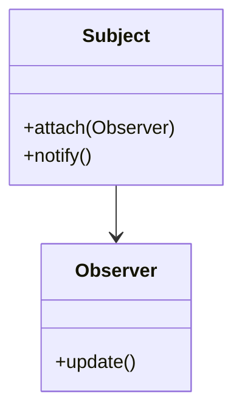

## 12.3.4 Theoretical Foundations

In the ever-evolving landscape of software development, understanding the theoretical foundations of state management is crucial for building robust, scalable applications. This section delves into the academic research and theoretical concepts that underpin modern state management practices, offering insights into how these theories influence practical implementations in Flutter.

### Key Theoretical Models

#### Observer Pattern

The Observer pattern is a fundamental design pattern used extensively in state management systems. It defines a one-to-many dependency between objects, allowing multiple observers to listen and react to changes in a subject.

- **Concept:** In the Observer pattern, a subject maintains a list of observers and notifies them of any state changes, typically by calling one of their methods.
- **Application in Flutter:** This pattern is mirrored in Flutter's widget tree, where widgets listen for changes in state and rebuild accordingly.

**Example:**

Consider a simple weather application where multiple widgets display weather data. When the data changes, all widgets need to update.



In this diagram, the `Subject` class represents the weather data source, and `Observer` classes are the widgets that display the data.

#### Redux's Single Source of Truth

Redux is a predictable state container for JavaScript apps, but its principles are widely applicable, including in Flutter.

- **Concept:** Redux's core principle is the single source of truth, where the entire state of an application is stored in a single immutable state tree.
- **Benefits:** This approach simplifies debugging and testing, as the state is centralized and changes are predictable.

**Example:**

In a Flutter app, using a Redux-like architecture involves maintaining a global state object that is updated through actions and reducers.

```dart
class AppState {
  final int counter;
  AppState(this.counter);
}

AppState reducer(AppState state, dynamic action) {
  if (action is IncrementAction) {
    return AppState(state.counter + 1);
  }
  return state;
}
```

#### Actor Model

The Actor model is a conceptual model that treats "actors" as the fundamental units of computation.

- **Concept:** In the Actor model, actors are independent entities that communicate through message passing, making it ideal for concurrent systems.
- **Application in Flutter:** While not directly implemented in Flutter, the Actor model's principles can inspire state management solutions that require high concurrency.

### Research Influence

#### Functional Programming

Functional programming emphasizes immutability and pure functions, which have significantly influenced modern state management.

- **Immutability:** Immutable state ensures that changes are predictable and side effects are minimized.
- **Pure Functions:** These functions produce the same output for the same input, making state transitions more reliable.

**Example:**

In Flutter, using immutable data structures and pure functions can enhance the predictability and reliability of state management.

```dart
class ImmutableState {
  final int value;
  ImmutableState(this.value);

  ImmutableState increment() {
    return ImmutableState(value + 1);
  }
}
```

#### Reactive Systems

Reactive systems respond to changes in state or environment, a concept that is central to Flutter's reactive framework.

- **Reactive Streams:** Dart's `Stream` class allows for asynchronous data handling, aligning with reactive principles.
- **Flutter's Widget Tree:** The widget tree reacts to state changes, rebuilding parts of the UI as necessary.

#### Concurrency

Concurrency research has led to models that efficiently manage state in multi-threaded environments.

- **Concurrency in Flutter:** Flutter's asynchronous programming model, using `Future` and `async/await`, is influenced by concurrency research.

### Formal Methods

Formal methods involve mathematically proving the correctness of algorithms, which can be applied to state management to ensure reliability.

- **Model Checking:** Techniques like model checking can verify that state transitions meet specified properties.
- **Application in State Management:** While not commonly used in everyday development, formal methods can be valuable in critical systems where correctness is paramount.

### Emerging Theoretical Concepts

#### CRDTs (Conflict-free Replicated Data Types)

CRDTs are data structures that enable distributed systems to achieve eventual consistency without conflict resolution.

- **Concept:** CRDTs allow multiple replicas of data to be updated independently and merged without conflicts.
- **Potential in Flutter:** While primarily used in distributed systems, CRDTs could inform future state management solutions that require offline capabilities and data synchronization.

**Example:**

Consider a collaborative text editor where multiple users can edit the same document simultaneously. CRDTs ensure that all changes are merged consistently.

### Best Practices

Understanding these theoretical foundations equips developers to make informed decisions about state management. Here are some best practices:

- **Embrace Immutability:** Use immutable data structures to enhance predictability.
- **Leverage Reactive Programming:** Utilize reactive streams and patterns to handle asynchronous data.
- **Explore Formal Methods:** Consider formal verification for critical systems to ensure correctness.
- **Stay Informed:** Keep up with emerging research to anticipate future trends in state management.

### Further Reading

For those interested in diving deeper into the theoretical aspects of state management, consider the following resources:

- **Books:** "Design Patterns: Elements of Reusable Object-Oriented Software" by Erich Gamma et al. for design patterns like Observer.
- **Articles:** Explore articles on functional programming and reactive systems in academic journals.
- **Online Courses:** Platforms like Coursera and edX offer courses on concurrency and distributed systems.

By understanding the theoretical underpinnings of state management, developers can build more robust and scalable applications, leveraging the latest research to stay ahead in the field.

## Quiz Time!



### Which design pattern is fundamental in state management systems for establishing a one-to-many dependency?

- [x] Observer Pattern
- [ ] Singleton Pattern
- [ ] Factory Pattern
- [ ] Strategy Pattern

> **Explanation:** The Observer pattern establishes a one-to-many dependency, allowing multiple observers to react to changes in a subject.

### What is the core principle of Redux that simplifies debugging and testing?

- [x] Single Source of Truth
- [ ] Multiple State Trees
- [ ] Asynchronous Actions
- [ ] Dynamic Typing

> **Explanation:** Redux's single source of truth centralizes the state, making it easier to debug and test.

### Which model treats "actors" as fundamental units of computation?

- [x] Actor Model
- [ ] Observer Model
- [ ] Redux Model
- [ ] MVC Model

> **Explanation:** The Actor model treats actors as independent entities that communicate through message passing.

### What programming paradigm emphasizes immutability and pure functions?

- [x] Functional Programming
- [ ] Object-Oriented Programming
- [ ] Procedural Programming
- [ ] Logic Programming

> **Explanation:** Functional programming emphasizes immutability and pure functions, influencing modern state management.

### Which data structure enables distributed systems to achieve eventual consistency without conflict resolution?

- [x] CRDTs
- [ ] Linked Lists
- [ ] Binary Trees
- [ ] Hash Maps

> **Explanation:** CRDTs (Conflict-free Replicated Data Types) allow data to be updated independently and merged without conflicts.

### What is the primary benefit of using immutable data structures in state management?

- [x] Predictability
- [ ] Increased Complexity
- [ ] Dynamic Updates
- [ ] Reduced Memory Usage

> **Explanation:** Immutable data structures enhance predictability by ensuring state changes are consistent.

### How do reactive systems respond to changes in state or environment?

- [x] Automatically
- [ ] Manually
- [ ] Periodically
- [ ] Randomly

> **Explanation:** Reactive systems automatically respond to changes, aligning with Flutter's reactive framework.

### What technique involves mathematically proving the correctness of algorithms?

- [x] Formal Methods
- [ ] Heuristic Analysis
- [ ] Empirical Testing
- [ ] A/B Testing

> **Explanation:** Formal methods involve mathematical proofs to ensure algorithm correctness.

### Which programming model is ideal for systems requiring high concurrency?

- [x] Actor Model
- [ ] Observer Model
- [ ] MVC Model
- [ ] Singleton Model

> **Explanation:** The Actor model is ideal for concurrent systems due to its message-passing architecture.

### True or False: CRDTs are primarily used in distributed systems for offline capabilities and data synchronization.

- [x] True
- [ ] False

> **Explanation:** CRDTs are designed for distributed systems to ensure data consistency across replicas.


