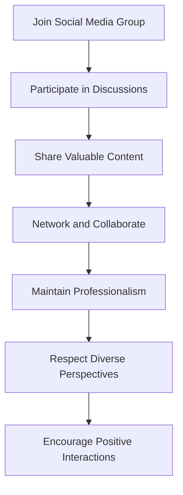

## 13.3.4 Social Media Groups for Flutter Enthusiasts: Connect, Learn, and Grow

In the ever-evolving world of software development, staying connected with a vibrant community can be a game-changer. For Flutter developers, social media platforms offer a dynamic space to engage with peers, share knowledge, and keep abreast of the latest trends and updates. This section delves into the various social media groups and platforms where Flutter enthusiasts can connect, learn, and grow together.

### Platforms to Join

Social media platforms provide a plethora of opportunities for developers to engage with the Flutter community. Here, we highlight some of the most popular platforms and groups that you should consider joining:

#### Facebook Groups

Facebook remains a powerful platform for community building, offering groups where developers can share insights, ask questions, and collaborate on projects.

- **"Flutter Developers" Group**
  - *Link:* [facebook.com/groups/flutterdev](https://www.facebook.com/groups/flutterdev)
  - This group is one of the largest and most active communities for Flutter developers on Facebook. It serves as a hub for sharing resources, discussing best practices, and seeking advice from fellow developers. Members frequently post about new packages, tutorials, and Flutter-related events.

#### Twitter

Twitter is an excellent platform for real-time updates and quick interactions. By following key accounts and using relevant hashtags, you can stay informed about the latest in Flutter development.

- **Accounts to Follow:**
  - **@flutterdev:** The official Flutter account provides updates on new releases, events, and community highlights.
  - **@dart_lang:** For updates on the Dart programming language, which is integral to Flutter development.

- **Hashtags to Use:**
  - **#Flutter:** A general hashtag for all things Flutter.
  - **#DartLang:** Focused on the Dart language.
  - **#FlutterDev:** Used by developers to share their projects and insights.

#### LinkedIn Groups

LinkedIn offers a more professional setting for networking and sharing industry insights. Joining groups related to Flutter can help you connect with professionals and explore career opportunities.

- **Search for Groups:**
  - Look for groups like "Flutter Developers" or "Mobile App Development" to find communities that align with your interests and professional goals.

#### Discord Servers

Discord is a popular platform for real-time chat and collaboration, offering servers dedicated to Flutter development.

- **Flutter Community**
  - *Link:* [discord.gg/flutterdev](https://discord.gg/flutterdev)
  - This server provides channels for discussing various aspects of Flutter development, including state management, UI design, and performance optimization. It's a great place to ask questions, share your work, and get feedback from other developers.

### Engagement Tips

Engaging with social media groups effectively can enhance your learning and networking experience. Here are some tips to make the most out of these platforms:

- **Participate in Discussions:**
  - Actively engage in conversations by asking questions, providing answers, and sharing your experiences. This not only helps you learn but also establishes your presence in the community.

- **Share Valuable Content:**
  - Contribute to the community by sharing articles, tutorials, and code snippets that you find useful. This fosters a culture of knowledge sharing and can help others in their learning journey.

- **Network and Collaborate:**
  - Use social media to connect with other developers and explore collaboration opportunities. Whether it's contributing to open-source projects or starting a new venture, networking can open doors to new possibilities.

### Best Practices

While social media offers numerous benefits, it's important to engage thoughtfully and professionally. Here are some best practices to keep in mind:

- **Maintain Professionalism:**
  - Remember that your posts can reach a wide audience. Be respectful and professional in your interactions, and avoid sharing sensitive or inappropriate content.

- **Respect Diverse Perspectives:**
  - Social media groups are diverse, with members from different backgrounds and experiences. Encourage positive interactions by respecting others' viewpoints and fostering an inclusive environment.

- **Encourage Positive Interactions:**
  - Be supportive and constructive in your feedback. Positive interactions not only enhance the community experience but also build a supportive network of peers.

### Practical Examples and Real-World Scenarios

To illustrate the impact of engaging with social media groups, consider the following scenarios:

- **Scenario 1: Solving a Complex Problem**
  - Imagine you're stuck on a challenging state management issue in your Flutter app. By posting your question in a Facebook group or Discord server, you receive insights from experienced developers who have faced similar challenges. This collaborative problem-solving approach can lead to innovative solutions and a deeper understanding of the topic.

- **Scenario 2: Discovering New Tools**
  - Through Twitter, you come across a tweet about a new Flutter package that simplifies state management. By following the conversation and engaging with the developer, you gain access to a tool that significantly enhances your project's efficiency.

- **Scenario 3: Career Advancement**
  - By actively participating in LinkedIn groups, you connect with industry leaders and potential employers. This networking leads to job opportunities and collaborations that propel your career forward.

### Encouraging Hands-On Practice and Experimentation

Engaging with social media groups is not just about consuming content; it's about active participation and experimentation. Here are some ways to apply what you've learned:

- **Mini-Exercise:**
  - Join a new social media group related to Flutter and introduce yourself. Share a recent project or challenge you're working on and invite feedback from the community.

- **Experiment with Code:**
  - After discovering a new technique or package through social media, implement it in a small project. Share your results with the group and discuss any challenges you faced.

### Diagrams and Visual Aids

To enhance your understanding of how social media groups can be structured and utilized, consider the following diagram:

This flowchart illustrates the steps to effectively engage with social media groups, emphasizing the cyclical nature of participation and growth.

### References and Further Exploration

To deepen your understanding and engagement with social media groups, consider exploring the following resources:

- **Official Documentation:**
  - [Flutter Documentation](https://flutter.dev/docs)
  - [Dart Documentation](https://dart.dev/guides)

- **Books and Articles:**
  - "Flutter in Action" by Eric Windmill
  - "Pragmatic Flutter" by Priyanka Tyagi

- **Online Courses:**
  - [Flutter & Dart - The Complete Guide](https://www.udemy.com/course/learn-flutter-dart-to-build-ios-android-apps/)
  - [Flutter Development Bootcamp with Dart](https://www.appbrewery.co/p/flutter-development-bootcamp-with-dart)

By actively engaging with social media groups and leveraging the resources available, you can enhance your skills, expand your network, and stay at the forefront of Flutter development.

## Quiz Time!



### Which Facebook group is recommended for Flutter developers?

- [x] Flutter Developers
- [ ] Flutter Enthusiasts
- [ ] Dart Coders
- [ ] Mobile App Innovators

> **Explanation:** The "Flutter Developers" group on Facebook is a large and active community for Flutter enthusiasts.

### What is the official Twitter account for Flutter updates?

- [x] @flutterdev
- [ ] @dartlang
- [ ] @flutter_updates
- [ ] @flutter_news

> **Explanation:** The official Twitter account for Flutter updates is @flutterdev.

### Which hashtag is commonly used for Dart language discussions on Twitter?

- [ ] #Flutter
- [x] #DartLang
- [ ] #FlutterDev
- [ ] #DartUpdates

> **Explanation:** The hashtag #DartLang is used for discussions related to the Dart programming language.

### What is a key benefit of joining LinkedIn groups for Flutter developers?

- [x] Networking and career opportunities
- [ ] Access to exclusive code snippets
- [ ] Direct communication with Flutter's core team
- [ ] Free access to premium courses

> **Explanation:** LinkedIn groups provide networking opportunities and can help in exploring career advancements.

### Which platform is recommended for real-time chat and collaboration among Flutter developers?

- [ ] Facebook
- [ ] Twitter
- [ ] LinkedIn
- [x] Discord

> **Explanation:** Discord offers real-time chat and collaboration through servers like the Flutter Community server.

### What is a best practice when engaging in social media groups?

- [x] Maintain professionalism
- [ ] Post as frequently as possible
- [ ] Focus only on self-promotion
- [ ] Avoid sharing personal experiences

> **Explanation:** Maintaining professionalism ensures respectful and constructive interactions within social media groups.

### How can social media groups help in solving complex development problems?

- [x] By enabling collaborative problem-solving
- [ ] By providing direct access to Flutter's core team
- [ ] By offering paid consulting services
- [ ] By limiting discussions to only experienced developers

> **Explanation:** Social media groups allow developers to share insights and collaboratively solve complex problems.

### What should you do after discovering a new technique through social media?

- [x] Implement it in a small project
- [ ] Ignore it unless it's from an official source
- [ ] Wait for a tutorial to be published
- [ ] Share it without testing

> **Explanation:** Implementing new techniques in small projects helps in understanding and validating their effectiveness.

### What is the main focus of the flowchart provided in the article?

- [x] Steps to effectively engage with social media groups
- [ ] The structure of a typical social media group
- [ ] The hierarchy of Flutter widgets
- [ ] The process of state management in Flutter

> **Explanation:** The flowchart illustrates steps to effectively engage with social media groups.

### True or False: Social media groups can only benefit beginners in Flutter development.

- [ ] True
- [x] False

> **Explanation:** Social media groups benefit developers of all levels by providing a platform for learning, sharing, and networking.


