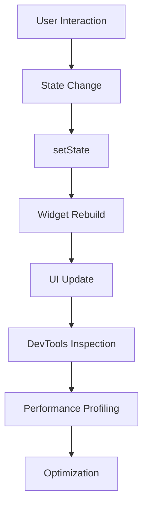

## 13.4.2 Developer Tools for Flutter State Management

In the dynamic world of Flutter development, leveraging the right tools can significantly enhance productivity, streamline workflows, and improve the overall quality of your applications. This section delves into essential developer tools that are particularly beneficial for managing state in Flutter projects. We will explore their features, best practices for usage, and how they can be integrated into your development process to optimize performance and debugging.

### Recommended Tools

#### Flutter DevTools

**Link:** [flutter.dev/docs/development/tools/devtools/overview](https://flutter.dev/docs/development/tools/devtools/overview)

Flutter DevTools is a suite of performance and debugging tools specifically designed for Dart and Flutter applications. It provides a comprehensive set of features that allow developers to inspect the widget tree, profile application performance, and debug issues effectively.

- **Performance Profiling:** DevTools offers a detailed view of your app's performance, including frame rendering times, memory usage, and CPU profiling. This is crucial for identifying bottlenecks and optimizing state management.
  
- **Widget Inspector:** This feature allows you to visualize the widget tree in real-time, making it easier to understand how state changes affect the UI. You can inspect widget properties and see how they relate to each other.

- **Network Monitoring:** Track network requests and responses to ensure that state changes triggered by API calls are handled correctly.

- **Logging and Debugging:** DevTools provides a logging view to monitor application logs, which is invaluable for debugging state-related issues.

#### Android Studio and IntelliJ IDEA Flutter Plugins

**Link:** [plugins.jetbrains.com/plugin/9212-flutter](https://plugins.jetbrains.com/plugin/9212-flutter)

The Flutter plugins for Android Studio and IntelliJ IDEA bring a robust set of features to these popular IDEs, enhancing the Flutter development experience with advanced code editing capabilities.

- **Code Completion and Refactoring:** These plugins offer intelligent code completion, syntax highlighting, and refactoring tools that help maintain clean and efficient code, crucial for managing complex state logic.

- **Hot Reload:** Instantly see the results of code changes without restarting the app, allowing for rapid iteration and testing of state management solutions.

- **Integrated Debugging:** Utilize breakpoints and step-through debugging to examine state transitions and logic flow.

- **Visual Layout Editor:** Provides a visual representation of the widget hierarchy, aiding in the understanding and management of state-dependent UI components.

#### VS Code Extensions

VS Code is a lightweight yet powerful editor that, with the right extensions, becomes a formidable tool for Flutter development.

##### Flutter Extension

**Link:** [marketplace.visualstudio.com/items?itemName=Dart-Code.flutter](https://marketplace.visualstudio.com/items?itemName=Dart-Code.flutter)

- **Hot Reload and Restart:** Quickly apply changes and restart your app to test state management implementations.

- **Widget Snippets:** Access a library of widget snippets to speed up UI development and ensure consistent state handling patterns.

- **Dart Analysis and Linting:** Automatically analyze code for errors and style issues, helping maintain high-quality state management practices.

##### Dart Extension

**Link:** [marketplace.visualstudio.com/items?itemName=Dart-Code.dart-code](https://marketplace.visualstudio.com/items?itemName=Dart-Code.dart-code)

- **Code Navigation:** Easily navigate through your codebase, which is essential for understanding and managing state across different parts of your application.

- **Refactoring Tools:** Simplify complex state logic with powerful refactoring tools that ensure code remains maintainable and scalable.

### Key Features of Developer Tools

- **Syntax Highlighting and Code Completion:** These features enhance readability and reduce errors, making it easier to implement and manage state logic.

- **Hot Reload and Performance Profiling:** Essential for testing state changes in real-time and optimizing application performance.

- **Visual Widget Trees and State Inspection:** Tools like the widget inspector in DevTools help visualize how state changes propagate through the widget tree, aiding in debugging and optimization.

### Best Practices for Using Developer Tools

- **Regular Updates:** Keep your tools updated to benefit from the latest features and improvements, which can enhance state management capabilities.

- **Customization:** Adjust tool settings to fit your workflow preferences, such as configuring keyboard shortcuts and themes, to increase efficiency.

- **Leverage Extensions:** Use extensions and plugins that complement your development style and project requirements, especially those that assist in managing state.

- **Keyboard Shortcuts:** Familiarize yourself with keyboard shortcuts for your IDE or editor to speed up common tasks and streamline state management processes.

### Practical Code Example

To illustrate how these tools can be used in practice, let's consider a simple Flutter application that manages a counter state. We'll utilize VS Code with the Flutter and Dart extensions to demonstrate hot reload, code completion, and debugging.

```dart
import 'package:flutter/material.dart';

void main() => runApp(MyApp());

class MyApp extends StatelessWidget {
  @override
  Widget build(BuildContext context) {
    return MaterialApp(
      home: CounterScreen(),
    );
  }
}

class CounterScreen extends StatefulWidget {
  @override
  _CounterScreenState createState() => _CounterScreenState();
}

class _CounterScreenState extends State<CounterScreen> {
  int _counter = 0;

  void _incrementCounter() {
    setState(() {
      _counter++;
    });
  }

  @override
  Widget build(BuildContext context) {
    return Scaffold(
      appBar: AppBar(
        title: Text('Counter App'),
      ),
      body: Center(
        child: Column(
          mainAxisAlignment: MainAxisAlignment.center,
          children: <Widget>[
            Text(
              'You have pushed the button this many times:',
            ),
            Text(
              '$_counter',
              style: Theme.of(context).textTheme.headline4,
            ),
          ],
        ),
      ),
      floatingActionButton: FloatingActionButton(
        onPressed: _incrementCounter,
        tooltip: 'Increment',
        child: Icon(Icons.add),
      ),
    );
  }
}
```

**Code Explanation:**

- **Hot Reload:** Use the hot reload feature in VS Code to see changes instantly as you modify the `_incrementCounter` method or UI components.
  
- **Debugging:** Set breakpoints in the `_incrementCounter` method to inspect how the state changes when the button is pressed.

- **Code Completion:** Take advantage of code completion to quickly write widget properties and methods, ensuring consistency and reducing errors.

### Real-World Scenario

Consider a scenario where you're developing a Flutter application with complex state management needs, such as an e-commerce platform. Using the tools discussed:

- **Flutter DevTools** can help profile the app's performance, ensuring that state changes related to product listings and user interactions are efficient.
  
- **Android Studio or IntelliJ IDEA** with Flutter plugins can facilitate rapid development and debugging of state logic, especially when integrating with backend services.

- **VS Code Extensions** can provide a lightweight and flexible environment for managing state across different modules, with powerful refactoring and navigation capabilities.

### Diagrams and Visual Aids

To further enhance understanding, let's include a diagram that illustrates the flow of state changes in a typical Flutter application using these tools.



**Diagram Explanation:**

- **User Interaction:** Triggers a state change, such as pressing a button.
- **State Change:** Managed by methods like `setState`, which updates the state.
- **Widget Rebuild:** The framework rebuilds affected widgets.
- **UI Update:** The user interface reflects the new state.
- **DevTools Inspection:** Use DevTools to inspect the widget tree and state changes.
- **Performance Profiling:** Analyze performance to identify bottlenecks.
- **Optimization:** Implement changes to enhance performance and efficiency.

### Conclusion

Developer tools are indispensable in the Flutter ecosystem, offering capabilities that streamline state management and enhance productivity. By integrating these tools into your workflow, you can improve the quality and performance of your applications, making state management more efficient and effective. Remember to explore the official documentation and community resources for each tool to maximize their potential and stay updated with the latest advancements.

## Quiz Time!



### Which tool is specifically designed for performance profiling and debugging in Flutter?

- [x] Flutter DevTools
- [ ] Android Studio
- [ ] VS Code
- [ ] IntelliJ IDEA

> **Explanation:** Flutter DevTools is a suite of performance and debugging tools for Dart and Flutter applications.

### What feature of Android Studio and IntelliJ IDEA plugins is crucial for maintaining clean code?

- [x] Code Completion and Refactoring
- [ ] Hot Reload
- [ ] Network Monitoring
- [ ] Visual Layout Editor

> **Explanation:** Code completion and refactoring help maintain clean and efficient code, essential for managing complex state logic.

### Which VS Code extension is necessary for Flutter development?

- [x] Flutter Extension
- [ ] Dart Extension
- [ ] Java Extension
- [ ] Python Extension

> **Explanation:** The Flutter Extension provides essential tools for Flutter development in VS Code.

### What is a key benefit of using hot reload in Flutter development?

- [x] Instantly see the results of code changes
- [ ] Automatically refactor code
- [ ] Profile application performance
- [ ] Monitor network requests

> **Explanation:** Hot reload allows developers to see the results of code changes instantly without restarting the app.

### Which tool provides a visual representation of the widget tree?

- [x] Flutter DevTools
- [ ] Android Studio
- [ ] VS Code
- [ ] Dart Extension

> **Explanation:** Flutter DevTools includes a widget inspector that provides a visual representation of the widget tree.

### What is the purpose of the Dart Extension in VS Code?

- [x] Code Navigation and Refactoring
- [ ] Performance Profiling
- [ ] Network Monitoring
- [ ] Visual Layout Editing

> **Explanation:** The Dart Extension provides code navigation and refactoring tools, essential for managing state across applications.

### Why is it important to regularly update your developer tools?

- [x] To access new features and improvements
- [ ] To change the IDE theme
- [ ] To reset all settings
- [ ] To remove unused extensions

> **Explanation:** Regular updates ensure you benefit from the latest features and improvements, enhancing state management capabilities.

### What is a common use of the widget inspector in Flutter DevTools?

- [x] Visualizing the widget tree
- [ ] Refactoring code
- [ ] Profiling network requests
- [ ] Monitoring CPU usage

> **Explanation:** The widget inspector is used to visualize the widget tree and understand how state changes affect the UI.

### Which IDE is known for its lightweight and flexible environment for Flutter development?

- [x] VS Code
- [ ] Android Studio
- [ ] IntelliJ IDEA
- [ ] Eclipse

> **Explanation:** VS Code is known for its lightweight and flexible environment, making it popular for Flutter development.

### True or False: The Flutter plugin for Android Studio provides integrated debugging capabilities.

- [x] True
- [ ] False

> **Explanation:** The Flutter plugin for Android Studio provides integrated debugging capabilities, allowing for efficient state management.


