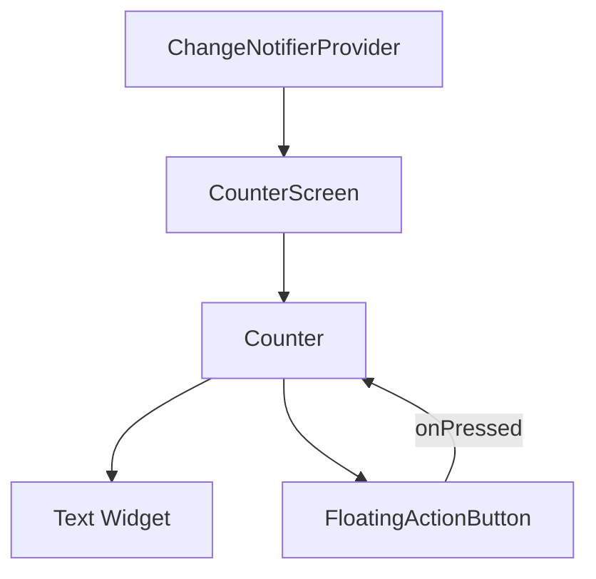

## 13.4.4 Code Snippets and Templates

In the fast-paced world of software development, efficiency and accuracy are paramount. Code snippets and templates serve as invaluable tools for developers, enabling them to write code faster, reduce errors, and adhere to best practices. This section delves into the advantages of using code snippets in Flutter development, how to access them, and best practices for their use, particularly in the context of state management.

### Advantages of Using Snippets

Code snippets offer several advantages that can significantly enhance your development workflow:

- **Accelerate Coding:** Snippets provide boilerplate code that can be inserted with just a few keystrokes, saving time and effort. This is particularly useful for repetitive tasks such as creating widgets or setting up state management structures.
  
- **Reduce Errors:** By using standardized code patterns, snippets help reduce the likelihood of errors. They ensure that commonly used code follows best practices and is less prone to bugs.

- **Consistency:** Snippets promote consistency across your codebase, making it easier to maintain and understand, especially when working in teams.

- **Learning Tool:** For beginners, snippets can serve as a learning tool, providing examples of how to implement certain features or patterns correctly.

### Accessing Snippets and Templates

There are several ways to access code snippets and templates for Flutter development:

#### Visual Studio Code Snippets

Visual Studio Code (VS Code) is a popular IDE for Flutter development, offering a wide range of extensions that provide code snippets:

- **Flutter Snippets Extension:** This extension offers a variety of snippets for Flutter, including widget scaffolds, build methods, and more. It can be installed directly from the VS Code marketplace.

- **Awesome Flutter Snippets:** Another extension that provides a comprehensive set of snippets for Flutter development. It includes shortcuts for common tasks such as creating StatelessWidget and StatefulWidget, setting up animations, and more.

#### GitHub Repositories

GitHub is a treasure trove of resources for developers, including repositories dedicated to Flutter templates and snippets:

- **Flutter Templates Repository:** Explore repositories that offer complete Flutter project templates. These templates can serve as a starting point for your projects, providing a pre-configured setup with state management, routing, and more.

- **Community Contributions:** Many developers share their own snippets and templates on GitHub. These contributions can be a great source of inspiration and practical examples.

#### Bloc and Provider Templates

State management is a critical aspect of Flutter development, and there are specific templates available for popular solutions like Bloc and Provider:

- **Bloc Templates:** The Bloc library offers templates that help you set up the Bloc pattern quickly. These templates include the necessary files and structure for managing state using Bloc.

- **Provider Templates:** Similar to Bloc, the Provider package and its community offer templates that simplify the setup of state management using Provider. These templates often include ChangeNotifier classes, Provider setup, and example widgets.

### Popular Snippets

Here are some popular snippets that can enhance your Flutter development experience:

#### StatelessWidget and StatefulWidget Shortcuts

Creating widgets is a fundamental part of Flutter development. Snippets for StatelessWidget and StatefulWidget can quickly generate the necessary boilerplate code:

```dart
// StatelessWidget snippet
class MyStatelessWidget extends StatelessWidget {
  @override
  Widget build(BuildContext context) {
    return Container(
      child: Text('Hello, StatelessWidget!'),
    );
  }
}

// StatefulWidget snippet
class MyStatefulWidget extends StatefulWidget {
  @override
  _MyStatefulWidgetState createState() => _MyStatefulWidgetState();
}

class _MyStatefulWidgetState extends State<MyStatefulWidget> {
  @override
  Widget build(BuildContext context) {
    return Container(
      child: Text('Hello, StatefulWidget!'),
    );
  }
}
```

These snippets provide a quick way to set up the basic structure of a widget, allowing you to focus on the specific functionality you need to implement.

#### Build Method Structures

The build method is where you define the UI of your widget. Snippets for common UI patterns can help you set up the structure quickly:

```dart
@override
Widget build(BuildContext context) {
  return Scaffold(
    appBar: AppBar(
      title: Text('My App'),
    ),
    body: Center(
      child: Column(
        mainAxisAlignment: MainAxisAlignment.center,
        children: <Widget>[
          Text('Hello, World!'),
          ElevatedButton(
            onPressed: () {},
            child: Text('Press Me'),
          ),
        ],
      ),
    ),
  );
}
```

This snippet provides a standard layout with an AppBar and a centered column of widgets, a common pattern in many Flutter apps.

### Best Practices

While snippets are incredibly useful, it's important to use them wisely:

- **Understand the Code:** Before using a snippet, take the time to understand what the code does. This will help you avoid blindly copying code that may not fit your specific use case.

- **Customize Snippets:** Snippets are meant to be a starting point. Customize them to fit the specific context and requirements of your application.

- **Maintain a Personal Library:** As you develop, you'll likely create custom snippets for tasks you perform frequently. Keep a personal library of these snippets to streamline your workflow.

### Practical Example: Using a Provider Template

Let's walk through a practical example of using a Provider template to manage state in a Flutter application. We'll create a simple counter app using the Provider package.

#### Step 1: Set Up the Project

First, create a new Flutter project and add the Provider package to your `pubspec.yaml` file:

```yaml
dependencies:
  flutter:
    sdk: flutter
  provider: ^6.0.0
```

Run `flutter pub get` to install the package.

#### Step 2: Create a ChangeNotifier

Create a new file `counter.dart` and define a `Counter` class that extends `ChangeNotifier`:

```dart
import 'package:flutter/foundation.dart';

class Counter with ChangeNotifier {
  int _count = 0;

  int get count => _count;

  void increment() {
    _count++;
    notifyListeners();
  }
}
```

This class manages the state of the counter and notifies listeners when the state changes.

#### Step 3: Set Up the Provider

In your `main.dart` file, wrap your application with a `ChangeNotifierProvider`:

```dart
import 'package:flutter/material.dart';
import 'package:provider/provider.dart';
import 'counter.dart';

void main() {
  runApp(
    ChangeNotifierProvider(
      create: (context) => Counter(),
      child: MyApp(),
    ),
  );
}

class MyApp extends StatelessWidget {
  @override
  Widget build(BuildContext context) {
    return MaterialApp(
      home: CounterScreen(),
    );
  }
}
```

#### Step 4: Build the UI

Create a `CounterScreen` widget that uses the `Counter` provider:

```dart
class CounterScreen extends StatelessWidget {
  @override
  Widget build(BuildContext context) {
    final counter = Provider.of<Counter>(context);

    return Scaffold(
      appBar: AppBar(
        title: Text('Counter App'),
      ),
      body: Center(
        child: Column(
          mainAxisAlignment: MainAxisAlignment.center,
          children: <Widget>[
            Text(
              'You have pushed the button this many times:',
            ),
            Text(
              '${counter.count}',
              style: Theme.of(context).textTheme.headline4,
            ),
          ],
        ),
      ),
      floatingActionButton: FloatingActionButton(
        onPressed: counter.increment,
        tooltip: 'Increment',
        child: Icon(Icons.add),
      ),
    );
  }
}
```

This widget listens to the `Counter` provider and updates the UI whenever the counter value changes.

### Diagrams and Visual Aids

To further illustrate the flow of state management using Provider, we can use a Mermaid.js diagram to visualize the widget tree and data flow:



This diagram shows how the `CounterScreen` widget accesses the `Counter` provider and how the `FloatingActionButton` triggers state changes.

### Conclusion

Code snippets and templates are powerful tools that can significantly enhance your Flutter development workflow. By providing quick access to boilerplate code and standardized patterns, they help you write code faster, reduce errors, and maintain consistency across your projects. However, it's crucial to understand and customize these snippets to fit your specific needs. By doing so, you'll not only become more efficient but also deepen your understanding of Flutter and state management best practices.

### Further Exploration

For more information on using code snippets and templates in Flutter, consider exploring the following resources:

- **Official Flutter Documentation:** [Flutter.dev](https://flutter.dev/docs)
- **Provider Package Documentation:** [Provider on pub.dev](https://pub.dev/packages/provider)
- **Bloc Package Documentation:** [Bloc on pub.dev](https://pub.dev/packages/bloc)
- **GitHub Repositories:** Search for Flutter templates and snippets on [GitHub](https://github.com)

By leveraging these resources, you can continue to refine your skills and explore new ways to enhance your Flutter development process.

## Quiz Time!



### What is one of the primary advantages of using code snippets in Flutter development?

- [x] Accelerate coding by providing boilerplate code.
- [ ] Increase the complexity of the codebase.
- [ ] Ensure that all code is unique and custom.
- [ ] Replace the need for understanding the code.

> **Explanation:** Code snippets accelerate coding by providing boilerplate code, allowing developers to focus on implementing specific functionality.

### Which Visual Studio Code extension is recommended for Flutter snippets?

- [x] Awesome Flutter Snippets
- [ ] Flutter Magic
- [ ] Dart Code Helper
- [ ] Widget Wizard

> **Explanation:** Awesome Flutter Snippets is a popular extension that provides a comprehensive set of snippets for Flutter development.

### What should you do before using a code snippet?

- [x] Understand the underlying code.
- [ ] Copy it without reviewing.
- [ ] Use it as is without any changes.
- [ ] Assume it fits all use cases.

> **Explanation:** It's important to understand the underlying code to ensure it fits your specific use case and to avoid potential issues.

### How can you access Flutter templates on GitHub?

- [x] Explore repositories dedicated to Flutter templates.
- [ ] Use the Flutter CLI to download them.
- [ ] Search for them in the Flutter documentation.
- [ ] Install them via the Dart package manager.

> **Explanation:** GitHub hosts numerous repositories dedicated to Flutter templates, which can be explored and used as starting points for projects.

### What is a common use for StatelessWidget and StatefulWidget snippets?

- [x] Quickly generate widget scaffolds.
- [ ] Create complex animations.
- [ ] Manage database connections.
- [ ] Handle network requests.

> **Explanation:** StatelessWidget and StatefulWidget snippets are commonly used to quickly generate the basic structure of widgets.

### What is a best practice when using code snippets?

- [x] Customize snippets to fit the specific context of your application.
- [ ] Use them without modification.
- [ ] Avoid using them to ensure originality.
- [ ] Share them without understanding.

> **Explanation:** Customizing snippets ensures they fit the specific context and requirements of your application.

### Which package provides templates for setting up the Bloc pattern?

- [x] Bloc
- [ ] Redux
- [ ] MobX
- [ ] Riverpod

> **Explanation:** The Bloc package provides templates that help set up the Bloc pattern for state management.

### What is the purpose of a ChangeNotifier in the Provider package?

- [x] To manage state and notify listeners of changes.
- [ ] To handle HTTP requests.
- [ ] To render UI components.
- [ ] To manage routing.

> **Explanation:** A ChangeNotifier is used to manage state and notify listeners of changes, making it a key component in the Provider package.

### How can you visualize the flow of state management in a Flutter app?

- [x] Use Mermaid.js diagrams to depict widget trees and data flow.
- [ ] Write detailed comments in the code.
- [ ] Use the Flutter CLI to generate diagrams.
- [ ] Rely on the IDE's built-in tools.

> **Explanation:** Mermaid.js diagrams can effectively visualize widget trees and data flow, aiding in understanding state management.

### True or False: Code snippets should replace the need for understanding the code.

- [ ] True
- [x] False

> **Explanation:** False. While code snippets are helpful, understanding the code is crucial to ensure it fits the specific use case and to avoid potential issues.


