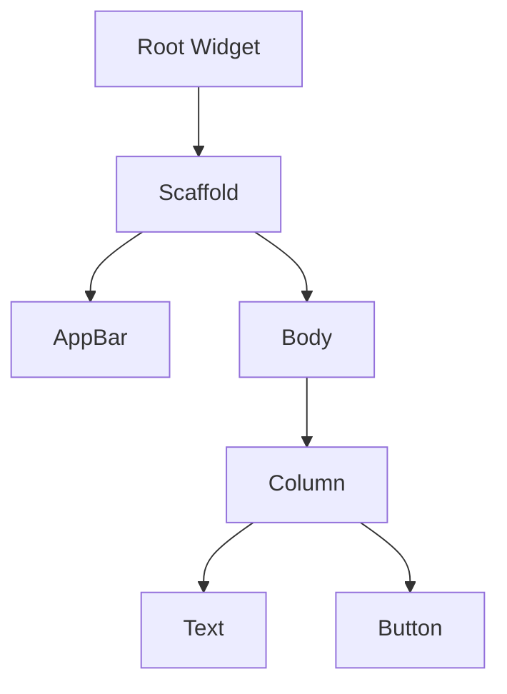

## 14.1.1 Common Terminology

Welcome to the glossary section of "State Management Essentials in Flutter." This glossary serves as a quick reference guide to the key terms and concepts discussed throughout the book. Understanding these terms is crucial for grasping the intricacies of Flutter and state management. Terms are listed alphabetically for easy navigation.

### **Asynchronous Programming**

Asynchronous programming is a paradigm that allows operations, such as network requests or file I/O, to occur without blocking the main execution thread. This enables applications to remain responsive to user interactions while waiting for these operations to complete. In Flutter, asynchronous programming is often implemented using `Future` and `async/await` keywords.

```dart
Future<String> fetchData() async {
  final response = await http.get(Uri.parse('https://example.com/data'));
  return response.body;
}
```

### **Bloc (Business Logic Component)**

Bloc is a design pattern that separates business logic from the presentation layer. It uses streams to handle events and output states, promoting a clear separation of concerns. The Bloc pattern is particularly useful for managing complex state changes and ensuring that the UI remains consistent with the underlying data.

```dart
class CounterBloc extends Bloc<CounterEvent, int> {
  CounterBloc() : super(0);

  @override
  Stream<int> mapEventToState(CounterEvent event) async* {
    if (event is IncrementEvent) {
      yield state + 1;
    }
  }
}
```

### **BuildContext**

`BuildContext` is an object in Flutter that provides information about the location of a widget in the widget tree. It is used to access theme data, media queries, and other inherited properties. Understanding `BuildContext` is essential for navigating the widget tree and managing dependencies.

```dart
@override
Widget build(BuildContext context) {
  return Text(
    'Hello, World!',
    style: Theme.of(context).textTheme.headline4,
  );
}
```

### **Declarative UI**

Declarative UI is a programming style where the UI is described in terms of the current application state, rather than providing step-by-step instructions on how to change the UI. Flutter's widget-based framework is inherently declarative, allowing developers to focus on what the UI should look like for a given state.

```dart
Widget build(BuildContext context) {
  return Scaffold(
    appBar: AppBar(title: Text('Declarative UI')),
    body: Center(
      child: Text('Hello, Flutter!'),
    ),
  );
}
```

### **Dependency Injection**

Dependency Injection (DI) is a design pattern used to achieve Inversion of Control (IoC) between classes and their dependencies. In Flutter, DI can be implemented using packages like `provider` and `get_it`, allowing for better testability and modularity.

```dart
final getIt = GetIt.instance;

void setup() {
  getIt.registerSingleton<ApiService>(ApiServiceImpl());
}

class MyWidget extends StatelessWidget {
  final apiService = getIt<ApiService>();

  @override
  Widget build(BuildContext context) {
    return Container();
  }
}
```

### **Ephemeral State**

Ephemeral state refers to temporary state that is local to a widget and does not need to be shared across the application. This type of state is typically managed using `StatefulWidget` and `setState`.

```dart
class Counter extends StatefulWidget {
  @override
  _CounterState createState() => _CounterState();
}

class _CounterState extends State<Counter> {
  int _count = 0;

  void _increment() {
    setState(() {
      _count++;
    });
  }

  @override
  Widget build(BuildContext context) {
    return Text('Count: $_count');
  }
}
```

### **Immutable State**

Immutable state is a state that cannot be changed after it is created. This concept is crucial in functional programming and helps prevent unintended side effects. In Flutter, immutable state is often managed using state management solutions like `Bloc` or `Provider`.

```dart
class AppState {
  final int counter;

  AppState(this.counter);
}
```

### **InheritedWidget**

`InheritedWidget` is a special type of widget in Flutter that allows data to be efficiently passed down the widget tree. It is commonly used for propagating theme data or application state to descendant widgets.

```dart
class MyInheritedWidget extends InheritedWidget {
  final int data;

  MyInheritedWidget({Key? key, required this.data, required Widget child})
      : super(key: key, child: child);

  @override
  bool updateShouldNotify(MyInheritedWidget oldWidget) {
    return oldWidget.data != data;
  }

  static MyInheritedWidget? of(BuildContext context) {
    return context.dependOnInheritedWidgetOfExactType<MyInheritedWidget>();
  }
}
```

### **Provider**

Provider is a popular state management library in Flutter that simplifies the process of managing and accessing state. It uses the concept of dependency injection to provide objects throughout the widget tree.

```dart
class Counter with ChangeNotifier {
  int _count = 0;

  int get count => _count;

  void increment() {
    _count++;
    notifyListeners();
  }
}

ChangeNotifierProvider(
  create: (context) => Counter(),
  child: MyApp(),
)
```

### **Reactive Programming**

Reactive programming is a programming paradigm oriented around data flows and the propagation of change. In Flutter, reactive programming is often implemented using streams, allowing for asynchronous data handling and event-driven architecture.

```dart
Stream<int> numberStream() async* {
  for (int i = 0; i < 5; i++) {
    yield i;
    await Future.delayed(Duration(seconds: 1));
  }
}
```

### **StatefulWidget**

`StatefulWidget` is a type of widget in Flutter that maintains mutable state. It is used when the widget needs to rebuild in response to user interactions or other events.

```dart
class MyStatefulWidget extends StatefulWidget {
  @override
  _MyStatefulWidgetState createState() => _MyStatefulWidgetState();
}

class _MyStatefulWidgetState extends State<MyStatefulWidget> {
  @override
  Widget build(BuildContext context) {
    return Container();
  }
}
```

### **StatelessWidget**

`StatelessWidget` is a type of widget in Flutter that does not require mutable state. It is used for widgets that do not change once they are built.

```dart
class MyStatelessWidget extends StatelessWidget {
  @override
  Widget build(BuildContext context) {
    return Text('I am a stateless widget');
  }
}
```

### **Stream**

A `Stream` is a sequence of asynchronous events. Streams are used in Flutter to handle data that is received asynchronously, such as user inputs or network responses.

```dart
Stream<int> counterStream() async* {
  for (int i = 0; i < 10; i++) {
    yield i;
    await Future.delayed(Duration(seconds: 1));
  }
}
```

### **Widget Tree**

The widget tree is the hierarchical structure of widgets that make up the user interface in a Flutter application. Understanding the widget tree is fundamental to building and managing Flutter UIs.



### Best Practices

- **Accuracy:** Ensure definitions are accurate and reflect the latest Flutter and Dart versions.
- **Clarity:** Use simple language and avoid jargon to make definitions accessible to all readers.
- **Cross-Referencing:** Mention related terms within definitions to provide a comprehensive understanding.
- **Examples:** Provide practical examples and code snippets to illustrate complex terms.

### Additional Resources

- [Flutter Documentation](https://flutter.dev/docs)
- [Dart Language Tour](https://dart.dev/guides/language/language-tour)
- [Bloc Library](https://bloclibrary.dev/#/)
- [Provider Package](https://pub.dev/packages/provider)

## Quiz Time!



### What is the primary purpose of asynchronous programming in Flutter?

- [x] To allow operations to occur without blocking the main execution thread
- [ ] To speed up the execution of synchronous code
- [ ] To simplify the code structure
- [ ] To enhance the visual appearance of the app

> **Explanation:** Asynchronous programming allows operations like network requests to occur without blocking the main thread, keeping the app responsive.

### Which design pattern does Bloc represent?

- [x] Separation of business logic from the presentation layer
- [ ] Direct manipulation of the UI components
- [ ] A way to manage ephemeral state
- [ ] A method for styling widgets

> **Explanation:** Bloc separates business logic from the UI, using streams to manage events and states.

### What is the role of BuildContext in Flutter?

- [x] Provides context about the location of a widget in the widget tree
- [ ] Manages the state of a widget
- [ ] Handles network requests
- [ ] Styles the application

> **Explanation:** BuildContext provides information about a widget's location in the widget tree, used for accessing inherited properties.

### How does Declarative UI differ from imperative UI?

- [x] Describes the UI in terms of the current application state
- [ ] Provides step-by-step instructions for UI changes
- [ ] Focuses on styling and layout
- [ ] Uses direct manipulation of DOM elements

> **Explanation:** Declarative UI describes what the UI should look like based on the current state, rather than how to change it.

### What is Dependency Injection used for in Flutter?

- [x] Achieving Inversion of Control between classes and their dependencies
- [ ] Styling widgets
- [ ] Managing network requests
- [ ] Handling user input

> **Explanation:** Dependency Injection is used to manage dependencies, promoting modularity and testability.

### What type of state is managed by StatefulWidget?

- [x] Ephemeral state
- [ ] Immutable state
- [ ] Global state
- [ ] Persistent state

> **Explanation:** StatefulWidget is used to manage ephemeral state, which is local to a widget and temporary.

### What is the primary benefit of using Immutable State?

- [x] Prevents unintended side effects
- [ ] Simplifies code structure
- [ ] Enhances UI styling
- [ ] Speeds up network requests

> **Explanation:** Immutable state helps prevent side effects by ensuring state cannot be changed after creation.

### How does InheritedWidget help in Flutter?

- [x] Allows data to be efficiently passed down the widget tree
- [ ] Manages network requests
- [ ] Handles user authentication
- [ ] Styles the application

> **Explanation:** InheritedWidget allows data to be passed efficiently to descendant widgets, often used for themes and state.

### What is the purpose of a Stream in Flutter?

- [x] To handle asynchronous sequences of events
- [ ] To style widgets
- [ ] To manage global state
- [ ] To handle synchronous operations

> **Explanation:** Streams handle asynchronous events, such as user inputs or network responses.

### True or False: StatelessWidget can maintain mutable state.

- [ ] True
- [x] False

> **Explanation:** StatelessWidget cannot maintain mutable state; it is used for widgets that do not change once built.


