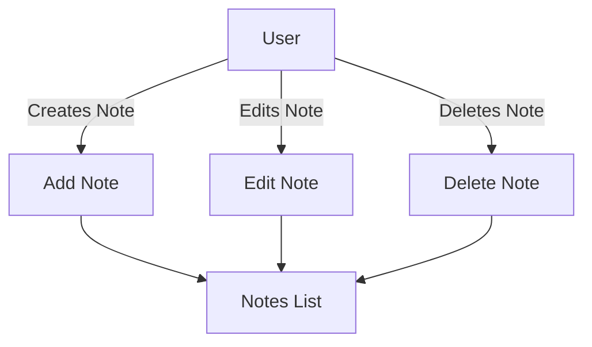
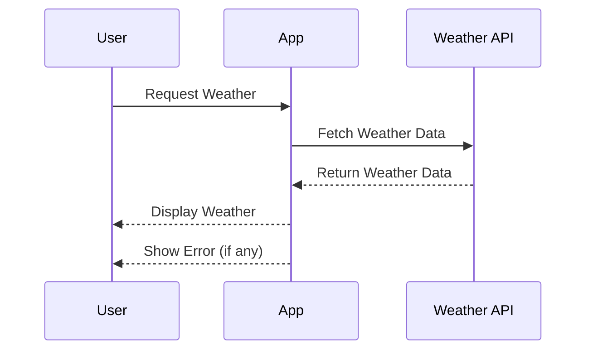
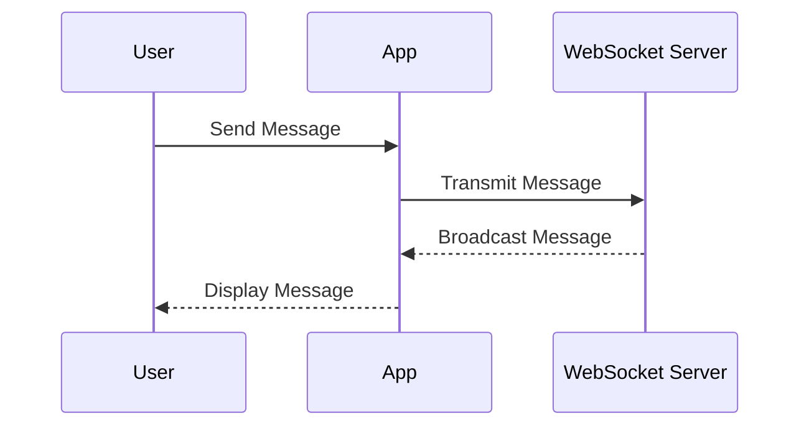
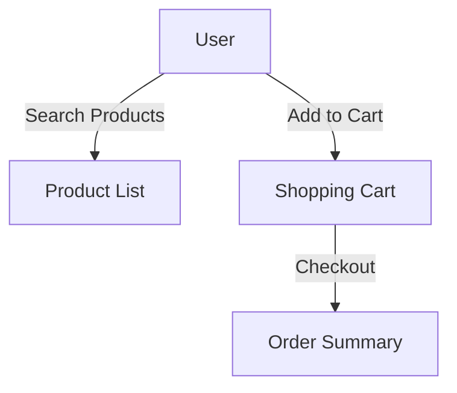

## 14.3.1 Practice Projects

In the journey of mastering state management in Flutter, theory alone is not enough. Practical application through projects is essential to solidify your understanding and gain confidence in implementing state management solutions. This section provides you with a set of practice projects designed to reinforce the concepts you've learned throughout this book. These projects not only serve as a platform for experimentation but also encourage you to tailor them to your interests and needs.

### Introduction

Applying knowledge through practical projects is invaluable. It allows you to:

- **Reinforce Learning:** By implementing concepts in real-world scenarios, you deepen your understanding.
- **Enhance Problem-Solving Skills:** Encountering and overcoming challenges in projects sharpens your ability to troubleshoot and adapt.
- **Build a Portfolio:** Completed projects can showcase your skills to potential employers or clients.
- **Foster Creativity:** Customizing projects to your interests encourages innovation and personal investment.

As you embark on these practice projects, remember that the goal is not just to complete them but to explore and experiment with different state management techniques. Feel free to modify and extend these projects to suit your interests and the specific challenges you wish to tackle.

### Suggested Practice Projects

#### Note-Taking App

**Description:** Create an app where users can create, edit, and delete notes. This project focuses on managing a list of notes, handling CRUD (Create, Read, Update, Delete) operations, and syncing data locally or to a backend.

**State Management Focus:**

- **Managing Notes List:** Use state management to handle the list of notes efficiently.
- **CRUD Operations:** Implement state changes for creating, editing, and deleting notes.
- **Data Persistence:** Explore local storage solutions like SQLite or Hive, or sync with a backend using REST APIs.

**Key Features to Implement:**

- **Add/Edit/Delete Notes:** Allow users to manage their notes with a simple and intuitive interface.
- **Search Functionality:** Implement a search feature to filter notes by keywords.
- **Categorization:** Enable users to categorize notes for better organization.

**Code Example:**

```dart
import 'package:flutter/material.dart';

void main() => runApp(NoteApp());

class NoteApp extends StatelessWidget {
  @override
  Widget build(BuildContext context) {
    return MaterialApp(
      home: NoteListScreen(),
    );
  }
}

class NoteListScreen extends StatefulWidget {
  @override
  _NoteListScreenState createState() => _NoteListScreenState();
}

class _NoteListScreenState extends State<NoteListScreen> {
  List<String> notes = [];

  void addNote() {
    setState(() {
      notes.add('New Note ${notes.length + 1}');
    });
  }

  @override
  Widget build(BuildContext context) {
    return Scaffold(
      appBar: AppBar(title: Text('Notes')),
      body: ListView.builder(
        itemCount: notes.length,
        itemBuilder: (context, index) {
          return ListTile(
            title: Text(notes[index]),
            trailing: IconButton(
              icon: Icon(Icons.delete),
              onPressed: () {
                setState(() {
                  notes.removeAt(index);
                });
              },
            ),
          );
        },
      ),
      floatingActionButton: FloatingActionButton(
        onPressed: addNote,
        child: Icon(Icons.add),
      ),
    );
  }
}
```

**Mermaid Diagram:**



#### Weather Forecast App

**Description:** Develop an app that displays current weather and forecasts using a public API. This project emphasizes handling asynchronous API calls, managing loading and error states, and updating the UI reactively.

**State Management Focus:**

- **Asynchronous API Calls:** Use state management to handle data fetching from a weather API.
- **Loading and Error States:** Implement state changes to reflect loading and error conditions.
- **Reactive UI Updates:** Ensure the UI updates automatically when new data is fetched.

**Key Features to Implement:**

- **Current Weather Display:** Show current weather conditions for a selected location.
- **Forecast Information:** Provide a 5-day weather forecast with daily summaries.
- **Location Search:** Allow users to search for weather data by city or coordinates.

**Code Example:**

```dart
import 'package:flutter/material.dart';
import 'package:http/http.dart' as http;
import 'dart:convert';

void main() => runApp(WeatherApp());

class WeatherApp extends StatelessWidget {
  @override
  Widget build(BuildContext context) {
    return MaterialApp(
      home: WeatherScreen(),
    );
  }
}

class WeatherScreen extends StatefulWidget {
  @override
  _WeatherScreenState createState() => _WeatherScreenState();
}

class _WeatherScreenState extends State<WeatherScreen> {
  String weather = 'Loading...';

  @override
  void initState() {
    super.initState();
    fetchWeather();
  }

  Future<void> fetchWeather() async {
    final response = await http.get(Uri.parse('https://api.weatherapi.com/v1/current.json?key=YOUR_API_KEY&q=London'));
    if (response.statusCode == 200) {
      setState(() {
        weather = jsonDecode(response.body)['current']['condition']['text'];
      });
    } else {
      setState(() {
        weather = 'Error fetching weather';
      });
    }
  }

  @override
  Widget build(BuildContext context) {
    return Scaffold(
      appBar: AppBar(title: Text('Weather')),
      body: Center(child: Text(weather)),
    );
  }
}
```

**Mermaid Diagram:**



#### Chat Application

**Description:** Build a basic messaging app with real-time communication features. This project focuses on managing user sessions, message streams, and real-time updates using streams or WebSockets.

**State Management Focus:**

- **User Sessions:** Manage user authentication and session state.
- **Message Streams:** Use streams to handle real-time message updates.
- **Real-Time Communication:** Implement WebSockets for instant messaging.

**Key Features to Implement:**

- **User Authentication:** Allow users to sign up, log in, and log out.
- **Real-Time Messaging:** Enable users to send and receive messages instantly.
- **Chat Rooms:** Support multiple chat rooms or direct messaging.

**Code Example:**

```dart
import 'package:flutter/material.dart';
import 'package:web_socket_channel/web_socket_channel.dart';

void main() => runApp(ChatApp());

class ChatApp extends StatelessWidget {
  @override
  Widget build(BuildContext context) {
    return MaterialApp(
      home: ChatScreen(),
    );
  }
}

class ChatScreen extends StatefulWidget {
  @override
  _ChatScreenState createState() => _ChatScreenState();
}

class _ChatScreenState extends State<ChatScreen> {
  final WebSocketChannel channel = WebSocketChannel.connect(Uri.parse('wss://echo.websocket.org'));
  final TextEditingController controller = TextEditingController();
  List<String> messages = [];

  void sendMessage() {
    if (controller.text.isNotEmpty) {
      channel.sink.add(controller.text);
      controller.clear();
    }
  }

  @override
  Widget build(BuildContext context) {
    return Scaffold(
      appBar: AppBar(title: Text('Chat')),
      body: Column(
        children: [
          Expanded(
            child: StreamBuilder(
              stream: channel.stream,
              builder: (context, snapshot) {
                if (snapshot.hasData) {
                  messages.add(snapshot.data);
                }
                return ListView.builder(
                  itemCount: messages.length,
                  itemBuilder: (context, index) {
                    return ListTile(title: Text(messages[index]));
                  },
                );
              },
            ),
          ),
          Padding(
            padding: const EdgeInsets.all(8.0),
            child: Row(
              children: [
                Expanded(
                  child: TextField(
                    controller: controller,
                    decoration: InputDecoration(labelText: 'Send a message'),
                  ),
                ),
                IconButton(
                  icon: Icon(Icons.send),
                  onPressed: sendMessage,
                ),
              ],
            ),
          ),
        ],
      ),
    );
  }

  @override
  void dispose() {
    channel.sink.close();
    super.dispose();
  }
}
```

**Mermaid Diagram:**



#### E-Commerce Product Catalog

**Description:** Design an app showcasing products with categories, search functionality, and a shopping cart. This project emphasizes implementing global state for the shopping cart, filtering products, and handling user interactions.

**State Management Focus:**

- **Global State Management:** Use a state management solution to handle the shopping cart and user interactions.
- **Product Filtering:** Implement state changes for filtering and searching products.
- **User Interactions:** Manage state for user actions like adding to cart and checking out.

**Key Features to Implement:**

- **Product Listing:** Display a list of products with categories and search functionality.
- **Shopping Cart:** Allow users to add, remove, and update items in their cart.
- **Checkout Process:** Implement a simple checkout flow with order summary.

**Code Example:**

```dart
import 'package:flutter/material.dart';

void main() => runApp(ECommerceApp());

class ECommerceApp extends StatelessWidget {
  @override
  Widget build(BuildContext context) {
    return MaterialApp(
      home: ProductListScreen(),
    );
  }
}

class ProductListScreen extends StatefulWidget {
  @override
  _ProductListScreenState createState() => _ProductListScreenState();
}

class _ProductListScreenState extends State<ProductListScreen> {
  List<String> products = ['Product 1', 'Product 2', 'Product 3'];
  List<String> cart = [];

  void addToCart(String product) {
    setState(() {
      cart.add(product);
    });
  }

  @override
  Widget build(BuildContext context) {
    return Scaffold(
      appBar: AppBar(title: Text('Products')),
      body: ListView.builder(
        itemCount: products.length,
        itemBuilder: (context, index) {
          return ListTile(
            title: Text(products[index]),
            trailing: IconButton(
              icon: Icon(Icons.add_shopping_cart),
              onPressed: () => addToCart(products[index]),
            ),
          );
        },
      ),
    );
  }
}
```

**Mermaid Diagram:**



### Guidelines for Completing Projects

- **Define Clear Objectives:** Before starting, outline the goals and requirements for your project. This helps maintain focus and ensures that you cover all necessary features.
- **Choose Appropriate State Management Solutions:** Select the state management techniques that best fit your project needs. Consider factors like complexity, scalability, and your familiarity with the tools.
- **Document the Development Process:** Keep a record of your development journey, including challenges faced and solutions implemented. This documentation can be invaluable for future reference and learning.
- **Experiment and Iterate:** Use these projects as a sandbox for trying out different approaches. Don't be afraid to refactor and improve your code as you learn.

### Best Practices

- **Experiment with Different Techniques:** Try implementing the same project using different state management solutions to understand their strengths and weaknesses.
- **Seek Feedback:** Share your projects with peers or the community to receive constructive feedback. Code reviews can provide new insights and improve your coding skills.
- **Focus on Clean Code:** Apply the best practices you've learned from this book to write clean, maintainable code. This includes following naming conventions, writing comments, and structuring your code logically.
- **Continuous Learning:** State management in Flutter is an evolving field. Stay updated with the latest trends and techniques to keep your skills sharp.

### Encouragement for Further Exploration

These practice projects are just the beginning. As you gain confidence, consider expanding them or creating entirely new projects that challenge you further. The skills you develop through hands-on practice will be invaluable in your career as a Flutter developer. Remember, the key to mastery is consistent practice and a willingness to learn from every experience.

## Quiz Time!



### Which project focuses on handling asynchronous API calls and managing loading and error states?

- [ ] Note-Taking App
- [x] Weather Forecast App
- [ ] Chat Application
- [ ] E-Commerce Product Catalog

> **Explanation:** The Weather Forecast App involves handling asynchronous API calls to fetch weather data and managing loading and error states to update the UI reactively.

### What is a key feature of the Note-Taking App project?

- [ ] Real-Time Messaging
- [x] CRUD Operations
- [ ] Product Filtering
- [ ] User Authentication

> **Explanation:** The Note-Taking App focuses on CRUD operations, allowing users to create, read, update, and delete notes.

### Which state management focus is emphasized in the Chat Application project?

- [ ] Global State Management
- [ ] Data Persistence
- [x] Real-Time Communication
- [ ] Product Filtering

> **Explanation:** The Chat Application emphasizes real-time communication, using streams or WebSockets to handle instant messaging.

### What should you do before starting a practice project?

- [x] Define clear objectives and requirements
- [ ] Choose a random state management solution
- [ ] Start coding immediately
- [ ] Avoid documenting the process

> **Explanation:** Defining clear objectives and requirements helps maintain focus and ensures that all necessary features are covered in the project.

### Which project involves implementing a shopping cart and handling user interactions?

- [ ] Note-Taking App
- [ ] Weather Forecast App
- [ ] Chat Application
- [x] E-Commerce Product Catalog

> **Explanation:** The E-Commerce Product Catalog project involves implementing a shopping cart and handling user interactions like adding to cart and checking out.

### What is a suggested best practice for completing practice projects?

- [ ] Avoid seeking feedback
- [x] Experiment with different state management techniques
- [ ] Focus only on one solution
- [ ] Ignore code quality

> **Explanation:** Experimenting with different state management techniques helps you understand their strengths and weaknesses, enhancing your learning experience.

### What is a benefit of sharing your projects with the community?

- [ ] Receiving criticism
- [x] Gaining constructive feedback
- [ ] Losing control over your code
- [ ] Avoiding code reviews

> **Explanation:** Sharing projects with the community can provide constructive feedback, offering new insights and improving your coding skills.

### Which project requires managing user sessions and message streams?

- [ ] Note-Taking App
- [ ] Weather Forecast App
- [x] Chat Application
- [ ] E-Commerce Product Catalog

> **Explanation:** The Chat Application requires managing user sessions and message streams for real-time communication.

### What is a key feature to implement in the Weather Forecast App?

- [ ] Real-Time Messaging
- [ ] Shopping Cart
- [x] Current Weather Display
- [ ] Note Categorization

> **Explanation:** A key feature of the Weather Forecast App is displaying the current weather conditions for a selected location.

### True or False: The E-Commerce Product Catalog project focuses on implementing real-time communication.

- [ ] True
- [x] False

> **Explanation:** The E-Commerce Product Catalog project focuses on global state management for the shopping cart and product filtering, not real-time communication.


