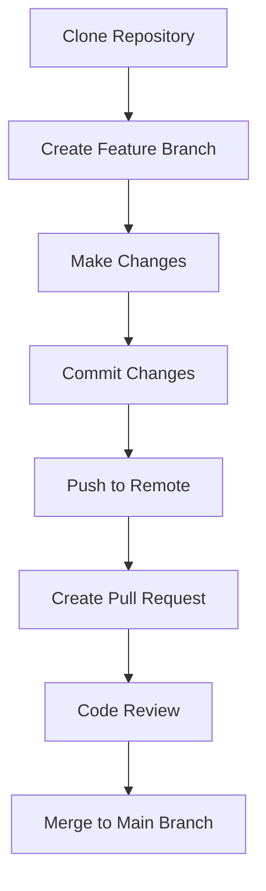

## 14.3.3 Collaborative Projects

In the world of software development, collaboration is a cornerstone of success. Engaging in collaborative projects not only enhances your technical skills but also prepares you for the dynamics of professional environments. This section explores the benefits of collaboration, provides project ideas, and outlines tools and best practices to help you succeed in collaborative endeavors.

### Benefits of Collaboration

Collaborative projects offer a multitude of benefits that extend beyond technical skill enhancement. Here are some key advantages:

- **Learning from Others' Perspectives and Expertise:**
  - Collaboration allows you to gain insights from team members with diverse backgrounds and experiences. This exposure can lead to innovative solutions and broaden your understanding of different approaches to problem-solving.

- **Practicing Version Control and Project Management:**
  - Working in a team setting provides an opportunity to practice using version control systems like Git, which are essential in managing code changes and coordinating with others. Additionally, you'll gain experience in project management tools that help track progress and organize tasks.

- **Preparing for Professional Team Environments:**
  - Collaborative projects simulate real-world work environments, helping you develop soft skills such as communication, teamwork, and conflict resolution. These experiences are invaluable when transitioning to professional settings.

### Project Ideas

Embarking on a collaborative project can be both exciting and challenging. Here are some project ideas to consider:

#### Open Source Contribution

Joining an existing open-source Flutter project is a fantastic way to contribute to the community while honing your skills. Focus on improving state management implementations or enhancing documentation. This experience not only builds your portfolio but also connects you with a network of developers.

- **Steps to Get Started:**
  - Identify a project that aligns with your interests and skill level.
  - Review the project's contribution guidelines and code of conduct.
  - Start with small issues or documentation improvements to familiarize yourself with the codebase.
  - Gradually take on more complex tasks as you gain confidence.

#### Group Development of an App

Form a team to develop a full-featured app, such as a social media platform or productivity tool. Assign roles and responsibilities related to different aspects of state management to ensure a well-rounded learning experience.

- **Project Phases:**
  - **Planning:** Define the app's scope, features, and target audience. Create a roadmap outlining milestones and deadlines.
  - **Design:** Collaborate on the app's UI/UX design, ensuring a cohesive and user-friendly interface.
  - **Development:** Divide tasks among team members, focusing on state management, UI components, and backend integration.
  - **Testing and Deployment:** Conduct thorough testing to ensure functionality and performance. Deploy the app and gather user feedback for future iterations.

#### Hackathons and Coding Challenges

Participate in events focused on Flutter development, such as hackathons or coding challenges. These events provide an opportunity to collaborate intensively over a short period to create innovative solutions.

- **Preparation Tips:**
  - Assemble a diverse team with complementary skills to tackle various aspects of the challenge.
  - Familiarize yourself with the event's theme and requirements beforehand.
  - Develop a clear strategy and allocate time efficiently to maximize productivity.

### Tools and Platforms for Collaboration

Effective collaboration requires the right tools and platforms. Here are some essential tools to facilitate teamwork:

#### Version Control Systems

- **Git:** A distributed version control system that tracks changes in source code. It's essential for coordinating work among multiple developers.
- **GitHub/GitLab:** Hosting services that provide repositories for storing code, along with collaboration features like pull requests and issue tracking.

#### Communication Tools

- **Slack/Discord/Teams:** Platforms for real-time communication and coordination. They support text, voice, and video communication, making it easy to stay connected with your team.

#### Project Management

- **Trello/Jira/Asana:** Tools for task tracking and project management. They help organize tasks, set priorities, and monitor progress, ensuring that everyone is aligned with the project's goals.

### Best Practices

To ensure a successful collaborative project, consider the following best practices:

- **Establish Clear Communication Channels and Project Guidelines:**
  - Define how and when the team will communicate. Set expectations for response times and meeting schedules.
  - Develop project guidelines that outline coding standards, branch naming conventions, and commit message formats.

- **Practice Code Reviews and Collaborative Coding Techniques:**
  - Conduct regular code reviews to maintain code quality and share knowledge among team members.
  - Use pair programming or mob programming sessions to solve complex problems collaboratively.

- **Respect Team Diversity and Foster an Inclusive Environment:**
  - Encourage open dialogue and respect differing opinions. Embrace diversity as a strength that can lead to more creative solutions.
  - Create an inclusive environment where all team members feel valued and heard.

### Practical Code Example: Collaborative Development Workflow

To illustrate a collaborative development workflow, let's consider a simple Flutter project using Git and GitHub for version control and collaboration.

```bash
git clone https://github.com/yourusername/yourproject.git
cd yourproject

git checkout -b feature/your-feature-name

# Edit files and add your changes
git add .
git commit -m "Add feature: your feature description"

git push origin feature/your-feature-name

# Navigate to your repository on GitHub and create a pull request for your branch
```

### Diagram: Collaborative Workflow

Below is a Mermaid.js diagram illustrating a typical collaborative workflow using Git and GitHub:



### Conclusion

Collaborative projects are a powerful way to enhance your skills, build your network, and prepare for professional environments. By engaging in these projects, you'll gain valuable experience in teamwork, version control, and project management. Remember to embrace diversity, communicate effectively, and continuously learn from your peers. Whether you're contributing to open source, developing an app with a team, or participating in hackathons, collaboration will enrich your development journey.

## Quiz Time!



### What is one key benefit of engaging in collaborative projects?

- [x] Learning from others' perspectives and expertise
- [ ] Working in isolation to focus better
- [ ] Avoiding the use of version control systems
- [ ] Reducing communication with other developers

> **Explanation:** Collaborative projects allow you to learn from team members with diverse backgrounds and experiences, which can lead to innovative solutions and broaden your understanding of different approaches to problem-solving.

### Which tool is essential for version control in collaborative projects?

- [x] Git
- [ ] Slack
- [ ] Trello
- [ ] Asana

> **Explanation:** Git is a distributed version control system that tracks changes in source code, making it essential for coordinating work among multiple developers.

### What is a recommended practice for maintaining code quality in collaborative projects?

- [x] Conduct regular code reviews
- [ ] Avoid using communication tools
- [ ] Work without any project guidelines
- [ ] Ignore team diversity

> **Explanation:** Conducting regular code reviews helps maintain code quality and allows team members to share knowledge and learn from each other.

### What is the purpose of using project management tools like Trello or Jira?

- [x] Organizing tasks and monitoring progress
- [ ] Replacing version control systems
- [ ] Eliminating the need for communication
- [ ] Avoiding task tracking

> **Explanation:** Project management tools like Trello or Jira help organize tasks, set priorities, and monitor progress, ensuring that everyone is aligned with the project's goals.

### Which platform is commonly used for real-time communication in collaborative projects?

- [x] Slack
- [ ] GitHub
- [ ] Git
- [ ] Trello

> **Explanation:** Slack is a platform for real-time communication and coordination, supporting text, voice, and video communication, making it easy to stay connected with your team.

### What is a key advantage of participating in hackathons?

- [x] Collaborating intensively over a short period to create innovative solutions
- [ ] Working alone to improve personal skills
- [ ] Avoiding teamwork and collaboration
- [ ] Focusing solely on theoretical knowledge

> **Explanation:** Hackathons provide an opportunity to collaborate intensively over a short period, allowing teams to create innovative solutions and gain practical experience.

### What is the first step in a typical collaborative development workflow using Git?

- [x] Clone the repository
- [ ] Create a pull request
- [ ] Push to remote
- [ ] Make changes

> **Explanation:** The first step in a typical collaborative development workflow using Git is to clone the repository to your local machine.

### Which of the following is a best practice for fostering an inclusive environment in collaborative projects?

- [x] Respect team diversity
- [ ] Avoid open dialogue
- [ ] Embrace uniformity
- [ ] Ignore differing opinions

> **Explanation:** Respecting team diversity and fostering an inclusive environment encourages open dialogue and values differing opinions, leading to more creative solutions.

### What is one way to prepare for professional team environments through collaborative projects?

- [x] Simulating real-world work environments
- [ ] Working in isolation
- [ ] Avoiding communication with team members
- [ ] Ignoring project management practices

> **Explanation:** Collaborative projects simulate real-world work environments, helping you develop soft skills such as communication, teamwork, and conflict resolution, which are invaluable in professional settings.

### True or False: Collaborative projects can help you practice using version control systems like Git.

- [x] True
- [ ] False

> **Explanation:** True. Collaborative projects provide an opportunity to practice using version control systems like Git, which are essential in managing code changes and coordinating with others.


