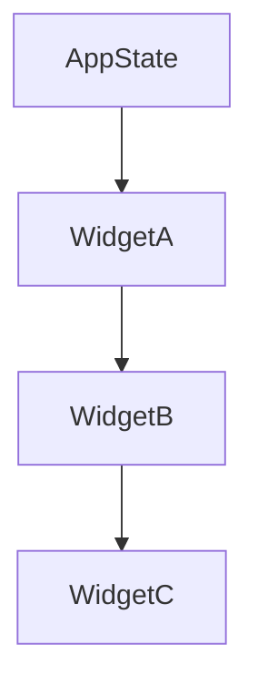

## 2.1.1 Unidirectional Data Flow

In the realm of Flutter and state management, understanding the concept of unidirectional data flow is crucial for building robust, maintainable applications. This approach simplifies the flow of data through your application, making it easier to track changes and debug issues. Let's delve into what unidirectional data flow means, its advantages, and how to implement it effectively in Flutter.

### Understanding Unidirectional Data Flow

Unidirectional data flow is a design principle where data moves in a single direction through the application. In the context of Flutter, this means that data flows from the top-level parent widgets down to the child widgets. This structure creates a predictable and manageable flow of data, which is essential for maintaining complex applications.

#### The Flow of Data

In a unidirectional data flow system, the application state is typically held at the top of the widget hierarchy. This state is then passed down to child widgets through constructor parameters or other mechanisms like providers. Each widget can read the state it needs to render itself correctly, but it cannot modify the state directly. Instead, any changes to the state are initiated by user interactions or other events, which are then propagated back up to the top-level state manager to update the state.

This flow can be visualized as follows:



In this diagram, `AppState` represents the central state of the application. Data flows from `AppState` to `WidgetA`, then to `WidgetB`, and finally to `WidgetC`. Each widget receives the data it needs from its parent, maintaining a clear and predictable flow.

### Advantages of Unidirectional Data Flow

Adopting unidirectional data flow in your Flutter applications offers several benefits:

- **Predictability:** Since data flows in a single direction, it's easier to predict how changes in the state will affect the application. This predictability simplifies debugging and reduces the likelihood of unexpected behaviors.
- **Easier State Tracking:** With a centralized state, tracking changes becomes straightforward. You can easily identify where the state is modified and how it affects the UI.
- **Reduced Complexity:** By avoiding bidirectional data flows, you eliminate the complexity that comes with managing state changes in multiple directions. This simplification leads to cleaner and more maintainable code.
- **Improved Maintainability:** With a clear separation between state management and UI rendering, your codebase becomes easier to maintain and extend. This separation allows developers to work on different parts of the application without interfering with each other.

### Implementing Unidirectional Data Flow in Flutter

To illustrate how unidirectional data flow can be implemented in a Flutter application, let's consider a simple shopping cart app. In this app, the central state holds the list of items in the cart, and this state is passed down to various UI components that display the cart contents and allow users to add or remove items.

#### Step-by-Step Implementation

1. **Define the App State:**

   The app state is typically defined as a class that holds the data and provides methods to modify it. For our shopping cart example, we might have a class like this:

   ```dart
   class CartState {
     List<String> items = [];

     void addItem(String item) {
       items.add(item);
     }

     void removeItem(String item) {
       items.remove(item);
     }
   }
   ```

2. **Create the Main App Widget:**

   The main app widget holds an instance of the `CartState` and passes it down to child widgets.

   ```dart
   class ShoppingCartApp extends StatelessWidget {
     final CartState cartState = CartState();

     @override
     Widget build(BuildContext context) {
       return MaterialApp(
         home: Scaffold(
           appBar: AppBar(title: Text('Shopping Cart')),
           body: CartScreen(cartState: cartState),
         ),
       );
     }
   }
   ```

3. **Build the Cart Screen:**

   The `CartScreen` widget receives the `CartState` and displays the list of items. It also provides buttons to add or remove items.

   ```dart
   class CartScreen extends StatelessWidget {
     final CartState cartState;

     CartScreen({required this.cartState});

     @override
     Widget build(BuildContext context) {
       return Column(
         children: [
           Expanded(
             child: ListView.builder(
               itemCount: cartState.items.length,
               itemBuilder: (context, index) {
                 return ListTile(
                   title: Text(cartState.items[index]),
                   trailing: IconButton(
                     icon: Icon(Icons.remove),
                     onPressed: () {
                       cartState.removeItem(cartState.items[index]);
                     },
                   ),
                 );
               },
             ),
           ),
           ElevatedButton(
             onPressed: () {
               cartState.addItem('New Item');
             },
             child: Text('Add Item'),
           ),
         ],
       );
     }
   }
   ```

4. **Manage State Changes:**

   In this example, the `CartState` class provides methods to modify the state. These methods are called in response to user interactions, such as pressing the "Add Item" or "Remove" buttons. The state changes are then reflected in the UI because the `CartScreen` widget rebuilds itself with the updated state.

### Key Takeaways

Unidirectional data flow is a powerful concept that enhances the predictability and maintainability of Flutter applications. By ensuring that data flows in a single direction from parent to child widgets, you can create applications that are easier to debug and extend. This approach is particularly beneficial in complex applications where state management can become challenging.

#### Encouragement to Adopt

As you build your Flutter applications, consider adopting unidirectional data flow to simplify your state management. This approach not only makes your code more predictable but also improves the overall quality and maintainability of your applications.

### Further Exploration

For those interested in diving deeper into unidirectional data flow and state management in Flutter, consider exploring the following resources:

- **Official Flutter Documentation:** The [Flutter documentation](https://flutter.dev/docs) provides comprehensive guides and examples on state management.
- **Books and Publications:** Books like "Flutter in Action" and "Pragmatic Flutter" offer insights into best practices for Flutter development.
- **Online Courses:** Platforms like Udemy and Coursera offer courses on Flutter development, including state management techniques.

By understanding and implementing unidirectional data flow, you'll be well-equipped to tackle the challenges of state management in your Flutter applications.

## Quiz Time!



### What is unidirectional data flow in Flutter?

- [x] A design principle where data flows in a single direction from parent to child widgets.
- [ ] A method of passing data back and forth between widgets.
- [ ] A technique for optimizing widget rendering.
- [ ] A way to manage asynchronous operations.

> **Explanation:** Unidirectional data flow refers to the design principle where data flows in a single direction, from parent to child widgets, enhancing predictability and manageability.

### What is a key advantage of unidirectional data flow?

- [x] Easier state tracking and debugging.
- [ ] Faster rendering of widgets.
- [ ] Simplified asynchronous operations.
- [ ] Automatic state synchronization.

> **Explanation:** Unidirectional data flow simplifies state tracking and debugging by ensuring data flows predictably from parent to child widgets.

### How does unidirectional data flow improve maintainability?

- [x] By reducing complexity and separating state management from UI rendering.
- [ ] By automatically updating the UI without manual intervention.
- [ ] By minimizing the number of widgets in the widget tree.
- [ ] By eliminating the need for state management.

> **Explanation:** Unidirectional data flow reduces complexity and separates concerns, making the codebase easier to maintain and extend.

### In a Flutter app, where is the central state typically held?

- [x] At the top of the widget hierarchy.
- [ ] In the deepest child widget.
- [ ] In a separate database.
- [ ] In the Flutter framework itself.

> **Explanation:** The central state is typically held at the top of the widget hierarchy, allowing it to be passed down to child widgets.

### What is the role of the `CartState` class in the example?

- [x] To hold and manage the list of items in the shopping cart.
- [ ] To render the UI components of the shopping cart.
- [ ] To handle network requests for the shopping cart.
- [ ] To manage user authentication.

> **Explanation:** The `CartState` class holds and manages the list of items in the shopping cart, providing methods to modify the state.

### How is the `CartState` passed to the `CartScreen` widget?

- [x] Through constructor parameters.
- [ ] Using global variables.
- [ ] Via a network request.
- [ ] Through a database query.

> **Explanation:** The `CartState` is passed to the `CartScreen` widget through constructor parameters, allowing the widget to access the state.

### What happens when the "Add Item" button is pressed in the example?

- [x] A new item is added to the `CartState`, and the UI is updated.
- [ ] The app navigates to a new screen.
- [ ] The app makes a network request.
- [ ] The app displays an error message.

> **Explanation:** When the "Add Item" button is pressed, a new item is added to the `CartState`, and the UI is updated to reflect the change.

### Why is predictability important in state management?

- [x] It simplifies debugging and reduces unexpected behaviors.
- [ ] It increases the speed of the application.
- [ ] It allows for more complex widget trees.
- [ ] It eliminates the need for testing.

> **Explanation:** Predictability simplifies debugging and reduces unexpected behaviors, making it easier to manage the application's state.

### What is a common pitfall when not using unidirectional data flow?

- [x] Increased complexity and difficulty in tracking state changes.
- [ ] Faster application performance.
- [ ] Simplified UI rendering.
- [ ] Automatic error handling.

> **Explanation:** Without unidirectional data flow, managing state changes can become complex and difficult to track, leading to potential issues.

### True or False: Unidirectional data flow eliminates the need for state management in Flutter.

- [ ] True
- [x] False

> **Explanation:** False. Unidirectional data flow is a method of managing state, not a replacement for state management.


