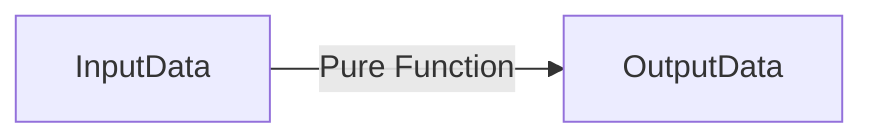

## 2.1.2 Immutability and Pure Functions

In the realm of state management, immutability and pure functions are pivotal concepts that contribute to the robustness and predictability of an application's state. Understanding these concepts is essential for any developer aiming to build scalable and maintainable Flutter applications.

### Defining Immutability

Immutability refers to the characteristic of data structures that cannot be altered after they have been created. In programming, an immutable object is one whose state cannot be modified once it is instantiated. Instead of changing the existing object, any update results in the creation of a new object with the desired changes.

#### Key Characteristics of Immutability:
- **Fixed State:** Once an object is created, its state remains constant throughout its lifecycle.
- **Creation of New Instances:** Any modification results in a new instance rather than altering the existing one.
- **Thread Safety:** Immutable objects are inherently thread-safe as their state cannot be changed, making them ideal for concurrent programming.

### Benefits of Immutability

Immutability offers several advantages that make it a preferred choice in state management:

- **Easier State Tracking:** Since immutable objects do not change, tracking the state over time becomes straightforward. This simplifies debugging and understanding the flow of data.
- **Avoidance of Unintended Side Effects:** Immutability ensures that functions do not alter the state of objects, preventing unexpected behavior and side effects.
- **Safer Concurrency:** Immutable objects can be shared across multiple threads without the risk of data corruption, making them suitable for concurrent applications.
- **Predictable State Changes:** With immutability, state changes are explicit and predictable, as they involve creating new objects rather than modifying existing ones.

### Pure Functions

Pure functions are functions that, given the same input, will always produce the same output and do not cause any side effects. They are a cornerstone of functional programming and contribute significantly to predictable and reliable state management.

#### Characteristics of Pure Functions:
- **Deterministic Output:** The output of a pure function is solely determined by its input parameters.
- **No Side Effects:** Pure functions do not modify any external state or interact with the outside world (e.g., no I/O operations).
- **Referential Transparency:** Pure functions can be replaced with their output value without changing the program's behavior.

### Implementing Immutability in Dart

Dart, the language behind Flutter, provides several mechanisms to implement immutability. Here are some techniques to create immutable classes:

#### Using `final` and `const`:

```dart
class ImmutablePoint {
  final double x;
  final double y;

  const ImmutablePoint(this.x, this.y);
}

void main() {
  const point = ImmutablePoint(3.0, 4.0);
  // point.x = 5.0; // This will cause a compile-time error
}
```

In this example, the `ImmutablePoint` class is immutable because its fields are `final`, and it uses a `const` constructor, ensuring that instances are constant and cannot be modified after creation.

#### Using the `copyWith` Method:

The `copyWith` method is a common pattern used to create a new instance of a class with some modified values while keeping the rest unchanged.

```dart
class User {
  final String name;
  final int age;

  User({required this.name, required this.age});

  User copyWith({String? name, int? age}) {
    return User(
      name: name ?? this.name,
      age: age ?? this.age,
    );
  }
}

void main() {
  final user = User(name: 'Alice', age: 30);
  final updatedUser = user.copyWith(age: 31);
  print(updatedUser.age); // Outputs: 31
}
```

### Using Packages

To facilitate the creation of immutable data classes, several Dart packages provide additional functionality:

#### `built_value` Package:

The `built_value` package offers a robust way to create immutable value types with a builder pattern.

```dart
import 'package:built_value/built_value.dart';

part 'user.g.dart';

abstract class User implements Built<User, UserBuilder> {
  String get name;
  int get age;

  User._();
  factory User([void Function(UserBuilder) updates]) = _$User;
}
```

#### `freezed` Package:

`freezed` is another popular package that simplifies the creation of immutable classes with union types and pattern matching.

```dart
import 'package:freezed_annotation/freezed_annotation.dart';

part 'user.freezed.dart';

@freezed
class User with _$User {
  const factory User({required String name, required int age}) = _User;
}
```

Both `built_value` and `freezed` generate boilerplate code for you, making it easier to work with immutable data structures.

### Mermaid.js Diagrams

To visualize how immutable data flows through pure functions, consider the following diagram:



This diagram illustrates the process where input data is transformed into output data through a pure function, emphasizing the predictability and lack of side effects.

### Exercises

To reinforce your understanding of immutability and pure functions, consider the following exercises:

- **Refactor Mutable Classes:** Take a mutable class from your existing codebase and refactor it into an immutable class using the techniques discussed.
- **Create Pure Functions:** Identify functions in your application that have side effects and refactor them into pure functions. Consider how this change affects the overall predictability of your application's state management.

### Conclusion

Immutability and pure functions are foundational concepts in state management that promote predictability, safety, and ease of maintenance. By leveraging these concepts in your Flutter applications, you can build more robust and scalable software. As you continue to explore state management, consider how these principles can be applied to enhance the quality and reliability of your code.

For further exploration, consider delving into resources such as:

- "Functional Programming in Dart" by Gilad Bracha
- Online courses on functional programming principles
- Documentation for the `built_value` and `freezed` packages

## Quiz Time!



### What is immutability in programming?

- [x] A concept where data structures cannot be modified after creation.
- [ ] A concept where data structures can be modified freely.
- [ ] A concept that only applies to primitive data types.
- [ ] A concept that is irrelevant in concurrent programming.

> **Explanation:** Immutability refers to data structures that cannot be altered once created, which is crucial for predictable state management and safer concurrency.

### Which of the following is a benefit of immutability?

- [x] Easier state tracking
- [x] Avoidance of unintended side effects
- [x] Safer concurrency
- [ ] Increased memory usage

> **Explanation:** Immutability simplifies state tracking, prevents unintended side effects, and enhances concurrency safety, though it may increase memory usage due to new object creation.

### What defines a pure function?

- [x] A function that returns the same output given the same input and has no side effects.
- [ ] A function that can modify global state.
- [ ] A function that performs I/O operations.
- [ ] A function that depends on external variables.

> **Explanation:** Pure functions are deterministic and do not cause side effects, making them predictable and reliable for state transformations.

### How can you create an immutable class in Dart?

- [x] Use `final` fields and a `const` constructor.
- [ ] Use `var` fields and a default constructor.
- [ ] Use `late` fields and a named constructor.
- [ ] Use mutable lists and maps.

> **Explanation:** An immutable class in Dart can be created using `final` fields and a `const` constructor to ensure the object's state cannot change after creation.

### What is the purpose of the `copyWith` method?

- [x] To create a new instance of a class with modified values.
- [ ] To modify the existing instance of a class.
- [ ] To delete an instance of a class.
- [ ] To clone an instance without any changes.

> **Explanation:** The `copyWith` method is used to create a new instance with some modified values while keeping the rest unchanged, maintaining immutability.

### Which package helps in creating immutable data classes in Dart?

- [x] `built_value`
- [x] `freezed`
- [ ] `http`
- [ ] `provider`

> **Explanation:** Both `built_value` and `freezed` are packages that aid in creating immutable data classes in Dart, providing tools for generating boilerplate code.

### What is a characteristic of pure functions?

- [x] They have no side effects.
- [ ] They modify global variables.
- [ ] They perform network requests.
- [ ] They depend on random numbers.

> **Explanation:** Pure functions do not cause side effects, meaning they do not alter any external state or rely on external variables.

### How does immutability contribute to safer concurrency?

- [x] Immutable objects can be shared across threads without risk of data corruption.
- [ ] Immutable objects require locks for thread safety.
- [ ] Immutable objects are not used in concurrent programming.
- [ ] Immutable objects can be modified by multiple threads simultaneously.

> **Explanation:** Immutability ensures that objects cannot be altered, allowing them to be safely shared across threads without the risk of data corruption.

### What is referential transparency in the context of pure functions?

- [x] The ability to replace a function call with its output value without changing the program's behavior.
- [ ] The ability to modify external state within a function.
- [ ] The ability to perform I/O operations within a function.
- [ ] The ability to use random numbers within a function.

> **Explanation:** Referential transparency allows a function call to be replaced with its output value, ensuring the program's behavior remains unchanged, a key property of pure functions.

### True or False: Immutability and pure functions are only applicable in functional programming languages.

- [ ] True
- [x] False

> **Explanation:** While immutability and pure functions are fundamental to functional programming, they are applicable and beneficial in any programming paradigm, including object-oriented languages like Dart.


