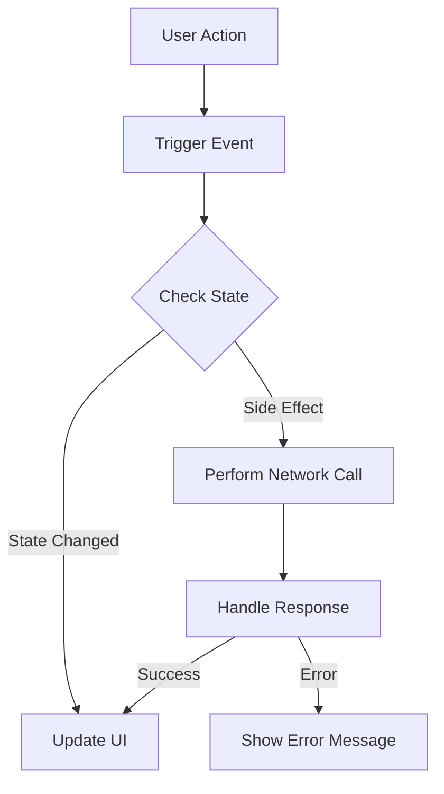

## 2.1.3 Side Effects and How to Handle Them

In the realm of software development, especially within Flutter applications, managing state effectively is crucial for creating responsive and robust applications. A significant aspect of state management involves understanding and handling side effects. This section delves into the nature of side effects, their impact on state management, and strategies to manage them efficiently.

### Understanding Side Effects

In programming, a side effect is any application state change that is observable outside the called function other than its return value. Side effects can include:

- **Network Calls:** Fetching data from a server or sending data to an API.
- **Database Writes:** Modifying or storing data in a local or remote database.
- **Modifying Global Variables:** Changing variables that are accessible throughout the application, which can lead to unpredictable behavior.

#### Examples of Side Effects

Consider a function that updates a user's profile information. This operation might involve:

- Sending a network request to update the server.
- Writing the updated information to a local database for offline access.
- Logging the update event for analytics.

Each of these actions constitutes a side effect because they alter the state of the application or its environment beyond merely returning a value.

### Impact on State Management

Side effects can lead to unpredictable state changes and bugs if not managed correctly. In reactive programming, where the flow of data and state changes are central, unmanaged side effects can disrupt the data flow, leading to inconsistencies and errors.

#### Why Managing Side Effects is Crucial

- **Predictability:** Uncontrolled side effects can make it difficult to predict how an application will behave, especially when multiple components depend on shared state.
- **Debugging Complexity:** Side effects can obscure the source of bugs, making it challenging to trace the cause of unexpected behavior.
- **Performance Issues:** Inefficient handling of side effects, such as redundant network calls, can degrade application performance.

### Handling Side Effects

To maintain a stable and predictable application, it's essential to handle side effects systematically. Here are some strategies:

#### Using Async/Await for Asynchronous Operations

In Flutter, asynchronous operations are common, especially for network requests and database interactions. Using `async` and `await` helps manage these operations cleanly, ensuring that side effects are handled in a controlled manner.

```dart
Future<void> updateUserProfile(User user) async {
  try {
    final response = await http.put(
      Uri.parse('https://api.example.com/user/${user.id}'),
      body: user.toJson(),
    );
    if (response.statusCode == 200) {
      // Handle successful update
    } else {
      // Handle error
    }
  } catch (e) {
    // Handle exception
  }
}
```

#### Employing Middleware in State Management Solutions

Middleware can intercept actions or events in state management solutions like Redux, allowing you to handle side effects such as logging, asynchronous API calls, or analytics.

```dart
final store = Store<AppState>(
  appReducer,
  middleware: [loggingMiddleware, apiMiddleware],
);
```

#### Utilizing Effect Handlers in Bloc or MobX

In Bloc, side effects are managed through effect handlers that respond to events and produce new states. MobX uses reactions to automatically trigger side effects when observable state changes.

```dart
class UserBloc extends Bloc<UserEvent, UserState> {
  UserBloc() : super(UserInitial());

  @override
  Stream<UserState> mapEventToState(UserEvent event) async* {
    if (event is UpdateUserProfile) {
      yield UserLoading();
      try {
        final user = await userRepository.updateUser(event.user);
        yield UserUpdated(user);
      } catch (_) {
        yield UserError();
      }
    }
  }
}
```

### Code Examples

#### Managing Side Effects with FutureBuilder

`FutureBuilder` is a widget that builds itself based on the latest snapshot of interaction with a `Future`. It is useful for handling asynchronous side effects in the UI.

```dart
FutureBuilder<User>(
  future: fetchUserProfile(),
  builder: (context, snapshot) {
    if (snapshot.connectionState == ConnectionState.waiting) {
      return CircularProgressIndicator();
    } else if (snapshot.hasError) {
      return Text('Error: ${snapshot.error}');
    } else {
      return UserProfile(snapshot.data);
    }
  },
)
```

#### Encapsulating Side Effects within State Management Classes

Encapsulating side effects within dedicated classes helps isolate them from the rest of the application logic, making the codebase cleaner and more maintainable.

```dart
class UserRepository {
  Future<User> fetchUserProfile() async {
    final response = await http.get(Uri.parse('https://api.example.com/user'));
    if (response.statusCode == 200) {
      return User.fromJson(jsonDecode(response.body));
    } else {
      throw Exception('Failed to load user');
    }
  }
}
```

### Best Practices

- **Use Pure Functions:** Aim to keep functions pure, meaning they should not produce side effects. This makes them easier to test and reason about.
- **Isolate Side Effects:** Encapsulate side effects in dedicated functions or classes to keep them separate from business logic.
- **Test Side Effects Separately:** Write tests specifically for side effects to ensure they behave as expected under various conditions.

### Mermaid.js Diagrams

To visualize the flow of data with properly handled side effects, consider the following diagram:



### Key Takeaways

- Recognizing and managing side effects is crucial for maintaining app stability and predictability.
- Use async/await, middleware, and effect handlers to manage side effects effectively.
- Isolate side effects to simplify debugging and enhance code maintainability.
- Regularly test side effects to ensure they perform as expected.

By understanding and applying these principles, you can create Flutter applications that are not only functional but also robust and maintainable.

## Quiz Time!



### What is a side effect in programming?

- [x] A change in application state observable outside the called function
- [ ] A function that returns a value
- [ ] A method that modifies local variables only
- [ ] An operation that does not affect the application state

> **Explanation:** A side effect is any change in application state that is observable outside the called function, such as network calls or database writes.

### Why is managing side effects crucial in state management?

- [x] To maintain predictability and stability in the application
- [ ] To increase the complexity of the code
- [ ] To reduce the number of functions
- [ ] To eliminate the need for testing

> **Explanation:** Managing side effects is crucial to maintain predictability and stability, ensuring that state changes are controlled and expected.

### Which of the following is a strategy for handling side effects in Flutter?

- [x] Using async/await for asynchronous operations
- [ ] Ignoring them
- [ ] Mixing them with business logic
- [ ] Avoiding network calls altogether

> **Explanation:** Using async/await helps manage asynchronous operations cleanly, ensuring side effects are handled in a controlled manner.

### How can middleware help in managing side effects?

- [x] By intercepting actions or events to handle side effects like logging or API calls
- [ ] By increasing the application's complexity
- [ ] By removing side effects entirely
- [ ] By making the application slower

> **Explanation:** Middleware can intercept actions or events, allowing side effects to be handled separately, such as logging or making API calls.

### What is the role of `FutureBuilder` in handling side effects?

- [x] It builds itself based on the latest snapshot of interaction with a `Future`.
- [ ] It eliminates the need for asynchronous operations.
- [ ] It makes synchronous calls only.
- [ ] It is used for styling widgets.

> **Explanation:** `FutureBuilder` builds itself based on the latest snapshot of interaction with a `Future`, making it useful for handling asynchronous side effects in the UI.

### Which of the following is NOT a best practice for managing side effects?

- [ ] Use pure functions
- [ ] Isolate side effects
- [ ] Test side effects separately
- [x] Mix side effects with business logic

> **Explanation:** Mixing side effects with business logic is not a best practice as it can complicate debugging and maintenance.

### What is the benefit of isolating side effects in dedicated classes?

- [x] It keeps the codebase cleaner and more maintainable.
- [ ] It increases the complexity of the application.
- [ ] It eliminates the need for testing.
- [ ] It makes the application slower.

> **Explanation:** Isolating side effects in dedicated classes keeps the codebase cleaner and more maintainable by separating concerns.

### How can you test side effects effectively?

- [x] By writing specific tests for side effects under various conditions
- [ ] By ignoring them in tests
- [ ] By mixing them with other tests
- [ ] By avoiding testing altogether

> **Explanation:** Writing specific tests for side effects ensures they perform as expected under various conditions, improving reliability.

### What does the `async` keyword indicate in Dart?

- [x] That the function contains asynchronous operations
- [ ] That the function is synchronous
- [ ] That the function returns immediately
- [ ] That the function is deprecated

> **Explanation:** The `async` keyword indicates that the function contains asynchronous operations and may use `await` to handle them.

### True or False: Side effects can lead to unpredictable state changes if not managed correctly.

- [x] True
- [ ] False

> **Explanation:** True. Unmanaged side effects can disrupt the data flow, leading to inconsistencies and errors in the application.


