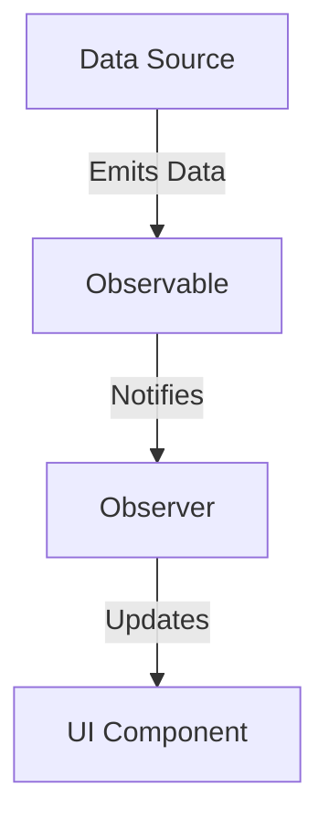

---

linkTitle: "2.1.4 Reactive Programming Concepts"
title: "Reactive Programming Concepts in Flutter: Understanding Reactive Programming Paradigms"
description: "Explore the fundamentals of reactive programming in Flutter, including observables, streams, and how state management solutions leverage these concepts for efficient app development."
categories:
- Flutter Development
- State Management
- Reactive Programming
tags:
- Flutter
- Reactive Programming
- State Management
- Streams
- Observables
date: 2024-10-25
type: docs
nav_weight: 214000
canonical: "https://fluttermasterylibrary.com/7/2/1/4"
license: "© 2023 Tokenizer Inc. CC BY-NC-SA 4.0"
---

## 2.1.4 Reactive Programming Concepts

In the world of modern software development, reactive programming has emerged as a powerful paradigm that enables developers to build responsive and scalable applications. This section delves into the core concepts of reactive programming, particularly in the context of Flutter, and explores how these principles can be harnessed to manage state effectively.

### Defining Reactive Programming

Reactive programming is a programming paradigm centered around data flows and the propagation of change. It allows developers to express static or dynamic data flows with ease, and automatically propagate changes through the system. This approach contrasts with traditional imperative programming, where developers explicitly define the sequence of operations and manage state changes manually.

#### Key Characteristics of Reactive Programming:

- **Data Flows:** In reactive programming, data flows are first-class citizens. Developers define how data moves through the system, and the framework takes care of updating dependent components when the data changes.
  
- **Change Propagation:** Reactive systems automatically propagate changes. When a data source changes, all dependent computations are updated in response, ensuring consistency across the application.

- **Asynchronous Processing:** Reactive programming often involves asynchronous data streams, allowing applications to handle data as it arrives, without blocking the main thread.

### Core Concepts

To effectively utilize reactive programming, it's essential to understand its core components: observables, observers, and schedulers.

#### Observables

Observables represent data sources that can be observed. They emit data over time, which can be consumed by observers. In Flutter, observables can be implemented using Dart's `Stream` class.

#### Observers

Observers subscribe to observables to receive data updates. They react to changes in the data stream, allowing the application to update its state or UI accordingly.

#### Schedulers

Schedulers control the execution context of observables and observers, determining when and where data processing occurs. They are crucial for managing asynchronous operations and ensuring that updates happen efficiently.

### Reactive Programming in Flutter

Flutter inherently supports reactive programming through its widget rebuild mechanism. When the state of a widget changes, Flutter triggers a rebuild of the affected widget tree, ensuring that the UI remains consistent with the underlying data.

#### Leveraging Reactive Principles in State Management

State management solutions in Flutter, such as Provider, Riverpod, and Bloc, leverage reactive principles to manage application state efficiently. These solutions use observables and streams to propagate state changes throughout the widget tree, minimizing the need for manual state updates.

### Using Streams

Dart's `Stream` class is a powerful tool for implementing reactive programming in Flutter. Streams allow developers to handle asynchronous data sequences, such as user inputs, network responses, or sensor data.

#### Creating and Listening to Streams

Here's a simple example of creating and listening to a stream in Dart:

```dart
import 'dart:async';

void main() {
  // Create a stream controller
  final StreamController<int> controller = StreamController<int>();

  // Listen to the stream
  controller.stream.listen((data) {
    print('Received: $data');
  });

  // Add data to the stream
  controller.add(1);
  controller.add(2);
  controller.add(3);

  // Close the stream
  controller.close();
}
```

In this example, a `StreamController` is used to create a stream of integers. The `listen` method subscribes to the stream, printing each received value to the console.

### Practical Examples

Let's explore a practical example of using reactive patterns in a Flutter application. Consider a simple app that displays a list of items fetched from a network source. Using streams, we can update the UI automatically when new data arrives.

#### Example: Updating UI with Streams

```dart
import 'dart:async';
import 'package:flutter/material.dart';

void main() => runApp(MyApp());

class MyApp extends StatelessWidget {
  @override
  Widget build(BuildContext context) {
    return MaterialApp(
      home: ItemListScreen(),
    );
  }
}

class ItemListScreen extends StatefulWidget {
  @override
  _ItemListScreenState createState() => _ItemListScreenState();
}

class _ItemListScreenState extends State<ItemListScreen> {
  final StreamController<List<String>> _itemsController = StreamController<List<String>>();

  @override
  void initState() {
    super.initState();
    _fetchItems();
  }

  void _fetchItems() async {
    // Simulate network delay
    await Future.delayed(Duration(seconds: 2));
    // Add fetched items to the stream
    _itemsController.add(['Item 1', 'Item 2', 'Item 3']);
  }

  @override
  void dispose() {
    _itemsController.close();
    super.dispose();
  }

  @override
  Widget build(BuildContext context) {
    return Scaffold(
      appBar: AppBar(title: Text('Items')),
      body: StreamBuilder<List<String>>(
        stream: _itemsController.stream,
        builder: (context, snapshot) {
          if (snapshot.connectionState == ConnectionState.waiting) {
            return Center(child: CircularProgressIndicator());
          } else if (snapshot.hasError) {
            return Center(child: Text('Error: ${snapshot.error}'));
          } else if (!snapshot.hasData || snapshot.data!.isEmpty) {
            return Center(child: Text('No items available'));
          } else {
            return ListView.builder(
              itemCount: snapshot.data!.length,
              itemBuilder: (context, index) {
                return ListTile(title: Text(snapshot.data![index]));
              },
            );
          }
        },
      ),
    );
  }
}
```

In this example, a `StreamController` is used to manage a stream of item lists. The `StreamBuilder` widget listens to the stream and rebuilds the UI whenever new data is available.

### Mermaid.js Diagrams

To visualize reactive data flows and the propagation of changes, we can use Mermaid.js diagrams. Below is a simple diagram illustrating the flow of data in a reactive system:



In this diagram, the data source emits data to the observable, which notifies the observer. The observer then updates the UI component, illustrating the flow of data in a reactive system.

### Exercises

To solidify your understanding of reactive programming concepts, try implementing a simple reactive data flow in a sample Flutter app. Here are some exercises to consider:

- **Exercise 1:** Create a Flutter app that displays a counter. Use a stream to update the counter value every second, and update the UI accordingly.
  
- **Exercise 2:** Build a weather app that fetches weather data from an API. Use streams to handle asynchronous data fetching and update the UI with the latest weather information.

- **Exercise 3:** Implement a chat application where messages are streamed from a server. Use streams to update the chat interface in real-time as new messages arrive.

These exercises will help you apply reactive programming principles in practical scenarios, enhancing your understanding of how to manage state effectively in Flutter applications.

### Conclusion

Reactive programming offers a powerful paradigm for managing state in Flutter applications. By understanding and leveraging core concepts such as observables, observers, and streams, developers can build responsive and scalable apps with ease. As you continue to explore Flutter's capabilities, consider how reactive programming can enhance your development process and improve the user experience.

## Quiz Time!



### What is reactive programming primarily focused on?

- [x] Data flows and change propagation
- [ ] Sequential execution of commands
- [ ] Static data management
- [ ] Manual state updates

> **Explanation:** Reactive programming is centered around data flows and the automatic propagation of changes through the system.

### Which of the following is NOT a core concept of reactive programming?

- [ ] Observables
- [ ] Observers
- [ ] Schedulers
- [x] Controllers

> **Explanation:** Observables, observers, and schedulers are core concepts of reactive programming. Controllers are not a fundamental part of the paradigm.

### How does Flutter inherently support reactive programming?

- [x] Through its widget rebuild mechanism
- [ ] By using imperative programming techniques
- [ ] By requiring manual state updates
- [ ] Through synchronous data processing

> **Explanation:** Flutter supports reactive programming through its widget rebuild mechanism, which automatically updates the UI in response to state changes.

### What is the role of a Stream in Dart?

- [x] To handle asynchronous data sequences
- [ ] To manage synchronous data flows
- [ ] To provide static data storage
- [ ] To execute imperative commands

> **Explanation:** Streams in Dart are used to handle asynchronous data sequences, allowing data to be processed as it arrives.

### In the provided example, what does the `StreamBuilder` widget do?

- [x] Listens to a stream and rebuilds the UI based on data changes
- [ ] Manages the lifecycle of a stream
- [ ] Provides a static data view
- [ ] Executes imperative commands

> **Explanation:** The `StreamBuilder` widget listens to a stream and rebuilds the UI whenever new data is available.

### What is an observable in reactive programming?

- [x] A data source that can be observed
- [ ] A function that processes data
- [ ] A static data structure
- [ ] A synchronous data handler

> **Explanation:** An observable is a data source that emits data over time and can be observed by other components.

### What is the purpose of a scheduler in reactive programming?

- [x] To control the execution context of observables and observers
- [ ] To store static data
- [ ] To execute synchronous commands
- [ ] To manage UI components

> **Explanation:** Schedulers control the execution context of observables and observers, determining when and where data processing occurs.

### Which of the following best describes an observer in reactive programming?

- [x] A component that subscribes to observables to receive data updates
- [ ] A static data structure
- [ ] A synchronous data handler
- [ ] A function that processes data

> **Explanation:** An observer subscribes to observables to receive data updates and react to changes.

### How can reactive programming improve the user experience in Flutter apps?

- [x] By ensuring the UI is always consistent with the underlying data
- [ ] By requiring manual state updates
- [ ] By using synchronous data processing
- [ ] By executing imperative commands

> **Explanation:** Reactive programming ensures that the UI is always consistent with the underlying data, improving the user experience.

### True or False: Reactive programming requires manual state updates for UI consistency.

- [ ] True
- [x] False

> **Explanation:** False. Reactive programming automatically propagates changes, ensuring UI consistency without manual state updates.


