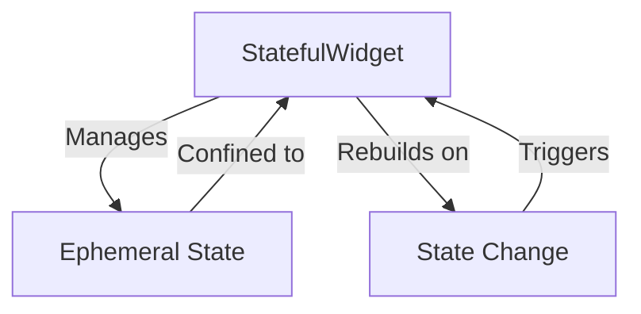

## 2.2.1 Ephemeral State

In the realm of Flutter development, managing state efficiently is crucial for creating responsive and interactive applications. One of the foundational concepts in state management is ephemeral state, also known as UI state or local state. This article delves into the intricacies of ephemeral state, providing insights into its definition, usage, limitations, and best practices. We'll explore how to manage ephemeral state using `StatefulWidget` and `setState`, and when it's appropriate to use this type of state management in your Flutter applications.

### Defining Ephemeral State

Ephemeral state refers to state that is confined to a single widget and is not shared across different parts of the application. It is typically used to manage temporary UI-related data that does not need to persist beyond the widget's lifecycle. Examples of ephemeral state include:

- The current page index in a `PageView`.
- Whether a `Checkbox` is checked or unchecked.
- The expanded or collapsed state of a `DropdownButton`.

This type of state is ideal for scenarios where the state is only relevant to the widget itself and does not need to be accessed or modified by other widgets.

### Using Stateful Widgets

In Flutter, ephemeral state is commonly managed using `StatefulWidget`. A `StatefulWidget` is a widget that has mutable state. When the state changes, the widget rebuilds to reflect the new state. The `setState` method is used to update the state and trigger a rebuild of the widget.

#### Code Example: Managing Ephemeral State with StatefulWidget

Let's consider a simple example of a counter app that uses ephemeral state to manage the count value.

```dart
import 'package:flutter/material.dart';

void main() => runApp(MyApp());

class MyApp extends StatelessWidget {
  @override
  Widget build(BuildContext context) {
    return MaterialApp(
      home: CounterScreen(),
    );
  }
}

class CounterScreen extends StatefulWidget {
  @override
  _CounterScreenState createState() => _CounterScreenState();
}

class _CounterScreenState extends State<CounterScreen> {
  int _counter = 0;

  void _incrementCounter() {
    setState(() {
      _counter++;
    });
  }

  @override
  Widget build(BuildContext context) {
    return Scaffold(
      appBar: AppBar(
        title: Text('Counter App'),
      ),
      body: Center(
        child: Column(
          mainAxisAlignment: MainAxisAlignment.center,
          children: <Widget>[
            Text(
              'You have pushed the button this many times:',
            ),
            Text(
              '$_counter',
              style: Theme.of(context).textTheme.headline4,
            ),
          ],
        ),
      ),
      floatingActionButton: FloatingActionButton(
        onPressed: _incrementCounter,
        tooltip: 'Increment',
        child: Icon(Icons.add),
      ),
    );
  }
}
```

In this example, the `_counter` variable is an ephemeral state managed within the `_CounterScreenState` class. The `setState` method is called to update the `_counter` and rebuild the widget when the button is pressed.

### When to Use Ephemeral State

Ephemeral state is suitable for scenarios where:

- The state is only relevant to a single widget and does not need to be shared.
- The state does not need to persist beyond the widget's lifecycle.
- The state is used to manage UI-related data, such as animations, form inputs, or temporary selections.

Using ephemeral state simplifies the state management process by keeping the state localized to the widget that needs it.

### Limitations of Ephemeral State

While ephemeral state is useful for managing local UI state, it has limitations:

- **Non-Persistent:** Ephemeral state is not suitable for data that needs to persist beyond the widget's lifecycle, such as user preferences or session data.
- **Non-Shared:** It cannot be easily shared across different widgets or parts of the application. For shared state, other state management solutions like Provider, Riverpod, or Bloc are more appropriate.
- **Rebuild Overhead:** Frequent calls to `setState` can lead to performance issues if not managed carefully, especially in complex widgets with heavy UI elements.

### Best Practices for Managing Ephemeral State

To effectively manage ephemeral state, consider the following best practices:

- **Keep State Localized:** Only use ephemeral state for data that is relevant to a single widget. This keeps the code simple and easy to maintain.
- **Minimize Rebuilds:** Use `setState` judiciously to avoid unnecessary widget rebuilds. Only update the state when necessary.
- **Use Stateless Widgets When Possible:** If a widget does not need to manage state, use a `StatelessWidget` to reduce complexity and improve performance.

### Visual Aids: Understanding Ephemeral State

To better understand how ephemeral state is confined within a widget, let's visualize it using a diagram.



In this diagram, the `StatefulWidget` manages the ephemeral state, which is confined within the widget itself. When a state change occurs, it triggers a rebuild of the widget.

### Conclusion

Ephemeral state is a fundamental concept in Flutter's state management ecosystem. By understanding its definition, usage, limitations, and best practices, you can effectively manage local UI state in your applications. While ephemeral state is ideal for managing temporary, widget-specific data, it's important to recognize when other state management solutions are more appropriate for shared or persistent state.

As you continue to develop Flutter applications, consider how ephemeral state can simplify your state management strategy, keeping your codebase clean and efficient.

## Quiz Time!



### What is ephemeral state in Flutter?

- [x] State that is confined to a single widget and not shared across the application.
- [ ] State that persists across app sessions.
- [ ] State that is shared between multiple widgets.
- [ ] State that is managed by a global state management solution.

> **Explanation:** Ephemeral state is local to a single widget and is not shared or persistent beyond the widget's lifecycle.

### Which widget type is used to manage ephemeral state in Flutter?

- [x] StatefulWidget
- [ ] StatelessWidget
- [ ] InheritedWidget
- [ ] Provider

> **Explanation:** StatefulWidget is used to manage mutable state that is local to the widget.

### What method is used to update ephemeral state in a StatefulWidget?

- [x] setState
- [ ] build
- [ ] initState
- [ ] dispose

> **Explanation:** The setState method is used to update the state and trigger a rebuild of the widget.

### When is it appropriate to use ephemeral state?

- [x] When the state is only relevant to a single widget.
- [ ] When the state needs to be shared across multiple widgets.
- [ ] When the state needs to persist across app sessions.
- [ ] When the state is managed by a global state management solution.

> **Explanation:** Ephemeral state is suitable for scenarios where the state is only relevant to a single widget.

### What is a limitation of ephemeral state?

- [x] It cannot be easily shared across widgets.
- [ ] It persists beyond the widget's lifecycle.
- [ ] It is managed by a global state management solution.
- [ ] It is suitable for data that needs to be shared.

> **Explanation:** Ephemeral state is not suitable for data that needs to be shared across widgets.

### What is a best practice for managing ephemeral state?

- [x] Keep state localized to the widget that needs it.
- [ ] Use global state management solutions for all state.
- [ ] Persist ephemeral state across app sessions.
- [ ] Share ephemeral state across multiple widgets.

> **Explanation:** Keeping state localized to the widget that needs it simplifies the code and improves maintainability.

### What happens when setState is called in a StatefulWidget?

- [x] The widget rebuilds to reflect the new state.
- [ ] The app restarts.
- [ ] The state is shared across the application.
- [ ] The state is persisted to local storage.

> **Explanation:** Calling setState triggers a rebuild of the widget to reflect the updated state.

### Which of the following is NOT an example of ephemeral state?

- [x] User authentication token
- [ ] Current page in a PageView
- [ ] Whether a Checkbox is checked
- [ ] Expanded state of a DropdownButton

> **Explanation:** A user authentication token is not ephemeral state as it needs to persist beyond the widget's lifecycle.

### How can you minimize rebuilds when managing ephemeral state?

- [x] Use setState judiciously and only when necessary.
- [ ] Use global state management solutions.
- [ ] Persist state across app sessions.
- [ ] Share state across multiple widgets.

> **Explanation:** Minimizing calls to setState reduces unnecessary widget rebuilds, improving performance.

### True or False: Ephemeral state is suitable for managing data that needs to be shared across multiple widgets.

- [ ] True
- [x] False

> **Explanation:** Ephemeral state is not suitable for shared data; it is confined to a single widget.


