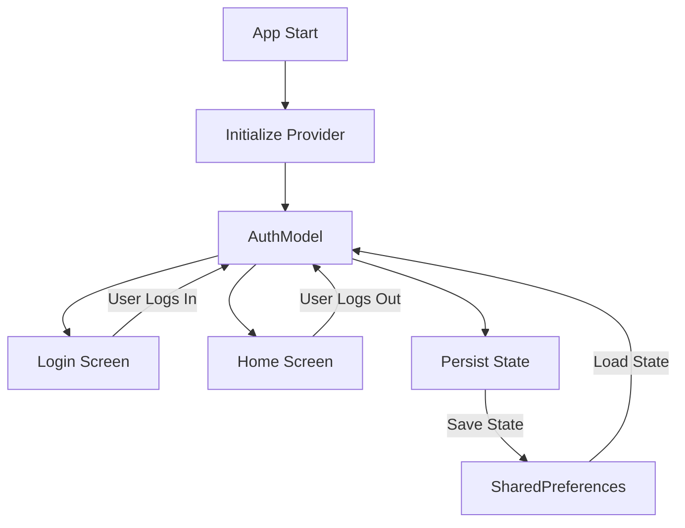

## 2.2.2 Application State

In the realm of Flutter development, understanding and managing application state is crucial for building robust, scalable, and user-friendly applications. Application state refers to data that influences multiple parts of an application or needs to persist across sessions. This section delves into the definition, management, sharing, and persistence of application state, providing insights, practical examples, and best practices to equip you with the knowledge needed to handle application state effectively.

### Defining Application State

Application state encompasses data that is critical to the overall functionality and user experience of an app. Unlike ephemeral state, which is temporary and confined to a single widget, application state is more persistent and often shared across various components of the app. Here are some common examples of application state:

- **User Authentication Status:** Determines whether a user is logged in or out and affects access to certain features or screens.
- **Theme Settings:** Controls the visual appearance of the app, such as light or dark mode, and needs to be consistent across all screens.
- **User Preferences:** Includes settings like language choice, notification preferences, and other personalized configurations that enhance user experience.

Understanding application state is pivotal because it directly impacts how users interact with your app and how they perceive its reliability and responsiveness.

### Sharing State Across Widgets

In Flutter, the widget tree is the backbone of UI rendering. However, sharing state across this tree can be challenging, especially when multiple widgets need access to the same data. Here are some mechanisms to facilitate state sharing:

- **Inherited Widgets:** These are a core part of Flutter's framework that allows data to be efficiently propagated down the widget tree. Inherited widgets are ideal for sharing state that doesn't change often or requires minimal updates.

```dart
class ThemeNotifier extends InheritedWidget {
  final bool isDarkMode;
  final Widget child;

  ThemeNotifier({required this.isDarkMode, required this.child}) : super(child: child);

  static ThemeNotifier? of(BuildContext context) {
    return context.dependOnInheritedWidgetOfExactType<ThemeNotifier>();
  }

  @override
  bool updateShouldNotify(ThemeNotifier oldWidget) {
    return oldWidget.isDarkMode != isDarkMode;
  }
}
```

- **Provider Package:** A more flexible and powerful solution for state management, allowing for easy state sharing and updates across the widget tree. Provider simplifies the process of accessing and updating state.

```dart
class ThemeModel with ChangeNotifier {
  bool _isDarkMode = false;

  bool get isDarkMode => _isDarkMode;

  void toggleTheme() {
    _isDarkMode = !_isDarkMode;
    notifyListeners();
  }
}

// Usage in a widget
ChangeNotifierProvider(
  create: (_) => ThemeModel(),
  child: MyApp(),
);
```

### State Persistence

Persisting application state between app launches is essential for maintaining a seamless user experience. Here are some common techniques for state persistence:

- **SharedPreferences:** A simple key-value storage system for storing small amounts of data, such as user preferences or settings.

```dart
Future<void> saveThemePreference(bool isDarkMode) async {
  final prefs = await SharedPreferences.getInstance();
  await prefs.setBool('isDarkMode', isDarkMode);
}

Future<bool> loadThemePreference() async {
  final prefs = await SharedPreferences.getInstance();
  return prefs.getBool('isDarkMode') ?? false;
}
```

- **SQLite:** A more robust solution for persisting complex data structures or large datasets, such as user-generated content or application data.

- **Hive:** A lightweight and fast NoSQL database that is easy to integrate and use for storing structured data.

### Practical Example: Managing Application State

Let's consider a practical example where we manage user authentication state using the Provider package. This example demonstrates how to share and persist authentication state across the app.

```dart
class AuthModel with ChangeNotifier {
  bool _isLoggedIn = false;

  bool get isLoggedIn => _isLoggedIn;

  void login() {
    _isLoggedIn = true;
    notifyListeners();
  }

  void logout() {
    _isLoggedIn = false;
    notifyListeners();
  }
}

// Usage in a widget
ChangeNotifierProvider(
  create: (_) => AuthModel(),
  child: MyApp(),
);

// Accessing AuthModel in a widget
Consumer<AuthModel>(
  builder: (context, authModel, child) {
    return authModel.isLoggedIn ? HomeScreen() : LoginScreen();
  },
);
```

### Considerations

Managing application state comes with its own set of challenges. Here are some considerations to keep in mind:

- **State Synchronization:** Ensuring that state changes are synchronized across all parts of the app can be complex, especially in apps with real-time features or multiple data sources.

- **Consistency:** Maintaining consistent state across different sessions and devices is crucial for a reliable user experience. This may involve implementing conflict resolution strategies or using centralized state management solutions.

- **Performance:** Efficiently managing state updates and minimizing unnecessary widget rebuilds is essential for maintaining app performance.

### Visualizing Application State

To better understand how application state is accessed and shared across an app, let's look at a diagram illustrating the flow of application state using the Provider package.



### Conclusion

Application state is a fundamental aspect of Flutter development, influencing how data is shared, persisted, and managed across an app. By understanding the mechanisms for sharing state, techniques for state persistence, and considerations for maintaining consistency, you can build more robust and user-friendly applications. As you continue to explore state management in Flutter, remember to experiment with different approaches and find the solutions that best fit your application's needs.

### Further Reading and Resources

- [Flutter Documentation on State Management](https://flutter.dev/docs/development/data-and-backend/state-mgmt/intro)
- [Provider Package Documentation](https://pub.dev/packages/provider)
- [SharedPreferences Plugin](https://pub.dev/packages/shared_preferences)
- [Hive Database](https://pub.dev/packages/hive)

## Quiz Time!



### What is application state in Flutter?

- [x] Data that affects multiple parts of the application or needs to persist over time.
- [ ] Temporary data confined to a single widget.
- [ ] Data that is only relevant during a single session.
- [ ] Data that does not affect user experience.

> **Explanation:** Application state refers to data that influences multiple parts of an application or needs to persist across sessions, such as user authentication status or theme settings.

### Which of the following is NOT an example of application state?

- [ ] User authentication status
- [ ] Theme settings
- [ ] User preferences
- [x] Button click count in a single widget

> **Explanation:** Button click count in a single widget is considered ephemeral state, not application state, as it is temporary and confined to that widget.

### How can you share application state across widgets in Flutter?

- [x] Using Inherited Widgets
- [x] Using the Provider package
- [ ] Using Stateless Widgets
- [ ] Using setState

> **Explanation:** Inherited Widgets and the Provider package are mechanisms for sharing application state across the widget tree, while Stateless Widgets and setState are not suitable for this purpose.

### What is a common method for persisting application state between app launches?

- [x] SharedPreferences
- [ ] Stateless Widgets
- [ ] setState
- [ ] Inherited Widgets

> **Explanation:** SharedPreferences is a common method for persisting application state between app launches, allowing data to be saved and retrieved across sessions.

### Which package is recommended for managing complex application state in Flutter?

- [x] Provider
- [ ] Stateless Widgets
- [ ] setState
- [ ] Inherited Widgets

> **Explanation:** The Provider package is recommended for managing complex application state in Flutter due to its flexibility and ease of use.

### What is a challenge associated with managing application state?

- [x] State synchronization
- [ ] Stateless Widgets
- [ ] setState
- [ ] Button click count

> **Explanation:** State synchronization is a challenge associated with managing application state, ensuring that state changes are consistent across the app.

### How can you access a value from an InheritedWidget in Flutter?

- [x] Using `context.dependOnInheritedWidgetOfExactType`
- [ ] Using `setState`
- [ ] Using `StatelessWidget`
- [ ] Using `SharedPreferences`

> **Explanation:** You can access a value from an InheritedWidget using `context.dependOnInheritedWidgetOfExactType`, which allows widgets to subscribe to changes.

### What is the purpose of the `notifyListeners` method in a ChangeNotifier?

- [x] To notify all listeners that the state has changed
- [ ] To reset the state to its initial value
- [ ] To persist state changes
- [ ] To remove all listeners

> **Explanation:** The `notifyListeners` method is used to notify all listeners that the state has changed, prompting them to rebuild and update accordingly.

### Which of the following is a technique for persisting complex data structures in Flutter?

- [x] SQLite
- [ ] Stateless Widgets
- [ ] setState
- [ ] Inherited Widgets

> **Explanation:** SQLite is a technique for persisting complex data structures in Flutter, suitable for storing large datasets or structured data.

### True or False: Application state only affects the UI and not the app's logic.

- [ ] True
- [x] False

> **Explanation:** False. Application state affects both the UI and the app's logic, as it encompasses data that influences the app's overall functionality and user experience.


