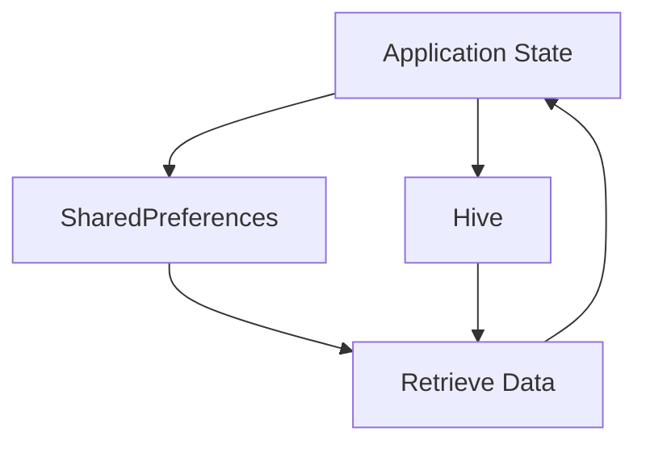

## 2.2.4 Persisting State

In the realm of mobile app development, managing state is crucial not only for the immediate user experience but also for maintaining data consistency across sessions. Persisting state refers to the practice of saving certain data so that it remains available even after the application is closed or restarted. This section delves into the reasons for persisting state, explores various persistence solutions, and provides practical guidance on implementing these solutions in Flutter applications.

### Reasons for Persisting State

Persisting state is essential for several reasons:

- **User Preferences:** Users expect their preferences, such as theme settings or language choices, to remain consistent across app sessions.
- **Login Tokens:** To avoid requiring users to log in every time they open the app, authentication tokens must be stored securely.
- **Cached Data:** Storing data locally can improve performance and provide offline access, enhancing the user experience.

By persisting these types of data, developers can ensure a seamless and user-friendly experience, reducing friction and increasing engagement.

### Persistence Solutions

Flutter offers several solutions for data persistence, each suited to different types of data and use cases:

- **SharedPreferences:** Ideal for storing simple key-value pairs, such as user settings or small amounts of data.
- **SQLite:** A robust solution for relational data, suitable for applications requiring complex queries and transactions.
- **Hive:** A lightweight and fast database option for storing structured data, offering a more developer-friendly API compared to SQLite.

#### Implementing SharedPreferences

SharedPreferences is a simple and effective way to store key-value pairs. It is particularly useful for saving user preferences or small amounts of data that do not require complex structures.

**Example: Storing and Retrieving Data with SharedPreferences**

```dart
import 'package:flutter/material.dart';
import 'package:shared_preferences/shared_preferences.dart';

class SharedPreferencesExample extends StatefulWidget {
  @override
  _SharedPreferencesExampleState createState() => _SharedPreferencesExampleState();
}

class _SharedPreferencesExampleState extends State<SharedPreferencesExample> {
  String _storedValue = '';

  @override
  void initState() {
    super.initState();
    _loadStoredValue();
  }

  Future<void> _loadStoredValue() async {
    final prefs = await SharedPreferences.getInstance();
    setState(() {
      _storedValue = prefs.getString('key') ?? 'Default Value';
    });
  }

  Future<void> _saveValue(String value) async {
    final prefs = await SharedPreferences.getInstance();
    prefs.setString('key', value);
  }

  @override
  Widget build(BuildContext context) {
    return Scaffold(
      appBar: AppBar(title: Text('SharedPreferences Example')),
      body: Center(
        child: Column(
          mainAxisAlignment: MainAxisAlignment.center,
          children: <Widget>[
            Text('Stored Value: $_storedValue'),
            ElevatedButton(
              onPressed: () {
                _saveValue('New Value');
                _loadStoredValue();
              },
              child: Text('Save New Value'),
            ),
          ],
        ),
      ),
    );
  }
}
```

**Explanation:**

- `SharedPreferences.getInstance()` is used to access the shared preferences.
- `prefs.getString('key')` retrieves the stored value associated with the key.
- `prefs.setString('key', value)` saves a new value under the specified key.

#### Using Hive for Complex Data

Hive is a powerful and efficient database solution for Flutter, particularly well-suited for storing structured data. It is known for its speed and ease of use, making it a popular choice among Flutter developers.

**Example: Setting Up Hive and Performing CRUD Operations**

```dart
import 'package:flutter/material.dart';
import 'package:hive/hive.dart';
import 'package:hive_flutter/hive_flutter.dart';

void main() async {
  await Hive.initFlutter();
  await Hive.openBox('myBox');
  runApp(MyApp());
}

class MyApp extends StatelessWidget {
  @override
  Widget build(BuildContext context) {
    return MaterialApp(
      home: HiveExample(),
    );
  }
}

class HiveExample extends StatefulWidget {
  @override
  _HiveExampleState createState() => _HiveExampleState();
}

class _HiveExampleState extends State<HiveExample> {
  final box = Hive.box('myBox');

  void _addData() {
    box.put('name', 'Flutter Developer');
  }

  void _readData() {
    final name = box.get('name');
    print('Name: $name');
  }

  void _deleteData() {
    box.delete('name');
  }

  @override
  Widget build(BuildContext context) {
    return Scaffold(
      appBar: AppBar(title: Text('Hive Example')),
      body: Center(
        child: Column(
          mainAxisAlignment: MainAxisAlignment.center,
          children: <Widget>[
            ElevatedButton(
              onPressed: _addData,
              child: Text('Add Data'),
            ),
            ElevatedButton(
              onPressed: _readData,
              child: Text('Read Data'),
            ),
            ElevatedButton(
              onPressed: _deleteData,
              child: Text('Delete Data'),
            ),
          ],
        ),
      ),
    );
  }
}
```

**Explanation:**

- `Hive.initFlutter()` initializes Hive for Flutter applications.
- `Hive.openBox('myBox')` opens a box, which is a Hive database.
- `box.put('name', 'Flutter Developer')` adds data to the box.
- `box.get('name')` retrieves data from the box.
- `box.delete('name')` removes data from the box.

### Synchronization Considerations

In some cases, persistent state needs to be synchronized with remote servers. This is common in applications that require data consistency across multiple devices or users.

- **Conflict Resolution:** Implement strategies to handle conflicts when local changes are synced with remote data.
- **Offline Support:** Ensure that the app can function offline and sync changes once connectivity is restored.

### Security Concerns

When persisting sensitive data, such as login tokens or personal information, security is paramount. Consider the following practices:

- **Encryption:** Use encryption to protect sensitive data stored locally.
- **Secure Storage:** Utilize secure storage solutions, such as Flutter's `flutter_secure_storage` package, for storing sensitive information.

### Mermaid.js Diagrams

To better understand the flow of data from application state to persistent storage and back, consider the following diagram:



**Explanation:**

- The diagram illustrates how application state is stored in SharedPreferences or Hive and then retrieved back into the application state.

### Best Practices and Common Pitfalls

- **Choose the Right Tool:** Select the appropriate persistence solution based on the complexity and structure of your data.
- **Avoid Over-Persistence:** Only persist data that is necessary to maintain across sessions to avoid unnecessary storage use.
- **Test Thoroughly:** Ensure that data persistence mechanisms are robust and handle edge cases, such as app crashes or unexpected shutdowns.

### Further Exploration

For more detailed information and advanced techniques, consider exploring the following resources:

- **Official Documentation:** [Flutter SharedPreferences](https://pub.dev/packages/shared_preferences), [Hive](https://pub.dev/packages/hive)
- **Books and Articles:** "Flutter for Beginners" by Alessandro Biessek, "Flutter in Action" by Eric Windmill
- **Online Courses:** Flutter & Dart - The Complete Guide [Udemy](https://www.udemy.com/course/learn-flutter-dart-to-build-ios-android-apps/)

By understanding and implementing effective state persistence strategies, you can significantly enhance the user experience and reliability of your Flutter applications.

## Quiz Time!



### Why is persisting state important in mobile applications?

- [x] To maintain user preferences across sessions
- [ ] To increase the app's file size
- [ ] To make the app slower
- [ ] To reduce app functionality

> **Explanation:** Persisting state is crucial for maintaining user preferences and data consistency across sessions, enhancing the user experience.

### Which of the following is NOT a persistence solution in Flutter?

- [ ] SharedPreferences
- [ ] SQLite
- [ ] Hive
- [x] NoSQL

> **Explanation:** SharedPreferences, SQLite, and Hive are common persistence solutions in Flutter, whereas NoSQL is a type of database not specifically mentioned in this context.

### What is the primary use case for SharedPreferences?

- [x] Storing simple key-value pairs
- [ ] Managing complex relational data
- [ ] Handling large binary files
- [ ] Implementing real-time data synchronization

> **Explanation:** SharedPreferences is ideal for storing simple key-value pairs, such as user settings or small amounts of data.

### How does Hive differ from SQLite in Flutter?

- [x] Hive is a lightweight and fast database option
- [ ] Hive is used for complex relational queries
- [ ] Hive requires more setup than SQLite
- [ ] Hive is slower than SQLite

> **Explanation:** Hive is known for being lightweight and fast, making it suitable for storing structured data without the complexity of relational queries.

### What should be considered when synchronizing persistent state with remote servers?

- [x] Conflict resolution strategies
- [x] Offline support
- [ ] Increasing app size
- [ ] Reducing app functionality

> **Explanation:** Synchronization requires handling conflicts and ensuring offline support to maintain data consistency across devices.

### Which package is recommended for secure storage of sensitive data in Flutter?

- [x] flutter_secure_storage
- [ ] shared_preferences
- [ ] hive
- [ ] sqflite

> **Explanation:** The `flutter_secure_storage` package is recommended for securely storing sensitive data in Flutter applications.

### What is a common pitfall when persisting state?

- [x] Over-persisting unnecessary data
- [ ] Under-persisting necessary data
- [ ] Using too many persistence solutions
- [ ] Not persisting any data

> **Explanation:** Over-persisting unnecessary data can lead to inefficient use of storage and potential performance issues.

### What is the purpose of encryption in data persistence?

- [x] To protect sensitive data stored locally
- [ ] To make data retrieval faster
- [ ] To increase app size
- [ ] To reduce app functionality

> **Explanation:** Encryption is used to protect sensitive data stored locally, ensuring it remains secure from unauthorized access.

### Which of the following is a best practice for data persistence?

- [x] Choose the right tool based on data complexity
- [ ] Persist all data regardless of necessity
- [ ] Avoid testing persistence mechanisms
- [ ] Use the same solution for all data types

> **Explanation:** Choosing the right tool based on data complexity ensures efficient and effective data persistence.

### True or False: Hive is slower than SQLite for storing structured data.

- [ ] True
- [x] False

> **Explanation:** Hive is generally faster and more efficient for storing structured data compared to SQLite, especially when complex relational queries are not needed.


