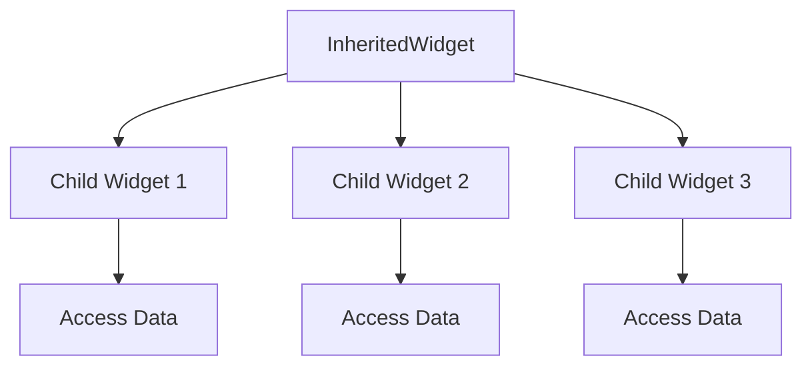

## 2.3.2 InheritedWidget and InheritedModel

In Flutter, managing state efficiently is crucial for building responsive and interactive applications. Two powerful tools for state management within the Flutter framework are `InheritedWidget` and `InheritedModel`. These widgets allow data to be efficiently passed down the widget tree, enabling child widgets to access and subscribe to changes. This section will delve into the intricacies of these tools, providing a comprehensive understanding, practical examples, and insights into their use cases and limitations.

### Understanding InheritedWidget

`InheritedWidget` is a special type of widget in Flutter that allows data to be efficiently shared down the widget tree. It is a key component in Flutter's state management strategy, enabling widgets to access shared data without the need for explicit passing through constructors.

#### Key Features of InheritedWidget

- **Data Sharing:** `InheritedWidget` allows data to be shared with all its descendant widgets. This is particularly useful for data that needs to be accessed by multiple widgets, such as theme data, localization, or user settings.
- **Efficient Updates:** When the data in an `InheritedWidget` changes, only the widgets that depend on that data are rebuilt. This selective rebuilding enhances performance by avoiding unnecessary widget rebuilds.
- **Contextual Access:** Child widgets can access the data provided by an `InheritedWidget` using the `BuildContext`. This access is typically done through a static method defined in the `InheritedWidget`.

#### How Child Widgets Access Data

Child widgets can access the data from an `InheritedWidget` using the `of` method, which is conventionally defined in the `InheritedWidget`. This method uses the `BuildContext` to traverse up the widget tree and retrieve the nearest instance of the `InheritedWidget`.

```dart
class MyInheritedWidget extends InheritedWidget {
  final int data;

  MyInheritedWidget({
    Key? key,
    required this.data,
    required Widget child,
  }) : super(key: key, child: child);

  static MyInheritedWidget? of(BuildContext context) {
    return context.dependOnInheritedWidgetOfExactType<MyInheritedWidget>();
  }

  @override
  bool updateShouldNotify(MyInheritedWidget oldWidget) {
    return oldWidget.data != data;
  }
}
```

In this example, `MyInheritedWidget` provides an integer `data` to its descendants. The `of` method allows child widgets to access this data.

### Implementing InheritedWidget

Creating a custom `InheritedWidget` involves extending the `InheritedWidget` class and implementing the `updateShouldNotify` method. This method determines whether the widget should notify its dependents of changes.

#### Step-by-Step Guide to Creating a Custom InheritedWidget

1. **Define the InheritedWidget:**
   Create a class that extends `InheritedWidget` and define the data you want to share.

2. **Implement the `updateShouldNotify` Method:**
   This method should return `true` if the new data is different from the old data, prompting dependent widgets to rebuild.

3. **Provide a Static `of` Method:**
   This method allows child widgets to access the data using the `BuildContext`.

4. **Use the InheritedWidget in Your Widget Tree:**
   Wrap your widget tree with the `InheritedWidget` to provide data to its descendants.

#### Code Example: Creating a Simple Theme Manager

Let's create a simple theme manager using `InheritedWidget` to demonstrate its implementation.

```dart
class ThemeManager extends InheritedWidget {
  final ThemeData themeData;

  ThemeManager({
    Key? key,
    required this.themeData,
    required Widget child,
  }) : super(key: key, child: child);

  static ThemeManager? of(BuildContext context) {
    return context.dependOnInheritedWidgetOfExactType<ThemeManager>();
  }

  @override
  bool updateShouldNotify(ThemeManager oldWidget) {
    return oldWidget.themeData != themeData;
  }
}

class MyApp extends StatelessWidget {
  @override
  Widget build(BuildContext context) {
    return ThemeManager(
      themeData: ThemeData.light(),
      child: MaterialApp(
        home: HomeScreen(),
      ),
    );
  }
}

class HomeScreen extends StatelessWidget {
  @override
  Widget build(BuildContext context) {
    final theme = ThemeManager.of(context)?.themeData ?? ThemeData.light();

    return Scaffold(
      appBar: AppBar(
        title: Text('InheritedWidget Example'),
      ),
      body: Center(
        child: Text(
          'Hello, Flutter!',
          style: theme.textTheme.headline4,
        ),
      ),
    );
  }
}
```

In this example, `ThemeManager` provides a `ThemeData` object to its descendants. The `HomeScreen` widget accesses this theme data to style its text.

### InheritedModel

`InheritedModel` extends the capabilities of `InheritedWidget` by allowing for more granular updates. It is particularly useful when different parts of the widget tree depend on different aspects of the shared data.

#### Key Features of InheritedModel

- **Granular Updates:** `InheritedModel` allows widgets to specify which aspect of the data they depend on. This means only the widgets that depend on the changed aspect are rebuilt.
- **Efficient Performance:** By minimizing unnecessary rebuilds, `InheritedModel` can significantly improve performance in complex widget trees.

#### Implementing InheritedModel

To implement an `InheritedModel`, you extend the `InheritedModel` class and define the `updateShouldNotify` and `updateShouldNotifyDependent` methods.

```dart
class MyInheritedModel extends InheritedModel<String> {
  final int dataA;
  final int dataB;

  MyInheritedModel({
    Key? key,
    required this.dataA,
    required this.dataB,
    required Widget child,
  }) : super(key: key, child: child);

  static MyInheritedModel? of(BuildContext context, String aspect) {
    return InheritedModel.inheritFrom<MyInheritedModel>(context, aspect: aspect);
  }

  @override
  bool updateShouldNotify(MyInheritedModel oldWidget) {
    return dataA != oldWidget.dataA || dataB != oldWidget.dataB;
  }

  @override
  bool updateShouldNotifyDependent(
      MyInheritedModel oldWidget, Set<String> dependencies) {
    if (dependencies.contains('A') && dataA != oldWidget.dataA) {
      return true;
    }
    if (dependencies.contains('B') && dataB != oldWidget.dataB) {
      return true;
    }
    return false;
  }
}
```

In this example, `MyInheritedModel` provides two pieces of data, `dataA` and `dataB`. Widgets can specify which data they depend on, allowing for more efficient updates.

### Use Cases

#### When to Use InheritedWidget

- **Global Configuration:** Use `InheritedWidget` for data that needs to be accessed globally, such as theme data, localization, or user settings.
- **Simple State Sharing:** When you need to share simple state across a few widgets without complex dependencies.

#### When to Use InheritedModel

- **Complex Dependencies:** Use `InheritedModel` when different parts of the widget tree depend on different aspects of the shared data.
- **Performance Optimization:** In scenarios where minimizing rebuilds is crucial for performance, such as in large lists or complex layouts.

### Limitations and Considerations

While `InheritedWidget` and `InheritedModel` are powerful tools, they come with certain limitations:

- **Complexity:** Implementing custom `InheritedWidgets` or `InheritedModels` can add complexity to your codebase, especially in large applications.
- **Scalability:** As the application grows, managing dependencies and ensuring efficient updates can become challenging.
- **Alternative Solutions:** For more complex state management needs, consider using other solutions like Provider, Riverpod, or Bloc.

### Mermaid.js Diagrams

To better understand the data flow using `InheritedWidget`, let's visualize it with a Mermaid.js diagram.



In this diagram, the `InheritedWidget` provides data to multiple child widgets, each of which can access the data as needed.

### Conclusion

`InheritedWidget` and `InheritedModel` are essential tools in Flutter's state management arsenal. They provide efficient ways to share data across the widget tree, enabling responsive and interactive applications. By understanding their strengths and limitations, you can make informed decisions about when and how to use them in your projects.

For further exploration, consider diving into the official Flutter documentation and experimenting with different state management solutions to find the best fit for your application's needs.

## Quiz Time!



### What is the primary purpose of an InheritedWidget in Flutter?

- [x] To efficiently pass data down the widget tree
- [ ] To handle user input events
- [ ] To manage animations in the app
- [ ] To create custom UI components

> **Explanation:** An `InheritedWidget` is used to efficiently pass data down the widget tree, allowing child widgets to access and subscribe to changes.

### How do child widgets access data from an InheritedWidget?

- [x] Using the `of` method with BuildContext
- [ ] By directly referencing the InheritedWidget instance
- [ ] Through global variables
- [ ] By using a constructor parameter

> **Explanation:** Child widgets access data from an `InheritedWidget` using the `of` method, which utilizes the `BuildContext` to retrieve the nearest instance of the `InheritedWidget`.

### What is a key advantage of using InheritedModel over InheritedWidget?

- [x] Allows for more granular updates
- [ ] Simplifies the widget tree structure
- [ ] Reduces the need for state management
- [ ] Automatically handles all state changes

> **Explanation:** `InheritedModel` allows for more granular updates by enabling widgets to specify which aspect of the data they depend on, minimizing unnecessary rebuilds.

### In which scenario is using InheritedWidget most beneficial?

- [x] Global configuration like theme data
- [ ] Managing complex user interactions
- [ ] Handling network requests
- [ ] Implementing custom animations

> **Explanation:** `InheritedWidget` is most beneficial for global configurations like theme data, where data needs to be accessed by multiple widgets across the app.

### What method must be implemented in a custom InheritedWidget to notify dependents of changes?

- [x] `updateShouldNotify`
- [ ] `build`
- [ ] `initState`
- [ ] `dispose`

> **Explanation:** The `updateShouldNotify` method must be implemented in a custom `InheritedWidget` to determine whether dependents should be notified of changes.

### What is the role of the `updateShouldNotifyDependent` method in InheritedModel?

- [x] To specify which dependents should be notified of changes
- [ ] To initialize the widget
- [ ] To handle user input
- [ ] To manage animations

> **Explanation:** The `updateShouldNotifyDependent` method in `InheritedModel` specifies which dependents should be notified of changes, allowing for more granular updates.

### Which of the following is a limitation of using InheritedWidget?

- [x] Can add complexity to the codebase
- [ ] Automatically handles all state changes
- [ ] Simplifies the widget tree structure
- [ ] Reduces the need for other state management solutions

> **Explanation:** Using `InheritedWidget` can add complexity to the codebase, especially in large applications with complex dependencies.

### What is the purpose of the `of` method in an InheritedWidget?

- [x] To allow child widgets to access the data
- [ ] To initialize the widget
- [ ] To handle user input
- [ ] To manage animations

> **Explanation:** The `of` method in an `InheritedWidget` allows child widgets to access the data by using the `BuildContext`.

### Which of the following is NOT a use case for InheritedModel?

- [x] Handling network requests
- [ ] Complex dependencies in the widget tree
- [ ] Performance optimization
- [ ] Granular updates for different data aspects

> **Explanation:** `InheritedModel` is not typically used for handling network requests; it is used for managing complex dependencies and performance optimization in the widget tree.

### True or False: InheritedWidget can be used to manage complex state across the entire application.

- [ ] True
- [x] False

> **Explanation:** While `InheritedWidget` is useful for sharing data across the widget tree, it is not designed to manage complex state across the entire application. Other state management solutions like Provider or Bloc may be more suitable for complex state management needs.


