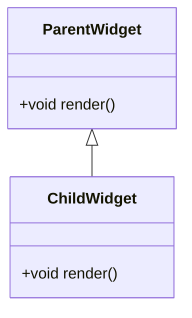
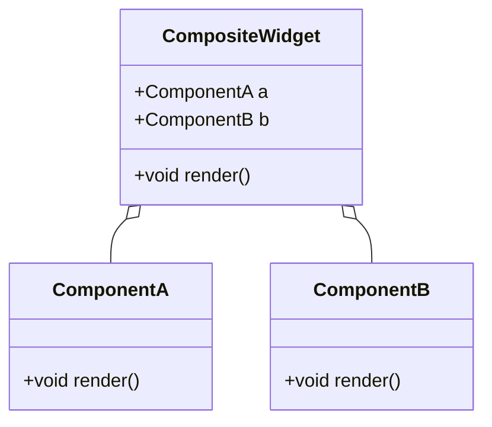

## 2.3.4 Composition vs. Inheritance

In the realm of software development, particularly in Flutter, understanding the distinction between composition and inheritance is crucial for effective state management and UI development. This section delves into these two fundamental object-oriented programming concepts, highlighting their differences, advantages, and best practices within the context of Flutter.

### Understanding Composition

Composition is a design principle where complex objects are constructed by combining simpler, reusable components. This approach allows developers to build flexible and modular systems by assembling objects that collaborate to achieve desired functionalities.

In Flutter, composition is often used to build user interfaces by nesting widgets. Each widget is responsible for a specific part of the UI, and together they form a cohesive application. This modularity is a cornerstone of Flutter's design philosophy, enabling developers to create highly customizable and maintainable applications.

#### Key Characteristics of Composition

- **Modularity:** Components are self-contained and can be reused across different parts of an application.
- **Flexibility:** Changes to one component do not necessarily affect others, allowing for easier maintenance and updates.
- **Scalability:** Applications can grow by adding new components without altering existing ones.
- **Reusability:** Components can be reused in different contexts, reducing code duplication.

### Understanding Inheritance

Inheritance is a mechanism in object-oriented programming where a new class is created based on an existing class. The new class, known as a subclass, inherits attributes and behaviors (methods) from the parent class, allowing for code reuse and extension.

In Flutter, inheritance is less commonly used for UI development but can be useful in certain scenarios, such as creating custom widgets or extending existing ones. However, excessive reliance on inheritance can lead to rigid and tightly coupled code structures.

#### Key Characteristics of Inheritance

- **Code Reusability:** Allows sharing of common logic between classes.
- **Hierarchical Relationships:** Establishes a clear parent-child relationship between classes.
- **Polymorphism:** Enables objects to be treated as instances of their parent class, allowing for flexible method overriding.

### Flutter's Preference for Composition

Flutter inherently favors composition over inheritance for several reasons:

- **Widget Tree Structure:** Flutter's UI is built using a tree of widgets, where each widget is a component that can contain other widgets. This naturally aligns with the principles of composition.
- **Customization and Flexibility:** Composition allows developers to customize and extend functionality without altering the base class, promoting flexibility.
- **Avoiding Tight Coupling:** Composition reduces dependencies between components, making the codebase easier to manage and refactor.

### Advantages of Composition

- **Flexibility:** Components can be easily replaced or modified without affecting the entire system.
- **Reusability:** Encourages the creation of generic components that can be reused across different projects.
- **Easier Maintenance:** Isolates changes to specific components, simplifying debugging and updates.
- **Decoupling:** Reduces dependencies between components, leading to a more modular and maintainable codebase.

### When to Use Inheritance

While composition is generally preferred, there are scenarios where inheritance is appropriate:

- **Extending Existing Widgets:** When creating a new widget that closely resembles an existing one but requires additional functionality.
- **Implementing Shared Behavior:** When multiple classes need to share common behavior or properties.
- **Polymorphic Behavior:** When objects need to be treated as instances of their parent class for flexibility in method overriding.

### Code Examples

Let's explore how composition and inheritance can be applied in Flutter through practical code examples.

#### Composition Example

```dart
import 'package:flutter/material.dart';

class CustomButton extends StatelessWidget {
  final String label;
  final VoidCallback onPressed;

  CustomButton({required this.label, required this.onPressed});

  @override
  Widget build(BuildContext context) {
    return ElevatedButton(
      onPressed: onPressed,
      child: Text(label),
    );
  }
}

class MyApp extends StatelessWidget {
  @override
  Widget build(BuildContext context) {
    return MaterialApp(
      home: Scaffold(
        appBar: AppBar(title: Text('Composition Example')),
        body: Center(
          child: CustomButton(
            label: 'Click Me',
            onPressed: () {
              print('Button Pressed!');
            },
          ),
        ),
      ),
    );
  }
}

void main() => runApp(MyApp());
```

In this example, `CustomButton` is a compositional widget that combines an `ElevatedButton` with custom behavior. This approach allows for easy reuse and customization without altering the base `ElevatedButton` class.

#### Inheritance Example

```dart
import 'package:flutter/material.dart';

class CustomElevatedButton extends ElevatedButton {
  CustomElevatedButton({required VoidCallback onPressed, required Widget child})
      : super(
          onPressed: onPressed,
          child: child,
          style: ButtonStyle(
            backgroundColor: MaterialStateProperty.all(Colors.green),
          ),
        );
}

class MyApp extends StatelessWidget {
  @override
  Widget build(BuildContext context) {
    return MaterialApp(
      home: Scaffold(
        appBar: AppBar(title: Text('Inheritance Example')),
        body: Center(
          child: CustomElevatedButton(
            onPressed: () {
              print('Custom Button Pressed!');
            },
            child: Text('Press Me'),
          ),
        ),
      ),
    );
  }
}

void main() => runApp(MyApp());
```

Here, `CustomElevatedButton` extends `ElevatedButton` to alter its appearance and behavior. While this approach can be useful, it may lead to less flexible and harder-to-maintain code compared to composition.

### Best Practices

- **Favor Composition Over Inheritance:** Use composition for building UI components and managing state to enhance flexibility and maintainability.
- **Use Inheritance Sparingly:** Reserve inheritance for cases where it provides clear benefits, such as extending existing classes with minimal changes.
- **Encapsulate Behavior:** Encapsulate behavior within components to promote reusability and modularity.
- **Design for Change:** Anticipate future changes and design components to be easily extendable and replaceable.

### Mermaid.js Diagrams

To visualize the differences between inheritance and composition, consider the following diagrams:

#### Inheritance Diagram



#### Composition Diagram



### Conclusion

In Flutter, understanding when to use composition versus inheritance is essential for creating flexible, maintainable, and scalable applications. By favoring composition, developers can build modular systems that are easier to extend and maintain. However, inheritance remains a valuable tool for specific scenarios where shared behavior and polymorphism are required. By adhering to best practices and leveraging the strengths of each approach, developers can create robust applications that stand the test of time.

## Quiz Time!



### What is composition in software design?

- [x] Building complex objects by combining simpler ones
- [ ] Deriving new classes from existing ones
- [ ] Sharing behavior across multiple classes
- [ ] Establishing parent-child relationships between classes

> **Explanation:** Composition involves creating complex objects by combining simpler, reusable components, promoting modularity and flexibility.

### What is inheritance in object-oriented programming?

- [ ] Building complex objects by combining simpler ones
- [x] Deriving new classes from existing ones
- [ ] Sharing behavior across multiple classes
- [ ] Establishing parent-child relationships between classes

> **Explanation:** Inheritance is a mechanism where a new class is created based on an existing class, inheriting its attributes and behaviors.

### Why does Flutter favor composition over inheritance?

- [x] It promotes flexibility and modularity
- [ ] It is easier to implement
- [ ] It reduces the number of classes
- [ ] It eliminates the need for state management

> **Explanation:** Flutter favors composition because it promotes flexibility, modularity, and easier maintenance by reducing dependencies between components.

### Which of the following is an advantage of composition?

- [x] Flexibility and reusability
- [ ] Establishing hierarchical relationships
- [ ] Code duplication
- [ ] Tight coupling

> **Explanation:** Composition offers flexibility and reusability by allowing components to be easily replaced or modified without affecting the entire system.

### When is inheritance appropriate in Flutter?

- [x] When extending existing widgets with minimal changes
- [ ] When building all UI components
- [ ] When avoiding code reuse
- [ ] When eliminating polymorphism

> **Explanation:** Inheritance is appropriate for extending existing widgets with minimal changes, sharing behavior, and implementing polymorphic behavior.

### Which approach is generally preferred for UI development in Flutter?

- [x] Composition
- [ ] Inheritance
- [ ] Neither
- [ ] Both equally

> **Explanation:** Composition is generally preferred for UI development in Flutter due to its flexibility and modularity.

### What is a key characteristic of inheritance?

- [ ] Modularity
- [ ] Flexibility
- [x] Hierarchical relationships
- [ ] Decoupling

> **Explanation:** Inheritance establishes hierarchical relationships between classes, allowing for code reuse and extension.

### What is a potential drawback of excessive inheritance?

- [x] Rigid and tightly coupled code structures
- [ ] Increased flexibility
- [ ] Easier maintenance
- [ ] Enhanced modularity

> **Explanation:** Excessive inheritance can lead to rigid and tightly coupled code structures, making the codebase harder to manage and refactor.

### How does composition enhance maintainability?

- [x] By isolating changes to specific components
- [ ] By increasing code duplication
- [ ] By establishing parent-child relationships
- [ ] By eliminating the need for state management

> **Explanation:** Composition enhances maintainability by isolating changes to specific components, simplifying debugging and updates.

### True or False: Composition allows for easier customization and extension of functionality.

- [x] True
- [ ] False

> **Explanation:** True. Composition allows for easier customization and extension of functionality without altering the base class, promoting flexibility.


