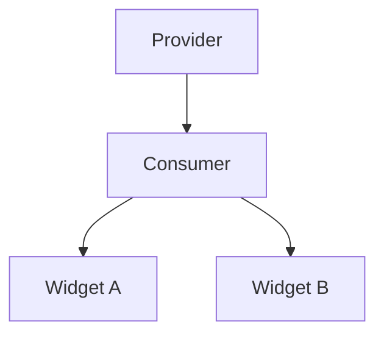

## 3.1.1 What is Provider?

State management is a crucial aspect of building robust and responsive Flutter applications. Among the various state management solutions available, the Provider package stands out as a recommended approach by the Flutter team. This article delves into the Provider package, exploring its core concepts, benefits, and how it simplifies state management in Flutter applications.

### Overview of Provider

The Provider package is a powerful and flexible state management solution for Flutter applications. It is built on top of Flutter's `InheritedWidget`, offering a simpler syntax and additional benefits that make it easier to manage and share state across the widget tree.

Provider acts as a wrapper around your application, allowing you to expose data to any widget that needs it. This approach eliminates the need for complex and error-prone state management techniques, providing a clean and efficient way to manage state.

### Why Use Provider?

Provider addresses many of the limitations associated with traditional state management techniques like `setState` and `InheritedWidgets`. Here are some reasons why you might choose Provider:

- **Simplifies State Sharing:** Provider makes it easy to share state across the widget tree without having to pass data through multiple widget constructors.
- **Efficient State Updates:** By using Provider, you can ensure that only the widgets that depend on the state are rebuilt when the state changes, improving performance.
- **Cleaner Code:** Provider's syntax is straightforward, reducing boilerplate code and making your codebase more maintainable.
- **Integration with Flutter's Reactive Model:** Provider works seamlessly with Flutter's reactive model, allowing you to build responsive and dynamic applications.

### Core Concepts

To effectively use Provider, it's essential to understand its core concepts:

- **Providers:** These are the objects that hold the state and notify listeners when the state changes. Providers can be of different types, such as `Provider`, `ChangeNotifierProvider`, `FutureProvider`, and `StreamProvider`.
- **Consumers:** These widgets listen to changes in the provider and rebuild themselves when the state changes. The `Consumer` widget is used to access the state and rebuild the UI accordingly.
- **ChangeNotifiers:** These are objects that extend `ChangeNotifier` and are used to notify listeners about changes in the state. They are typically used with `ChangeNotifierProvider`.

#### How Provider Works with Flutter's Reactive Model

Provider leverages Flutter's reactive model by using `InheritedWidget` under the hood. When the state changes, Provider ensures that only the widgets that depend on that state are rebuilt. This approach minimizes unnecessary rebuilds and enhances performance.

### Differences from Other Solutions

Provider is one of many state management solutions available in Flutter. Here's how it compares to some other popular options:

- **setState:** While `setState` is simple and effective for managing local state, it becomes cumbersome for managing global or shared state. Provider offers a more scalable solution.
- **InheritedWidget:** Provider is built on top of `InheritedWidget`, providing a more straightforward API and additional features like `ChangeNotifier`.
- **Bloc and Redux:** These are more complex state management solutions that offer additional features like time travel debugging and middleware. Provider is simpler and more lightweight, making it suitable for many applications.

### Code Examples

Let's look at a simple example of how to use Provider to pass data down the widget tree.

```dart
import 'package:flutter/material.dart';
import 'package:provider/provider.dart';

// Define a ChangeNotifier class
class Counter extends ChangeNotifier {
  int _count = 0;

  int get count => _count;

  void increment() {
    _count++;
    notifyListeners(); // Notify listeners about the change
  }
}

void main() {
  runApp(
    ChangeNotifierProvider(
      create: (context) => Counter(),
      child: MyApp(),
    ),
  );
}

class MyApp extends StatelessWidget {
  @override
  Widget build(BuildContext context) {
    return MaterialApp(
      home: Scaffold(
        appBar: AppBar(title: Text('Provider Example')),
        body: Center(
          child: Column(
            mainAxisAlignment: MainAxisAlignment.center,
            children: <Widget>[
              Text('You have pushed the button this many times:'),
              Consumer<Counter>(
                builder: (context, counter, child) {
                  return Text(
                    '${counter.count}',
                    style: Theme.of(context).textTheme.headline4,
                  );
                },
              ),
            ],
          ),
        ),
        floatingActionButton: FloatingActionButton(
          onPressed: () => context.read<Counter>().increment(),
          tooltip: 'Increment',
          child: Icon(Icons.add),
        ),
      ),
    );
  }
}
```

**Code Explanation:**

- **ChangeNotifier:** The `Counter` class extends `ChangeNotifier`, allowing it to notify listeners when the state changes.
- **ChangeNotifierProvider:** This widget provides an instance of `Counter` to its descendants.
- **Consumer:** The `Consumer` widget listens to changes in the `Counter` and rebuilds its child when the state changes.
- **context.read<Counter>().increment():** This line accesses the `Counter` instance and calls the `increment` method to update the state.

### Visual Aids

To better understand how Provider works, consider the following diagram:



In this diagram, the `Provider` supplies the `Counter` instance to its descendants, `Consumer`, `Widget A`, and `Widget B`. The `Consumer` listens for changes in the `Counter` and rebuilds itself when the state changes.

### Key Takeaways

- **Simplicity and Power:** Provider offers a simple yet powerful way to manage state in Flutter applications, making it a popular choice among developers.
- **Efficient State Management:** By minimizing unnecessary rebuilds, Provider enhances application performance.
- **Foundation for State Management:** Provider serves as a foundational tool for state management, suitable for both simple and complex applications.

Provider is a versatile and efficient state management solution that can significantly simplify your Flutter development process. By understanding its core concepts and benefits, you can leverage Provider to build responsive and maintainable applications.

## Quiz Time!



### What is the primary advantage of using Provider over setState?

- [x] Simplifies sharing and updating state across the widget tree
- [ ] Provides time travel debugging
- [ ] Offers middleware for side effects
- [ ] Enables server-side rendering

> **Explanation:** Provider simplifies the sharing and updating of state across the widget tree, making it more efficient than using `setState` for managing global or shared state.

### Which of the following is NOT a type of Provider?

- [ ] ChangeNotifierProvider
- [ ] FutureProvider
- [ ] StreamProvider
- [x] ReduxProvider

> **Explanation:** ReduxProvider is not a type of Provider. The types of Provider include ChangeNotifierProvider, FutureProvider, and StreamProvider.

### What does the Consumer widget do in the Provider package?

- [x] Listens to changes in the provider and rebuilds its child
- [ ] Provides data to the widget tree
- [ ] Manages asynchronous operations
- [ ] Handles navigation between screens

> **Explanation:** The Consumer widget listens to changes in the provider and rebuilds its child when the state changes.

### How does Provider enhance performance in Flutter applications?

- [x] By ensuring only widgets that depend on the state are rebuilt
- [ ] By reducing the app's memory footprint
- [ ] By enabling server-side rendering
- [ ] By providing middleware for side effects

> **Explanation:** Provider enhances performance by ensuring that only the widgets that depend on the state are rebuilt, minimizing unnecessary rebuilds.

### What is the role of ChangeNotifier in the Provider package?

- [x] To notify listeners about changes in the state
- [ ] To manage navigation between screens
- [ ] To handle asynchronous operations
- [ ] To provide middleware for side effects

> **Explanation:** ChangeNotifier is used to notify listeners about changes in the state, allowing them to rebuild as needed.

### Which widget is used to provide an instance of a ChangeNotifier to its descendants?

- [x] ChangeNotifierProvider
- [ ] InheritedWidget
- [ ] FutureProvider
- [ ] StreamProvider

> **Explanation:** ChangeNotifierProvider is used to provide an instance of a ChangeNotifier to its descendants.

### What does the context.read<T>() method do in the Provider package?

- [x] Accesses the current value of the provider
- [ ] Listens to changes in the provider
- [ ] Provides data to the widget tree
- [ ] Manages asynchronous operations

> **Explanation:** The context.read<T>() method accesses the current value of the provider without listening for changes.

### Which of the following is a benefit of using Provider over InheritedWidget?

- [x] Simpler API and additional features like ChangeNotifier
- [ ] Provides time travel debugging
- [ ] Offers middleware for side effects
- [ ] Enables server-side rendering

> **Explanation:** Provider offers a simpler API and additional features like ChangeNotifier, making it easier to use than InheritedWidget.

### What is the purpose of the notifyListeners() method in a ChangeNotifier?

- [x] To notify all listeners that the state has changed
- [ ] To manage navigation between screens
- [ ] To handle asynchronous operations
- [ ] To provide middleware for side effects

> **Explanation:** The notifyListeners() method is used to notify all listeners that the state has changed, prompting them to rebuild.

### True or False: Provider is built on top of Redux.

- [ ] True
- [x] False

> **Explanation:** False. Provider is built on top of InheritedWidget, not Redux.


