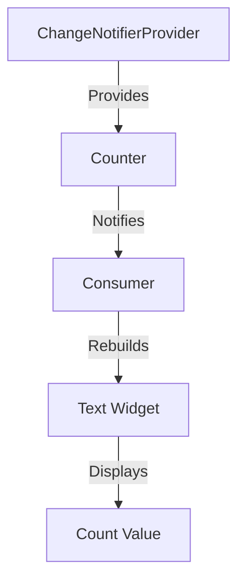

---

linkTitle: "3.1.2 How Provider Works"
title: "How Provider Works: Understanding Flutter's Provider Mechanism"
description: "Explore the inner workings of the Provider package in Flutter, including its use of InheritedWidgets, types of providers, and practical examples with ChangeNotifier and Consumer widgets."
categories:
- Flutter
- State Management
- Mobile Development
tags:
- Flutter Provider
- State Management
- ChangeNotifier
- Consumer Widget
- InheritedWidget
date: 2024-10-25
type: docs
nav_weight: 312000
---

## 3.1.2 How Provider Works

In the realm of Flutter development, managing state efficiently is crucial for building responsive and interactive applications. The Provider package is a widely adopted solution that simplifies state management by leveraging Flutter's inherent capabilities. This section delves into the mechanics of Provider, exploring its types, usage, and best practices to harness its full potential.

### Provider Mechanism

At its core, the Provider package is built on top of Flutter's `InheritedWidget`. This foundational widget allows data to be efficiently passed down the widget tree without the need for manual data propagation. Here's how the Provider mechanism operates:

- **InheritedWidgets Under the Hood:**
  - Providers use `InheritedWidget` to propagate data to descendant widgets. When a widget subscribes to a provider, it gains access to the data stored within the `InheritedWidget`.
  - The `InheritedWidget` listens for changes in the data and triggers a rebuild of any dependent widgets, ensuring that the UI remains in sync with the underlying state.

- **Listening and Notifying:**
  - Providers listen for changes in the data they manage. When a change occurs, they notify all registered consumers, prompting them to rebuild and reflect the updated state.
  - This notification mechanism is efficient, as only widgets that depend on the changed data are rebuilt, minimizing unnecessary UI updates.

### Types of Providers

The Provider package offers several types of providers, each catering to different state management needs:

- **`Provider`:**
  - This is the simplest form of provider, used to expose a value to the widget tree. It does not listen for changes, making it ideal for static data or configurations.
  - **Use Case:** Providing configuration settings or static data that does not change over time.

- **`ChangeNotifierProvider`:**
  - This provider is used in conjunction with `ChangeNotifier`, a class that provides change notification capabilities. It is suitable for managing mutable state.
  - **Use Case:** Managing UI state that changes in response to user interactions, such as form inputs or toggle switches.

- **`FutureProvider`:**
  - Designed to handle asynchronous data, `FutureProvider` listens to a `Future` and updates the UI once the future completes.
  - **Use Case:** Fetching data from a network request or database query that completes at a later time.

- **`StreamProvider`:**
  - Similar to `FutureProvider`, but for streams of data. It listens to a `Stream` and updates the UI whenever new data is emitted.
  - **Use Case:** Real-time data updates, such as live chat messages or stock price changes.

### ChangeNotifier

The `ChangeNotifier` class plays a pivotal role in the Provider ecosystem by enabling efficient state updates:

- **Role of `ChangeNotifier`:**
  - `ChangeNotifier` is a class that provides a simple mechanism to notify listeners about changes. It is commonly used with `ChangeNotifierProvider`.
  - When the state changes, `ChangeNotifier` calls `notifyListeners()`, which triggers a rebuild of any widgets listening to the provider.

- **Example of a Simple `ChangeNotifier` Class:**

```dart
import 'package:flutter/material.dart';

class Counter extends ChangeNotifier {
  int _count = 0;

  int get count => _count;

  void increment() {
    _count++;
    notifyListeners(); // Notify listeners about the change
  }
}
```

### Consumer Widget

The `Consumer` widget is an essential part of the Provider package, allowing widgets to access and react to changes in the provided data:

- **Using the `Consumer` Widget:**
  - The `Consumer` widget listens to a provider and rebuilds whenever the provider's data changes. It separates the UI logic from the business logic, promoting a clean architecture.
  - **Benefits:** By using `Consumer`, you can minimize the coupling between UI components and the underlying data model, making your codebase more maintainable and testable.

- **Example of Using `Consumer`:**

```dart
import 'package:flutter/material.dart';
import 'package:provider/provider.dart';

void main() {
  runApp(
    ChangeNotifierProvider(
      create: (context) => Counter(),
      child: MyApp(),
    ),
  );
}

class MyApp extends StatelessWidget {
  @override
  Widget build(BuildContext context) {
    return MaterialApp(
      home: Scaffold(
        appBar: AppBar(title: Text('Provider Example')),
        body: Center(
          child: Consumer<Counter>(
            builder: (context, counter, child) {
              return Text('Count: ${counter.count}');
            },
          ),
        ),
        floatingActionButton: FloatingActionButton(
          onPressed: () => context.read<Counter>().increment(),
          child: Icon(Icons.add),
        ),
      ),
    );
  }
}
```

### Code Examples

Let's walk through setting up a `ChangeNotifierProvider` and using a `Consumer` to access and display data:

1. **Setting Up the Provider:**

   - Wrap your application with `ChangeNotifierProvider` to provide the `Counter` instance to the widget tree.

   ```dart
   ChangeNotifierProvider(
     create: (context) => Counter(),
     child: MyApp(),
   );
   ```

2. **Accessing Data with `Consumer`:**

   - Use the `Consumer` widget to listen to changes in the `Counter` and update the UI accordingly.

   ```dart
   Consumer<Counter>(
     builder: (context, counter, child) {
       return Text('Count: ${counter.count}');
     },
   );
   ```

3. **Updating State:**

   - Use the `context.read<Counter>().increment()` method to update the state and notify listeners.

### Mermaid.js Diagrams

To better understand the flow of data from the `Provider` to the `Consumer`, consider the following diagram:



This diagram illustrates how the `ChangeNotifierProvider` provides the `Counter` instance, which notifies the `Consumer` of changes, prompting a rebuild of the `Text Widget` to display the updated count value.

### Practical Tips

- **Best Practices:**
  - Place providers higher in the widget tree to make data accessible to more widgets. This approach ensures that any widget needing access to the data can obtain it without unnecessary duplication.
  - Avoid overusing providers at every level, as this can clutter the widget tree and make the code harder to manage.

- **Common Pitfalls:**
  - Ensure that `notifyListeners()` is called only when necessary to prevent excessive rebuilds, which can impact performance.
  - Be mindful of the widget rebuilds triggered by `Consumer` and optimize by using `Selector` for more granular updates.

### Conclusion

The Provider package offers a robust and flexible solution for state management in Flutter applications. By understanding its underlying mechanisms, types, and practical usage, developers can build responsive and maintainable applications. Remember to follow best practices and consider the architectural implications of your state management choices to create scalable and efficient Flutter apps.

## Quiz Time!



### What is the primary widget that Provider uses under the hood?

- [x] InheritedWidget
- [ ] StatefulWidget
- [ ] StatelessWidget
- [ ] Container

> **Explanation:** Provider uses InheritedWidget to propagate data down the widget tree efficiently.

### Which provider type is best suited for handling asynchronous data that completes at a later time?

- [ ] ChangeNotifierProvider
- [x] FutureProvider
- [ ] StreamProvider
- [ ] Provider

> **Explanation:** FutureProvider is designed to handle asynchronous data and updates the UI once the future completes.

### What method is called in ChangeNotifier to notify listeners about changes?

- [ ] updateListeners()
- [x] notifyListeners()
- [ ] refreshListeners()
- [ ] changeListeners()

> **Explanation:** The notifyListeners() method is used in ChangeNotifier to trigger a rebuild of listening widgets.

### Which widget is used to access and react to changes in the provided data?

- [ ] Builder
- [x] Consumer
- [ ] Container
- [ ] Column

> **Explanation:** The Consumer widget listens to a provider and rebuilds whenever the provider's data changes.

### What is a benefit of using the Consumer widget?

- [x] Separates UI logic from business logic
- [ ] Increases coupling between components
- [ ] Reduces code readability
- [ ] Limits data accessibility

> **Explanation:** The Consumer widget helps separate UI logic from business logic, promoting a clean architecture.

### Which provider type is ideal for managing UI state that changes in response to user interactions?

- [ ] FutureProvider
- [ ] StreamProvider
- [x] ChangeNotifierProvider
- [ ] Provider

> **Explanation:** ChangeNotifierProvider is suitable for managing mutable UI state that changes with user interactions.

### What is the role of ChangeNotifier in the Provider ecosystem?

- [ ] To fetch data from the network
- [x] To notify listeners about changes
- [ ] To manage static data
- [ ] To handle asynchronous operations

> **Explanation:** ChangeNotifier provides a mechanism to notify listeners about changes in the state.

### Which method is used to update the state and notify listeners in the provided example?

- [ ] context.watch<Counter>().increment()
- [x] context.read<Counter>().increment()
- [ ] context.listen<Counter>().increment()
- [ ] context.observe<Counter>().increment()

> **Explanation:** The context.read<Counter>().increment() method is used to update the state and notify listeners.

### What is a common pitfall when using providers?

- [ ] Placing providers too high in the widget tree
- [x] Overusing providers at every level
- [ ] Using ChangeNotifier for static data
- [ ] Avoiding the use of Consumer

> **Explanation:** Overusing providers at every level can clutter the widget tree and make the code harder to manage.

### True or False: The Provider package can be used to manage both static and dynamic data.

- [x] True
- [ ] False

> **Explanation:** The Provider package is versatile and can manage both static and dynamic data efficiently.


