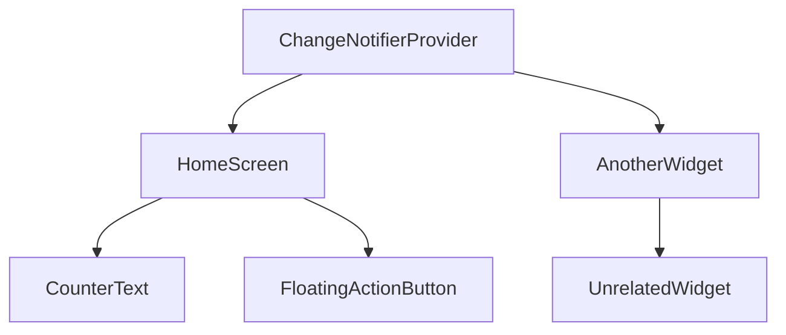

## 3.2.1 Providing Data to Widgets in Flutter with Provider

In Flutter, managing state efficiently is crucial for building responsive and interactive applications. The Provider package is a popular choice for state management due to its simplicity and flexibility. This section will guide you through the process of providing data to widgets using Provider, ensuring that your Flutter applications are both robust and maintainable.

### Wrapping the Widget Tree

To make data accessible to widgets in your Flutter app, you need to wrap parts of the widget tree with a `Provider`. This allows child widgets to access and react to changes in the data. The Provider package offers several types of providers, but `ChangeNotifierProvider` is one of the most commonly used for managing state changes.

#### Using ChangeNotifierProvider

`ChangeNotifierProvider` is used to provide an instance of a class that extends `ChangeNotifier`. This class holds the state and notifies listeners when the state changes. Here’s an example of how to wrap your widget tree with a `ChangeNotifierProvider`:

```dart
import 'package:flutter/material.dart';
import 'package:provider/provider.dart';

void main() {
  runApp(MyApp());
}

class MyApp extends StatelessWidget {
  @override
  Widget build(BuildContext context) {
    return ChangeNotifierProvider(
      create: (context) => CounterModel(),
      child: MaterialApp(
        home: HomeScreen(),
      ),
    );
  }
}

class CounterModel extends ChangeNotifier {
  int _count = 0;

  int get count => _count;

  void increment() {
    _count++;
    notifyListeners();
  }
}

class HomeScreen extends StatelessWidget {
  @override
  Widget build(BuildContext context) {
    return Scaffold(
      appBar: AppBar(title: Text('Provider Example')),
      body: Center(child: CounterText()),
      floatingActionButton: FloatingActionButton(
        onPressed: () => context.read<CounterModel>().increment(),
        child: Icon(Icons.add),
      ),
    );
  }
}

class CounterText extends StatelessWidget {
  @override
  Widget build(BuildContext context) {
    final count = context.watch<CounterModel>().count;
    return Text('$count', style: TextStyle(fontSize: 48));
  }
}
```

In this example, `ChangeNotifierProvider` is used to provide an instance of `CounterModel` to the widget tree. The `HomeScreen` widget and its descendants can access and react to changes in the `CounterModel`.

#### Using MultiProvider

When your application grows, you might need to provide multiple objects. `MultiProvider` allows you to provide multiple providers at once, making your code cleaner and more manageable:

```dart
import 'package:flutter/material.dart';
import 'package:provider/provider.dart';

void main() {
  runApp(MyApp());
}

class MyApp extends StatelessWidget {
  @override
  Widget build(BuildContext context) {
    return MultiProvider(
      providers: [
        ChangeNotifierProvider(create: (context) => CounterModel()),
        ChangeNotifierProvider(create: (context) => AnotherModel()),
      ],
      child: MaterialApp(
        home: HomeScreen(),
      ),
    );
  }
}

class AnotherModel extends ChangeNotifier {
  // Implementation of another model
}
```

### Scope of Data

The location of the `Provider` in the widget tree determines the scope of data availability. Placing a provider too high in the tree might expose it to widgets that do not need it, while placing it too low might restrict access to widgets that do need it.

#### Implications of Provider Placement

- **High Placement:** If a provider is placed at the top of the widget tree, all widgets below it can access the data. This is useful for global state that needs to be accessed throughout the app, such as user authentication status.
  
- **Low Placement:** Placing a provider lower in the tree limits its scope to a smaller set of widgets. This is beneficial for local state that only a specific part of the app needs, reducing unnecessary rebuilds and improving performance.

### Accessing Data in Child Widgets

Once a provider is set up, child widgets can access the provided data using several methods: `Provider.of`, `Consumer`, and `Selector`.

#### Using Provider.of

`Provider.of` is a straightforward way to access the provided data. However, it should be used sparingly in the build method due to the potential for unnecessary rebuilds:

```dart
class CounterText extends StatelessWidget {
  @override
  Widget build(BuildContext context) {
    final count = Provider.of<CounterModel>(context).count;
    return Text('$count', style: TextStyle(fontSize: 48));
  }
}
```

#### Using Consumer

`Consumer` is a widget that listens to changes in the provider and rebuilds only the parts of the widget tree that need to change:

```dart
class CounterText extends StatelessWidget {
  @override
  Widget build(BuildContext context) {
    return Consumer<CounterModel>(
      builder: (context, counter, child) {
        return Text('${counter.count}', style: TextStyle(fontSize: 48));
      },
    );
  }
}
```

#### Using Selector

`Selector` provides even more granular control by allowing you to specify which part of the data you want to listen to, reducing unnecessary rebuilds:

```dart
class CounterText extends StatelessWidget {
  @override
  Widget build(BuildContext context) {
    return Selector<CounterModel, int>(
      selector: (context, counter) => counter.count,
      builder: (context, count, child) {
        return Text('$count', style: TextStyle(fontSize: 48));
      },
    );
  }
}
```

### Visualizing Data Access with Mermaid.js

To better understand which parts of the widget tree have access to the provided data, consider the following diagram:



In this diagram, `HomeScreen`, `CounterText`, and `FloatingActionButton` have access to the `CounterModel` provided by `ChangeNotifierProvider`. However, `UnrelatedWidget` does not, illustrating the importance of provider placement.

### Best Practices

- **Minimal Use of Provider.of:** Avoid using `Provider.of` in the build method to prevent unnecessary rebuilds. Instead, use `Consumer` or `Selector` for more granular control.
  
- **Granular Rebuilds with Consumer and Selector:** Use `Consumer` or `Selector` to rebuild only the parts of the widget tree that need to change, improving performance.

- **Appropriate Provider Placement:** Carefully consider where to place your providers in the widget tree to balance accessibility and performance.

### Conclusion

Providing data to widgets in Flutter using the Provider package is a powerful technique that enhances state management. By wrapping your widget tree with providers and using tools like `Consumer` and `Selector`, you can build efficient and maintainable applications. Remember to consider the scope of your providers and follow best practices to optimize performance.

For further exploration, consider reading the official [Provider documentation](https://pub.dev/packages/provider) and experimenting with different provider types and configurations in your projects.

## Quiz Time!



### What is the primary purpose of wrapping the widget tree with a Provider?

- [x] To make data accessible to child widgets
- [ ] To improve the visual appearance of the app
- [ ] To reduce the app's memory usage
- [ ] To increase the app's startup speed

> **Explanation:** Wrapping the widget tree with a Provider makes data accessible to child widgets, allowing them to react to changes in the data.

### Which provider type is commonly used for managing state changes?

- [x] ChangeNotifierProvider
- [ ] StreamProvider
- [ ] FutureProvider
- [ ] ValueProvider

> **Explanation:** ChangeNotifierProvider is commonly used for managing state changes as it provides an instance of a class that extends ChangeNotifier.

### What is the advantage of using MultiProvider?

- [x] It allows providing multiple providers at once
- [ ] It improves the app's network performance
- [ ] It reduces the app's code size
- [ ] It simplifies the app's navigation

> **Explanation:** MultiProvider allows you to provide multiple providers at once, making the code cleaner and more manageable.

### What is a potential downside of placing a provider too high in the widget tree?

- [x] It might expose data to widgets that do not need it
- [ ] It will cause the app to crash
- [ ] It will increase the app's memory usage
- [ ] It will decrease the app's startup speed

> **Explanation:** Placing a provider too high in the widget tree might expose data to widgets that do not need it, leading to unnecessary rebuilds.

### Which method should be used sparingly in the build method due to potential for unnecessary rebuilds?

- [x] Provider.of
- [ ] Consumer
- [ ] Selector
- [ ] MultiProvider

> **Explanation:** Provider.of should be used sparingly in the build method due to the potential for unnecessary rebuilds.

### What is the primary benefit of using Selector?

- [x] It provides granular control over which part of the data to listen to
- [ ] It simplifies the app's user interface
- [ ] It increases the app's startup speed
- [ ] It reduces the app's code size

> **Explanation:** Selector provides granular control by allowing you to specify which part of the data you want to listen to, reducing unnecessary rebuilds.

### Which widget listens to changes in the provider and rebuilds only the parts of the widget tree that need to change?

- [x] Consumer
- [ ] Provider.of
- [ ] MultiProvider
- [ ] ChangeNotifierProvider

> **Explanation:** Consumer listens to changes in the provider and rebuilds only the parts of the widget tree that need to change.

### What is the role of ChangeNotifier in the Provider pattern?

- [x] It holds the state and notifies listeners when the state changes
- [ ] It improves the app's network performance
- [ ] It reduces the app's code size
- [ ] It simplifies the app's navigation

> **Explanation:** ChangeNotifier holds the state and notifies listeners when the state changes, making it a key component in the Provider pattern.

### How does MultiProvider improve code management?

- [x] By allowing multiple providers to be declared in a single location
- [ ] By reducing the app's memory usage
- [ ] By increasing the app's startup speed
- [ ] By simplifying the app's user interface

> **Explanation:** MultiProvider improves code management by allowing multiple providers to be declared in a single location, making the code cleaner.

### True or False: Placing a provider too low in the widget tree can restrict access to widgets that need it.

- [x] True
- [ ] False

> **Explanation:** True. Placing a provider too low in the widget tree can restrict access to widgets that need it, limiting the scope of data availability.


