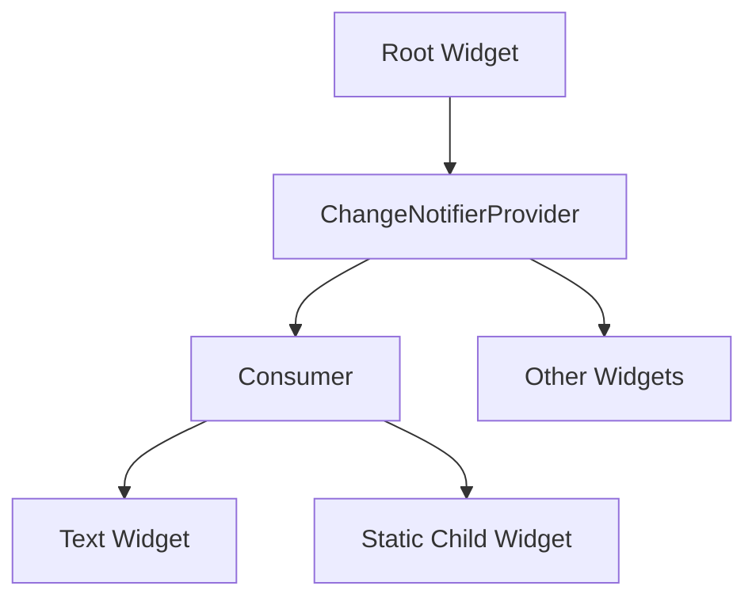

## 3.2.2 Consuming Data with Consumer

State management is a crucial aspect of Flutter development, and the Provider package offers a robust solution for managing and consuming state efficiently. One of the key widgets provided by the Provider package is the `Consumer`, which allows you to rebuild only specific parts of your UI when the data they depend on changes. This article delves into the nuances of using `Consumer`, optimizing UI updates, and understanding when to use `Consumer` versus `Provider.of`.

### Understanding Consumer

The `Consumer` widget is a cornerstone of the Provider package, designed to listen to changes in the provided data and rebuild its child widget tree accordingly. This capability is particularly useful in scenarios where only a part of the UI needs to react to changes in the state, allowing for more efficient and performant applications.

#### Key Features of Consumer

- **Selective Rebuilding:** `Consumer` rebuilds only the widgets that depend on the data, minimizing unnecessary UI updates.
- **Ease of Use:** It simplifies the process of accessing and reacting to changes in the provided data.
- **Performance Optimization:** By rebuilding only necessary parts of the UI, `Consumer` helps in optimizing the performance of Flutter applications.

### Using Consumer

To effectively use `Consumer`, you need to understand its parameters and how it integrates with your widget tree. The `Consumer` widget takes a `builder` function, which provides access to the context, the data being consumed, and an optional child widget.

#### Code Example: Basic Usage of Consumer

Here's a simple example demonstrating how to use `Consumer` to rebuild a specific part of the UI:

```dart
import 'package:flutter/material.dart';
import 'package:provider/provider.dart';

void main() {
  runApp(
    ChangeNotifierProvider(
      create: (context) => CounterModel(),
      child: MyApp(),
    ),
  );
}

class MyApp extends StatelessWidget {
  @override
  Widget build(BuildContext context) {
    return MaterialApp(
      home: Scaffold(
        appBar: AppBar(title: Text('Provider Example')),
        body: Center(
          child: Consumer<CounterModel>(
            builder: (context, counter, child) {
              return Text(
                'Count: ${counter.count}',
                style: TextStyle(fontSize: 24),
              );
            },
          ),
        ),
        floatingActionButton: FloatingActionButton(
          onPressed: () {
            context.read<CounterModel>().increment();
          },
          child: Icon(Icons.add),
        ),
      ),
    );
  }
}

class CounterModel extends ChangeNotifier {
  int _count = 0;

  int get count => _count;

  void increment() {
    _count++;
    notifyListeners();
  }
}
```

In this example:

- **`Consumer<CounterModel>`:** Listens to changes in `CounterModel` and rebuilds the `Text` widget when `count` changes.
- **`builder` Function:** Takes three parameters:
  - **`context`:** The BuildContext in which the widget is built.
  - **`counter`:** The instance of `CounterModel` being consumed.
  - **`child`:** An optional widget that remains constant and does not rebuild.

### Optimizing with Child Parameter

The `child` parameter in the `Consumer` widget is a powerful optimization tool. It allows you to pass a widget that does not depend on the data and thus does not need to be rebuilt when the data changes. This can significantly improve performance by reducing the number of widgets that need to be rebuilt.

#### Code Example: Using the Child Parameter

```dart
Consumer<CounterModel>(
  builder: (context, counter, child) {
    return Column(
      mainAxisAlignment: MainAxisAlignment.center,
      children: [
        child!,
        Text(
          'Count: ${counter.count}',
          style: TextStyle(fontSize: 24),
        ),
      ],
    );
  },
  child: Text(
    'Static Text',
    style: TextStyle(fontSize: 18),
  ),
),
```

In this example, the `Text` widget displaying "Static Text" is passed as a `child` and does not rebuild when the `count` changes, optimizing the UI updates.

### When to Use Consumer vs. Provider.of

Understanding when to use `Consumer` versus `Provider.of` is crucial for efficient state management in Flutter.

- **`Consumer`:** Use when you need to rebuild only specific parts of the UI in response to changes in the data. It is ideal for optimizing performance by minimizing unnecessary rebuilds.
- **`Provider.of`:** Use when you need to access the data without causing a rebuild, such as in event handlers or non-UI logic.

#### Comparison Table

| Feature                  | Consumer                          | Provider.of                       |
|--------------------------|-----------------------------------|-----------------------------------|
| **Rebuilds UI**          | Yes, selectively                   | No, unless used in build method   |
| **Performance**          | Optimized for selective rebuilds   | Can lead to unnecessary rebuilds  |
| **Use Case**             | UI updates                         | Data access without UI rebuild    |

### Mermaid.js Diagram: Visualizing Consumer

To better understand how `Consumer` fits into the widget tree and reacts to data changes, consider the following diagram:



In this diagram, the `Consumer` widget listens to changes in the `ChangeNotifierProvider` and rebuilds the `Text Widget` when necessary, while the `Static Child Widget` remains unchanged.

### Best Practices

- **Use `Consumer` in Build Method:** Always use `Consumer` within the build method to ensure that the widget tree is rebuilt correctly.
- **Minimize Rebuild Logic:** Keep the logic within the `builder` function minimal to avoid performance bottlenecks.
- **Optimize with `child`:** Use the `child` parameter to pass widgets that do not need to rebuild, optimizing performance.

### Conclusion

The `Consumer` widget is a powerful tool in Flutter's Provider package, enabling efficient and selective UI updates. By understanding its usage, parameters, and optimization techniques, you can significantly enhance the performance of your Flutter applications. Remember to choose between `Consumer` and `Provider.of` based on your specific use case, and always adhere to best practices for optimal results.

## Quiz Time!



### What is the primary purpose of the `Consumer` widget in Flutter?

- [x] To rebuild specific parts of the UI when the data changes
- [ ] To provide data to the entire widget tree
- [ ] To manage application-wide state
- [ ] To handle user input events

> **Explanation:** The `Consumer` widget is designed to rebuild only the parts of the UI that depend on the data it consumes, optimizing performance by reducing unnecessary rebuilds.

### Which parameter in the `Consumer` widget allows you to pass a widget that does not rebuild?

- [ ] context
- [ ] value
- [x] child
- [ ] builder

> **Explanation:** The `child` parameter is used to pass a widget that remains constant and does not rebuild when the data changes, optimizing UI performance.

### When should you use `Provider.of` instead of `Consumer`?

- [ ] When you want to rebuild the UI
- [x] When you need to access data without causing a rebuild
- [ ] When you want to optimize performance
- [ ] When you need to pass a static child widget

> **Explanation:** `Provider.of` is used to access data without causing a rebuild, making it suitable for event handlers or non-UI logic.

### What is a key benefit of using `Consumer` over `Provider.of`?

- [ ] It provides data to the entire widget tree
- [ ] It simplifies state management logic
- [x] It reduces unnecessary UI rebuilds
- [ ] It handles asynchronous operations

> **Explanation:** `Consumer` reduces unnecessary UI rebuilds by rebuilding only the parts of the UI that depend on the data, optimizing performance.

### In the provided code example, what does the `increment` method do?

- [ ] Decreases the count by one
- [x] Increases the count by one
- [ ] Resets the count to zero
- [ ] Multiplies the count by two

> **Explanation:** The `increment` method increases the count by one and calls `notifyListeners` to update the UI.

### What is the role of `ChangeNotifierProvider` in the example?

- [ ] To handle user input
- [ ] To provide static data
- [x] To provide an instance of `CounterModel` to the widget tree
- [ ] To manage navigation

> **Explanation:** `ChangeNotifierProvider` provides an instance of `CounterModel` to the widget tree, allowing widgets to listen to changes.

### How does the `Consumer` widget optimize performance?

- [ ] By rebuilding the entire widget tree
- [x] By rebuilding only the widgets that depend on the data
- [ ] By caching data locally
- [ ] By handling network requests

> **Explanation:** `Consumer` optimizes performance by rebuilding only the widgets that depend on the data, minimizing unnecessary updates.

### Which of the following is NOT a parameter of the `Consumer` widget?

- [ ] context
- [ ] builder
- [ ] child
- [x] notifier

> **Explanation:** The `Consumer` widget does not have a `notifier` parameter. It uses `context`, `builder`, and `child`.

### What does the `notifyListeners` method do in the `CounterModel` class?

- [ ] It resets the count to zero
- [ ] It logs the current count
- [x] It notifies listeners of changes to the model
- [ ] It saves the count to a database

> **Explanation:** The `notifyListeners` method notifies all listeners of changes to the model, triggering UI updates.

### True or False: The `Consumer` widget can be used to manage application-wide state.

- [ ] True
- [x] False

> **Explanation:** The `Consumer` widget is used to consume and react to changes in data, not to manage application-wide state. It is part of the state management process but not the sole manager.


