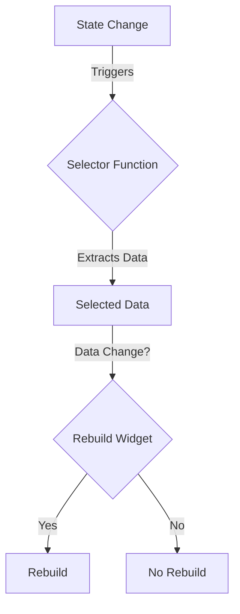

## 3.2.4 Selector for Performance Optimization

In the realm of Flutter development, performance optimization is a crucial aspect that can significantly enhance the user experience. One of the tools that Flutter developers can leverage for this purpose is the `Selector` widget from the Provider package. This article delves into the purpose, usage, and best practices of the `Selector` widget, providing you with the knowledge to optimize your Flutter applications effectively.

### Purpose of Selector

The `Selector` widget is designed to provide fine-grained control over widget rebuilds by allowing developers to select only a specific part of the data that a widget depends on. This selective approach ensures that only the necessary parts of the widget tree are rebuilt when the underlying data changes, thereby improving the application's performance.

#### Key Features of Selector

- **Selective Rebuilding:** Only rebuilds the widget when the selected part of the data changes.
- **Efficiency:** Reduces unnecessary widget rebuilds, which can be costly in terms of performance.
- **Flexibility:** Can be used in various scenarios where only a portion of the model changes frequently.

### When to Use Selector

The `Selector` widget is particularly useful in scenarios where only a portion of the model changes, and you want to avoid unnecessary rebuilds of the entire widget tree. This is common in applications with complex state management needs, where different parts of the UI depend on different pieces of the state.

#### Typical Use Cases

- **Large Data Models:** When dealing with large models where only a small part changes frequently.
- **Complex UI Components:** In complex UI components where performance is critical.
- **High-Frequency Updates:** When certain parts of the UI need to update frequently without affecting the rest.

### Using Selector

To illustrate the use of the `Selector` widget, let's consider a simple example where we have a `CounterModel` that holds a count value. We want to display this count in a `Text` widget, but we only want to rebuild the `Text` widget when the count changes.

```dart
import 'package:flutter/material.dart';
import 'package:provider/provider.dart';

class CounterModel with ChangeNotifier {
  int _count = 0;

  int get count => _count;

  void increment() {
    _count++;
    notifyListeners();
  }
}

void main() {
  runApp(
    ChangeNotifierProvider(
      create: (_) => CounterModel(),
      child: MyApp(),
    ),
  );
}

class MyApp extends StatelessWidget {
  @override
  Widget build(BuildContext context) {
    return MaterialApp(
      home: Scaffold(
        appBar: AppBar(title: Text('Selector Example')),
        body: Center(
          child: Column(
            mainAxisAlignment: MainAxisAlignment.center,
            children: <Widget>[
              Selector<CounterModel, int>(
                selector: (context, counterModel) => counterModel.count,
                builder: (context, count, child) {
                  return Text(
                    'Count: $count',
                    style: TextStyle(fontSize: 24),
                  );
                },
              ),
              ElevatedButton(
                onPressed: () {
                  Provider.of<CounterModel>(context, listen: false).increment();
                },
                child: Text('Increment'),
              ),
            ],
          ),
        ),
      ),
    );
  }
}
```

#### Explanation of the Code

- **Selector Widget:** The `Selector<CounterModel, int>` widget is used to listen to changes in the `count` property of the `CounterModel`.
- **Selector Function:** The `selector` function `(context, counterModel) => counterModel.count` extracts the `count` value from the `CounterModel`. This function determines when the `builder` should be called again.
- **Builder Function:** The `builder` function `(context, count, child)` is responsible for building the `Text` widget. It only rebuilds when the `count` value changes.

### Performance Benefits

The primary performance benefit of using the `Selector` widget is the reduction in the number of widget rebuilds. By only rebuilding the parts of the UI that depend on the changed data, the application can run more efficiently, especially in scenarios with complex UI structures or frequent state updates.

#### How Selector Improves Performance

- **Minimized Rebuilds:** By focusing on specific data changes, `Selector` minimizes the number of widgets that need to be rebuilt.
- **Optimized Rendering:** Reduces the workload on the rendering engine, leading to smoother animations and transitions.
- **Resource Efficiency:** Conserves memory and CPU resources by avoiding unnecessary computations.

### Comparison with Consumer

Both `Selector` and `Consumer` are used to listen to changes in the state, but they serve slightly different purposes and are used in different scenarios.

#### Consumer Widget

- **Purpose:** Rebuilds the widget whenever the entire model changes.
- **Use Case:** Suitable for simpler scenarios where the entire model needs to be observed.

#### Selector Widget

- **Purpose:** Rebuilds the widget only when the selected part of the model changes.
- **Use Case:** Ideal for performance-critical parts of the app where only specific data changes need to trigger a rebuild.

### Best Practices

To make the most out of the `Selector` widget, consider the following best practices:

- **Identify Critical Parts:** Use `Selector` in parts of the app where performance is critical and only specific data changes.
- **Test Thoroughly:** Ensure that the `selector` function is correctly implemented to avoid missing updates or causing unnecessary rebuilds.
- **Combine with Other Widgets:** Use `Selector` in combination with other Provider widgets to create a robust and efficient state management solution.

### Practical Example: Real-World Scenario

Consider a real-world scenario where you have a shopping cart application. The cart has multiple items, and each item has a quantity and price. You want to display the total price, but you only want to update the total price when the quantity or price of any item changes.

```dart
import 'package:flutter/material.dart';
import 'package:provider/provider.dart';

class CartItem {
  final String name;
  final double price;
  int quantity;

  CartItem({required this.name, required this.price, this.quantity = 1});
}

class CartModel with ChangeNotifier {
  final List<CartItem> _items = [];

  List<CartItem> get items => _items;

  double get totalPrice => _items.fold(0, (total, current) => total + current.price * current.quantity);

  void addItem(CartItem item) {
    _items.add(item);
    notifyListeners();
  }

  void updateQuantity(CartItem item, int quantity) {
    item.quantity = quantity;
    notifyListeners();
  }
}

void main() {
  runApp(
    ChangeNotifierProvider(
      create: (_) => CartModel(),
      child: MyApp(),
    ),
  );
}

class MyApp extends StatelessWidget {
  @override
  Widget build(BuildContext context) {
    return MaterialApp(
      home: Scaffold(
        appBar: AppBar(title: Text('Shopping Cart')),
        body: Column(
          children: [
            Expanded(
              child: ListView.builder(
                itemCount: context.watch<CartModel>().items.length,
                itemBuilder: (context, index) {
                  final item = context.watch<CartModel>().items[index];
                  return ListTile(
                    title: Text(item.name),
                    subtitle: Text('Price: \$${item.price} x ${item.quantity}'),
                    trailing: IconButton(
                      icon: Icon(Icons.add),
                      onPressed: () {
                        context.read<CartModel>().updateQuantity(item, item.quantity + 1);
                      },
                    ),
                  );
                },
              ),
            ),
            Selector<CartModel, double>(
              selector: (context, cartModel) => cartModel.totalPrice,
              builder: (context, totalPrice, child) {
                return Text(
                  'Total Price: \$${totalPrice.toStringAsFixed(2)}',
                  style: TextStyle(fontSize: 24),
                );
              },
            ),
          ],
        ),
      ),
    );
  }
}
```

### Diagram: Selector Workflow

To better understand how `Selector` works, let's visualize the workflow using a Mermaid.js diagram.



### Conclusion

The `Selector` widget is a powerful tool in Flutter's Provider package that allows developers to optimize performance by controlling widget rebuilds. By understanding when and how to use `Selector`, you can create more efficient and responsive Flutter applications. Remember to test your selectors thoroughly and consider combining them with other state management techniques for the best results.

### Further Reading and Resources

- [Provider Documentation](https://pub.dev/packages/provider)
- [Flutter Performance Best Practices](https://flutter.dev/docs/perf/rendering/best-practices)
- [State Management in Flutter](https://flutter.dev/docs/development/data-and-backend/state-mgmt/intro)

## Quiz Time!



### What is the primary purpose of the Selector widget in Flutter?

- [x] To provide fine-grained control over widget rebuilds by selecting only part of the data.
- [ ] To rebuild the entire widget tree whenever any data changes.
- [ ] To manage asynchronous operations in Flutter.
- [ ] To handle navigation between different screens.

> **Explanation:** The Selector widget is used to optimize performance by rebuilding only the parts of the widget tree that depend on the selected data.

### When should you consider using the Selector widget?

- [x] When only a portion of the model changes and you want to prevent unnecessary rebuilds.
- [ ] When the entire model changes frequently.
- [ ] When you need to manage complex navigation flows.
- [ ] When you want to handle user input validation.

> **Explanation:** Selector is ideal when only a part of the model changes, allowing you to avoid unnecessary rebuilds of the entire widget tree.

### What does the selector function in a Selector widget do?

- [x] It extracts the specific part of the data that the widget depends on.
- [ ] It handles user interactions with the widget.
- [ ] It manages the lifecycle of the widget.
- [ ] It performs network requests to fetch data.

> **Explanation:** The selector function is responsible for extracting the specific data that the widget should depend on, determining when the widget should rebuild.

### How does the Selector widget improve performance?

- [x] By reducing the number of widget rebuilds.
- [ ] By increasing the frequency of widget rebuilds.
- [ ] By handling asynchronous operations more efficiently.
- [ ] By managing complex animations.

> **Explanation:** Selector improves performance by minimizing unnecessary widget rebuilds, focusing only on the data that has changed.

### What is a key difference between Selector and Consumer widgets?

- [x] Selector rebuilds only when the selected part of the model changes, while Consumer rebuilds whenever the entire model changes.
- [ ] Selector handles user input, while Consumer manages network requests.
- [ ] Selector is used for navigation, while Consumer is used for animations.
- [ ] Selector is part of the Flutter core, while Consumer is an external package.

> **Explanation:** Selector provides more granular control by rebuilding only when the selected data changes, whereas Consumer rebuilds for any change in the model.

### In which scenario would using a Selector be most beneficial?

- [x] In a performance-critical part of the app where only specific data changes.
- [ ] In a simple app with minimal state changes.
- [ ] In an app that does not use any state management.
- [ ] In an app with no performance concerns.

> **Explanation:** Selector is most beneficial in performance-critical scenarios where only specific data changes need to trigger a rebuild.

### What should you ensure when implementing a Selector widget?

- [x] That the selector function is correctly implemented to avoid missing updates.
- [ ] That the widget is always rebuilt, regardless of data changes.
- [ ] That the widget handles all user interactions.
- [ ] That the widget performs network requests.

> **Explanation:** Ensuring the selector function is correctly implemented is crucial to avoid missing updates or causing unnecessary rebuilds.

### Can Selector and Consumer widgets be used together in a Flutter app?

- [x] Yes, they can be used together to manage different parts of the state efficiently.
- [ ] No, they cannot be used together as they serve the same purpose.
- [ ] Yes, but only in simple applications.
- [ ] No, Selector is a replacement for Consumer.

> **Explanation:** Selector and Consumer can be used together to manage different parts of the state, providing flexibility and efficiency.

### What is the role of the builder function in a Selector widget?

- [x] It builds the widget based on the selected data.
- [ ] It manages the state of the application.
- [ ] It performs network requests.
- [ ] It handles user authentication.

> **Explanation:** The builder function is responsible for constructing the widget based on the data selected by the selector function.

### True or False: The Selector widget is part of the Flutter core library.

- [ ] True
- [x] False

> **Explanation:** The Selector widget is part of the Provider package, which is not included in the Flutter core library but is a popular third-party package for state management.


