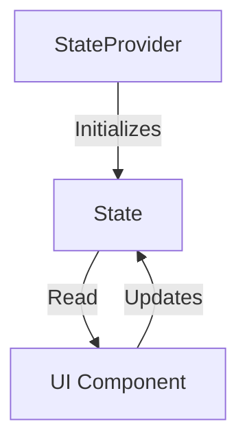
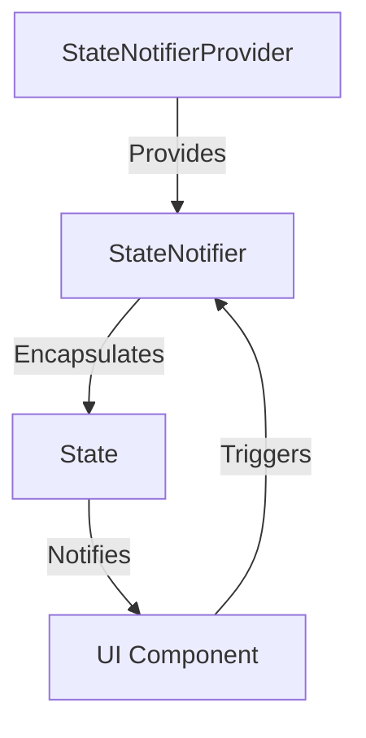

## 4.2.3 StateProvider and StateNotifierProvider

In the realm of Flutter state management, Riverpod stands out as a robust and flexible solution. Among its various providers, `StateProvider` and `StateNotifierProvider` are pivotal for managing state effectively. This section delves into these two providers, illustrating their use through practical examples and code snippets. By the end of this article, you'll have a solid understanding of how to leverage these tools to manage both simple and complex state in your Flutter applications.

### StateProvider: Managing Simple State

`StateProvider` is a straightforward way to manage simple state in your Flutter applications. It is particularly useful when you need to manage a single piece of state, such as a counter or a toggle switch. `StateProvider` provides a simple API to read and write state, making it an excellent choice for scenarios where state changes are frequent and straightforward.

#### Understanding StateProvider

`StateProvider` is a part of the Riverpod package, designed to manage a single piece of state. It is similar to using a `ValueNotifier` in Flutter, but with the added benefits of Riverpod's provider system, such as dependency injection and state scoping.

Here's how `StateProvider` works:

- **State Initialization:** You define a `StateProvider` with an initial value. This value can be of any type, such as an integer, string, or boolean.
- **State Reading:** You can read the current state using the `read` or `watch` methods provided by Riverpod's `ProviderContainer` or `ConsumerWidget`.
- **State Updating:** You can update the state using the `state` property of the provider.

#### Example: Counter App with StateProvider

Let's create a simple counter app using `StateProvider`. This example will demonstrate how to initialize, read, and update state using `StateProvider`.

```dart
import 'package:flutter/material.dart';
import 'package:flutter_riverpod/flutter_riverpod.dart';

// Define a StateProvider for an integer counter
final counterProvider = StateProvider<int>((ref) => 0);

void main() {
  runApp(
    ProviderScope(
      child: MyApp(),
    ),
  );
}

class MyApp extends StatelessWidget {
  @override
  Widget build(BuildContext context) {
    return MaterialApp(
      home: CounterScreen(),
    );
  }
}

class CounterScreen extends ConsumerWidget {
  @override
  Widget build(BuildContext context, WidgetRef ref) {
    // Watch the counterProvider to get the current counter value
    final counter = ref.watch(counterProvider);

    return Scaffold(
      appBar: AppBar(
        title: Text('Counter App with StateProvider'),
      ),
      body: Center(
        child: Column(
          mainAxisAlignment: MainAxisAlignment.center,
          children: <Widget>[
            Text(
              'Current Counter Value:',
            ),
            Text(
              '$counter',
              style: Theme.of(context).textTheme.headline4,
            ),
          ],
        ),
      ),
      floatingActionButton: FloatingActionButton(
        onPressed: () {
          // Increment the counter value
          ref.read(counterProvider.notifier).state++;
        },
        tooltip: 'Increment',
        child: Icon(Icons.add),
      ),
    );
  }
}
```

**Explanation:**

- **Provider Definition:** We define a `StateProvider` named `counterProvider` with an initial value of `0`.
- **ProviderScope:** The `ProviderScope` widget is used to wrap the `MyApp` widget, enabling Riverpod's provider system.
- **ConsumerWidget:** The `CounterScreen` widget extends `ConsumerWidget`, allowing it to watch and react to changes in the `counterProvider`.
- **State Reading and Updating:** The `ref.watch(counterProvider)` method retrieves the current counter value, and `ref.read(counterProvider.notifier).state++` increments the counter.

### StateNotifierProvider: Managing Complex State

While `StateProvider` is ideal for simple state management, `StateNotifierProvider` is designed for more complex state logic. It allows you to encapsulate state and business logic within a `StateNotifier` class, promoting a clean separation of concerns.

#### Introducing StateNotifier

`StateNotifier` is a class that manages state and exposes methods to modify it. It is similar to `ChangeNotifier` but with a focus on immutability and a more functional approach to state updates.

Key features of `StateNotifier` include:

- **Encapsulation:** State and logic are encapsulated within a single class, making it easier to manage and test.
- **Immutability:** Encourages immutable state updates, reducing the risk of unintended side effects.
- **Reactivity:** Automatically notifies listeners when the state changes, allowing the UI to react accordingly.

#### Implementing a StateNotifier Class

To use `StateNotifier`, you need to create a class that extends `StateNotifier` and define methods to update the state. Let's implement a simple counter using `StateNotifier`.

```dart
import 'package:flutter/material.dart';
import 'package:flutter_riverpod/flutter_riverpod.dart';

// Define a StateNotifier class for managing counter state
class CounterNotifier extends StateNotifier<int> {
  CounterNotifier() : super(0); // Initial state is 0

  // Method to increment the counter
  void increment() {
    state++;
  }

  // Method to decrement the counter
  void decrement() {
    state--;
  }
}

// Define a StateNotifierProvider for CounterNotifier
final counterNotifierProvider = StateNotifierProvider<CounterNotifier, int>((ref) {
  return CounterNotifier();
});

void main() {
  runApp(
    ProviderScope(
      child: MyApp(),
    ),
  );
}

class MyApp extends StatelessWidget {
  @override
  Widget build(BuildContext context) {
    return MaterialApp(
      home: CounterScreen(),
    );
  }
}

class CounterScreen extends ConsumerWidget {
  @override
  Widget build(BuildContext context, WidgetRef ref) {
    // Watch the counterNotifierProvider to get the current counter value
    final counter = ref.watch(counterNotifierProvider);

    return Scaffold(
      appBar: AppBar(
        title: Text('Counter App with StateNotifierProvider'),
      ),
      body: Center(
        child: Column(
          mainAxisAlignment: MainAxisAlignment.center,
          children: <Widget>[
            Text(
              'Current Counter Value:',
            ),
            Text(
              '$counter',
              style: Theme.of(context).textTheme.headline4,
            ),
          ],
        ),
      ),
      floatingActionButton: Column(
        mainAxisAlignment: MainAxisAlignment.end,
        children: [
          FloatingActionButton(
            onPressed: () {
              // Increment the counter value
              ref.read(counterNotifierProvider.notifier).increment();
            },
            tooltip: 'Increment',
            child: Icon(Icons.add),
          ),
          SizedBox(height: 10),
          FloatingActionButton(
            onPressed: () {
              // Decrement the counter value
              ref.read(counterNotifierProvider.notifier).decrement();
            },
            tooltip: 'Decrement',
            child: Icon(Icons.remove),
          ),
        ],
      ),
    );
  }
}
```

**Explanation:**

- **StateNotifier Class:** We define a `CounterNotifier` class that extends `StateNotifier<int>`. It manages an integer state and provides methods to increment and decrement the counter.
- **StateNotifierProvider:** We create a `StateNotifierProvider` named `counterNotifierProvider`, which provides an instance of `CounterNotifier`.
- **State Management:** The `CounterScreen` widget watches the `counterNotifierProvider` to display the current counter value. It also uses the `increment` and `decrement` methods to update the state.

### Best Practices and Common Pitfalls

When using `StateProvider` and `StateNotifierProvider`, consider the following best practices:

- **Use StateProvider for Simple State:** Opt for `StateProvider` when managing simple, single-value state. It is lightweight and easy to use.
- **Leverage StateNotifier for Complex Logic:** Use `StateNotifier` when your state management involves complex logic or multiple state transitions.
- **Encapsulate Logic:** Keep state and business logic encapsulated within `StateNotifier` classes to promote maintainability and testability.
- **Avoid Direct State Mutation:** Always use the provided methods to update state, ensuring that changes are tracked and propagated correctly.

### Real-World Scenarios

Consider a shopping cart application where you need to manage the list of items in the cart. `StateNotifierProvider` can be used to encapsulate the cart logic, allowing you to add, remove, and update items efficiently.

```dart
class CartItem {
  final String id;
  final String name;
  final double price;

  CartItem({required this.id, required this.name, required this.price});
}

class CartNotifier extends StateNotifier<List<CartItem>> {
  CartNotifier() : super([]);

  void addItem(CartItem item) {
    state = [...state, item];
  }

  void removeItem(String id) {
    state = state.where((item) => item.id != id).toList();
  }

  void clearCart() {
    state = [];
  }
}

final cartProvider = StateNotifierProvider<CartNotifier, List<CartItem>>((ref) {
  return CartNotifier();
});
```

**Explanation:**

- **CartItem Class:** Represents an item in the cart with an ID, name, and price.
- **CartNotifier Class:** Manages a list of `CartItem` objects, providing methods to add, remove, and clear items.
- **StateNotifierProvider:** Provides an instance of `CartNotifier` to manage the cart state.

### Diagrams and Visualizations

To better understand the flow of state management using `StateProvider` and `StateNotifierProvider`, consider the following diagrams:

#### State Flow with StateProvider



#### State Flow with StateNotifierProvider



### Conclusion

`StateProvider` and `StateNotifierProvider` are powerful tools in the Riverpod ecosystem, each serving distinct purposes in state management. By understanding their differences and applications, you can effectively manage both simple and complex state in your Flutter applications. Remember to encapsulate logic within `StateNotifier` classes and leverage the simplicity of `StateProvider` for straightforward state needs.

### Further Reading

For more information on Riverpod and state management in Flutter, consider the following resources:

- [Riverpod Documentation](https://pub.dev/documentation/riverpod/latest/)
- [Flutter State Management](https://flutter.dev/docs/development/data-and-backend/state-mgmt/intro)
- [Effective Dart: Style](https://dart.dev/guides/language/effective-dart/style)

## Quiz Time!



### What is the primary use of StateProvider in Riverpod?

- [x] Managing simple state
- [ ] Managing complex state logic
- [ ] Handling asynchronous operations
- [ ] Dependency injection

> **Explanation:** StateProvider is designed for managing simple, single-value state efficiently.

### How do you update the state in a StateProvider?

- [x] Using the state property of the provider
- [ ] Directly modifying the state variable
- [ ] Using setState method
- [ ] Through a callback function

> **Explanation:** The state property of the provider is used to update the state in a StateProvider.

### What is the advantage of using StateNotifier over StateProvider?

- [x] Encapsulation of complex state logic
- [ ] Simplicity in managing single-value state
- [ ] Direct state mutation
- [ ] Automatic UI updates without listeners

> **Explanation:** StateNotifier allows encapsulation of complex state logic, promoting a clean separation of concerns.

### Which method in StateNotifierProvider is used to provide an instance of StateNotifier?

- [x] StateNotifierProvider constructor
- [ ] StateProvider constructor
- [ ] ChangeNotifierProvider constructor
- [ ] FutureProvider constructor

> **Explanation:** The StateNotifierProvider constructor is used to provide an instance of StateNotifier.

### What is a common use case for StateNotifierProvider?

- [x] Managing a list of items with complex logic
- [ ] Toggling a boolean value
- [ ] Updating a single integer value
- [ ] Handling network requests

> **Explanation:** StateNotifierProvider is ideal for managing lists or collections with complex state logic.

### How does StateNotifier promote immutability?

- [x] By encouraging immutable state updates
- [ ] By allowing direct state mutation
- [ ] By using mutable state variables
- [ ] By preventing state changes

> **Explanation:** StateNotifier encourages immutable state updates, reducing unintended side effects.

### In a shopping cart app, which provider would you use to manage the cart items?

- [x] StateNotifierProvider
- [ ] StateProvider
- [ ] FutureProvider
- [ ] StreamProvider

> **Explanation:** StateNotifierProvider is suitable for managing complex state like a list of cart items.

### What is the role of the StateNotifier class?

- [x] To encapsulate state and business logic
- [ ] To directly update UI components
- [ ] To manage asynchronous operations
- [ ] To provide dependency injection

> **Explanation:** StateNotifier encapsulates state and business logic, promoting maintainability.

### Can StateProvider be used for managing a list of items?

- [ ] Yes, it is ideal for managing lists
- [x] No, it is better suited for single-value state
- [ ] Yes, but only with additional configuration
- [ ] No, it cannot manage any state

> **Explanation:** StateProvider is better suited for managing single-value state, not lists.

### True or False: StateNotifierProvider automatically notifies listeners when the state changes.

- [x] True
- [ ] False

> **Explanation:** StateNotifierProvider automatically notifies listeners when the state changes, allowing the UI to react accordingly.


