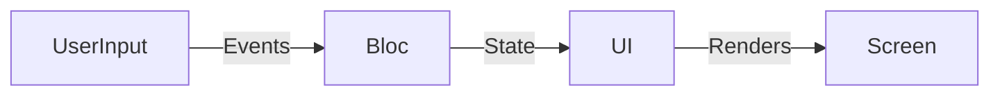

## 5.1.1 The Origins of Bloc

The Bloc pattern, standing for Business Logic Component, has become a cornerstone in the Flutter ecosystem for managing state in a structured and predictable manner. Introduced by Google at the 2018 DartConf, Bloc was designed to address the challenges of separating presentation from business logic, a common hurdle in app development. This section delves into the origins of Bloc, the problems it solves, its core principles, and its significance in the Flutter ecosystem.

### Background of Bloc

Bloc, or Business Logic Component, was introduced to the Flutter community as a way to streamline the development process by clearly delineating the responsibilities of different parts of an application. At the 2018 DartConf, Google presented Bloc as a solution to the pervasive issue of tightly coupled UI and business logic, which often leads to code that is difficult to maintain and extend.

The Bloc pattern emerged from the need to create applications that are both reactive and maintainable. By enforcing a clear separation between the UI and the business logic, Bloc allows developers to focus on building robust, scalable applications without the overhead of managing complex state transitions directly within the UI layer.

### Problem it Solves

In traditional app development, it's common to encounter tightly coupled UI and business logic. This coupling can lead to several issues:

- **Complexity in Maintenance:** As applications grow, maintaining code where UI and business logic are intertwined becomes increasingly difficult.
- **Testing Challenges:** Testing components that have mixed responsibilities is cumbersome and often requires extensive mocking.
- **Lack of Reusability:** Code that mixes UI and business logic is less reusable across different parts of an application or in different projects.

Bloc addresses these issues by promoting a reactive and predictable architecture. It achieves this by:

- **Decoupling UI and Business Logic:** Bloc separates the responsibilities, allowing each part of the application to evolve independently.
- **Facilitating Testing:** With clear boundaries, testing becomes more straightforward, as each component can be tested in isolation.
- **Enhancing Reusability:** Business logic encapsulated within Bloc components can be reused across different applications or modules.

### Core Principles

The Bloc pattern is built on several core principles that guide its implementation and usage:

- **Separation of Concerns:** Bloc enforces a strict separation between the UI and business logic, ensuring that each layer of the application is responsible for a specific set of tasks.
- **Unidirectional Data Flow:** Data flows in a single direction, from the UI to the Bloc as events, and from the Bloc to the UI as states. This flow makes the application predictable and easier to debug.
- **Reactive Programming:** Bloc leverages reactive programming principles, allowing the UI to react to changes in the state emitted by the Bloc.

### Role in Flutter Ecosystem

Bloc has carved out a significant role within the Flutter ecosystem as a preferred state management solution for many developers. Its strong community support and widespread adoption in production applications underscore its effectiveness and reliability. Bloc's alignment with Flutter's reactive nature makes it a natural fit for developers looking to build scalable and maintainable applications.

Bloc is particularly beneficial in scenarios where applications have complex business logic or require a high degree of maintainability and testability. Its structured approach to state management makes it an excellent choice for large applications with intricate state transitions.

### Use Cases

Bloc shines in several use cases, particularly in large applications with complex business logic. Some scenarios where Bloc is particularly beneficial include:

- **Enterprise Applications:** Where maintainability and scalability are critical.
- **Applications with Complex State Transitions:** Such as those requiring intricate user interactions or data processing.
- **Multi-Platform Applications:** Where shared business logic is essential across different platforms.

### High-Level Bloc Architecture

To better understand the Bloc pattern, let's examine a high-level diagram illustrating its architecture:



In this architecture:

- **UserInput** represents the events triggered by user interactions.
- **Bloc** processes these events and updates the state accordingly.
- **UI** listens to state changes and updates the screen to reflect the current state.

### Key Takeaways

Understanding the origins and motivations behind the Bloc pattern is crucial for appreciating its benefits. By separating business logic from UI, Bloc promotes a clean, maintainable, and testable architecture. Its alignment with reactive programming principles and unidirectional data flow makes it a powerful tool in the Flutter developer's toolkit.

Bloc's strong community support and widespread adoption in production applications highlight its effectiveness as a state management solution. As you continue to explore state management in Flutter, consider how Bloc's principles can be applied to your projects to enhance maintainability and scalability.

### Practical Code Example

To illustrate the Bloc pattern in action, let's consider a simple counter application. This example demonstrates how Bloc separates the business logic from the UI.

#### Step 1: Define Events and States

First, define the events and states for the counter application.

```dart
// counter_event.dart
abstract class CounterEvent {}

class Increment extends CounterEvent {}

class Decrement extends CounterEvent {}

// counter_state.dart
class CounterState {
  final int counterValue;

  CounterState(this.counterValue);
}
```

#### Step 2: Implement the Bloc

Next, implement the Bloc that handles the business logic.

```dart
// counter_bloc.dart
import 'package:flutter_bloc/flutter_bloc.dart';
import 'counter_event.dart';
import 'counter_state.dart';

class CounterBloc extends Bloc<CounterEvent, CounterState> {
  CounterBloc() : super(CounterState(0));

  @override
  Stream<CounterState> mapEventToState(CounterEvent event) async* {
    if (event is Increment) {
      yield CounterState(state.counterValue + 1);
    } else if (event is Decrement) {
      yield CounterState(state.counterValue - 1);
    }
  }
}
```

#### Step 3: Integrate with UI

Finally, integrate the Bloc with the UI using `BlocProvider` and `BlocBuilder`.

```dart
// main.dart
import 'package:flutter/material.dart';
import 'package:flutter_bloc/flutter_bloc.dart';
import 'counter_bloc.dart';
import 'counter_event.dart';
import 'counter_state.dart';

void main() {
  runApp(MyApp());
}

class MyApp extends StatelessWidget {
  @override
  Widget build(BuildContext context) {
    return MaterialApp(
      home: BlocProvider(
        create: (context) => CounterBloc(),
        child: CounterScreen(),
      ),
    );
  }
}

class CounterScreen extends StatelessWidget {
  @override
  Widget build(BuildContext context) {
    final CounterBloc counterBloc = BlocProvider.of<CounterBloc>(context);

    return Scaffold(
      appBar: AppBar(title: Text('Counter')),
      body: BlocBuilder<CounterBloc, CounterState>(
        builder: (context, state) {
          return Center(
            child: Text('Counter Value: ${state.counterValue}'),
          );
        },
      ),
      floatingActionButton: Column(
        mainAxisAlignment: MainAxisAlignment.end,
        children: <Widget>[
          FloatingActionButton(
            onPressed: () => counterBloc.add(Increment()),
            child: Icon(Icons.add),
          ),
          SizedBox(height: 8),
          FloatingActionButton(
            onPressed: () => counterBloc.add(Decrement()),
            child: Icon(Icons.remove),
          ),
        ],
      ),
    );
  }
}
```

### Encouragement for Further Exploration

As you explore the Bloc pattern, consider how its principles can be applied to your projects. Experiment with different scenarios and extend the examples provided to deepen your understanding. The Bloc pattern offers a robust framework for managing state in Flutter applications, and mastering it can significantly enhance your development skills.

For further exploration, consider the following resources:

- [Bloc Library Documentation](https://bloclibrary.dev/)
- [Flutter Bloc Package on Pub.dev](https://pub.dev/packages/flutter_bloc)
- [Bloc Pattern in Flutter: A Comprehensive Guide](https://medium.com/flutterdevs/bloc-pattern-in-flutter-ecf3f1b9e8b9)

By understanding the origins and motivations behind the Bloc pattern, you can leverage its benefits to build scalable, maintainable, and testable applications. Keep experimenting and exploring to unlock the full potential of Bloc in your Flutter projects.

## Quiz Time!



### What does Bloc stand for in the context of Flutter?

- [x] Business Logic Component
- [ ] Basic Logic Component
- [ ] Binary Logic Component
- [ ] Block Logic Component

> **Explanation:** Bloc stands for Business Logic Component, emphasizing its role in separating business logic from UI components.

### When was the Bloc pattern introduced by Google?

- [x] 2018 DartConf
- [ ] 2019 Flutter Live
- [ ] 2020 Flutter Engage
- [ ] 2021 Google I/O

> **Explanation:** Bloc was introduced at the 2018 DartConf as a solution for separating business logic from UI in Flutter applications.

### What is a primary problem that Bloc aims to solve?

- [x] Tightly coupled UI and business logic
- [ ] Slow application performance
- [ ] Lack of UI components
- [ ] Limited platform support

> **Explanation:** Bloc addresses the issue of tightly coupled UI and business logic by promoting a clear separation of concerns.

### Which of the following is a core principle of the Bloc pattern?

- [x] Unidirectional data flow
- [ ] Bidirectional data flow
- [ ] Circular data flow
- [ ] Random data flow

> **Explanation:** Bloc follows the principle of unidirectional data flow, where data moves in a single direction from events to states.

### How does Bloc facilitate testing in Flutter applications?

- [x] By separating business logic from UI
- [ ] By integrating directly with testing frameworks
- [ ] By reducing the need for tests
- [ ] By automating test generation

> **Explanation:** Bloc facilitates testing by separating business logic from UI, allowing components to be tested in isolation.

### In which scenario is Bloc particularly beneficial?

- [x] Large applications with complex business logic
- [ ] Small applications with simple logic
- [ ] Applications with no state management needs
- [ ] Applications that do not require testing

> **Explanation:** Bloc is beneficial in large applications with complex business logic, where maintainability and scalability are crucial.

### What is the role of events in the Bloc pattern?

- [x] They trigger changes in the Bloc
- [ ] They define the UI layout
- [ ] They store application data
- [ ] They manage network requests

> **Explanation:** Events in the Bloc pattern trigger changes in the Bloc, initiating state transitions.

### What does the Bloc emit in response to events?

- [x] State
- [ ] UI components
- [ ] Network requests
- [ ] Database queries

> **Explanation:** Bloc emits states in response to events, which the UI listens to and renders accordingly.

### How does Bloc enhance reusability in applications?

- [x] By encapsulating business logic in reusable components
- [ ] By providing pre-built UI components
- [ ] By reducing application size
- [ ] By automating code generation

> **Explanation:** Bloc enhances reusability by encapsulating business logic in components that can be reused across different applications or modules.

### True or False: Bloc is not suitable for applications that require reactive programming.

- [ ] True
- [x] False

> **Explanation:** False. Bloc is suitable for applications that require reactive programming, as it leverages reactive principles to manage state changes.


