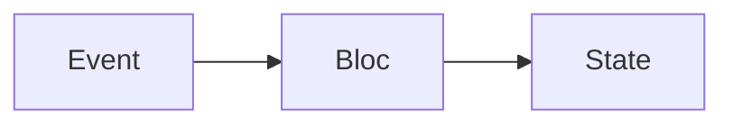

## 5.1.2 Core Concepts: Events and States

State management is a crucial aspect of building robust and scalable applications in Flutter. Among the various state management solutions, the Bloc (Business Logic Component) pattern stands out for its clear separation of concerns and unidirectional data flow. In this section, we will delve into the core concepts of events and states within the Bloc pattern, providing a comprehensive understanding of how they interact to manage application state effectively.

### Events in Bloc

Events are the inputs to a Bloc, representing user actions or external triggers that initiate changes within the application. They are dispatched to the Bloc to signal that something has happened, prompting the Bloc to process the event and produce a new state.

#### Defining Events

Events are typically defined as immutable classes that encapsulate all the necessary information required to handle a specific action. This immutability ensures that events remain consistent throughout their lifecycle, enhancing predictability and reducing potential side effects.

**Examples of Events:**

- **LoadData:** Triggered when the application needs to fetch data from a remote server or local database.
- **SubmitForm:** Dispatched when a user submits a form, carrying the form data as payload.
- **IncrementCounter:** Used to signal that a counter value should be incremented.

```dart
abstract class CounterEvent {}

class IncrementEvent extends CounterEvent {}
```

In the example above, `IncrementEvent` is a simple event class extending the abstract `CounterEvent` class. This structure allows for easy expansion as more event types are added.

### States in Bloc

States are the outputs from a Bloc, representing the current status of the application or a specific feature. The UI listens to these state changes and rebuilds itself accordingly, ensuring that the user interface always reflects the latest application state.

#### Defining States

States are also typically defined as immutable classes. They encapsulate all the information necessary to render the UI for a particular state of the application.

**Examples of States:**

- **LoadingState:** Represents a state where data is being loaded, often used to display loading indicators.
- **LoadedState:** Indicates that data has been successfully loaded and is ready for display.
- **ErrorState:** Used to signify that an error has occurred, often accompanied by an error message.

```dart
abstract class CounterState {
  final int counter;
  CounterState(this.counter);
}

class CounterValue extends CounterState {
  CounterValue(int counter) : super(counter);
}
```

In this example, `CounterValue` is a state class that holds the current value of a counter. By extending `CounterState`, it maintains a consistent structure for all counter-related states.

### Unidirectional Data Flow

The Bloc pattern enforces a unidirectional data flow, which is a key aspect of its architecture. This flow ensures that data moves in a single direction, enhancing the predictability and testability of the application.

**Flow of Data:**

- **Events Flow Into the Bloc:** User actions or external triggers are dispatched as events into the Bloc.
- **Bloc Processes Events:** The Bloc processes these events, applying business logic to determine the appropriate state transition.
- **States Flow Out to the UI:** The Bloc emits new states based on the processed events, which the UI listens to and updates accordingly.



The diagram above illustrates the unidirectional flow of events and states in the Bloc pattern. This clear separation of input (events) and output (states) simplifies debugging and enhances maintainability.

### Code Examples

To further illustrate the concepts of events and states, let's consider a simple counter application using the Bloc pattern.

**Event Class:**

```dart
abstract class CounterEvent {}

class IncrementEvent extends CounterEvent {}
```

**State Class:**

```dart
abstract class CounterState {
  final int counter;
  CounterState(this.counter);
}

class CounterValue extends CounterState {
  CounterValue(int counter) : super(counter);
}
```

In this example, `IncrementEvent` is dispatched to the Bloc whenever the user wants to increment the counter. The Bloc processes this event and emits a new `CounterValue` state with the updated counter value.

### Best Practices

When implementing the Bloc pattern, consider the following best practices to ensure a robust and maintainable codebase:

- **Use Immutable Classes:** Define events and states as immutable classes to maintain consistency and predictability.
- **Clear and Descriptive Naming:** Use clear and descriptive names for events and states to enhance code readability and maintainability.
- **Separation of Concerns:** Keep business logic within the Bloc, separate from the UI and data layers, to promote a clean architecture.

### Key Takeaways

Understanding the roles of events and states is fundamental to effectively using the Bloc pattern in Flutter applications. By adhering to the principles of unidirectional data flow and immutability, developers can create applications that are both predictable and easy to test.

- **Events** are the inputs that trigger changes within the Bloc.
- **States** are the outputs that represent the current status of the application.
- **Unidirectional Data Flow** ensures a clear and predictable flow of data, enhancing testability and maintainability.

By mastering these core concepts, developers can leverage the Bloc pattern to build scalable and maintainable Flutter applications.

## Quiz Time!



### What is the primary role of events in the Bloc pattern?

- [x] To serve as inputs that trigger changes within the Bloc
- [ ] To represent the current state of the application
- [ ] To directly update the UI components
- [ ] To store the application's business logic

> **Explanation:** Events in the Bloc pattern are inputs that trigger changes within the Bloc, initiating state transitions.

### Why are states in the Bloc pattern typically defined as immutable classes?

- [x] To maintain consistency and predictability
- [ ] To allow direct modification by the UI
- [ ] To enable dynamic changes at runtime
- [ ] To reduce memory usage

> **Explanation:** Immutable classes ensure that states remain consistent and predictable, reducing potential side effects.

### What is an example of a state in the Bloc pattern?

- [ ] SubmitForm
- [x] LoadedState
- [ ] IncrementEvent
- [ ] LoadData

> **Explanation:** LoadedState is an example of a state that represents data being successfully loaded.

### How does unidirectional data flow enhance the Bloc pattern?

- [x] By ensuring a clear and predictable flow of data
- [ ] By allowing events and states to be modified interchangeably
- [ ] By enabling direct communication between UI and data layers
- [ ] By reducing the need for testing

> **Explanation:** Unidirectional data flow ensures a clear and predictable flow of data, enhancing testability and maintainability.

### Which of the following is a best practice when using the Bloc pattern?

- [x] Use immutable classes for events and states
- [ ] Store UI logic within the Bloc
- [ ] Allow direct state modification by the UI
- [ ] Use dynamic typing for events and states

> **Explanation:** Using immutable classes for events and states maintains consistency and predictability.

### What does the Bloc emit as a result of processing an event?

- [ ] Another event
- [x] A new state
- [ ] A UI component
- [ ] A data model

> **Explanation:** The Bloc emits a new state as a result of processing an event.

### In the Bloc pattern, what is the relationship between events and states?

- [x] Events are inputs that lead to state changes
- [ ] States are inputs that lead to event changes
- [ ] Events and states are interchangeable
- [ ] States directly trigger events

> **Explanation:** Events are inputs that lead to state changes within the Bloc.

### What is the benefit of using clear and descriptive naming for events and states?

- [x] It enhances code readability and maintainability
- [ ] It allows for dynamic changes at runtime
- [ ] It reduces the need for documentation
- [ ] It enables direct UI updates

> **Explanation:** Clear and descriptive naming enhances code readability and maintainability.

### Which of the following is NOT a typical example of an event in the Bloc pattern?

- [ ] LoadData
- [ ] IncrementCounter
- [x] LoadingState
- [ ] SubmitForm

> **Explanation:** LoadingState is an example of a state, not an event.

### True or False: In the Bloc pattern, the UI directly modifies the state.

- [ ] True
- [x] False

> **Explanation:** False. In the Bloc pattern, the UI listens to state changes but does not directly modify the state.


