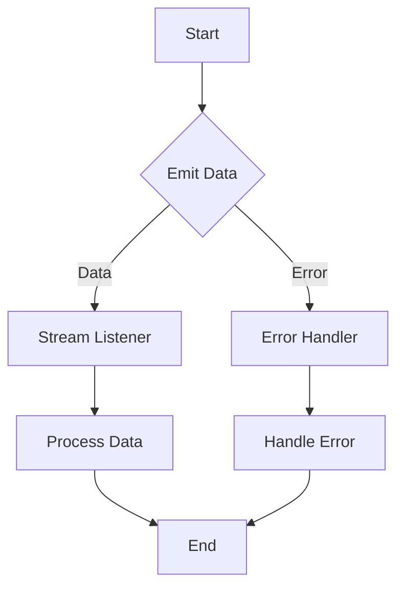

## 5.1.3 Streams in Dart

In the realm of Flutter development, mastering the use of Streams in Dart is crucial for implementing effective state management, particularly when using the Bloc pattern. Streams are a core component of asynchronous programming in Dart, enabling developers to handle sequences of asynchronous data efficiently. This section delves into the intricacies of Streams, their role within the Bloc pattern, and how they can be harnessed to manage state changes in Flutter applications.

### Introduction to Streams

Streams in Dart are akin to a conduit through which a sequence of asynchronous data flows. They are essential for handling data that arrives over time, such as user inputs, network responses, or real-time updates. Streams provide a robust mechanism to process data asynchronously, allowing developers to write non-blocking code that remains responsive to user interactions.

#### Key Characteristics of Streams

- **Asynchronous Data Handling:** Streams allow for processing data that is not immediately available, making them ideal for tasks like fetching data from a server or listening to user inputs.
- **Event-Driven:** Streams can emit multiple events over time, which can be handled individually as they occur.
- **Single or Multiple Subscribers:** Streams can be single-subscription, where only one listener can listen at a time, or broadcast, where multiple listeners can subscribe simultaneously.

### Streams in Bloc

The Bloc pattern in Flutter leverages Streams to manage event and state changes effectively. By utilizing Streams, Bloc separates the business logic from the UI, ensuring a clean architecture that is easy to test and maintain.

#### How Bloc Uses Streams

- **Event Streams (`Stream<Event>`):** In Bloc, events are dispatched into a stream, which the Bloc listens to and processes. Each event represents a user action or an external trigger that requires the Bloc to perform some logic and potentially update the state.
- **State Streams (`Stream<State>`):** After processing an event, the Bloc emits a new state through a state stream. The UI components listen to this stream and rebuild themselves based on the latest state.

This separation of concerns allows for a reactive programming model where the UI reacts to changes in state, driven by events.

### Creating Streams

Creating and listening to Streams in Dart is straightforward. Here's a simple example of a stream that emits a sequence of integers over time:

```dart
Stream<int> numberStream() async* {
  for (int i = 0; i < 5; i++) {
    yield i;
    await Future.delayed(Duration(seconds: 1));
  }
}
```

In this example, `numberStream` is an asynchronous generator function that yields integers from 0 to 4, with a one-second delay between each emission. This demonstrates how Streams can be used to produce data asynchronously.

### Stream Controllers

`StreamController` is a powerful utility in Dart that provides manual control over streams. It allows you to add data, errors, and close the stream programmatically. In the context of Bloc, `StreamController` is often used internally to manage the flow of events and states.

#### Using StreamController

```dart
final StreamController<int> controller = StreamController<int>();

void main() {
  controller.stream.listen((data) {
    print('Received: $data');
  });

  controller.add(1);
  controller.add(2);
  controller.add(3);

  controller.close();
}
```

In this example, a `StreamController` is created to manage a stream of integers. The `listen` method is used to subscribe to the stream, and `add` is used to emit data into the stream.

### Listening to Streams

Subscribing to streams can be done using the `listen` method or by utilizing Flutter's `StreamBuilder` widget, which rebuilds the UI in response to new data.

#### Using `listen`

```dart
numberStream().listen((number) {
  print('Number: $number');
});
```

#### Using `StreamBuilder`

```dart
StreamBuilder<int>(
  stream: numberStream(),
  builder: (context, snapshot) {
    if (snapshot.connectionState == ConnectionState.waiting) {
      return CircularProgressIndicator();
    } else if (snapshot.hasError) {
      return Text('Error: ${snapshot.error}');
    } else {
      return Text('Number: ${snapshot.data}');
    }
  },
);
```

`StreamBuilder` is a powerful widget that listens to a stream and rebuilds its child widget whenever a new event is emitted. It provides a convenient way to integrate streams with the Flutter widget tree.

### Error Handling

Handling errors in streams is crucial for building robust applications. Dart provides mechanisms to catch and handle errors emitted by streams.

#### Error Handling Example

```dart
Stream<int> faultyStream() async* {
  yield 1;
  throw Exception('Something went wrong!');
  yield 2;
}

faultyStream().listen(
  (data) {
    print('Data: $data');
  },
  onError: (error) {
    print('Error: $error');
  },
  onDone: () {
    print('Stream closed');
  },
);
```

In this example, an error is thrown within the stream. The `onError` callback is used to handle the error gracefully, ensuring that the application can recover or inform the user appropriately.

### Mermaid.js Diagrams

To visualize how data flows through streams, we can use Mermaid.js diagrams. Below is a simple flowchart depicting the flow of data through a stream:



This diagram illustrates the lifecycle of a stream, from data emission to processing by listeners, and error handling.

### Key Takeaways

Understanding Streams is fundamental to effectively using the Bloc pattern in Flutter. Streams provide a powerful way to handle asynchronous data, enabling developers to build responsive and scalable applications. By leveraging Streams, Bloc separates business logic from UI components, promoting a clean and maintainable architecture.

- **Streams are essential for asynchronous programming in Dart.**
- **Bloc uses Streams to manage event and state changes efficiently.**
- **StreamController provides manual control over streams, used internally by Bloc.**
- **Error handling in streams is crucial for building robust applications.**

By mastering Streams, you can harness the full potential of the Bloc pattern, creating applications that are both performant and easy to maintain.

## Quiz Time!



### What is the primary purpose of Streams in Dart?

- [x] To handle sequences of asynchronous data
- [ ] To manage synchronous data processing
- [ ] To replace traditional loops
- [ ] To simplify UI design

> **Explanation:** Streams are used to handle sequences of asynchronous data, allowing for non-blocking data processing.

### How does the Bloc pattern utilize Streams?

- [x] By using Streams to manage event and state changes
- [ ] By using Streams to render UI components
- [ ] By using Streams to store data persistently
- [ ] By using Streams to handle user authentication

> **Explanation:** Bloc uses Streams to manage event and state changes, separating business logic from UI components.

### What is the role of `StreamController` in Dart?

- [x] To provide manual control over streams
- [ ] To automatically handle all stream errors
- [ ] To replace the need for Streams
- [ ] To simplify network requests

> **Explanation:** `StreamController` allows for manual control over streams, enabling developers to add data, errors, and close streams programmatically.

### Which widget is used in Flutter to listen to Streams and rebuild the UI?

- [x] StreamBuilder
- [ ] FutureBuilder
- [ ] ListView
- [ ] Container

> **Explanation:** `StreamBuilder` is used to listen to Streams and rebuild its child widget whenever a new event is emitted.

### How can errors be handled in Streams?

- [x] By using the `onError` callback
- [ ] By using try-catch blocks
- [ ] By ignoring them
- [ ] By restarting the stream

> **Explanation:** Errors in Streams can be handled using the `onError` callback, allowing for graceful error management.

### What type of data flow do Streams in Dart support?

- [x] Asynchronous
- [ ] Synchronous
- [ ] Static
- [ ] Linear

> **Explanation:** Streams support asynchronous data flow, which is crucial for non-blocking operations.

### What is a key benefit of using Streams in the Bloc pattern?

- [x] Separation of business logic from UI
- [ ] Faster rendering of UI components
- [ ] Simplified database management
- [ ] Enhanced security features

> **Explanation:** Streams in Bloc help separate business logic from UI, promoting a clean and maintainable architecture.

### Can Streams in Dart have multiple subscribers?

- [x] Yes, if they are broadcast streams
- [ ] No, Streams only support single subscribers
- [ ] Yes, all Streams support multiple subscribers
- [ ] No, Streams are not designed for multiple subscribers

> **Explanation:** Streams can have multiple subscribers if they are broadcast streams.

### What is the purpose of the `yield` keyword in a stream generator function?

- [x] To emit a value from the stream
- [ ] To terminate the stream
- [ ] To handle errors in the stream
- [ ] To pause the stream

> **Explanation:** The `yield` keyword is used to emit a value from the stream in a generator function.

### True or False: Streams in Dart can only handle data, not errors.

- [ ] True
- [x] False

> **Explanation:** Streams in Dart can handle both data and errors, allowing for comprehensive asynchronous data management.


