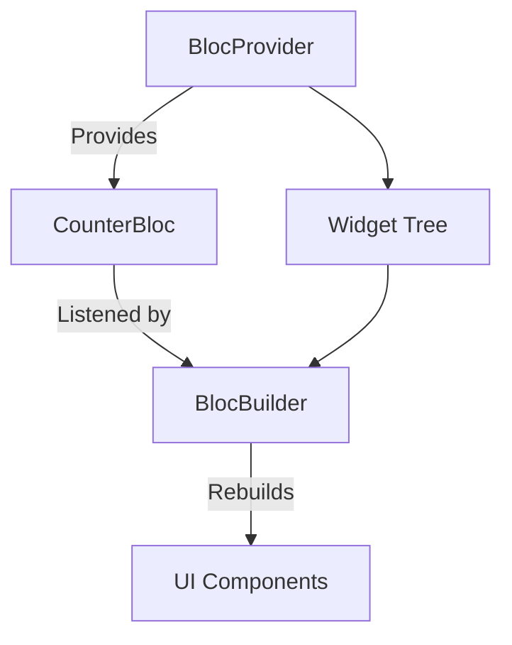

## 5.2.2 BlocProvider and BlocBuilder

State management is a cornerstone of building responsive and interactive applications in Flutter. Among the various patterns available, the Bloc (Business Logic Component) pattern stands out for its ability to separate business logic from UI, promoting a clean and maintainable codebase. In this section, we delve into two essential components of the `flutter_bloc` library: `BlocProvider` and `BlocBuilder`. These widgets are pivotal in managing state transitions and UI updates efficiently.

### Understanding BlocProvider

`BlocProvider` is a Flutter widget that provides a Bloc to its descendants. It is responsible for creating and disposing of the Bloc, ensuring that the lifecycle of the Bloc is managed correctly. This widget is typically used at the top of the widget tree, allowing any descendant widget to access the Bloc instance.

#### Key Features of BlocProvider

- **Bloc Creation and Disposal:** `BlocProvider` handles the instantiation and disposal of the Bloc, ensuring resources are managed efficiently.
- **Contextual Access:** Descendant widgets can access the Bloc using the `context` parameter, promoting a clean and organized architecture.

#### Code Example

Here's a simple example of using `BlocProvider` to provide a `CounterBloc` to a `CounterScreen`:

```dart
import 'package:flutter/material.dart';
import 'package:flutter_bloc/flutter_bloc.dart';
import 'counter_bloc.dart';
import 'counter_screen.dart';

void main() {
  runApp(MyApp());
}

class MyApp extends StatelessWidget {
  @override
  Widget build(BuildContext context) {
    return MaterialApp(
      home: BlocProvider(
        create: (context) => CounterBloc(),
        child: CounterScreen(),
      ),
    );
  }
}
```

In this example, `BlocProvider` is used to create a `CounterBloc` and provide it to the `CounterScreen`. The `create` parameter is a function that returns a new instance of the Bloc. The `context` parameter allows access to the current widget tree, enabling the Bloc to be integrated seamlessly.

### Exploring BlocBuilder

`BlocBuilder` is another crucial widget in the `flutter_bloc` library. It listens to a Bloc and rebuilds the UI in response to new states. This widget is essential for reflecting state changes in the user interface.

#### Key Features of BlocBuilder

- **State Listening:** `BlocBuilder` listens to the Bloc and triggers a rebuild whenever the state changes.
- **Flexible UI Updates:** The `builder` parameter allows developers to define how the UI should look based on the current state.

#### Code Example

Here's how you can use `BlocBuilder` to update the UI based on the state of a `CounterBloc`:

```dart
import 'package:flutter/material.dart';
import 'package:flutter_bloc/flutter_bloc.dart';
import 'counter_bloc.dart';

class CounterScreen extends StatelessWidget {
  @override
  Widget build(BuildContext context) {
    return Scaffold(
      appBar: AppBar(title: Text('Counter')),
      body: Center(
        child: BlocBuilder<CounterBloc, int>(
          builder: (context, count) {
            return Text(
              '$count',
              style: TextStyle(fontSize: 24),
            );
          },
        ),
      ),
      floatingActionButton: FloatingActionButton(
        onPressed: () => context.read<CounterBloc>().add(CounterIncremented()),
        child: Icon(Icons.add),
      ),
    );
  }
}
```

In this example, `BlocBuilder` listens to the `CounterBloc` and rebuilds the `Text` widget whenever the state changes. The `builder` function receives the current state (`count`) and returns the UI that should be displayed.

### BlocProvider vs. Provider

While both `BlocProvider` and `Provider` from the Provider package serve the purpose of state management, they cater to different needs:

- **BlocProvider** is specifically designed for the Bloc pattern, providing a structured way to manage state transitions and business logic.
- **Provider** is a more general-purpose solution that can be used with various state management patterns, including Bloc.

The choice between `BlocProvider` and `Provider` depends on the complexity of your application and the state management pattern you prefer.

### Using Nested Providers

In complex applications, you might need to use multiple `BlocProvider`s to manage different Blocs. This can be achieved by nesting `BlocProvider`s within the widget tree:

```dart
import 'package:flutter/material.dart';
import 'package:flutter_bloc/flutter_bloc.dart';
import 'counter_bloc.dart';
import 'theme_bloc.dart';
import 'counter_screen.dart';

void main() {
  runApp(MyApp());
}

class MyApp extends StatelessWidget {
  @override
  Widget build(BuildContext context) {
    return MaterialApp(
      home: MultiBlocProvider(
        providers: [
          BlocProvider(create: (context) => CounterBloc()),
          BlocProvider(create: (context) => ThemeBloc()),
        ],
        child: CounterScreen(),
      ),
    );
  }
}
```

In this example, `MultiBlocProvider` is used to provide both `CounterBloc` and `ThemeBloc` to the `CounterScreen`. This approach ensures that each Bloc is accessible to the widgets that need it.

### Performance Considerations

Efficient state management is crucial for maintaining app performance. Here are some tips to minimize unnecessary rebuilds with `BlocBuilder`:

- **Granular Rebuilds:** Use `BlocBuilder` at a granular level to rebuild only the parts of the UI that need to change.
- **Avoid Overuse:** Avoid wrapping large widget trees with `BlocBuilder`. Instead, use it for specific widgets that need to respond to state changes.

### Visualizing the Relationship with Mermaid.js

To better understand the relationship between `BlocProvider`, `BlocBuilder`, and the widget tree, consider the following diagram:



This diagram illustrates how `BlocProvider` provides a `CounterBloc` to the widget tree. `BlocBuilder` listens to the `CounterBloc` and rebuilds the UI components when the state changes.

### Conclusion

`BlocProvider` and `BlocBuilder` are powerful tools in the `flutter_bloc` library that facilitate efficient state management in Flutter applications. By understanding their roles and how to use them effectively, you can build responsive and maintainable apps. Remember to consider performance implications and structure your widget tree to minimize unnecessary rebuilds.

For further exploration, consider reading the official [flutter_bloc documentation](https://bloclibrary.dev/#/flutterbloccoreconcepts) and experimenting with different Bloc patterns in your projects.

## Quiz Time!



### What is the primary role of BlocProvider in Flutter?

- [x] To provide a Bloc to its descendants and manage its lifecycle.
- [ ] To rebuild the UI based on state changes.
- [ ] To handle user input and events.
- [ ] To manage network requests.

> **Explanation:** BlocProvider is responsible for providing a Bloc to its descendants and managing its lifecycle, including creation and disposal.

### What parameter is used in BlocProvider to create a new instance of a Bloc?

- [x] `create`
- [ ] `builder`
- [ ] `init`
- [ ] `context`

> **Explanation:** The `create` parameter in BlocProvider is used to create a new instance of a Bloc.

### How does BlocBuilder update the UI?

- [x] By listening to a Bloc and rebuilding the UI when the state changes.
- [ ] By directly modifying the widget tree.
- [ ] By handling user interactions.
- [ ] By managing network requests.

> **Explanation:** BlocBuilder listens to a Bloc and rebuilds the UI when the state changes, ensuring the UI reflects the current state.

### What is the purpose of the builder parameter in BlocBuilder?

- [x] To define how the UI should look based on the current state.
- [ ] To create a new instance of a Bloc.
- [ ] To handle user input.
- [ ] To manage network requests.

> **Explanation:** The builder parameter in BlocBuilder defines how the UI should look based on the current state of the Bloc.

### How can multiple Blocs be provided to a widget tree?

- [x] By using MultiBlocProvider.
- [ ] By nesting multiple BlocBuilder widgets.
- [ ] By using a single BlocProvider.
- [ ] By using a single BlocBuilder.

> **Explanation:** MultiBlocProvider is used to provide multiple Blocs to a widget tree, ensuring each Bloc is accessible to the widgets that need it.

### What is a key difference between BlocProvider and Provider from the Provider package?

- [x] BlocProvider is specifically designed for the Bloc pattern, while Provider is more general-purpose.
- [ ] BlocProvider can only be used for network requests.
- [ ] Provider is specifically designed for the Bloc pattern.
- [ ] BlocProvider and Provider are identical in functionality.

> **Explanation:** BlocProvider is specifically designed for the Bloc pattern, providing a structured way to manage state transitions and business logic, while Provider is a more general-purpose solution.

### What should be avoided to minimize unnecessary rebuilds with BlocBuilder?

- [x] Wrapping large widget trees with BlocBuilder.
- [ ] Using BlocProvider at the top of the widget tree.
- [ ] Listening to multiple Blocs.
- [ ] Using MultiBlocProvider.

> **Explanation:** To minimize unnecessary rebuilds, avoid wrapping large widget trees with BlocBuilder. Instead, use it for specific widgets that need to respond to state changes.

### What does the BlocBuilder widget listen to?

- [x] A Bloc
- [ ] User input
- [ ] Network requests
- [ ] UI components

> **Explanation:** BlocBuilder listens to a Bloc and rebuilds the UI when the state changes.

### What is the role of the context parameter in BlocProvider?

- [x] To provide access to the current widget tree.
- [ ] To define the UI layout.
- [ ] To handle network requests.
- [ ] To manage user input.

> **Explanation:** The context parameter in BlocProvider provides access to the current widget tree, enabling the Bloc to be integrated seamlessly.

### True or False: BlocBuilder can be used to manage network requests directly.

- [ ] True
- [x] False

> **Explanation:** False. BlocBuilder is used to listen to a Bloc and rebuild the UI based on state changes, not to manage network requests directly.


