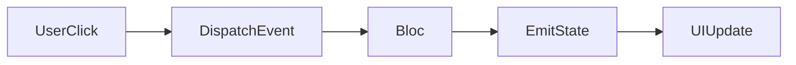

## 5.2.3 Creating a Simple Counter with Bloc

In this section, we will explore how to create a simple counter application using the Bloc pattern in Flutter. The Bloc pattern is a powerful state management solution that helps separate business logic from the UI, making your code more modular and testable. We'll use the `flutter_bloc` package to implement this pattern efficiently.

### Project Setup

To get started, let's create a new Flutter project. Open your terminal and run the following command:

```bash
flutter create bloc_counter_app
```

Navigate into the project directory:

```bash
cd bloc_counter_app
```

Open the project in your preferred IDE, such as Visual Studio Code or Android Studio.

### Defining Events

In the Bloc pattern, events are the inputs to the Bloc. They represent user actions or occurrences in the app that require a response. For our counter app, we'll define two events: increment and decrement.

Create a new file named `counter_event.dart` in the `lib` directory and add the following code:

```dart
abstract class CounterEvent {}

class IncrementEvent extends CounterEvent {}

class DecrementEvent extends CounterEvent {}
```

Here, `CounterEvent` is an abstract class, and `IncrementEvent` and `DecrementEvent` are concrete implementations representing the actions to increase or decrease the counter.

### Defining the Bloc

Next, we'll define the Bloc itself, which will handle the logic for updating the counter based on the events received.

Create a new file named `counter_bloc.dart` in the `lib` directory and add the following code:

```dart
import 'package:flutter_bloc/flutter_bloc.dart';
import 'counter_event.dart';

class CounterBloc extends Bloc<CounterEvent, int> {
  CounterBloc() : super(0) {
    on<IncrementEvent>((event, emit) => emit(state + 1));
    on<DecrementEvent>((event, emit) => emit(state - 1));
  }
}
```

- **Bloc<CounterEvent, int>**: This indicates that `CounterBloc` takes `CounterEvent` as input and outputs an `int` (the counter value).
- **super(0)**: Initializes the Bloc with a state of `0`.
- **on<EventType>**: Registers event handlers. Here, we handle `IncrementEvent` and `DecrementEvent` by updating the state using the `emit` function.

### Building the UI

Now, let's build the UI for our counter app. We'll create a simple interface with two buttons to increment and decrement the counter and a text widget to display the current count.

Open the `lib/main.dart` file and replace its content with the following code:

```dart
import 'package:flutter/material.dart';
import 'package:flutter_bloc/flutter_bloc.dart';
import 'counter_bloc.dart';
import 'counter_event.dart';

void main() {
  runApp(MyApp());
}

class MyApp extends StatelessWidget {
  @override
  Widget build(BuildContext context) {
    return MaterialApp(
      home: BlocProvider(
        create: (context) => CounterBloc(),
        child: CounterPage(),
      ),
    );
  }
}

class CounterPage extends StatelessWidget {
  @override
  Widget build(BuildContext context) {
    return Scaffold(
      appBar: AppBar(title: Text('Bloc Counter')),
      body: Center(
        child: Column(
          mainAxisAlignment: MainAxisAlignment.center,
          children: <Widget>[
            BlocBuilder<CounterBloc, int>(
              builder: (context, count) {
                return Text(
                  '$count',
                  style: TextStyle(fontSize: 24.0),
                );
              },
            ),
            Row(
              mainAxisAlignment: MainAxisAlignment.center,
              children: <Widget>[
                IconButton(
                  icon: Icon(Icons.add),
                  onPressed: () {
                    context.read<CounterBloc>().add(IncrementEvent());
                  },
                ),
                IconButton(
                  icon: Icon(Icons.remove),
                  onPressed: () {
                    context.read<CounterBloc>().add(DecrementEvent());
                  },
                ),
              ],
            ),
          ],
        ),
      ),
    );
  }
}
```

- **BlocProvider**: Provides the `CounterBloc` to the widget tree, making it accessible to all descendant widgets.
- **BlocBuilder**: Rebuilds the UI in response to state changes. It listens to the `CounterBloc` and updates the text widget with the current count.
- **IconButton**: Dispatches `IncrementEvent` and `DecrementEvent` to the `CounterBloc` when pressed.

### Dispatching Events

In the UI code, we use `context.read<CounterBloc>().add(IncrementEvent())` to dispatch events. This triggers the corresponding handler in the Bloc, updating the state and consequently the UI.

### Running the App

To run the app, use the following command in your terminal:

```bash
flutter run
```

This will launch the app on your connected device or emulator. You should see a simple interface with two buttons and a counter display. Pressing the "+" button will increment the counter, while pressing the "-" button will decrement it.

### Visualizing the Flow with Mermaid.js

To better understand the flow of data in our app, let's visualize the process from user interaction to UI update using a Mermaid.js diagram:



- **UserClick**: Represents the user's interaction with the UI (button press).
- **DispatchEvent**: The event (IncrementEvent or DecrementEvent) is dispatched to the Bloc.
- **Bloc**: Processes the event and emits a new state.
- **EmitState**: The new state is emitted.
- **UIUpdate**: The UI updates to reflect the new state.

### Key Takeaways

- **Separation of Concerns**: The Bloc pattern helps separate business logic from the UI, making your code more modular and testable.
- **Event-Driven Architecture**: Events are dispatched in response to user actions, and the Bloc processes these events to update the state.
- **State Management**: The Bloc pattern provides a structured way to manage state changes and UI updates in Flutter applications.

By following these steps, you have successfully implemented a simple counter app using the Bloc pattern in Flutter. This foundational understanding will help you build more complex applications with robust state management.

### Further Exploration

To deepen your understanding of the Bloc pattern and its applications, consider exploring the following resources:

- **Official Bloc Documentation**: [Bloc Library Documentation](https://bloclibrary.dev/)
- **Flutter Bloc Package**: [flutter_bloc on pub.dev](https://pub.dev/packages/flutter_bloc)
- **Bloc Pattern Tutorials**: Search for online tutorials and courses that cover advanced Bloc concepts and real-world applications.

## Quiz Time!



### What is the primary purpose of the Bloc pattern in Flutter?

- [x] To separate business logic from the UI
- [ ] To enhance the visual appearance of the app
- [ ] To manage network requests
- [ ] To optimize app performance

> **Explanation:** The Bloc pattern is designed to separate business logic from the UI, making the code more modular and testable.

### Which class do you extend to create a Bloc in Flutter?

- [x] Bloc
- [ ] Stream
- [ ] State
- [ ] Widget

> **Explanation:** In Flutter, you extend the `Bloc` class to create a Bloc, which manages the state and event handling.

### What is the role of the `emit` function in a Bloc?

- [x] To output new states
- [ ] To dispatch events
- [ ] To build widgets
- [ ] To initialize the Bloc

> **Explanation:** The `emit` function is used within a Bloc to output new states in response to events.

### How do you provide a Bloc to the widget tree in Flutter?

- [x] Using BlocProvider
- [ ] Using InheritedWidget
- [ ] Using setState
- [ ] Using ChangeNotifier

> **Explanation:** `BlocProvider` is used to provide a Bloc to the widget tree, making it accessible to descendant widgets.

### Which widget is used to rebuild the UI in response to state changes in a Bloc?

- [x] BlocBuilder
- [ ] StreamBuilder
- [ ] FutureBuilder
- [ ] StatelessWidget

> **Explanation:** `BlocBuilder` listens to state changes in a Bloc and rebuilds the UI accordingly.

### How do you dispatch an event to a Bloc in Flutter?

- [x] context.read<BlocType>().add(EventType())
- [ ] setState(() => event)
- [ ] BlocProvider.of<BlocType>().dispatch(EventType())
- [ ] event.sendToBloc()

> **Explanation:** You dispatch an event to a Bloc using `context.read<BlocType>().add(EventType())`.

### What is the initial state of the `CounterBloc` in the example?

- [x] 0
- [ ] 1
- [ ] null
- [ ] -1

> **Explanation:** The `CounterBloc` is initialized with a state of `0`.

### What does the `on<EventType>` method do in a Bloc?

- [x] Registers event handlers
- [ ] Emits new states
- [ ] Builds the UI
- [ ] Initializes the Bloc

> **Explanation:** The `on<EventType>` method is used to register handlers for specific events in a Bloc.

### What is the purpose of the `CounterEvent` class in the example?

- [x] To define the types of events that can be dispatched to the Bloc
- [ ] To store the current state of the counter
- [ ] To manage UI updates
- [ ] To handle network requests

> **Explanation:** The `CounterEvent` class defines the types of events that can be dispatched to the Bloc, such as `IncrementEvent` and `DecrementEvent`.

### True or False: The Bloc pattern in Flutter is only suitable for large applications.

- [ ] True
- [x] False

> **Explanation:** False. The Bloc pattern can be used in both small and large applications to manage state effectively.


