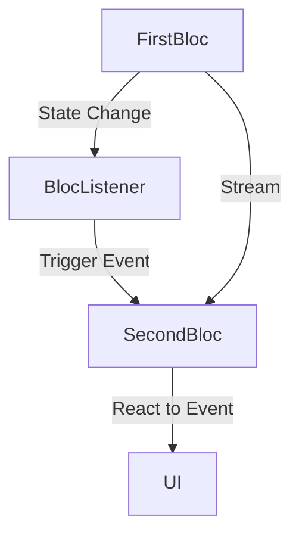

## 5.3.2 Bloc-to-Bloc Communication

In complex Flutter applications, managing state effectively often requires multiple Blocs to communicate with each other. This section delves into advanced techniques for enabling Bloc-to-Bloc communication, ensuring your application remains responsive and maintainable.

### When Blocs Need to Communicate

Blocs are designed to encapsulate business logic and manage state independently. However, there are scenarios where one Bloc needs to react to changes in another Bloc. Understanding these scenarios is crucial for implementing effective communication strategies:

- **Shared State Dependencies:** When two Blocs depend on a shared piece of state, changes in one Bloc may necessitate updates in another.
- **Sequential Operations:** In workflows where one operation must complete before another begins, Blocs may need to signal each other to proceed.
- **Cross-Cutting Concerns:** Features like authentication or logging might require multiple Blocs to coordinate actions.

### Using BlocListener

`BlocListener` is a powerful tool for responding to state changes in one Bloc without rebuilding the UI. It allows you to listen for specific state changes and trigger actions in other Blocs.

#### Code Example

Consider a scenario where `FirstBloc` updates its state, and `SecondBloc` needs to react to this change:

```dart
BlocListener<FirstBloc, FirstState>(
  listener: (context, state) {
    if (state is FirstStateUpdated) {
      context.read<SecondBloc>().add(SecondEventTriggered());
    }
  },
  child: Container(),
)
```

In this example, `BlocListener` listens for the `FirstStateUpdated` state in `FirstBloc`. When this state occurs, it triggers `SecondEventTriggered` in `SecondBloc`, facilitating communication between the two Blocs.

### Using Stream Subscriptions

Another approach to Bloc-to-Bloc communication is using stream subscriptions. This technique involves subscribing to one Bloc's stream within another Bloc, allowing for direct state monitoring and response.

#### Code Example

Inside `SecondBloc`, you can subscribe to `FirstBloc`'s stream:

```dart
late StreamSubscription firstBlocSubscription;

SecondBloc({required FirstBloc firstBloc}) : super(InitialSecondState()) {
  firstBlocSubscription = firstBloc.stream.listen((state) {
    // React to changes in FirstBloc
    if (state is FirstStateUpdated) {
      add(SecondEventTriggered());
    }
  });
}

@override
Future<void> close() {
  firstBlocSubscription.cancel();
  return super.close();
}
```

Here, `SecondBloc` listens to `FirstBloc`'s stream. When `FirstStateUpdated` is emitted, `SecondBloc` triggers `SecondEventTriggered`, ensuring the two Blocs remain in sync.

### Dependency Injection

Effective Bloc-to-Bloc communication often relies on dependency injection. By injecting Blocs into each other, you can facilitate communication while maintaining loose coupling.

- **Constructor Injection:** Pass dependencies directly through constructors.
- **Contextual Access:** Use the `BuildContext` to access other Blocs when necessary.

### Best Practices

While enabling communication between Blocs is essential, it's crucial to adhere to best practices to maintain a clean architecture:

- **Avoid Tight Coupling:** Ensure Blocs remain loosely coupled by relying on events and states rather than direct method calls.
- **Use Events and States:** Communicate changes through events and states to maintain the reactive nature of Blocs.
- **Limit Direct Dependencies:** Use dependency injection to manage dependencies, avoiding direct references between Blocs.

### Visualizing Bloc Communication

To better understand the flow of communication between Blocs, consider the following Mermaid.js diagram:



This diagram illustrates how `FirstBloc` communicates with `SecondBloc` through both `BlocListener` and stream subscriptions, ensuring seamless state management across your application.

### Conclusion

Bloc-to-Bloc communication is a vital aspect of managing complex state interactions in Flutter applications. By leveraging tools like `BlocListener` and stream subscriptions, you can ensure your Blocs communicate effectively while maintaining a clean and maintainable architecture. Remember to adhere to best practices, such as avoiding tight coupling and using events and states for communication, to keep your application scalable and robust.

For further exploration, consider reviewing the official [Bloc documentation](https://bloclibrary.dev) and experimenting with different communication patterns in your projects.

## Quiz Time!



### What is a common scenario where one Bloc needs to communicate with another?

- [x] Shared state dependencies
- [ ] Independent state management
- [ ] UI rendering
- [ ] Database operations

> **Explanation:** Shared state dependencies often require communication between Blocs to ensure consistency.

### How does BlocListener facilitate communication between Blocs?

- [x] By listening to state changes and triggering events in other Blocs
- [ ] By directly modifying the state of other Blocs
- [ ] By rendering UI components
- [ ] By accessing the database

> **Explanation:** BlocListener listens for specific state changes and triggers corresponding events in other Blocs.

### What is a key advantage of using stream subscriptions for Bloc communication?

- [x] Direct monitoring of state changes
- [ ] Reduced code complexity
- [ ] Simplified UI rendering
- [ ] Enhanced security

> **Explanation:** Stream subscriptions allow direct monitoring of state changes, enabling responsive communication.

### Which method is recommended for injecting dependencies between Blocs?

- [x] Constructor injection
- [ ] Global variables
- [ ] Direct method calls
- [ ] Singleton pattern

> **Explanation:** Constructor injection is a clean and maintainable method for managing dependencies between Blocs.

### What should be avoided to maintain a clean architecture in Bloc communication?

- [x] Tight coupling between Blocs
- [ ] Use of events and states
- [ ] Dependency injection
- [ ] Reactive programming

> **Explanation:** Tight coupling should be avoided to ensure Blocs remain independent and maintainable.

### Which tool is used to visualize the communication flow between Blocs?

- [x] Mermaid.js
- [ ] Flutter Inspector
- [ ] Dart Analyzer
- [ ] Firebase Console

> **Explanation:** Mermaid.js is used to create diagrams that visualize communication flows.

### What is the purpose of using events and states in Bloc communication?

- [x] To maintain the reactive nature of Blocs
- [ ] To simplify UI rendering
- [ ] To enhance security
- [ ] To reduce code size

> **Explanation:** Events and states help maintain the reactive nature of Blocs, facilitating communication.

### How can Blocs be accessed contextually in Flutter?

- [x] Using BuildContext
- [ ] Through global variables
- [ ] By direct method calls
- [ ] Using Singleton pattern

> **Explanation:** BuildContext allows access to Blocs contextually within the widget tree.

### What is a potential pitfall of using direct dependencies between Blocs?

- [x] Increased coupling and reduced maintainability
- [ ] Improved performance
- [ ] Simplified code structure
- [ ] Enhanced security

> **Explanation:** Direct dependencies can lead to increased coupling, reducing maintainability.

### True or False: Bloc-to-Bloc communication should always be avoided to maintain independence.

- [ ] True
- [x] False

> **Explanation:** While independence is important, communication is necessary in scenarios with shared state dependencies or sequential operations.


