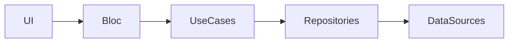

## 5.3.3 Bloc and Clean Architecture

In the world of software development, creating applications that are both scalable and maintainable is a constant challenge. Clean Architecture, introduced by Robert C. Martin (Uncle Bob), provides a framework that emphasizes separation of concerns, making it easier to manage complex applications. When combined with the Bloc pattern in Flutter, developers can achieve a robust architecture that ensures clear boundaries between different parts of the application, enhancing testability and maintainability.

### Overview of Clean Architecture

Clean Architecture is a design philosophy that aims to create systems that are easy to understand, modify, and test. The core principles include:

- **Separation of Concerns:** Each layer of the application has a distinct responsibility, reducing the complexity of individual components.
- **Layer Independence:** Layers are designed to be independent, allowing changes in one layer without affecting others.
- **Dependency Rule:** High-level modules should not depend on low-level modules. Both should depend on abstractions.

The architecture is typically divided into several layers:

- **Presentation Layer:** Handles the UI and user interactions.
- **Domain Layer:** Contains the business logic, including use cases and entities.
- **Data Layer:** Manages data access, including repositories and data sources.

### Bloc in the Presentation Layer

Bloc (Business Logic Component) is a state management pattern that fits naturally into the presentation layer of Clean Architecture. It separates the UI logic from the business logic, allowing for a clear distinction between how data is processed and how it is presented.

- **UI Logic Handling:** Bloc manages the state of the UI, responding to user inputs and updating the UI accordingly.
- **Event-Driven Architecture:** The Bloc pattern uses events to trigger state changes, ensuring that the UI remains reactive and responsive.

#### Example of Bloc in the Presentation Layer

```dart
class MyBloc extends Bloc<MyEvent, MyState> {
  final GetItemsUseCase getItems;

  MyBloc({required this.getItems}) : super(InitialMyState()) {
    on<FetchItemsEvent>((event, emit) async {
      emit(LoadingState());
      final items = await getItems();
      emit(ItemsLoadedState(items));
    });
  }
}
```

### Use Cases and Entities in the Domain Layer

The domain layer is the heart of the application, containing the business logic that defines how data can be manipulated and accessed. It consists of:

- **Entities:** Represent the core data structures of the application.
- **Use Cases:** Define the operations that can be performed on the entities.

#### Structuring the Domain Layer

- **Entities:** Define the data model, focusing on the attributes and behaviors that are essential to the application's business logic.
- **Use Cases:** Implement the business rules, interacting with repositories to fetch or persist data.

```dart
class GetItemsUseCase {
  final ItemRepository repository;

  GetItemsUseCase(this.repository);

  Future<List<Item>> call() {
    return repository.getItems();
  }
}
```

### Dependency Injection

Dependency Injection (DI) is a technique used to manage dependencies between objects, promoting loose coupling and enhancing testability. In Flutter, the `get_it` package is a popular choice for implementing DI.

- **Service Locator Pattern:** `get_it` acts as a service locator, providing a centralized place to manage dependencies.

#### Setting Up Dependency Injection

```dart
final getIt = GetIt.instance;

void setup() {
  getIt.registerLazySingleton<ItemRepository>(() => ItemRepositoryImpl());
  getIt.registerFactory(() => GetItemsUseCase(getIt<ItemRepository>()));
  getIt.registerFactory(() => MyBloc(getItems: getIt<GetItemsUseCase>()));
}
```

### Project Structure

A well-organized project structure is crucial for maintaining clean architecture. Here is a sample directory structure for a Flutter project using Bloc and Clean Architecture:

```
lib/
├── data/
│   └── repositories/
├── domain/
│   ├── entities/
│   └── usecases/
└── presentation/
    ├── blocs/
    └── screens/
```

### Flow Between Layers

To visualize the interaction between different layers, consider the following Mermaid.js diagram:



### Code Examples: Injecting Use Cases into Blocs

Injecting use cases into Blocs ensures that the business logic is decoupled from the UI logic, promoting a clean separation of concerns.

```dart
class MyBloc extends Bloc<MyEvent, MyState> {
  final GetItemsUseCase getItems;

  MyBloc({required this.getItems}) : super(InitialMyState()) {
    on<FetchItemsEvent>((event, emit) async {
      emit(LoadingState());
      final items = await getItems();
      emit(ItemsLoadedState(items));
    });
  }
}
```

### Benefits of Combining Bloc with Clean Architecture

- **Testability:** Each layer can be tested independently, ensuring that changes in one part of the application do not affect others.
- **Maintainability:** Clear separation of concerns makes it easier to understand and modify the codebase.
- **Scalability:** The architecture can easily accommodate new features and requirements.

### Best Practices

- **Adhere to SOLID Principles:** Ensure that each class has a single responsibility and that dependencies are injected rather than hardcoded.
- **Keep Layers Independent:** Use interfaces to define interactions between layers, ensuring that each layer only communicates through well-defined contracts.
- **Use Dependency Injection:** Manage dependencies effectively to promote loose coupling and enhance testability.

### Conclusion

Integrating Bloc with Clean Architecture in Flutter applications provides a powerful combination that enhances both the structure and functionality of your codebase. By adhering to the principles of separation of concerns and layer independence, developers can create applications that are not only robust and scalable but also easy to maintain and test.

### Further Reading and Resources

- [Bloc Library Documentation](https://bloclibrary.dev/)
- [Clean Architecture: A Craftsman's Guide to Software Structure and Design](https://www.amazon.com/Clean-Architecture-Craftsmans-Software-Structure/dp/0134494164)
- [Flutter Dependency Injection with get_it](https://pub.dev/packages/get_it)

## Quiz Time!



### What is the primary goal of Clean Architecture?

- [x] Separation of concerns and layer independence
- [ ] Maximizing code reuse
- [ ] Minimizing the number of classes
- [ ] Reducing the number of dependencies

> **Explanation:** Clean Architecture emphasizes separation of concerns and layer independence to create systems that are easy to understand, modify, and test.

### In Clean Architecture, where does the Bloc pattern fit?

- [x] Presentation Layer
- [ ] Domain Layer
- [ ] Data Layer
- [ ] Infrastructure Layer

> **Explanation:** Bloc fits into the Presentation Layer, handling UI logic and state management.

### What is the role of use cases in the domain layer?

- [x] Define operations that can be performed on entities
- [ ] Manage UI components
- [ ] Handle data storage
- [ ] Provide network connectivity

> **Explanation:** Use cases in the domain layer define the operations that can be performed on entities, encapsulating business logic.

### Which package is commonly used for dependency injection in Flutter?

- [x] get_it
- [ ] provider
- [ ] redux
- [ ] riverpod

> **Explanation:** The `get_it` package is commonly used for dependency injection in Flutter, acting as a service locator.

### What is the benefit of using dependency injection?

- [x] Promotes loose coupling and enhances testability
- [ ] Increases code complexity
- [ ] Reduces the number of classes
- [ ] Simplifies UI design

> **Explanation:** Dependency injection promotes loose coupling and enhances testability by managing dependencies between objects.

### How should layers communicate in Clean Architecture?

- [x] Through defined interfaces
- [ ] Directly accessing each other's methods
- [ ] Using global variables
- [ ] Through shared state

> **Explanation:** Layers should communicate through defined interfaces to maintain independence and separation of concerns.

### What is the primary advantage of using Bloc with Clean Architecture?

- [x] Enhanced testability and maintainability
- [ ] Faster UI rendering
- [ ] Reduced code size
- [ ] Simplified state management

> **Explanation:** Using Bloc with Clean Architecture enhances testability and maintainability by separating UI logic from business logic.

### What principle should be followed to ensure each class has a single responsibility?

- [x] SOLID Principles
- [ ] DRY Principle
- [ ] KISS Principle
- [ ] YAGNI Principle

> **Explanation:** The SOLID Principles, particularly the Single Responsibility Principle, ensure that each class has a single responsibility.

### Which layer in Clean Architecture contains the business logic?

- [x] Domain Layer
- [ ] Presentation Layer
- [ ] Data Layer
- [ ] Infrastructure Layer

> **Explanation:** The Domain Layer contains the business logic, including use cases and entities.

### True or False: Clean Architecture allows changes in one layer without affecting others.

- [x] True
- [ ] False

> **Explanation:** Clean Architecture promotes layer independence, allowing changes in one layer without affecting others.


