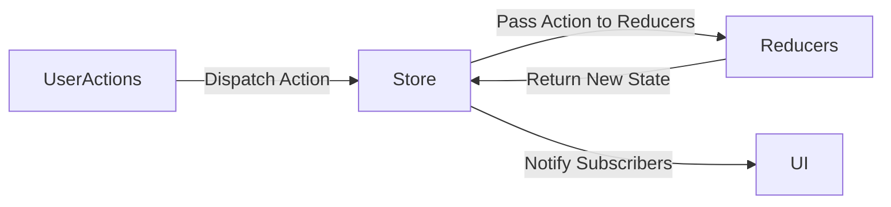

## 6.1.1 The Principles of Redux

State management is a crucial aspect of developing robust and scalable applications. Among the various state management solutions available, Redux stands out as a predictable state container, originally designed for JavaScript applications and now adapted for Dart and Flutter. This section delves into the core principles of Redux, its benefits, and how it can be effectively utilized in Flutter applications.

### Understanding Redux

Redux is a library that provides a structured approach to managing application state. It was inspired by the Flux architecture and popularized by Dan Abramov. Redux is known for its simplicity and predictability, making it a popular choice for developers who need to manage complex state in their applications.

#### Origin and Adaptation

Redux was initially developed for JavaScript applications, particularly those using React. Its principles, however, are universal and have been adapted for various platforms, including Flutter. The core idea behind Redux is to manage the state of an application in a predictable way, ensuring that the state changes are consistent and easy to track.

### Core Principles of Redux

Understanding the core principles of Redux is essential for effectively implementing it in your Flutter applications. These principles provide the foundation for Redux's predictable state management.

#### Single Source of Truth

The entire state of the application is stored in a single object tree within a single store. This concept is known as the "single source of truth." By maintaining a single store, Redux simplifies state management and debugging. All components of the application access the state from this central location, ensuring consistency across the application.

- **Benefits:**
  - Simplifies state management by centralizing the state.
  - Makes debugging easier as the entire state is stored in one place.
  - Facilitates state persistence and synchronization.

#### State is Read-only

In Redux, the state is read-only. The only way to change the state is by emitting an action, which is an object that describes what happened. This approach ensures that state mutations are predictable and traceable.

- **Benefits:**
  - Ensures that state changes are intentional and explicit.
  - Makes it easier to track state changes over time.
  - Supports time-travel debugging by allowing you to replay actions.

#### Changes are Made with Pure Functions

To specify how the state tree is transformed by actions, you write pure reducers. A reducer is a pure function that takes the previous state and an action, and returns the next state. Pure functions are side-effect-free, meaning they do not modify the state directly but return a new state object.

- **Benefits:**
  - Ensures that state transformations are predictable and consistent.
  - Facilitates testing and debugging by isolating state changes.
  - Encourages a functional programming approach, promoting code clarity.

### Benefits of Using Redux

Redux offers several benefits that make it an attractive choice for state management in Flutter applications:

- **Predictability:** The strict unidirectional data flow in Redux ensures that state changes are predictable and easy to trace.
- **Debugging and Testing:** Redux's transparent nature makes it easier to debug and test applications. The state is centralized, and actions are explicit, making it easier to identify issues.
- **State Persistence and Synchronization:** Redux facilitates state persistence, allowing you to save and restore the state across sessions. It also supports state synchronization between different environments, such as server and client.
- **Time-travel Debugging:** Redux's architecture supports time-travel debugging, enabling you to replay actions and inspect state changes over time.

### Redux Terminology

To effectively use Redux, it's important to understand its key concepts:

- **Store:** The store holds the application state. It provides methods to access the state (`getState()`), dispatch actions (`dispatch(action)`), and register listeners (`subscribe(listener)`).
- **Action:** An action is a plain Dart object that represents an intention to change the state. It usually contains a `type` field that describes the action.
- **Reducer:** A reducer is a pure function that takes the previous state and an action, and returns the next state. Reducers specify how the state changes in response to actions.

### Visualizing the Redux Data Flow

The following Mermaid.js diagram illustrates the data flow in a Redux application:



- **User Actions:** Users interact with the application, triggering actions.
- **Store:** The store receives actions and passes them to reducers.
- **Reducers:** Reducers process the actions and return a new state.
- **UI:** The store notifies subscribers (UI components) of state changes, updating the UI.

### Key Takeaways

Understanding Redux's core principles is crucial for effectively implementing it in Flutter applications. By adhering to the principles of a single source of truth, read-only state, and pure functions, Redux provides a predictable and scalable state management solution.

- **Single Source of Truth:** Centralizes state management, simplifying debugging and ensuring consistency.
- **Read-only State:** Ensures intentional and traceable state changes.
- **Pure Functions:** Promotes predictable and testable state transformations.

By leveraging these principles, developers can manage complex state in their applications more effectively. Redux's benefits, such as predictability, debugging ease, and state persistence, make it a valuable tool for Flutter developers.

### Practical Example: Implementing Redux in a Flutter Application

To illustrate the principles of Redux in action, let's consider a simple Flutter application that uses Redux to manage a counter's state.

#### Step 1: Setting Up Redux

First, add the necessary dependencies to your `pubspec.yaml` file:

```yaml
dependencies:
  flutter:
    sdk: flutter
  redux: ^5.0.0
  flutter_redux: ^0.8.0
```

#### Step 2: Defining Actions

Define the actions that will be used to modify the state. In this case, we'll define an action to increment the counter:

```dart
class IncrementAction {}
```

#### Step 3: Creating a Reducer

Create a reducer that specifies how the state changes in response to actions. The reducer takes the current state and an action, and returns the new state:

```dart
int counterReducer(int state, dynamic action) {
  if (action is IncrementAction) {
    return state + 1;
  }
  return state;
}
```

#### Step 4: Setting Up the Store

Create a store that holds the application's state. The store is initialized with the reducer and the initial state:

```dart
final store = Store<int>(counterReducer, initialState: 0);
```

#### Step 5: Connecting Redux to the UI

Use the `StoreProvider` and `StoreConnector` widgets from the `flutter_redux` package to connect the Redux store to the Flutter UI:

```dart
import 'package:flutter/material.dart';
import 'package:flutter_redux/flutter_redux.dart';

void main() {
  runApp(MyApp());
}

class MyApp extends StatelessWidget {
  @override
  Widget build(BuildContext context) {
    return StoreProvider<int>(
      store: store,
      child: MaterialApp(
        home: CounterPage(),
      ),
    );
  }
}

class CounterPage extends StatelessWidget {
  @override
  Widget build(BuildContext context) {
    return Scaffold(
      appBar: AppBar(
        title: Text('Redux Counter'),
      ),
      body: Center(
        child: StoreConnector<int, String>(
          converter: (store) => store.state.toString(),
          builder: (context, counter) {
            return Text(
              'Counter: $counter',
              style: TextStyle(fontSize: 24.0),
            );
          },
        ),
      ),
      floatingActionButton: StoreConnector<int, VoidCallback>(
        converter: (store) {
          return () => store.dispatch(IncrementAction());
        },
        builder: (context, callback) {
          return FloatingActionButton(
            onPressed: callback,
            child: Icon(Icons.add),
          );
        },
      ),
    );
  }
}
```

### Conclusion

Redux provides a structured and predictable approach to state management in Flutter applications. By adhering to its core principles, developers can manage complex state more effectively, ensuring consistency and ease of debugging. The benefits of Redux, such as predictability, debugging ease, and state persistence, make it a valuable tool for Flutter developers.

### Further Reading and Resources

- **Official Redux Documentation:** [Redux](https://redux.js.org/)
- **Flutter Redux Package:** [flutter_redux](https://pub.dev/packages/flutter_redux)
- **Dan Abramov's Redux Tutorials:** [Getting Started with Redux](https://egghead.io/courses/getting-started-with-redux)

By exploring these resources, you can deepen your understanding of Redux and its application in Flutter projects.

## Quiz Time!



### What is Redux primarily used for in Flutter applications?

- [x] Managing application state predictably
- [ ] Handling network requests
- [ ] Styling UI components
- [ ] Managing animations

> **Explanation:** Redux is a predictable state container used to manage application state in a structured manner.

### Which architecture inspired Redux?

- [x] Flux
- [ ] MVC
- [ ] MVVM
- [ ] Clean Architecture

> **Explanation:** Redux is based on the Flux architecture, which emphasizes unidirectional data flow.

### What is the "single source of truth" in Redux?

- [x] A single store holding the entire application state
- [ ] Multiple stores for different parts of the application
- [ ] A database that stores all application data
- [ ] A configuration file with application settings

> **Explanation:** The "single source of truth" refers to the single store that holds the entire application state in Redux.

### How is the state changed in Redux?

- [x] By dispatching actions
- [ ] By directly modifying the state object
- [ ] By calling setState()
- [ ] By using context

> **Explanation:** In Redux, the state is changed by dispatching actions, which are then processed by reducers.

### What is a reducer in Redux?

- [x] A pure function that returns the next state
- [ ] A component that renders UI
- [ ] A service for handling API requests
- [ ] A middleware for logging actions

> **Explanation:** A reducer is a pure function that takes the previous state and an action, and returns the next state.

### Why are reducers required to be pure functions?

- [x] To ensure predictable state transformations
- [ ] To allow direct state mutations
- [ ] To enable asynchronous operations
- [ ] To simplify UI rendering

> **Explanation:** Reducers are pure functions to ensure that state transformations are predictable and consistent.

### What is an action in Redux?

- [x] A plain object representing an intention to change the state
- [ ] A function that updates the UI
- [ ] A service that fetches data from an API
- [ ] A widget that displays data

> **Explanation:** An action is a plain object that represents an intention to change the state, usually containing a `type` field.

### What benefit does Redux offer for debugging?

- [x] Time-travel debugging
- [ ] Automatic error correction
- [ ] Real-time performance monitoring
- [ ] Automatic code generation

> **Explanation:** Redux supports time-travel debugging, allowing developers to replay actions and inspect state changes over time.

### How does Redux facilitate state persistence?

- [x] By centralizing state in a single store
- [ ] By using local storage APIs
- [ ] By integrating with cloud services
- [ ] By caching network responses

> **Explanation:** Redux facilitates state persistence by centralizing the state in a single store, making it easier to save and restore.

### True or False: In Redux, state can be directly modified within components.

- [ ] True
- [x] False

> **Explanation:** False. In Redux, state cannot be directly modified; it can only be changed by dispatching actions.


