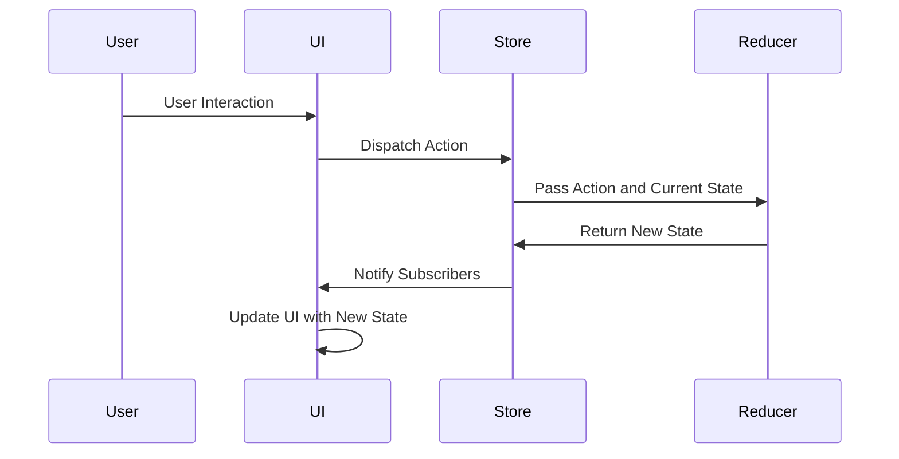

## 6.1.2 Redux Data Flow

In the world of state management, Redux stands out for its simplicity and predictability, largely due to its strict unidirectional data flow. This flow ensures that data moves in a single direction, creating a clear and manageable path from user interactions to state updates. Understanding this flow is crucial for leveraging Redux effectively in Flutter applications. Let's dive into the components and steps involved in Redux's data flow.

### Unidirectional Data Flow

Redux enforces a unidirectional data flow, which means that data in a Redux application follows a single path: from the user interface (UI) to actions, then to the store, through reducers, and finally back to the UI. This flow can be summarized as:

- **View (UI) -> Actions -> Store -> Reducers -> State -> View**

This structure provides several benefits, including easier debugging, predictable state transitions, and a clear separation of concerns.

### Steps in Redux Data Flow

Let's break down each step in the Redux data flow to understand how they contribute to the overall architecture.

#### Dispatching an Action

The data flow begins with an action. Actions are payloads of information that send data from your application to your Redux store. They are the only source of information for the store. You send them to the store using `store.dispatch()`.

- **User Interactions or Events Dispatch Actions:**
  When a user interacts with the UI, such as clicking a button or submitting a form, an action is dispatched to the store. This action describes what happened.

  ```dart
  store.dispatch(IncrementAction());
  ```

#### Reducers Process Actions

Once an action is dispatched, the store forwards it to the reducers. Reducers are pure functions that take the current state and an action as arguments and return a new state. They specify how the application's state changes in response to actions.

- **Pure Functions:**
  Reducers must be pure functions, meaning they should not have side effects and should return the same output given the same input.

  ```dart
  int counterReducer(int state, dynamic action) {
    if (action is IncrementAction) {
      return state + 1;
    }
    return state;
  }
  ```

#### State Update

After the reducer processes the action, the store updates its state with the new state returned by the reducer. This updated state is now the single source of truth for the application.

#### UI Update

Finally, the store notifies all subscribers, typically the UI components, about the state change. The UI can then retrieve the new state and re-render accordingly, reflecting the latest data.

### Mermaid.js Diagram

To visualize this flow, let's look at a sequence diagram that illustrates the Redux data flow:



### Code Walkthrough

Let's walk through a simple example to see how these concepts come together in a Redux application.

#### Define an Action

Actions are simple classes or objects that describe what happened. In this example, we'll define an `IncrementAction` to increase a counter.

```dart
class IncrementAction {}
```

#### Define a Reducer

Reducers handle actions and update the state accordingly. Here, the `counterReducer` increments the state when it receives an `IncrementAction`.

```dart
int counterReducer(int state, dynamic action) {
  if (action is IncrementAction) {
    return state + 1;
  }
  return state;
}
```

#### Initialize the Store

The store holds the application's state and is created by passing the reducer and an initial state.

```dart
final store = Store<int>(counterReducer, initialState: 0);
```

#### Dispatch an Action

Actions are dispatched to the store to trigger state changes.

```dart
store.dispatch(IncrementAction());
```

#### Subscribe to State Changes

You can subscribe to the store to listen for state updates and react accordingly, such as updating the UI.

```dart
store.onChange.listen((state) {
  print('Current counter value: $state');
});
```

### Key Takeaways

- **Predictability:** The unidirectional data flow in Redux ensures that all state transitions are predictable and traceable, making debugging easier.
- **Separation of Concerns:** By separating actions, reducers, and state, Redux promotes a clean architecture that is easy to maintain and extend.
- **Scalability:** Redux's structure supports complex applications by providing a clear and consistent way to manage state.

Understanding Redux's data flow is crucial for building robust Flutter applications. By following this flow, you can create applications that are easier to debug, maintain, and scale. As you implement Redux in your projects, consider the implications of unidirectional data flow and how it can enhance your application's architecture.

### Further Exploration

For those interested in diving deeper into Redux and its applications in Flutter, consider exploring the following resources:

- **Official Redux Documentation:** [Redux Documentation](https://redux.js.org/)
- **Flutter and Redux Integration:** [Flutter Redux Package](https://pub.dev/packages/flutter_redux)
- **Books and Courses:** Look for books and online courses that cover Redux in depth, such as "Learning Redux" or "Mastering Flutter State Management."

By mastering Redux's data flow, you'll be well-equipped to tackle complex state management challenges in your Flutter applications.

## Quiz Time!



### What is the primary benefit of Redux's unidirectional data flow?

- [x] Predictable state transitions
- [ ] Faster performance
- [ ] Easier UI design
- [ ] Reduced code complexity

> **Explanation:** Redux's unidirectional data flow ensures that state transitions are predictable and traceable, which simplifies debugging and maintenance.

### In Redux, what is the role of an action?

- [x] To describe what happened
- [ ] To update the UI directly
- [ ] To store the application's state
- [ ] To notify subscribers

> **Explanation:** Actions are payloads of information that describe what happened in the application and are dispatched to the store.

### What must reducers in Redux be?

- [x] Pure functions
- [ ] Asynchronous
- [ ] Stateful
- [ ] UI components

> **Explanation:** Reducers must be pure functions, meaning they should return the same output given the same input and have no side effects.

### What happens after a reducer processes an action?

- [x] The store updates its state
- [ ] The UI updates automatically
- [ ] The action is dispatched again
- [ ] The user is notified

> **Explanation:** After a reducer processes an action, the store updates its state with the new state returned by the reducer.

### How does the UI know to update after a state change in Redux?

- [x] The store notifies subscribers
- [ ] The reducer triggers a UI update
- [ ] The action includes UI instructions
- [ ] The user manually refreshes the UI

> **Explanation:** The store notifies subscribers, such as UI components, about the state change, allowing them to update accordingly.

### What is the first step in the Redux data flow?

- [x] Dispatching an action
- [ ] Updating the state
- [ ] Processing by reducers
- [ ] Notifying the UI

> **Explanation:** The first step in the Redux data flow is dispatching an action, which describes what happened in the application.

### Which of the following is NOT a component of Redux's data flow?

- [ ] Actions
- [ ] Reducers
- [ ] Store
- [x] Middleware

> **Explanation:** While middleware can be used in Redux for handling side effects, it is not a core component of the data flow, which consists of actions, reducers, and the store.

### What does the store do after receiving a new state from the reducer?

- [x] Notifies subscribers
- [ ] Dispatches a new action
- [ ] Executes middleware
- [ ] Updates the UI directly

> **Explanation:** After receiving a new state from the reducer, the store notifies subscribers, such as UI components, about the state change.

### Why is it important for reducers to be pure functions?

- [x] To ensure predictable state updates
- [ ] To improve performance
- [ ] To simplify UI design
- [ ] To reduce code size

> **Explanation:** Pure functions ensure that reducers produce predictable state updates, which is crucial for maintaining a consistent application state.

### True or False: In Redux, the UI directly modifies the state.

- [ ] True
- [x] False

> **Explanation:** In Redux, the UI does not directly modify the state. Instead, it dispatches actions to the store, which are processed by reducers to update the state.


