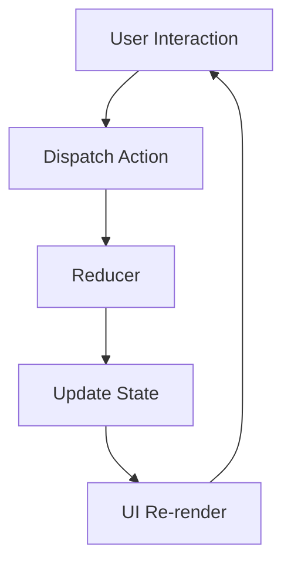

## 6.1.3 When to Choose Redux

State management is a critical aspect of developing robust and scalable Flutter applications. Among the various state management solutions available, Redux stands out for its ability to handle complex state management needs with predictability and traceability. This section delves into the scenarios where choosing Redux is advantageous, providing insights into its suitability for different project requirements.

### Assessing Project Complexity

When considering Redux for your Flutter application, it's essential to evaluate the complexity of your project's state management needs. Redux is particularly beneficial in scenarios where:

- **Large and Deeply Nested State Objects:** Applications with extensive and hierarchical state structures can benefit from Redux's centralized state management. Redux's single source of truth simplifies managing and updating deeply nested state objects.

- **Frequent Interactions Across Multiple UI Components:** If your application requires frequent state sharing and updates across various parts of the UI, Redux's global state management can streamline these interactions. This is especially useful in applications where multiple widgets need to access and modify the same state.

- **Requirement for Predictability and Ease of Debugging:** Redux's predictable state transitions, achieved through pure functions (reducers), facilitate easier debugging and understanding of state changes over time. This predictability is crucial for maintaining large applications.

#### Example Scenario

Consider a complex e-commerce application with features such as user authentication, product listings, shopping cart management, and order processing. Each of these features involves multiple state changes and interactions across different parts of the UI. Redux can effectively manage such complexity by providing a centralized state management solution that ensures consistency and predictability.

### Team Size and Collaboration

Redux can be particularly advantageous for larger development teams. Its structured approach to state management promotes consistent patterns across the application, which is beneficial for collaboration. When multiple developers work on different parts of an application, Redux's clear separation of concerns—actions, reducers, and the store—helps maintain code consistency and reduces the likelihood of conflicts.

#### Team Collaboration Benefits

- **Consistent Patterns:** Redux enforces a uniform pattern for managing state, making it easier for team members to understand and contribute to different parts of the application.

- **Scalability:** As the team grows, Redux's structured approach scales well, allowing new developers to onboard quickly and understand the application's state management logic.

### Predictability and Traceability

One of Redux's standout features is its ability to provide predictable state management. This predictability is achieved through the use of pure functions (reducers) to handle state transitions. Each action dispatched to the Redux store results in a predictable state change, making it easier to trace bugs and understand the application's behavior over time.

#### Time-Travel Debugging

Redux's architecture enables powerful debugging tools, such as time-travel debugging. This feature allows developers to inspect and replay state changes, providing a clear view of how the application reached its current state. Time-travel debugging is invaluable for diagnosing complex bugs and ensuring the application behaves as expected.

### Testing Requirements

For projects that require rigorous testing, Redux offers significant advantages. The use of pure functions for reducers makes it straightforward to write unit tests. These tests can verify that given a specific action and initial state, the reducer produces the expected new state. This predictability simplifies the testing process and enhances the reliability of the application.

#### Testing with Redux

- **Unit Testing Reducers:** Since reducers are pure functions, they can be tested in isolation, ensuring that state transitions occur as expected.

- **Integration Testing:** Redux's centralized state management simplifies integration testing by providing a single point of truth for the application's state.

### Learning Curve

While Redux offers numerous benefits, it is important to acknowledge its steeper learning curve compared to simpler state management solutions like `Provider`. Teams considering Redux should assess their capacity to adopt and effectively use Redux. This includes understanding Redux's core concepts—actions, reducers, and the store—and how they interact within a Flutter application.

#### Learning Considerations

- **Training and Resources:** Ensure that team members have access to training materials and resources to learn Redux effectively.

- **Initial Setup Time:** Be prepared for an initial investment of time to set up Redux and integrate it into the application.

### Alternatives

For simpler applications or those with less complex state needs, other state management solutions like `Provider` or `Riverpod` might be more appropriate. These solutions offer a lower learning curve and can be more efficient for applications with straightforward state management requirements.

#### When to Consider Alternatives

- **Simple State Needs:** If the application has minimal state management complexity, consider using `Provider` for its simplicity and ease of use.

- **Rapid Development:** For projects that require rapid development and iteration, `Provider` or `Riverpod` can provide quicker setup and integration.

### Decision Matrix

To help decide if Redux is suitable for your project, consider the following checklist:

- **Does the app have complex state that changes frequently?**
- **Do multiple widgets need to access and modify the same state?**
- **Is debugging and predictability of state changes a high priority?**
- **Is the team prepared to invest time in learning and implementing Redux?**

### Key Takeaways

Choosing the right state management solution is crucial for the success of your Flutter application. Redux offers powerful tools for managing complex state with predictability and traceability, making it an excellent choice for large-scale applications and teams. However, it is important to weigh the benefits against the learning curve and consider alternatives for simpler projects.

By thoughtfully considering your project's needs and team capabilities, you can select the state management solution that best aligns with your goals and ensures a robust and maintainable application.

### Practical Code Example

To illustrate Redux's implementation in a Flutter application, let's consider a simple counter app that uses Redux for state management.

```dart
// Define the actions
class IncrementAction {}

class DecrementAction {}

// Define the reducer
int counterReducer(int state, dynamic action) {
  if (action is IncrementAction) {
    return state + 1;
  } else if (action is DecrementAction) {
    return state - 1;
  }
  return state;
}

// Create the store
final store = Store<int>(counterReducer, initialState: 0);

void main() {
  runApp(MyApp());
}

class MyApp extends StatelessWidget {
  @override
  Widget build(BuildContext context) {
    return StoreProvider<int>(
      store: store,
      child: MaterialApp(
        home: CounterPage(),
      ),
    );
  }
}

class CounterPage extends StatelessWidget {
  @override
  Widget build(BuildContext context) {
    return Scaffold(
      appBar: AppBar(
        title: Text('Redux Counter'),
      ),
      body: Center(
        child: StoreConnector<int, String>(
          converter: (store) => store.state.toString(),
          builder: (context, count) {
            return Text(
              count,
              style: TextStyle(fontSize: 48.0),
            );
          },
        ),
      ),
      floatingActionButton: Column(
        mainAxisAlignment: MainAxisAlignment.end,
        children: [
          FloatingActionButton(
            onPressed: () => StoreProvider.of<int>(context).dispatch(IncrementAction()),
            tooltip: 'Increment',
            child: Icon(Icons.add),
          ),
          SizedBox(height: 10),
          FloatingActionButton(
            onPressed: () => StoreProvider.of<int>(context).dispatch(DecrementAction()),
            tooltip: 'Decrement',
            child: Icon(Icons.remove),
          ),
        ],
      ),
    );
  }
}
```

#### Code Explanation

- **Actions:** Defined as simple classes, `IncrementAction` and `DecrementAction` represent the possible state changes.
- **Reducer:** A pure function `counterReducer` takes the current state and an action, returning a new state based on the action type.
- **Store:** The `Store` holds the application's state and is initialized with the `counterReducer` and an initial state of `0`.
- **StoreProvider:** Wraps the application, providing access to the Redux store.
- **StoreConnector:** Connects the UI to the store, allowing the `CounterPage` to display the current state and dispatch actions.

### Visualizing Redux Architecture

Below is a Mermaid.js diagram illustrating the flow of actions and state in a Redux-managed Flutter application:



- **User Interaction:** Triggers an action dispatch.
- **Dispatch Action:** Sends an action to the reducer.
- **Reducer:** Processes the action and returns a new state.
- **Update State:** The store updates with the new state.
- **UI Re-render:** The UI re-renders to reflect the updated state.

### Further Reading and Resources

- **Official Redux Documentation:** [Redux Documentation](https://redux.js.org/)
- **Flutter Redux Package:** [flutter_redux](https://pub.dev/packages/flutter_redux)
- **Books:** "Learning Redux" by Alex Banks and Eve Porcello
- **Online Courses:** "Redux in Flutter" on Udemy

By understanding when to choose Redux, you can leverage its strengths to build scalable and maintainable Flutter applications. Remember to assess your project's specific needs and team capabilities to make an informed decision.

## Quiz Time!



### When is Redux particularly beneficial for a Flutter application?

- [x] When the application has complex and large-scale state management needs.
- [ ] When the application is simple and has minimal state management requirements.
- [ ] When the team is small and prefers rapid development.
- [ ] When debugging is not a priority.

> **Explanation:** Redux is beneficial for applications with complex and large-scale state management needs due to its predictability and centralized state management.

### What is a key feature of Redux that aids in debugging?

- [x] Time-travel debugging
- [ ] Automatic state updates
- [ ] Real-time collaboration
- [ ] Code generation

> **Explanation:** Time-travel debugging allows developers to inspect and replay state changes, making it easier to trace bugs.

### Why might Redux be advantageous for larger teams?

- [x] It promotes consistent patterns across the application.
- [ ] It allows for rapid prototyping.
- [ ] It eliminates the need for documentation.
- [ ] It requires minimal setup.

> **Explanation:** Redux's structured approach to state management promotes consistent patterns, which is beneficial for collaboration in larger teams.

### What makes Redux's reducers easy to test?

- [x] They are pure functions.
- [ ] They automatically generate test cases.
- [ ] They are written in a special testing language.
- [ ] They do not require inputs.

> **Explanation:** Redux's reducers are pure functions, meaning they have predictable outputs given specific inputs, making them easy to test.

### What should be considered before choosing Redux for a project?

- [x] The complexity of the application's state.
- [ ] The availability of Redux developers.
- [x] The team's capacity to learn Redux.
- [ ] The color scheme of the application.

> **Explanation:** The complexity of the application's state and the team's capacity to learn Redux are important considerations.

### Which of the following is NOT a reason to choose Redux?

- [x] To simplify a very basic application with minimal state.
- [ ] To manage complex state interactions.
- [ ] To ensure predictability in state changes.
- [ ] To facilitate team collaboration.

> **Explanation:** Redux is not typically chosen for very basic applications with minimal state due to its complexity.

### What is a potential downside of using Redux?

- [x] It has a steeper learning curve.
- [ ] It automatically scales with any application.
- [ ] It eliminates the need for testing.
- [ ] It is only compatible with web applications.

> **Explanation:** Redux has a steeper learning curve, which can be a downside for teams not prepared to invest time in learning it.

### How does Redux handle state?

- [x] Through a single source of truth.
- [ ] By creating multiple copies of state.
- [ ] By using local storage.
- [ ] By directly modifying the UI.

> **Explanation:** Redux manages state through a single source of truth, the store, ensuring consistency and predictability.

### What is an alternative to Redux for simpler state management needs?

- [x] Provider
- [ ] SQL Database
- [ ] REST API
- [ ] HTTP Requests

> **Explanation:** Provider is a simpler state management solution suitable for applications with less complex state needs.

### True or False: Redux is only suitable for web applications.

- [ ] True
- [x] False

> **Explanation:** Redux can be used in various types of applications, including mobile applications developed with Flutter.


