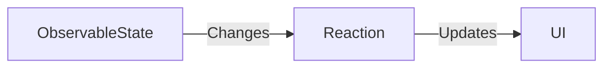

## 7.1.1 Reactive State Management in Flutter with MobX

In the world of application development, managing state efficiently is crucial for building responsive and interactive user interfaces. Reactive state management, a paradigm that has gained significant traction, offers a robust solution to this challenge. In this section, we will delve into the principles of reactive programming, explore how MobX facilitates reactive state management in Flutter applications, and compare it with other state management solutions.

### Introduction to Reactive Programming

Reactive programming is a declarative programming paradigm centered around data streams and the propagation of change. Unlike imperative programming, where developers explicitly define the sequence of operations, reactive programming focuses on the automatic propagation of changes through a system. This approach is akin to a spreadsheet where cells automatically update when the data they depend on changes.

#### Principles of Reactive Programming

- **Data Streams:** In reactive programming, data streams are the primary means of communication. These streams can emit events over time, and components can react to these events.
- **Propagation of Change:** When a change occurs in the data, it automatically propagates through the system, updating all dependent components.
- **Declarative Nature:** Developers specify what should happen in response to changes, rather than how to perform the operations.

#### Real-World Analogy

Consider a spreadsheet where you have a cell that sums up values from other cells. If any of the source cells change, the sum cell automatically updates to reflect the new total. This automatic update mechanism is the essence of reactive programming, where dependencies are tracked, and changes are propagated without manual intervention.

### MobX Overview

MobX is a library that brings transparent reactivity to state management in Flutter applications. It allows developers to manage application state in a simple and scalable way by automatically updating the UI in response to state changes. MobX is known for its minimal boilerplate and ease of use, making it an attractive choice for both small and large applications.

#### Key Features of MobX

- **Transparent Reactivity:** MobX tracks dependencies automatically and ensures that any changes in the observable state are reflected in the UI.
- **Minimal Boilerplate:** Setting up MobX requires minimal code, allowing developers to focus on building features rather than managing state.
- **Ease of Use:** With its intuitive API, MobX simplifies the process of implementing reactive state management in Flutter applications.

### Key Benefits of MobX

Using MobX in Flutter applications offers several advantages:

- **Simplicity:** MobX requires minimal code to set up state management, reducing the complexity of your application.
- **Scalability:** Whether you're building a small app or a large enterprise application, MobX scales effortlessly.
- **Readability:** MobX promotes a clear separation of state and UI logic, making your codebase easier to understand and maintain.
- **Reactivity:** The UI automatically updates when the underlying state changes, ensuring a seamless user experience.

### Comparison with Other State Management Solutions

MobX stands out among other state management solutions like Provider, Bloc, and Redux due to its reactive nature and simplicity.

- **Provider:** While Provider is a popular choice for state management in Flutter, it requires more boilerplate compared to MobX. MobX's automatic reactivity can be more intuitive for developers familiar with reactive programming.
- **Bloc:** Bloc is a powerful pattern for managing state, especially in complex applications. However, it involves more setup and can be overkill for simpler applications where MobX's simplicity shines.
- **Redux:** Redux offers a predictable state container but often involves significant boilerplate. MobX, with its minimal setup, provides a more straightforward approach to state management.

### Mermaid.js Diagrams

To better understand how MobX facilitates reactive state management, let's visualize the process using a Mermaid.js diagram.



In this diagram:
- **ObservableState** represents the state that MobX tracks.
- **Reaction** is the automatic response to changes in the observable state.
- **UI** is the user interface that updates in response to these changes.

This flow illustrates how MobX automatically propagates changes from the state to the UI, ensuring that the application remains responsive and up-to-date.

### Key Takeaways

Understanding the reactive model is crucial to effectively utilizing MobX in Flutter applications. By embracing reactive state management, developers can build applications that are not only efficient but also maintainable and scalable. MobX's transparent reactivity, minimal boilerplate, and ease of use make it a compelling choice for managing state in Flutter applications.

As you explore MobX, keep an open mind about the benefits of reactive state management. Consider how this approach can simplify your development process and enhance the user experience in your applications.

### Practical Code Example

Let's look at a simple example of how MobX can be used to manage state in a Flutter application. We'll create a counter app where the count value is an observable, and the UI automatically updates when the count changes.

```dart
import 'package:flutter/material.dart';
import 'package:flutter_mobx/flutter_mobx.dart';
import 'package:mobx/mobx.dart';

// Store class
class Counter {
  // Observable state
  final _count = Observable(0);

  // Action to modify the state
  void increment() {
    _count.value++;
  }

  // Computed value
  int get count => _count.value;
}

void main() {
  runApp(MyApp());
}

class MyApp extends StatelessWidget {
  final Counter counter = Counter();

  @override
  Widget build(BuildContext context) {
    return MaterialApp(
      home: Scaffold(
        appBar: AppBar(title: Text('MobX Counter')),
        body: Center(
          child: Observer(
            builder: (_) => Text(
              '${counter.count}',
              style: TextStyle(fontSize: 40),
            ),
          ),
        ),
        floatingActionButton: FloatingActionButton(
          onPressed: counter.increment,
          child: Icon(Icons.add),
        ),
      ),
    );
  }
}
```

#### Code Explanation

- **Observable:** The `_count` variable is an observable, meaning MobX tracks changes to it.
- **Action:** The `increment` method is an action that modifies the observable state.
- **Observer:** The `Observer` widget listens for changes in the observable state and rebuilds the UI when changes occur.

### Encouragement for Hands-On Practice

To fully grasp the power of MobX, I encourage you to experiment with the code example provided. Try extending the functionality by adding a decrement button or implementing a reset feature. Consider how MobX's reactivity simplifies these tasks and enhances the user experience.

### References and Further Reading

- [MobX Documentation](https://mobx.js.org/): The official MobX documentation provides comprehensive guides and examples.
- [Flutter MobX Package](https://pub.dev/packages/flutter_mobx): Explore the Flutter MobX package for integrating MobX with Flutter applications.
- [Reactive Programming with RxDart](https://pub.dev/packages/rxdart): Learn more about reactive programming with RxDart, a library that complements MobX.

## Quiz Time!



### What is the primary focus of reactive programming?

- [x] Automatic propagation of changes
- [ ] Manual updates of the UI
- [ ] Sequential execution of operations
- [ ] Static data management

> **Explanation:** Reactive programming focuses on the automatic propagation of changes through a system, unlike imperative programming, which involves manual updates.

### How does MobX handle state changes?

- [x] Automatically updates the UI in response to state changes
- [ ] Requires manual intervention to update the UI
- [ ] Uses a complex configuration to manage state
- [ ] Ignores state changes

> **Explanation:** MobX automatically updates the UI when the underlying state changes, leveraging its reactive nature.

### Which of the following is a key benefit of using MobX?

- [x] Minimal boilerplate
- [ ] Complex setup
- [ ] Manual state management
- [ ] High memory usage

> **Explanation:** MobX is known for its minimal boilerplate, making it easy to set up and use for state management.

### In the provided code example, what is the role of the `Observer` widget?

- [x] It listens for changes in the observable state and rebuilds the UI
- [ ] It modifies the observable state
- [ ] It initializes the application
- [ ] It handles user input

> **Explanation:** The `Observer` widget listens for changes in the observable state and rebuilds the UI when changes occur.

### What is an observable in MobX?

- [x] A state that MobX tracks for changes
- [ ] A method that modifies the state
- [ ] A UI component
- [ ] A static data structure

> **Explanation:** An observable in MobX is a state that MobX tracks for changes, allowing automatic updates to the UI.

### How does MobX compare to Redux in terms of setup?

- [x] MobX requires less boilerplate than Redux
- [ ] MobX requires more boilerplate than Redux
- [ ] MobX and Redux have the same setup complexity
- [ ] MobX does not require any setup

> **Explanation:** MobX requires less boilerplate than Redux, making it simpler to set up and use.

### What is a real-world analogy for reactive programming?

- [x] A spreadsheet where cells update automatically
- [ ] A manual calculator
- [ ] A static webpage
- [ ] A sequential script

> **Explanation:** Reactive programming is like a spreadsheet where cells automatically update when the data they depend on changes.

### Which state management solution is known for its minimal setup and ease of use?

- [x] MobX
- [ ] Bloc
- [ ] Redux
- [ ] Provider

> **Explanation:** MobX is known for its minimal setup and ease of use, making it a popular choice for state management.

### What does the `increment` method in the code example do?

- [x] It modifies the observable state by incrementing the count
- [ ] It resets the observable state
- [ ] It decrements the observable state
- [ ] It initializes the observable state

> **Explanation:** The `increment` method modifies the observable state by incrementing the count value.

### True or False: MobX requires manual updates to the UI when the state changes.

- [ ] True
- [x] False

> **Explanation:** False. MobX automatically updates the UI when the state changes, thanks to its reactive nature.


