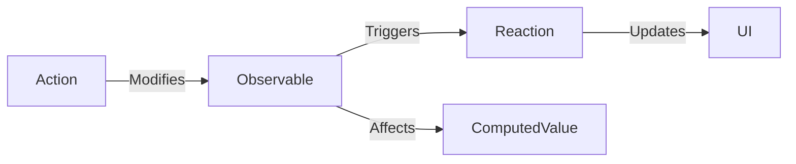

## 7.1.2 Core Concepts: Observables, Actions, Reactions

In the realm of state management, MobX stands out as a powerful library that embraces the reactive programming paradigm. It provides a seamless way to manage state in Flutter applications by focusing on three core concepts: Observables, Actions, and Reactions. Understanding these concepts is crucial for leveraging MobX effectively in your projects. This section will delve into each of these components, illustrating how they interact to create a dynamic and responsive application state.

### Observables: The Reactive Variables

Observables are the cornerstone of MobX's reactive system. They are reactive variables that hold the state of your application. When an observable changes, any dependent computations or UI components automatically update, ensuring that your application remains consistent and up-to-date.

#### Defining Observables

In MobX, observables are declared using the `@observable` annotation. This annotation marks a variable as reactive, allowing MobX to track its changes and propagate updates to any dependent components or computations.

**Example: Declaring an Observable**

```dart
import 'package:mobx/mobx.dart';

part 'counter.g.dart';

class Counter = _Counter with _$Counter;

abstract class _Counter with Store {
  @observable
  int counter = 0;
}
```

In this example, `counter` is an observable variable. Any changes to `counter` will automatically trigger updates in the UI or any computations that depend on it.

#### Practical Use Case

Consider a simple counter application where the user can increment a number displayed on the screen. By making the counter an observable, you ensure that the UI updates automatically whenever the counter changes.

### Actions: Modifying the State

Actions are methods that modify observables. In MobX, actions are the only way to change the state, promoting a clear and structured approach to state management. This constraint helps maintain a predictable and manageable state flow within your application.

#### Declaring Actions

Actions are declared using the `@action` annotation. This annotation marks a method as an action, allowing it to modify observable variables.

**Example: Declaring an Action**

```dart
@action
void incrementCounter() {
  counter++;
}
```

In this example, `incrementCounter` is an action that modifies the `counter` observable. By encapsulating state changes within actions, MobX ensures that all modifications are tracked and can trigger necessary updates.

#### Importance of Actions

Actions provide a clear boundary between the logic that modifies the state and the state itself. This separation enhances code readability and maintainability, making it easier to track and debug state changes.

### Reactions: Responding to Changes

Reactions in MobX are side effects that occur in response to changes in observables. They ensure that your application reacts appropriately to state changes, keeping the UI and other dependent components in sync.

#### Types of Reactions

MobX provides several types of reactions, each serving a specific purpose:

- **Observer Widgets:** These widgets automatically rebuild the UI when observables change. They are the primary way to bind observables to the UI in Flutter.

- **Autorun:** This reaction runs a function whenever any observables inside it change. It's useful for logging or performing side effects that don't directly affect the UI.

- **When:** This reaction triggers a function when a certain condition is met. It's ideal for executing code only when specific criteria are satisfied.

**Example: Using Reactions**

```dart
autorun(() {
  print('Counter changed to $counter');
});
```

In this example, the `autorun` function logs the counter's value whenever it changes. This demonstrates how reactions can be used to perform side effects in response to state changes.

#### Practical Application

Reactions are essential for keeping your application responsive and interactive. By leveraging reactions, you can ensure that your application remains consistent and performs necessary updates automatically.

### Computed Values: Derived Data

Computed values in MobX are derived data based on observables. They are cached and only recomputed when the underlying observables change, providing an efficient way to manage derived state.

#### Declaring Computed Values

Computed values are declared using the `@computed` annotation. This annotation marks a getter as a computed value, allowing MobX to track its dependencies and recompute it when necessary.

**Example: Declaring a Computed Value**

```dart
@computed
bool get isCounterEven => counter % 2 == 0;
```

In this example, `isCounterEven` is a computed value that determines whether the counter is even. It automatically updates whenever the counter changes, ensuring that the derived state remains accurate.

#### Benefits of Computed Values

Computed values provide a way to encapsulate derived logic, reducing redundancy and improving code clarity. By using computed values, you can ensure that your application efficiently manages derived state without unnecessary recomputations.

### Visualizing the MobX System

To better understand how observables, actions, reactions, and computed values interact, let's visualize these relationships using a Mermaid.js diagram:



This diagram illustrates the flow of data and updates within a MobX-managed application. Actions modify observables, which in turn trigger reactions and affect computed values. Reactions then update the UI, ensuring that the application remains consistent and responsive.

### Key Takeaways

- **Observables** are reactive variables that hold the application state. They automatically propagate changes to dependent computations and UI components.
- **Actions** are the only way to modify observables, promoting a structured and predictable state management approach.
- **Reactions** ensure that your application responds appropriately to state changes, keeping the UI and other components in sync.
- **Computed Values** provide an efficient way to manage derived state, reducing redundancy and improving code clarity.

By understanding and applying these core concepts, you can leverage MobX to create a dynamic and responsive state management system in your Flutter applications. Practice these concepts with small code snippets to solidify your understanding and explore how they can enhance your projects.

### Further Exploration

To deepen your understanding of MobX and its core concepts, consider exploring the following resources:

- **MobX Documentation:** [MobX Official Documentation](https://mobx.js.org/README.html)
- **Flutter and MobX Tutorial:** [Flutter MobX Tutorial](https://flutter.dev/docs/development/data-and-backend/state-mgmt/simple)
- **Books:** "MobX Quick Start Guide" by Pavan Podila
- **Online Courses:** Platforms like Udemy and Coursera offer courses on state management in Flutter, including MobX.

By engaging with these resources, you can expand your knowledge and apply MobX effectively in your projects.

## Quiz Time!



### What is an observable in MobX?

- [x] A reactive variable that holds the application state.
- [ ] A method that modifies the application state.
- [ ] A function that runs when a condition is met.
- [ ] A derived value based on other observables.

> **Explanation:** An observable is a reactive variable that holds the application state, automatically updating dependent computations and UI components when it changes.

### How are actions declared in MobX?

- [x] Using the `@action` annotation.
- [ ] Using the `@observable` annotation.
- [ ] Using the `@computed` annotation.
- [ ] Using the `@reaction` annotation.

> **Explanation:** Actions in MobX are declared using the `@action` annotation, marking methods that modify observables.

### What is the purpose of reactions in MobX?

- [x] To perform side effects in response to changes in observables.
- [ ] To declare reactive variables.
- [ ] To modify the application state.
- [ ] To create derived values.

> **Explanation:** Reactions in MobX are used to perform side effects in response to changes in observables, ensuring that the application remains responsive and consistent.

### Which of the following is a type of reaction in MobX?

- [x] Autorun
- [ ] Observable
- [ ] Action
- [ ] Computed

> **Explanation:** Autorun is a type of reaction in MobX that runs a function whenever any observables inside it change.

### What is a computed value in MobX?

- [x] A derived value based on observables.
- [ ] A method that modifies observables.
- [ ] A reactive variable that holds the application state.
- [ ] A function that runs when a condition is met.

> **Explanation:** A computed value in MobX is a derived value based on observables, cached and only recomputed when the underlying observables change.

### How do you declare a computed value in MobX?

- [x] Using the `@computed` annotation.
- [ ] Using the `@observable` annotation.
- [ ] Using the `@action` annotation.
- [ ] Using the `@reaction` annotation.

> **Explanation:** Computed values in MobX are declared using the `@computed` annotation, marking getters that derive data from observables.

### What is the relationship between actions and observables in MobX?

- [x] Actions modify observables.
- [ ] Observables modify actions.
- [ ] Actions are derived from observables.
- [ ] Observables are derived from actions.

> **Explanation:** In MobX, actions are methods that modify observables, ensuring a clear and structured approach to state management.

### Which of the following best describes the role of observer widgets in MobX?

- [x] They automatically rebuild the UI when observables change.
- [ ] They declare reactive variables.
- [ ] They modify the application state.
- [ ] They create derived values.

> **Explanation:** Observer widgets in MobX automatically rebuild the UI when observables change, ensuring that the interface remains consistent with the application state.

### What is the benefit of using computed values in MobX?

- [x] They provide an efficient way to manage derived state.
- [ ] They modify the application state.
- [ ] They declare reactive variables.
- [ ] They perform side effects in response to changes.

> **Explanation:** Computed values in MobX provide an efficient way to manage derived state, reducing redundancy and improving code clarity.

### True or False: In MobX, actions are the only way to change the state.

- [x] True
- [ ] False

> **Explanation:** True. In MobX, actions are the only way to change the state, promoting a clear and structured approach to state management.


