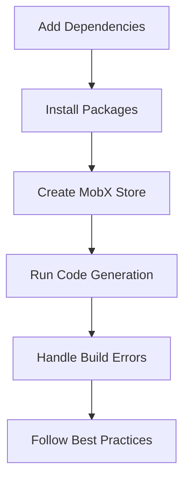

## 7.1.3 Setting Up MobX in Flutter

MobX is a powerful and flexible state management library that leverages reactive programming principles to make your Flutter applications more dynamic and responsive. In this section, we'll explore how to set up MobX in a Flutter project, covering everything from adding dependencies to creating a MobX store and running code generation. By the end of this guide, you'll have a solid understanding of how to integrate MobX into your Flutter applications effectively.

### Adding Dependencies

To begin, you'll need to add the necessary MobX packages to your Flutter project's `pubspec.yaml` file. These packages include `flutter_mobx` for Flutter-specific bindings, `mobx` for the core MobX functionality, `mobx_codegen` for code generation, and `build_runner` to facilitate the code generation process.

```yaml
dependencies:
  flutter_mobx: ^2.0.0
  mobx: ^2.0.0

dev_dependencies:
  build_runner: ^2.1.0
  mobx_codegen: ^2.0.0
```

- **`flutter_mobx`:** This package provides the necessary widgets and utilities to integrate MobX with Flutter.
- **`mobx`:** The core library that enables reactive state management.
- **`mobx_codegen`:** A code generation library that automates the creation of boilerplate code required for MobX.
- **`build_runner`:** A tool to run code generation commands, essential for generating the `.g.dart` files.

### Installing Packages

Once you've added the dependencies, run the following command in your terminal to install them:

```bash
flutter pub get
```

This command fetches the packages and makes them available in your project.

### Creating a MobX Store

A MobX store is a class that encapsulates the state and business logic of your application. It uses observables to track state changes and actions to modify the state. Let's walk through the process of creating a simple MobX store.

#### Step 1: Import Necessary Libraries

Start by importing the MobX library and specifying a part file for code generation. The part file will contain the generated code.

```dart
import 'package:mobx/mobx.dart';
part 'counter_store.g.dart';
```

- **`part 'counter_store.g.dart';`:** This directive tells Dart to include the generated code from the `counter_store.g.dart` file. This file is automatically generated by the code generation process.

#### Step 2: Annotate the Class

Next, define your store class. Use the `@store` annotation to mark it for code generation, and extend it with the generated class.

```dart
@store
abstract class _CounterStore with Store {
  // Observables and actions
}

class CounterStore = _CounterStore with _$CounterStore;
```

- **`@store`:** This annotation indicates that the class is a MobX store and should be processed by the code generator.
- **`abstract class _CounterStore with Store`:** The abstract class holds the state and logic. The `Store` mixin provides the necessary functionality for observables and actions.
- **`class CounterStore = _CounterStore with _$CounterStore;`:** This line creates a concrete implementation of the store by combining the abstract class with the generated code.

#### Step 3: Define Observables and Actions

Within your store, define observables to represent the state and actions to modify it. Here's an example of a simple counter store:

```dart
@store
abstract class _CounterStore with Store {
  @observable
  int count = 0;

  @action
  void increment() {
    count++;
  }
}
```

- **`@observable`:** Marks a field as an observable, allowing MobX to track changes to its value.
- **`@action`:** Marks a method as an action, indicating that it modifies the state.

### Running Code Generation

To generate the `.g.dart` files, you'll need to run the build runner. This process creates the necessary boilerplate code for your MobX store.

#### Build Command

Run the following command to generate the code:

```bash
flutter pub run build_runner build
```

This command processes all annotated classes and generates the corresponding `.g.dart` files.

#### Watch Command

For continuous code generation during development, use the watch command:

```bash
flutter pub run build_runner watch
```

This command automatically regenerates the code whenever changes are detected, streamlining the development process.

### Handling Build Errors

During the code generation process, you might encounter errors. Here are some common issues and troubleshooting tips:

- **Version Conflicts:** Ensure that all packages are compatible with each other. Check the package documentation for version compatibility.
- **Missing Annotations:** Verify that all necessary annotations (`@store`, `@observable`, `@action`) are present.
- **Cleaning the Build Cache:** If you encounter persistent issues, try cleaning the build cache:

  ```bash
  flutter pub run build_runner clean
  ```

This command clears the generated files, allowing you to start fresh.

### Best Practices

When working with MobX, consider the following best practices to maintain clean and efficient code:

- **Keep Store Classes Focused:** Ensure that each store class is responsible for a specific part of the application's state. Avoid mixing unrelated logic.
- **Separate UI from Business Logic:** Use MobX stores to manage state and logic, while keeping UI code in Flutter widgets. This separation enhances maintainability and readability.
- **Use Code Generation Wisely:** Leverage code generation to reduce boilerplate, but remain aware of the generated code and its impact on your project.

### Visualizing the Setup Process

To better understand the flow of setting up MobX in a Flutter project, consider the following Mermaid.js diagram:



This diagram illustrates the sequential steps involved in setting up MobX, from adding dependencies to following best practices.

### Key Takeaways

- **MobX Setup:** You've learned how to set up MobX in a Flutter project, including adding dependencies, creating a store, and running code generation.
- **Code Generation:** Understanding the role of code generation is crucial for working with MobX effectively.
- **Best Practices:** Following best practices ensures that your MobX implementation is clean, maintainable, and efficient.

By following these steps, you can integrate MobX into your Flutter projects, leveraging its reactive capabilities to manage state effectively. As you continue to explore MobX, remember to experiment with different patterns and techniques to find the best fit for your application's needs.

## Quiz Time!



### What is the primary purpose of the `mobx_codegen` package?

- [x] To automate the creation of boilerplate code for MobX stores
- [ ] To provide Flutter-specific bindings for MobX
- [ ] To manage state changes in MobX
- [ ] To run MobX stores in a production environment

> **Explanation:** The `mobx_codegen` package is used for code generation, automating the creation of boilerplate code for MobX stores.

### Which command is used to install the MobX packages in a Flutter project?

- [x] `flutter pub get`
- [ ] `flutter pub run build_runner build`
- [ ] `flutter install packages`
- [ ] `flutter setup mobx`

> **Explanation:** The `flutter pub get` command is used to install the packages listed in the `pubspec.yaml` file.

### What annotation is used to mark a class as a MobX store?

- [x] `@store`
- [ ] `@observable`
- [ ] `@action`
- [ ] `@mobx`

> **Explanation:** The `@store` annotation is used to mark a class as a MobX store, indicating it should be processed by the code generator.

### What is the purpose of the `part` directive in a MobX store file?

- [x] To include the generated code from the `.g.dart` file
- [ ] To define observables and actions
- [ ] To import necessary libraries
- [ ] To declare the class as abstract

> **Explanation:** The `part` directive tells Dart to include the generated code from the `.g.dart` file, which is created during the code generation process.

### How can you continuously generate code during development?

- [x] Use the `flutter pub run build_runner watch` command
- [ ] Use the `flutter pub run build_runner build` command
- [ ] Use the `flutter pub run build_runner clean` command
- [ ] Use the `flutter pub run build_runner generate` command

> **Explanation:** The `flutter pub run build_runner watch` command continuously generates code during development, automatically updating the `.g.dart` files when changes are detected.

### What is a common solution for persistent build errors during code generation?

- [x] Clean the build cache with `flutter pub run build_runner clean`
- [ ] Reinstall the MobX packages
- [ ] Restart the Flutter development server
- [ ] Manually edit the `.g.dart` files

> **Explanation:** Cleaning the build cache with `flutter pub run build_runner clean` can resolve persistent build errors by removing outdated generated files.

### Which of the following is NOT a best practice when using MobX?

- [ ] Keep store classes focused on specific state management
- [ ] Separate UI code from business logic
- [x] Mix unrelated logic within a single store
- [ ] Use code generation to reduce boilerplate

> **Explanation:** Mixing unrelated logic within a single store is not a best practice, as it can lead to complex and unmanageable code.

### What is the role of the `@observable` annotation in a MobX store?

- [x] To mark a field as an observable, allowing MobX to track changes
- [ ] To mark a method as an action
- [ ] To indicate a class is a MobX store
- [ ] To include the generated code from the `.g.dart` file

> **Explanation:** The `@observable` annotation marks a field as an observable, allowing MobX to track changes to its value.

### Which command is used to generate the `.g.dart` files for a MobX store?

- [x] `flutter pub run build_runner build`
- [ ] `flutter pub run build_runner watch`
- [ ] `flutter pub run build_runner clean`
- [ ] `flutter pub run build_runner generate`

> **Explanation:** The `flutter pub run build_runner build` command generates the `.g.dart` files for a MobX store, creating the necessary boilerplate code.

### True or False: MobX allows you to manage state reactively in Flutter applications.

- [x] True
- [ ] False

> **Explanation:** True. MobX is designed to manage state reactively, making it easier to build dynamic and responsive Flutter applications.


