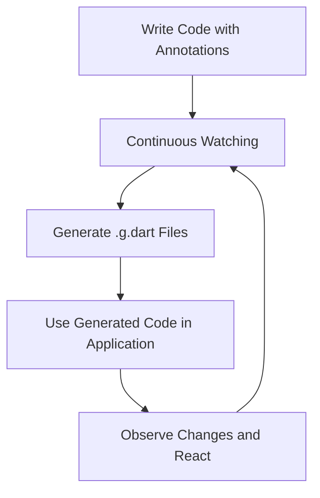

## 7.1.4 Code Generation with Build Runner

In the realm of Flutter state management, MobX stands out for its simplicity and power, largely due to its use of code generation. This section delves into how MobX leverages `build_runner` to automate the creation of reactive components, reducing boilerplate and enhancing developer productivity.

### Understanding Code Generation

Code generation in MobX is a pivotal feature that automates the creation of reactive mechanisms, allowing developers to focus on business logic rather than boilerplate code. By using annotations, MobX instructs the code generator to produce the necessary code behind the scenes, encapsulating complex reactive patterns into manageable constructs.

#### The Role of `build_runner`

`build_runner` is a Dart tool that automates code generation tasks. It listens to changes in your codebase and regenerates necessary files, ensuring that your application remains in sync with your latest changes. This automation is crucial in maintaining the reactive nature of MobX without manual intervention.

### Annotations and Generated Files

MobX uses specific annotations to define reactive properties and behaviors. These annotations are processed by `build_runner` to generate code in `.g.dart` files, which are then used by your application to implement reactivity.

#### Key Annotations

- **`@observable`:** Marks a property as observable, allowing it to react to changes.
- **`@action`:** Indicates a method that modifies observable properties, ensuring that changes are tracked.
- **`@computed`:** Defines a computed property that derives its value from other observables.

These annotations are crucial for informing the code generator about which parts of your code should be reactive.

```dart
import 'package:mobx/mobx.dart';

part 'counter.g.dart';

class Counter = _Counter with _$Counter;

abstract class _Counter with Store {
  @observable
  int value = 0;

  @action
  void increment() {
    value++;
  }

  @computed
  bool get isEven => value % 2 == 0;
}
```

In this example, the `Counter` class uses annotations to define an observable property `value`, an action `increment`, and a computed property `isEven`. The `part 'counter.g.dart';` directive indicates that the generated code will be placed in a separate file.

### Configuring Build Runner

While `build_runner` works out of the box for most use cases, there are scenarios where customization is beneficial. This can be achieved through a `build.yaml` file, which allows you to specify advanced configurations such as build targets and options.

#### Customizing with `build.yaml`

A `build.yaml` file can be used to fine-tune the behavior of `build_runner`. For example, you can specify which files to include or exclude from the build process, or adjust the output directory for generated files.

```yaml
targets:
  $default:
    sources:
      include:
        - lib/**
      exclude:
        - lib/excluded/**
```

This configuration includes all files in the `lib` directory except those in `lib/excluded`.

### Running Build Runner Commands

To generate code with `build_runner`, you can use several commands depending on your workflow needs:

- **Single Build:**

  ```bash
  flutter pub run build_runner build
  ```

  This command generates code once and exits.

- **Continuous Watching:**

  ```bash
  flutter pub run build_runner watch
  ```

  This command watches for changes and regenerates code automatically, ideal for active development.

- **Cleaning Generated Files:**

  ```bash
  flutter pub run build_runner clean
  ```

  Use this command to remove all generated files, useful when you need a fresh start.

### Handling Conflicts and Errors

During development, you may encounter conflicts or errors related to code generation. Common issues include conflicting outputs or build failures due to outdated generated files.

#### Resolving Conflicts

One effective way to resolve conflicts is by using the `--delete-conflicting-outputs` flag:

```bash
flutter pub run build_runner build --delete-conflicting-outputs
```

This command deletes any conflicting outputs before regenerating code, ensuring a clean build.

### Best Practices

To maximize the benefits of code generation with MobX, consider the following best practices:

- **Version Control:** Keep generated files out of version control by adding them to `.gitignore`. This prevents unnecessary clutter and conflicts in your repository.
  
  ```plaintext
  *.g.dart
  ```

- **Regular Updates:** Run code generation regularly to keep your codebase up to date with the latest changes, ensuring that all reactive components function correctly.

### Mermaid.js Diagrams

To visualize how code generation integrates into the development workflow, consider the following diagram:



This flowchart illustrates the cyclical nature of code generation, emphasizing its role in maintaining application reactivity.

### Key Takeaways

Understanding the code generation process is crucial for effectively using MobX in Flutter applications. By leveraging `build_runner`, developers can automate the creation of reactive components, reducing boilerplate and focusing on core application logic. Embracing best practices and handling common issues proactively ensures a smooth development experience.

### Further Exploration

For those interested in delving deeper into MobX and code generation, consider exploring the following resources:

- [MobX Documentation](https://mobx.netlify.app/)
- [Build Runner Documentation](https://pub.dev/packages/build_runner)
- [Flutter Official Documentation](https://flutter.dev/docs)

These resources provide comprehensive insights into the capabilities and configurations of MobX and `build_runner`, enabling you to harness their full potential in your projects.

## Quiz Time!



### What is the primary purpose of code generation in MobX?

- [x] To automate the creation of reactive components and reduce boilerplate code.
- [ ] To manually write all reactive code by hand.
- [ ] To replace the need for state management entirely.
- [ ] To generate UI components automatically.

> **Explanation:** Code generation in MobX automates the creation of reactive components, reducing the need for boilerplate code and allowing developers to focus on business logic.

### Which annotation is used in MobX to mark a property as observable?

- [x] `@observable`
- [ ] `@action`
- [ ] `@computed`
- [ ] `@store`

> **Explanation:** The `@observable` annotation is used to mark properties as observable, enabling them to react to changes.

### What command would you use to continuously watch for changes and regenerate code with build_runner?

- [x] `flutter pub run build_runner watch`
- [ ] `flutter pub run build_runner build`
- [ ] `flutter pub run build_runner clean`
- [ ] `flutter pub run build_runner update`

> **Explanation:** The `flutter pub run build_runner watch` command is used to continuously watch for changes and regenerate code automatically.

### How can you resolve conflicts during code generation with build_runner?

- [x] Use the `--delete-conflicting-outputs` flag.
- [ ] Manually delete all generated files.
- [ ] Ignore the conflicts and proceed.
- [ ] Use a different state management library.

> **Explanation:** The `--delete-conflicting-outputs` flag helps resolve conflicts by deleting any conflicting outputs before regenerating code.

### What is the purpose of the `@computed` annotation in MobX?

- [x] To define a computed property that derives its value from other observables.
- [ ] To mark a property as observable.
- [ ] To indicate a method that modifies observables.
- [ ] To create a new store.

> **Explanation:** The `@computed` annotation is used to define computed properties that derive their values from other observables, enabling efficient state management.

### Which file should be modified to customize build_runner configurations?

- [x] `build.yaml`
- [ ] `pubspec.yaml`
- [ ] `config.yaml`
- [ ] `settings.json`

> **Explanation:** The `build.yaml` file is used to customize build_runner configurations, allowing advanced settings and build targets.

### Why should generated files be kept out of version control?

- [x] To prevent unnecessary clutter and conflicts in the repository.
- [ ] To ensure they are always available for others.
- [ ] To make them easier to edit manually.
- [ ] To improve application performance.

> **Explanation:** Keeping generated files out of version control prevents unnecessary clutter and conflicts, as they can be regenerated as needed.

### What is the benefit of using `flutter pub run build_runner clean`?

- [x] It removes all generated files, useful for a fresh start.
- [ ] It updates all dependencies automatically.
- [ ] It optimizes the application for production.
- [ ] It compiles the application for deployment.

> **Explanation:** The `flutter pub run build_runner clean` command removes all generated files, providing a clean slate for regeneration.

### Which of the following is NOT a MobX annotation?

- [x] `@store`
- [ ] `@observable`
- [ ] `@action`
- [ ] `@computed`

> **Explanation:** `@store` is not a MobX annotation. The primary annotations are `@observable`, `@action`, and `@computed`.

### True or False: Code generation with build_runner eliminates the need for state management in Flutter.

- [ ] True
- [x] False

> **Explanation:** False. Code generation with build_runner facilitates state management by automating reactive component creation, but it does not eliminate the need for state management.


