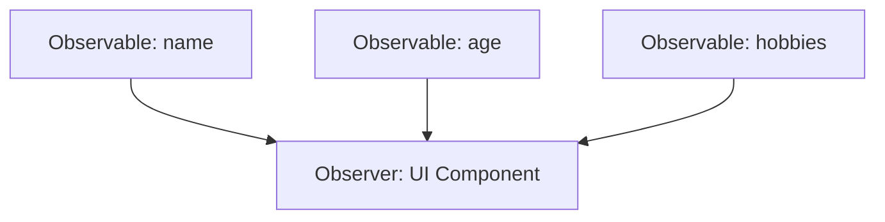

## 7.2.1 Creating Observables

In the realm of state management within Flutter applications, MobX stands out as a powerful and intuitive library that leverages reactive programming principles. At the heart of MobX's functionality are observables, which are variables that automatically notify observers about changes, allowing for seamless UI updates and state management. This section delves into the creation and management of observables in MobX, providing you with the knowledge to harness their full potential in your Flutter projects.

### Defining Observable Properties

Observables are the cornerstone of MobX's reactive system. They represent the state of your application and are capable of notifying any observers when their values change. To define an observable in MobX, you use the `@observable` annotation. This annotation transforms a regular variable into an observable one, enabling it to participate in MobX's reactivity system.

#### Example: Declaring an Observable Variable

```dart
import 'package:mobx/mobx.dart';

part 'user_store.g.dart';

class UserStore = _UserStore with _$UserStore;

abstract class _UserStore with Store {
  @observable
  String username = '';
}
```

In this example, the `username` variable is declared as an observable. Any change to `username` will trigger reactions, such as UI updates, wherever this observable is used.

### Understanding Observable Behavior

The power of observables lies in their ability to automatically trigger reactions when their values change. This behavior is fundamental to creating dynamic and responsive user interfaces. When an observable changes, any observer that depends on it is automatically notified and can react accordingly.

#### Demonstrating Observable Changes

Consider a simple Flutter widget that displays a username. When the `username` observable changes, the widget automatically updates to reflect the new value.

```dart
import 'package:flutter/material.dart';
import 'package:flutter_mobx/flutter_mobx.dart';

class UserWidget extends StatelessWidget {
  final UserStore userStore;

  UserWidget(this.userStore);

  @override
  Widget build(BuildContext context) {
    return Observer(
      builder: (_) => Text('Username: ${userStore.username}'),
    );
  }
}
```

In this widget, the `Observer` widget listens for changes in `userStore.username` and rebuilds the `Text` widget whenever the `username` changes.

### Observable Lists and Maps

In addition to simple data types, MobX supports reactive collections through `ObservableList` and `ObservableMap`. These collections allow you to manage lists and maps reactively, ensuring that any changes to their contents trigger the necessary reactions.

#### Example: Using ObservableList and ObservableMap

```dart
import 'package:mobx/mobx.dart';

class CollectionStore = _CollectionStore with _$CollectionStore;

abstract class _CollectionStore with Store {
  @observable
  ObservableList<String> items = ObservableList<String>();

  @observable
  ObservableMap<String, int> scores = ObservableMap<String, int>();
}
```

In this example, `items` is an `ObservableList` that can hold a list of strings, and `scores` is an `ObservableMap` that maps strings to integers. Any modifications to these collections, such as adding or removing elements, will trigger reactions.

### Initializing Observables

Initializing observables is straightforward. You can assign default values directly or use constructors to set initial states. This flexibility allows you to tailor the initialization process to your application's needs.

#### Example: Initializing Observables with Default Values

```dart
@observable
String status = 'active';

@observable
int count = 10;
```

Here, `status` and `count` are initialized with default values, ensuring that they have meaningful initial states when the application starts.

### Best Practices

To maintain clean and maintainable code, consider the following best practices when working with observables:

- **Keep Observables Private:** Whenever possible, keep observables private and provide read-only access through getters. This encapsulation helps prevent unintended modifications from outside the store.
  
- **Use Descriptive Names:** Choose descriptive names for your observables to enhance code readability and maintainability. This practice makes it easier for others (and yourself) to understand the purpose of each observable.

### Code Examples: Sample Store Class

To illustrate the use of multiple observables within a MobX store, let's create a sample store class that manages user-related data.

```dart
import 'package:mobx/mobx.dart';

part 'user_store.g.dart';

class UserStore = _UserStore with _$UserStore;

abstract class _UserStore with Store {
  @observable
  String name = '';

  @observable
  int age = 0;

  @observable
  ObservableList<String> hobbies = ObservableList<String>();
}
```

In this `UserStore` class, we have three observables: `name`, `age`, and `hobbies`. These observables can be used to manage user information reactively, ensuring that any changes are automatically reflected in the UI.

### Mermaid.js Diagrams

To better understand how observables are connected within a MobX store and how they trigger reactions, consider the following diagram:



This diagram illustrates the relationship between observables and an observer. Changes in any of the observables (`name`, `age`, or `hobbies`) will trigger a reaction in the observer, which could be a UI component that updates accordingly.

### Key Takeaways

- **Declarative State Management:** Observables in MobX provide a declarative way to manage state, ensuring that changes automatically propagate through your application.
- **Reactive Collections:** Utilize `ObservableList` and `ObservableMap` for managing collections reactively, enabling dynamic updates in your UI.
- **Encapsulation and Readability:** Follow best practices by keeping observables private and using descriptive names to maintain clean and understandable code.

By mastering the creation and management of observables in MobX, you can build Flutter applications that are both responsive and maintainable. Experiment with different types of observables and practice integrating them into your projects to fully leverage MobX's capabilities.

## Quiz Time!



### What is an observable in MobX?

- [x] A variable that automatically notifies observers about changes
- [ ] A function that triggers side effects
- [ ] A constant value that cannot be changed
- [ ] A method for asynchronous operations

> **Explanation:** An observable in MobX is a variable that notifies observers about changes, enabling reactive programming.

### How do you declare an observable in MobX?

- [x] Using the `@observable` annotation
- [ ] Using the `@action` annotation
- [ ] Using the `@computed` annotation
- [ ] Using the `@reaction` annotation

> **Explanation:** The `@observable` annotation is used to declare variables as observables in MobX.

### What happens when an observable changes in MobX?

- [x] Observers are automatically notified and can react
- [ ] The application crashes
- [ ] The observable becomes immutable
- [ ] Nothing happens

> **Explanation:** When an observable changes, observers are automatically notified, allowing them to react accordingly.

### Which of the following is a reactive collection in MobX?

- [x] ObservableList
- [ ] List
- [ ] Set
- [ ] Map

> **Explanation:** `ObservableList` is a reactive collection in MobX that triggers reactions when its contents change.

### How can you initialize an observable with a default value?

- [x] Assign a value directly during declaration
- [ ] Use the `@action` annotation
- [ ] Use a separate initialization method
- [ ] Observables cannot have default values

> **Explanation:** You can initialize an observable with a default value by assigning it directly during declaration.

### What is a best practice for naming observables?

- [x] Use descriptive names for readability
- [ ] Use single-letter names for brevity
- [ ] Use numbers to indicate order
- [ ] Use random strings to avoid conflicts

> **Explanation:** Using descriptive names for observables enhances code readability and maintainability.

### Why should observables be kept private when possible?

- [x] To prevent unintended modifications from outside the store
- [ ] To make the code more complex
- [ ] To reduce performance overhead
- [ ] To avoid using getters

> **Explanation:** Keeping observables private prevents unintended modifications from outside the store, maintaining encapsulation.

### What is the purpose of the `Observer` widget in Flutter?

- [x] To listen for changes in observables and rebuild the UI
- [ ] To declare new observables
- [ ] To perform asynchronous operations
- [ ] To manage application state globally

> **Explanation:** The `Observer` widget listens for changes in observables and rebuilds the UI accordingly.

### Which of the following is NOT a type of observable collection in MobX?

- [x] ObservableSet
- [ ] ObservableList
- [ ] ObservableMap
- [ ] Observable

> **Explanation:** MobX does not have an `ObservableSet`; it supports `ObservableList` and `ObservableMap`.

### True or False: Observables in MobX can only hold primitive data types.

- [ ] True
- [x] False

> **Explanation:** Observables in MobX can hold complex data types, including lists and maps, not just primitives.



By understanding and implementing observables in MobX, you can create Flutter applications that are both dynamic and maintainable. Observables provide a powerful mechanism for managing state reactively, ensuring that your UI remains in sync with the underlying data.
