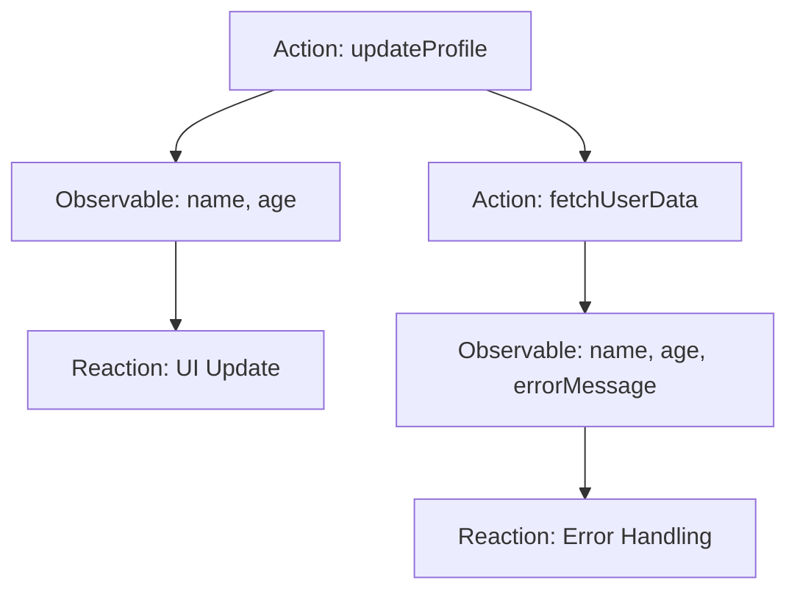

## 7.2.2 Writing Actions

In the world of state management with MobX, actions play a pivotal role in ensuring that state changes are predictable, efficient, and easy to track. This section delves into the intricacies of writing actions in MobX, providing you with the knowledge and tools to manage state changes effectively in your Flutter applications.

### Defining Actions

In MobX, actions are methods specifically designed to modify the state of observables. They are crucial for encapsulating all the logic that leads to a change in state, ensuring that your application remains consistent and predictable. By using the `@action` annotation, you clearly indicate which methods are responsible for state changes.

#### Why Use Actions?

- **Encapsulation:** Actions encapsulate the logic that modifies state, making your codebase cleaner and more organized.
- **Predictability:** By defining actions, you ensure that state changes occur in a controlled manner, reducing the likelihood of unexpected behavior.
- **Efficiency:** Actions can batch multiple state changes into a single transaction, optimizing the reaction process and improving performance.

#### Using the `@action` Annotation

The `@action` annotation is a simple yet powerful tool in MobX. It signals to the MobX library that the annotated method is an action, which should be tracked and managed accordingly.

```dart
import 'package:mobx/mobx.dart';

part 'user_store.g.dart';

class UserStore = _UserStore with _$UserStore;

abstract class _UserStore with Store {
  @observable
  String name = '';

  @observable
  int age = 0;

  @action
  void updateName(String newName) {
    name = newName;
  }

  @action
  void incrementAge() {
    age++;
  }
}
```

In this example, `updateName` and `incrementAge` are actions that modify the `name` and `age` observables, respectively. By using the `@action` annotation, these methods are optimized for state changes.

### Implementing Actions

Implementing actions in MobX involves creating methods that directly modify observable properties. These methods should be focused on state changes, leaving complex business logic to be handled elsewhere.

#### Example: Modifying Observables

Let's explore a simple implementation where actions modify observables:

```dart
@action
void updateName(String newName) {
  name = newName;
}

@action
void incrementAge() {
  age++;
}
```

These actions are straightforward, each focusing on a single task: updating the `name` and incrementing the `age`. This simplicity is key to maintaining clean and understandable code.

### Batching Changes

One of the significant advantages of using actions is the ability to batch multiple state changes into a single transaction. This capability is crucial for optimizing reactions and ensuring that your application remains performant.

#### Example: Batching State Changes

Consider a scenario where you need to update multiple observables simultaneously:

```dart
@action
void updateProfile(String newName, int newAge) {
  name = newName;
  age = newAge;
}
```

In this example, both `name` and `age` are updated within a single action. This batching ensures that any reactions to these changes are triggered only once, rather than separately for each state change.

### Asynchronous Actions

In modern applications, asynchronous operations are commonplace, whether fetching data from an API or performing complex computations. MobX supports asynchronous actions, allowing you to handle such operations seamlessly.

#### Handling Asynchronous Operations

To handle asynchronous operations within actions, you can use `async` and `await`. Here's an example of an asynchronous action:

```dart
@action
Future<void> fetchUserData() async {
  try {
    final data = await api.getUserData();
    name = data.name;
    age = data.age;
  } catch (error) {
    // Handle error
  }
}
```

In this example, `fetchUserData` is an asynchronous action that fetches user data from an API and updates the `name` and `age` observables. Note the use of `try-catch` for error handling, which we'll discuss next.

### Error Handling

Error handling is an essential aspect of writing robust actions. When errors occur during state changes, it's crucial to handle them gracefully and update the store state to reflect any issues.

#### Strategies for Error Handling

- **Use Try-Catch Blocks:** Wrap asynchronous operations in try-catch blocks to catch and handle exceptions.
- **Update State on Errors:** Consider updating the store state to indicate an error, such as setting an `errorMessage` observable.

```dart
@observable
String errorMessage = '';

@action
Future<void> fetchUserData() async {
  try {
    final data = await api.getUserData();
    name = data.name;
    age = data.age;
  } catch (error) {
    errorMessage = 'Failed to fetch user data';
  }
}
```

In this example, if an error occurs during the data fetch, the `errorMessage` observable is updated, allowing the UI to respond accordingly.

### Best Practices

To ensure your actions are effective and maintainable, consider the following best practices:

- **Focus on State Changes:** Keep actions focused on modifying observable state. Avoid embedding complex business logic directly within actions.
- **Delegate Complex Logic:** If an action requires complex logic, delegate it to a separate service or utility class.
- **Keep Actions Simple:** Strive for simplicity in your actions. Each action should perform a single, clear task.

### Expanding the Sample Store

Let's expand our sample store with additional actions to manage a list of hobbies:

```dart
@observable
ObservableList<String> hobbies = ObservableList<String>();

@action
void addHobby(String hobby) {
  hobbies.add(hobby);
}

@action
void removeHobby(String hobby) {
  hobbies.remove(hobby);
}
```

In this example, `addHobby` and `removeHobby` are actions that manage a list of hobbies. These actions demonstrate how MobX can be used to manage collections of data efficiently.

### Visualizing the Flow with Mermaid.js Diagrams

To better understand the flow from actions to state changes and subsequent reactions, let's visualize it using a Mermaid.js diagram:



This diagram illustrates how actions like `updateProfile` and `fetchUserData` lead to changes in observables, which then trigger reactions such as UI updates and error handling.

### Key Takeaways

- **Use Actions for State Changes:** Actions are the cornerstone of state management in MobX, ensuring that state changes are predictable and efficient.
- **Batch Changes for Efficiency:** Leverage actions to batch multiple state changes, optimizing reactions and improving performance.
- **Handle Asynchronous Operations Gracefully:** Use `async` and `await` within actions to manage asynchronous operations effectively.
- **Embrace Best Practices:** Keep actions simple and focused on state changes, delegating complex logic to separate services.

By mastering the art of writing actions in MobX, you can create Flutter applications that are not only efficient and responsive but also maintainable and scalable. As you continue to explore MobX, remember to experiment with different patterns and techniques, adapting them to suit your application's unique needs.

## Quiz Time!



### What is the primary purpose of actions in MobX?

- [x] To modify the state of observables
- [ ] To render UI components
- [ ] To manage application routing
- [ ] To handle user authentication

> **Explanation:** Actions in MobX are specifically designed to modify the state of observables, ensuring state changes are predictable and efficient.

### Which annotation is used to define an action in MobX?

- [x] @action
- [ ] @observable
- [ ] @computed
- [ ] @store

> **Explanation:** The `@action` annotation is used to indicate that a method is an action responsible for modifying state in MobX.

### How can you handle asynchronous operations within MobX actions?

- [x] By using `async` and `await`
- [ ] By using `setState`
- [ ] By using `FutureBuilder`
- [ ] By using `StreamBuilder`

> **Explanation:** Asynchronous operations in MobX actions can be handled using `async` and `await`, allowing you to perform tasks like API calls within actions.

### What is a key benefit of batching changes in MobX actions?

- [x] Optimizing reactions
- [ ] Increasing code complexity
- [ ] Reducing code readability
- [ ] Decreasing application performance

> **Explanation:** Batching changes in MobX actions optimizes reactions by ensuring that multiple state changes are processed as a single transaction, improving performance.

### What should you avoid including directly in MobX actions?

- [x] Complex business logic
- [ ] State changes
- [ ] Error handling
- [ ] UI rendering

> **Explanation:** It's best to avoid including complex business logic directly in MobX actions. Instead, delegate such logic to separate services or utility classes.

### How can you handle errors within MobX actions?

- [x] By using try-catch blocks
- [ ] By ignoring them
- [ ] By using `setState`
- [ ] By using `FutureBuilder`

> **Explanation:** Errors within MobX actions can be handled using try-catch blocks, allowing you to catch exceptions and update the store state accordingly.

### What is a recommended practice when writing MobX actions?

- [x] Keeping actions focused on modifying observable state
- [ ] Including UI rendering logic
- [ ] Embedding routing logic
- [ ] Ignoring error handling

> **Explanation:** A recommended practice is to keep MobX actions focused on modifying observable state, ensuring they remain simple and maintainable.

### Which of the following is an example of an asynchronous action in MobX?

- [x] `@action Future<void> fetchUserData() async { ... }`
- [ ] `@action void updateName(String newName) { ... }`
- [ ] `@action void incrementAge() { ... }`
- [ ] `@action void addHobby(String hobby) { ... }`

> **Explanation:** The example `@action Future<void> fetchUserData() async { ... }` is an asynchronous action that uses `async` and `await` to perform operations.

### What is the role of the `@observable` annotation in MobX?

- [x] To define properties that can be observed for changes
- [ ] To define methods that modify state
- [ ] To define computed values
- [ ] To define UI components

> **Explanation:** The `@observable` annotation in MobX is used to define properties that can be observed for changes, triggering reactions when they are modified.

### True or False: MobX actions can only modify a single observable at a time.

- [ ] True
- [x] False

> **Explanation:** False. MobX actions can modify multiple observables at once, allowing for batching of state changes into a single transaction.


