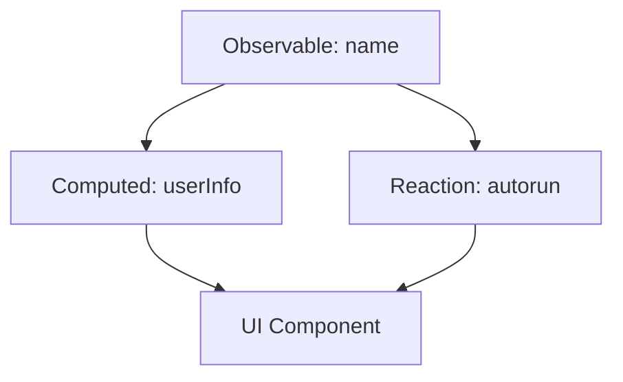

## 7.2.3 Using Reactions and Computed Values

In the world of state management, MobX stands out for its simplicity and powerful reactivity model. Two of its core features, reactions and computed values, play a crucial role in creating responsive and efficient applications. This section delves into these concepts, providing you with the knowledge and tools to implement them effectively in your Flutter projects.

### Understanding Reactions

Reactions in MobX are functions that automatically respond to changes in observables. They are essential for creating side effects in response to state changes, such as updating the UI or triggering network requests. MobX provides three primary methods for handling reactions: `autorun`, `reaction`, and `when`.

#### Autorun

The `autorun` function is a straightforward way to create a reaction that runs immediately and re-executes whenever any observable it references changes. This is particularly useful for logging or simple state-dependent actions.

**Example:**

```dart
autorun(() {
  print('Name changed to $name');
});
```

In this example, the `autorun` function prints a message every time the `name` observable changes.

#### Reaction

The `reaction` method allows you to specify a more targeted reaction, responding only to changes in specific observables. It consists of two parts: a function that returns the observable to watch and a side effect function that executes when the observable changes.

**Example:**

```dart
reaction(
  (_) => age,
  (int newAge) => print('Age changed to $newAge'),
);
```

Here, the `reaction` watches the `age` observable and prints a message whenever it changes.

#### When

The `when` method is a conditional reaction that waits until a specified condition is met before executing a function. This is useful for triggering actions only when certain criteria are satisfied.

**Example:**

```dart
when(
  () => age >= 18,
  () => print('User is now an adult'),
);
```

In this example, the `when` function waits until the `age` observable reaches 18 before printing a message.

### Implementing Reactions

To effectively use reactions, it's important to understand how to implement and manage them within your application. Below are some practical examples and considerations.

#### Code Examples

Let's expand on the examples provided earlier to demonstrate how reactions can be integrated into a Flutter application.

**Autorun Example:**

```dart
final name = Observable('John Doe');

autorun(() {
  print('Name changed to $name');
});
```

**Reaction Example:**

```dart
final age = Observable(17);

reaction(
  (_) => age.value,
  (int newAge) => print('Age changed to $newAge'),
);
```

**When Example:**

```dart
when(
  () => age.value >= 18,
  () => print('User is now an adult'),
);
```

### Disposing Reactions

Reactions can consume resources if not managed properly. It's crucial to dispose of them when they are no longer needed to prevent memory leaks. MobX provides disposer functions for this purpose.

**Example:**

```dart
final disposer = autorun(() {
  print('Name changed to $name');
});

// Dispose of the reaction when it's no longer needed
disposer();
```

### Computed Values

Computed values in MobX are derived values that automatically update when their dependencies change. They are defined using the `@computed` annotation and help keep your code DRY (Don't Repeat Yourself) by encapsulating logic that depends on observable data.

#### Defining Computed Values

To declare a computed value, use the `@computed` annotation and define a getter that returns the derived value.

**Example:**

```dart
@computed
String get userInfo => '$name, Age: $age';
```

In this example, `userInfo` is a computed value that combines the `name` and `age` observables.

#### Benefits of Computed Values

Computed values offer several advantages:

- **Code Reusability:** By encapsulating derived logic, computed values reduce code duplication.
- **Performance Optimization:** MobX caches computed values, recalculating them only when their dependencies change.
- **Declarative Logic:** Computed values provide a clear and declarative way to express derived state.

### Best Practices

When using computed values and reactions, consider the following best practices:

- **Use Computed Values for Derived Data:** Whenever you need to derive data from observables, use computed values to encapsulate the logic.
- **Keep Computed Properties Pure:** Ensure that computed properties are pure functions without side effects, as this maintains predictability and reliability.
- **Dispose of Reactions Appropriately:** Always dispose of reactions when they are no longer needed to avoid memory leaks.

### Code Examples

Let's expand our store with additional computed properties to illustrate their use.

```dart
final hobbies = ObservableList<String>();

@computed
bool get hasHobbies => hobbies.isNotEmpty;
```

In this example, `hasHobbies` is a computed value that checks if the `hobbies` list is not empty.

### Visualizing with Mermaid.js Diagrams

To better understand how computed values and reactions fit into the MobX system, let's visualize their relationships using Mermaid.js diagrams.



In this diagram, the `name` observable affects both the `userInfo` computed value and a reaction. The computed value and reaction, in turn, influence a UI component.

### Key Takeaways

- **Reactions** are essential for creating side effects in response to observable changes. Use `autorun`, `reaction`, and `when` to handle different scenarios.
- **Computed Values** provide a powerful way to derive and cache data, improving code maintainability and performance.
- Properly managing reactions and computed values can significantly enhance the reactivity and efficiency of your Flutter applications.

### Further Exploration

For more information on MobX and its features, consider exploring the following resources:

- [MobX Documentation](https://mobx.js.org/)
- [Flutter MobX Package](https://pub.dev/packages/flutter_mobx)
- [MobX GitHub Repository](https://github.com/mobxjs/mobx.dart)

By understanding and implementing reactions and computed values, you can take full advantage of MobX's capabilities, creating responsive and efficient Flutter applications.

## Quiz Time!



### What is the primary purpose of reactions in MobX?

- [x] To create side effects in response to observable changes
- [ ] To store state data persistently
- [ ] To manage asynchronous operations
- [ ] To define UI components

> **Explanation:** Reactions in MobX are used to create side effects, such as updating the UI or triggering network requests, in response to changes in observables.

### Which MobX method runs immediately and re-executes whenever any observable it references changes?

- [x] autorun
- [ ] reaction
- [ ] when
- [ ] computed

> **Explanation:** The `autorun` method runs immediately and re-executes whenever any observable it references changes, making it useful for logging or simple state-dependent actions.

### What does the `reaction` method in MobX do?

- [x] Watches a specific observable and reacts when it changes
- [ ] Waits until a condition is met before executing a function
- [ ] Runs immediately and after any observable it references changes
- [ ] Defines a derived value that updates automatically

> **Explanation:** The `reaction` method watches a specific observable and executes a side effect function when the observable changes.

### How does the `when` method in MobX function?

- [x] Waits until a condition is met before executing a function
- [ ] Runs immediately and re-executes when observables change
- [ ] Watches a specific observable and reacts when it changes
- [ ] Defines a derived value that updates automatically

> **Explanation:** The `when` method waits until a specified condition is met before executing a function, making it useful for conditional reactions.

### Why is it important to dispose of reactions in MobX?

- [x] To prevent memory leaks
- [ ] To improve application performance
- [ ] To ensure observables update correctly
- [ ] To simplify code structure

> **Explanation:** Disposing of reactions is crucial to prevent memory leaks, as they consume resources if not managed properly.

### What are computed values in MobX?

- [x] Derived values that automatically update when their dependencies change
- [ ] Functions that create side effects in response to state changes
- [ ] Methods for managing asynchronous operations
- [ ] Components that define the UI layout

> **Explanation:** Computed values are derived values that automatically update when their dependencies change, helping to keep the code DRY and optimized.

### What annotation is used to define computed values in MobX?

- [x] @computed
- [ ] @observable
- [ ] @action
- [ ] @reaction

> **Explanation:** The `@computed` annotation is used to define computed values in MobX, indicating that the value is derived from other observables.

### How do computed values improve performance in MobX?

- [x] By caching results until dependencies change
- [ ] By reducing the number of observables
- [ ] By simplifying the code structure
- [ ] By managing asynchronous operations

> **Explanation:** Computed values improve performance by caching their results and only recalculating them when their dependencies change, reducing unnecessary computations.

### What is a best practice when using computed values in MobX?

- [x] Keep computed properties pure and side-effect-free
- [ ] Use computed values for storing persistent data
- [ ] Define computed values for every observable
- [ ] Avoid using computed values in large applications

> **Explanation:** Keeping computed properties pure and side-effect-free ensures predictability and reliability, making them a best practice in MobX.

### True or False: Reactions in MobX can be used to define UI components.

- [ ] True
- [x] False

> **Explanation:** Reactions in MobX are not used to define UI components; they are used to create side effects in response to changes in observables.


