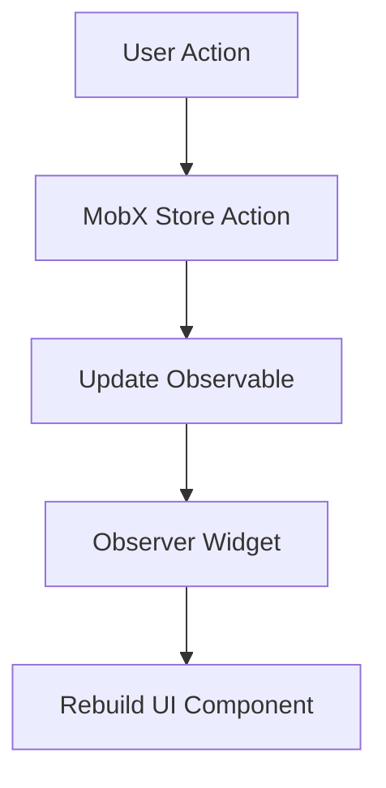

## 7.2.4 Integrating MobX with Flutter Widgets

In this section, we will explore how to integrate MobX with Flutter widgets to create reactive user interfaces. MobX is a powerful state management library that allows for seamless reactivity in Flutter applications. By leveraging MobX, you can build UIs that automatically update in response to changes in the underlying state, without the need for manual `setState` calls. This integration is achieved through the use of `Observer` widgets, which ensure that only the necessary parts of the UI are rebuilt when observables change.

### Using Observer Widgets

The `Observer` widget is a cornerstone of MobX's reactivity in Flutter. It acts as a bridge between your UI and the MobX store, rebuilding the UI components it wraps whenever the observables they depend on change. This ensures that your application remains responsive and efficient.

#### Example: Wrapping UI Components with Observer

Consider a simple counter application where the counter value is stored in a MobX store. By wrapping the `Text` widget displaying the counter value with an `Observer`, we ensure that it updates automatically whenever the counter changes:

```dart
import 'package:flutter/material.dart';
import 'package:flutter_mobx/flutter_mobx.dart';
import 'counter_store.dart'; // Assume this file contains the MobX store

class CounterApp extends StatelessWidget {
  final CounterStore counterStore = CounterStore();

  @override
  Widget build(BuildContext context) {
    return MaterialApp(
      home: Scaffold(
        appBar: AppBar(title: Text('MobX Counter')),
        body: Center(
          child: Column(
            mainAxisAlignment: MainAxisAlignment.center,
            children: [
              Observer(
                builder: (_) => Text(
                  'Counter: ${counterStore.counter}',
                  style: TextStyle(fontSize: 24),
                ),
              ),
              ElevatedButton(
                onPressed: counterStore.incrementCounter,
                child: Text('Increment'),
              ),
            ],
          ),
        ),
      ),
    );
  }
}
```

In this example, the `Observer` widget listens to changes in the `counter` observable from the `CounterStore`. Whenever `counter` is updated, the `Text` widget is rebuilt to reflect the new value.

### Reactivity in the UI

One of the key advantages of using MobX is that it allows the UI to react automatically to changes in the state. This eliminates the need for manual state management calls like `setState`, making your code cleaner and more maintainable.

- **Automatic UI Updates:** With MobX, the UI components wrapped in `Observer` widgets are automatically rebuilt when the observables they depend on change. This ensures that your application remains responsive to user interactions and state changes.

- **Selective Rebuilding:** Only the parts of the UI that are wrapped in `Observer` widgets are rebuilt when observables change. This selective rebuilding helps optimize performance by minimizing unnecessary widget rebuilds.

### Avoiding Unnecessary Rebuilds

To optimize performance, it's important to ensure that only the necessary parts of the UI are wrapped in `Observer` widgets. Wrapping entire widget trees in `Observer` can lead to unnecessary rebuilds, which can degrade performance.

#### Strategies for Optimizing Widget Rebuilds

- **Wrap Only Necessary Widgets:** Identify the specific widgets that need to react to state changes and wrap only those in `Observer` widgets. This minimizes the number of widgets that need to be rebuilt.

- **Use StatelessWidgets:** Since MobX handles state changes, most of your UI can remain as `StatelessWidget`. This simplifies your widget hierarchy and improves performance.

### Using StatelessWidgets

MobX's reactivity allows you to use `StatelessWidget` for most of your UI components. This is because the `Observer` widget takes care of rebuilding the necessary parts of the UI when observables change, eliminating the need for `StatefulWidget` in many cases.

### Accessing the Store in Widgets

To use MobX effectively, you need to provide the MobX store to your widgets. This can be done through constructor injection or by using a state management solution like the `Provider` package.

#### Example: Constructor Injection

Constructor injection is a straightforward way to pass the MobX store to your widgets. Here's how you can implement it:

```dart
class CounterView extends StatelessWidget {
  final CounterStore counterStore;

  CounterView({required this.counterStore});

  @override
  Widget build(BuildContext context) {
    return Observer(
      builder: (_) => Text('Counter: ${counterStore.counter}'),
    );
  }
}
```

In this example, the `CounterView` widget receives the `CounterStore` instance through its constructor, allowing it to access the store's observables and actions.

### Handling User Input

MobX makes it easy to connect user actions in the UI to actions in the store. By defining actions in your MobX store, you can update the state in response to user interactions.

#### Example: Connecting User Actions to Store Actions

Here's how you can connect a button press to an action in the MobX store:

```dart
ElevatedButton(
  onPressed: counterStore.incrementCounter,
  child: Text('Increment'),
);
```

In this example, pressing the button triggers the `incrementCounter` action in the `CounterStore`, which updates the `counter` observable.

### Combining MobX with Flutter Forms

MobX can also be used to manage form state and validation in Flutter applications. By using `Observable` properties to track form inputs and errors, you can create dynamic and responsive forms.

#### Example: Managing Form State with MobX

Consider a simple form with a text input field. You can use MobX to track the input value and validate it:

```dart
import 'package:flutter/material.dart';
import 'package:flutter_mobx/flutter_mobx.dart';
import 'form_store.dart'; // Assume this file contains the MobX store

class FormExample extends StatelessWidget {
  final FormStore formStore = FormStore();

  @override
  Widget build(BuildContext context) {
    return Scaffold(
      appBar: AppBar(title: Text('MobX Form')),
      body: Padding(
        padding: const EdgeInsets.all(16.0),
        child: Column(
          children: [
            Observer(
              builder: (_) => TextField(
                onChanged: formStore.setName,
                decoration: InputDecoration(
                  labelText: 'Name',
                  errorText: formStore.nameError,
                ),
              ),
            ),
            ElevatedButton(
              onPressed: formStore.submitForm,
              child: Text('Submit'),
            ),
          ],
        ),
      ),
    );
  }
}
```

In this example, the `TextField` is wrapped in an `Observer` widget to listen for changes in the `name` observable. The `errorText` property displays validation errors, which are also tracked by MobX.

### Best Practices

To make the most of MobX in your Flutter applications, consider the following best practices:

- **Keep UI Code Clean:** Delegate business logic and state management to the MobX store, keeping your UI code clean and focused on presentation.

- **Use Actions for State Changes:** Avoid directly modifying observables in the UI. Instead, use actions defined in the MobX store to update the state.

- **Optimize Widget Rebuilds:** Wrap only the necessary parts of the UI in `Observer` widgets to minimize unnecessary rebuilds and improve performance.

### Code Examples

Let's build a simple counter app using MobX, including the full widget code:

```dart
import 'package:flutter/material.dart';
import 'package:flutter_mobx/flutter_mobx.dart';
import 'package:mobx/mobx.dart';

// MobX Store
class CounterStore {
  // Observable
  final _counter = Observable(0);

  // Computed
  int get counter => _counter.value;

  // Action
  void incrementCounter() {
    _counter.value++;
  }
}

void main() {
  runApp(CounterApp());
}

class CounterApp extends StatelessWidget {
  final CounterStore counterStore = CounterStore();

  @override
  Widget build(BuildContext context) {
    return MaterialApp(
      home: Scaffold(
        appBar: AppBar(title: Text('MobX Counter')),
        body: Center(
          child: Column(
            mainAxisAlignment: MainAxisAlignment.center,
            children: [
              Observer(
                builder: (_) => Text(
                  'Counter: ${counterStore.counter}',
                  style: TextStyle(fontSize: 24),
                ),
              ),
              ElevatedButton(
                onPressed: counterStore.incrementCounter,
                child: Text('Increment'),
              ),
            ],
          ),
        ),
      ),
    );
  }
}
```

### Mermaid.js Diagrams

To better understand how the UI interacts with the MobX store, consider the following diagram:



This diagram illustrates the flow of data and control in a MobX-powered Flutter application. User actions trigger store actions, which update observables. The `Observer` widget listens for changes in these observables and rebuilds the UI components as needed.

### Key Takeaways

- **Reactive UIs:** MobX allows you to create reactive UIs that automatically update in response to state changes.
- **Efficient Rebuilding:** By using `Observer` widgets, you can ensure that only the necessary parts of the UI are rebuilt, optimizing performance.
- **Separation of Concerns:** Keep your UI code clean by delegating state management to the MobX store and using actions to update the state.

Encourage experimenting with building different UI components using MobX, and explore how it can simplify state management in your Flutter applications.

## Quiz Time!



### What is the primary role of the `Observer` widget in MobX?

- [x] To rebuild UI components when observables change
- [ ] To manage state transitions in the MobX store
- [ ] To handle user input events
- [ ] To provide dependency injection for stores

> **Explanation:** The `Observer` widget in MobX rebuilds UI components whenever the observables it observes change, ensuring the UI stays in sync with the state.

### How can you prevent unnecessary widget rebuilds in MobX?

- [x] Wrap only necessary parts of the UI with `Observer`
- [ ] Use `StatefulWidget` for all UI components
- [ ] Avoid using `Observer` widgets
- [ ] Directly modify observables in the UI

> **Explanation:** To prevent unnecessary rebuilds, wrap only the parts of the UI that need to react to state changes with `Observer` widgets.

### What is a recommended practice for modifying observables in MobX?

- [x] Use actions defined in the MobX store
- [ ] Directly modify observables in the UI
- [ ] Use `setState` to update observables
- [ ] Modify observables in the `build` method

> **Explanation:** It is recommended to use actions defined in the MobX store to modify observables, ensuring a clear separation of concerns.

### How does MobX handle reactivity in Flutter applications?

- [x] By using `Observer` widgets to listen for changes in observables
- [ ] By using `setState` to manually update the UI
- [ ] By requiring all widgets to be `StatefulWidget`
- [ ] By automatically wrapping all widgets in `Observer`

> **Explanation:** MobX handles reactivity by using `Observer` widgets to listen for changes in observables and automatically rebuild the UI components that depend on them.

### What is the benefit of using `StatelessWidget` with MobX?

- [x] It simplifies the widget hierarchy and improves performance
- [ ] It allows direct modification of observables in the UI
- [ ] It requires less boilerplate code than `StatefulWidget`
- [ ] It automatically manages state transitions

> **Explanation:** Using `StatelessWidget` with MobX simplifies the widget hierarchy and improves performance, as MobX handles state changes through `Observer` widgets.

### How can you pass a MobX store to a widget?

- [x] Through constructor injection
- [ ] By using `setState`
- [ ] By directly accessing the store in the UI
- [ ] By using a global variable

> **Explanation:** A MobX store can be passed to a widget through constructor injection, allowing the widget to access the store's observables and actions.

### What is the role of actions in MobX?

- [x] To encapsulate state changes and ensure consistency
- [ ] To directly modify observables in the UI
- [ ] To handle user input events
- [ ] To provide dependency injection for stores

> **Explanation:** Actions in MobX encapsulate state changes and ensure consistency, providing a clear way to modify observables.

### How can MobX be used to manage form state in Flutter?

- [x] By using `Observable` properties to track form inputs and errors
- [ ] By using `setState` to update form fields
- [ ] By directly modifying form fields in the UI
- [ ] By using `StatefulWidget` for all form components

> **Explanation:** MobX can manage form state by using `Observable` properties to track form inputs and errors, allowing for dynamic and responsive forms.

### What is a key takeaway from integrating MobX with Flutter widgets?

- [x] MobX allows for reactive UIs that automatically update in response to state changes
- [ ] MobX requires manual `setState` calls to update the UI
- [ ] MobX is only suitable for small applications
- [ ] MobX does not support form validation

> **Explanation:** A key takeaway is that MobX allows for reactive UIs that automatically update in response to state changes, simplifying state management.

### True or False: MobX requires all widgets to be `StatefulWidget`.

- [ ] True
- [x] False

> **Explanation:** False. MobX allows most widgets to remain as `StatelessWidget` because it handles state changes through `Observer` widgets.


