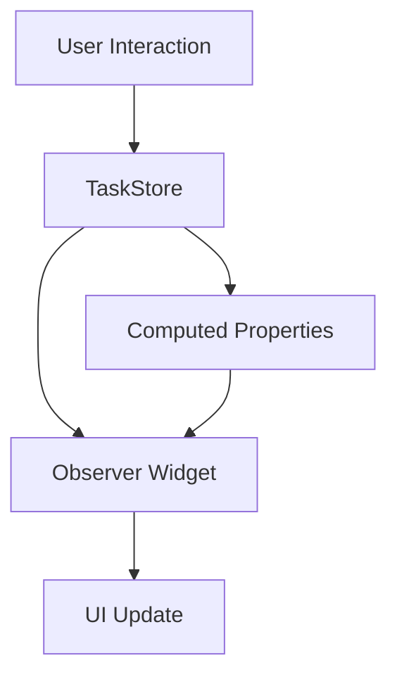

## 7.3.3 UI Components and Observers

In this section, we will delve into the practical implementation of UI components using MobX for state management in Flutter. The focus will be on creating a responsive user interface that reacts to state changes using `Observer` widgets. We will build a task management application to demonstrate these concepts.

### Building the Task List UI

The task list UI is the heart of our application, where users can view, add, and manage their tasks. We'll use MobX to ensure that any changes in the task list are immediately reflected in the UI.

#### Creating the Home Screen

The `HomeScreen` will display a list of tasks. We'll use an `Observer` widget to ensure that any changes in the task list are automatically updated in the UI.

```dart
import 'package:flutter/material.dart';
import 'package:flutter_mobx/flutter_mobx.dart';
import 'package:your_app/stores/task_store.dart';
import 'package:your_app/widgets/task_item.dart';

class HomeScreen extends StatelessWidget {
  final TaskStore taskStore;

  HomeScreen({required this.taskStore});

  @override
  Widget build(BuildContext context) {
    return Scaffold(
      appBar: AppBar(title: Text('Task Manager')),
      body: Observer(
        builder: (_) => ListView.builder(
          itemCount: taskStore.taskList.length,
          itemBuilder: (context, index) {
            final task = taskStore.taskList[index];
            return TaskItem(
              task: task,
              onToggle: () => taskStore.toggleTaskStatus(task.id),
              onDelete: () => taskStore.removeTask(task.id),
            );
          },
        ),
      ),
      floatingActionButton: FloatingActionButton(
        onPressed: () {
          Navigator.push(
            context,
            MaterialPageRoute(
              builder: (context) => AddTaskScreen(taskStore: taskStore),
            ),
          );
        },
        child: Icon(Icons.add),
      ),
    );
  }
}
```

**Key Points:**
- The `Observer` widget listens to changes in the `taskStore.taskList` and rebuilds the `ListView` whenever the list changes.
- The `FloatingActionButton` is used to navigate to the `AddTaskScreen`, where users can add new tasks.

### Creating the Task Item Widget

Each task is represented by a `TaskItem` widget. This widget displays task details and provides options to toggle completion status or delete the task.

```dart
import 'package:flutter/material.dart';
import 'package:your_app/models/task.dart';

class TaskItem extends StatelessWidget {
  final Task task;
  final VoidCallback onToggle;
  final VoidCallback onDelete;

  TaskItem({
    required this.task,
    required this.onToggle,
    required this.onDelete,
  });

  @override
  Widget build(BuildContext context) {
    return ListTile(
      title: Text(task.title),
      subtitle: Text(task.description),
      leading: Checkbox(
        value: task.isCompleted,
        onChanged: (_) => onToggle(),
      ),
      trailing: IconButton(
        icon: Icon(Icons.delete),
        onPressed: onDelete,
      ),
    );
  }
}
```

**Key Points:**
- The `Checkbox` widget allows users to mark tasks as completed or pending.
- The `IconButton` provides a delete option for each task.

### Adding New Tasks

To add new tasks, we will create an `AddTaskScreen` with a form. This screen will use `TextEditingController` to capture user input.

```dart
import 'package:flutter/material.dart';
import 'package:your_app/stores/task_store.dart';
import 'package:your_app/models/task.dart';

class AddTaskScreen extends StatelessWidget {
  final TaskStore taskStore;
  final TextEditingController titleController = TextEditingController();
  final TextEditingController descriptionController = TextEditingController();

  AddTaskScreen({required this.taskStore});

  @override
  Widget build(BuildContext context) {
    return Scaffold(
      appBar: AppBar(title: Text('Add New Task')),
      body: Padding(
        padding: EdgeInsets.all(16.0),
        child: Column(
          children: [
            TextField(
              controller: titleController,
              decoration: InputDecoration(labelText: 'Title'),
            ),
            TextField(
              controller: descriptionController,
              decoration: InputDecoration(labelText: 'Description'),
            ),
            SizedBox(height: 20),
            ElevatedButton(
              onPressed: () {
                final task = Task(
                  id: DateTime.now().toString(),
                  title: titleController.text,
                  description: descriptionController.text,
                  isCompleted: false,
                );
                taskStore.addTask(task);
                Navigator.pop(context);
              },
              child: Text('Add Task'),
            ),
          ],
        ),
      ),
    );
  }
}
```

**Key Points:**
- The `TextField` widgets capture the task title and description.
- On submission, a new `Task` object is created and added to the `taskStore`.

### Navigation Between Screens

Navigation is handled using Flutter's `Navigator` class. We pass the `taskStore` to the `AddTaskScreen` to maintain a single source of truth for the task list.

```dart
Navigator.push(
  context,
  MaterialPageRoute(
    builder: (context) => AddTaskScreen(taskStore: taskStore),
  ),
);
```

**Key Points:**
- Use `Navigator.push` to navigate to the `AddTaskScreen`.
- Use `Navigator.pop` to return to the previous screen after adding a task.

### Filtering Tasks

To enhance the user experience, we can add filtering options to view all, completed, or pending tasks. This can be achieved using computed properties in the MobX store.

```dart
// In TaskStore
@computed
List<Task> get completedTasks => taskList.where((task) => task.isCompleted).toList();

@computed
List<Task> get pendingTasks => taskList.where((task) => !task.isCompleted).toList();
```

**Key Points:**
- Use computed properties to derive filtered lists of tasks.
- Update the UI to allow users to select different filters.

### Best Practices

- **Keep UI Components Stateless:** Whenever possible, keep your UI components stateless and rely on MobX for state management.
- **Use Observer Strategically:** Use `Observer` widgets only where necessary to optimize performance and avoid unnecessary rebuilds.

### Code Examples

For a complete codebase, refer to the [GitHub repository](https://github.com/your-repo/task-manager) containing all the examples discussed.

### Mermaid.js Diagrams

To better understand the flow of data and user interactions, consider the following diagram:



**Explanation:**
- User interactions trigger changes in the `TaskStore`.
- The `Observer` widget listens for changes and updates the UI accordingly.
- Computed properties provide filtered views of the task list.

### Key Takeaways

- **Reactive UI:** MobX allows for building highly reactive UIs that respond instantly to state changes.
- **Experimentation:** Encourage experimentation with different UI components and observe how they react to changes in the MobX store.

By following these guidelines, you can create a robust and responsive task management application using MobX in Flutter. This approach not only simplifies state management but also enhances the user experience by ensuring that the UI is always in sync with the underlying data.

## Quiz Time!



### What is the primary role of the `Observer` widget in MobX?

- [x] To listen for changes in observable state and rebuild the UI when changes occur.
- [ ] To manage navigation between screens.
- [ ] To handle user inputs and form submissions.
- [ ] To store application-wide settings.

> **Explanation:** The `Observer` widget in MobX listens for changes in observable state and rebuilds the UI when changes occur, ensuring the UI is always up-to-date.

### In the `HomeScreen` example, what does the `FloatingActionButton` do?

- [x] It navigates to the `AddTaskScreen`.
- [ ] It deletes all tasks.
- [ ] It marks all tasks as completed.
- [ ] It refreshes the task list.

> **Explanation:** The `FloatingActionButton` is used to navigate to the `AddTaskScreen`, allowing users to add new tasks.

### How are new tasks added to the `taskStore` in the `AddTaskScreen`?

- [x] By creating a new `Task` object and calling `taskStore.addTask(task)`.
- [ ] By directly modifying the `taskList`.
- [ ] By using a `setState` call.
- [ ] By sending a request to a backend server.

> **Explanation:** New tasks are added by creating a `Task` object and calling the `addTask` method on the `taskStore`, which manages the list of tasks.

### What is the purpose of computed properties in the `TaskStore`?

- [x] To provide derived data, such as filtered lists of tasks.
- [ ] To handle user authentication.
- [ ] To manage network requests.
- [ ] To store application settings.

> **Explanation:** Computed properties in MobX are used to provide derived data, such as filtered lists of tasks, based on the current state.

### Why should UI components be kept stateless when possible?

- [x] To improve performance and maintainability.
- [ ] To reduce the number of files in the project.
- [ ] To simplify navigation logic.
- [ ] To ensure compatibility with older devices.

> **Explanation:** Keeping UI components stateless improves performance and maintainability by separating UI logic from state management.

### What is the benefit of using `Navigator.push` in Flutter?

- [x] It allows for navigation to new screens.
- [ ] It updates the state of the current screen.
- [ ] It refreshes the widget tree.
- [ ] It saves user preferences.

> **Explanation:** `Navigator.push` is used in Flutter to navigate to new screens, enabling users to move through different parts of the app.

### How does the `Checkbox` widget in the `TaskItem` function?

- [x] It allows users to toggle the completion status of a task.
- [ ] It deletes the task when checked.
- [ ] It opens a detailed view of the task.
- [ ] It shares the task on social media.

> **Explanation:** The `Checkbox` widget in the `TaskItem` allows users to toggle the completion status of a task, updating its state.

### What happens when the `onDelete` callback is triggered in the `TaskItem`?

- [x] The task is removed from the `taskStore`.
- [ ] The task is marked as completed.
- [ ] The task is duplicated.
- [ ] The task is archived.

> **Explanation:** When the `onDelete` callback is triggered, the task is removed from the `taskStore`, effectively deleting it from the list.

### How do `Observer` widgets contribute to performance optimization?

- [x] By only rebuilding parts of the UI that depend on the observed state.
- [ ] By caching network requests.
- [ ] By reducing the number of widgets in the tree.
- [ ] By compressing images used in the app.

> **Explanation:** `Observer` widgets contribute to performance optimization by only rebuilding parts of the UI that depend on the observed state, minimizing unnecessary updates.

### True or False: MobX requires all widgets to be wrapped in `Observer` widgets.

- [ ] True
- [x] False

> **Explanation:** False. MobX only requires widgets that need to react to changes in observable state to be wrapped in `Observer` widgets, not all widgets.


