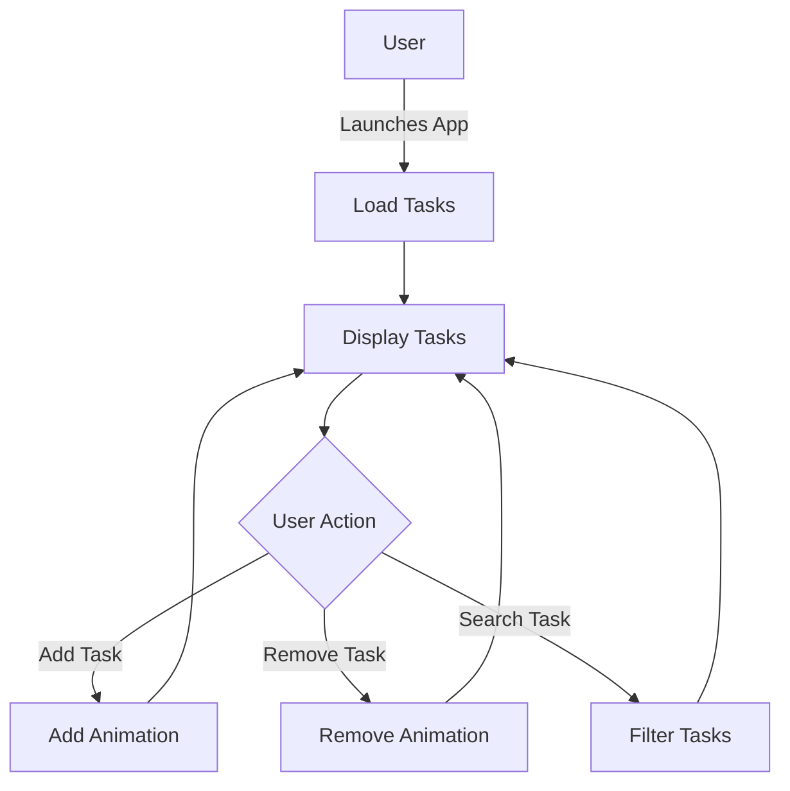

## 7.3.4 Adding Features and Enhancements

In this section, we delve into enhancing a Flutter application using MobX for state management. We'll explore various strategies to persist data, restore state, improve user experience, handle errors, and test the application. Additionally, we'll discuss refactoring and code organization to maintain a clean and scalable codebase. By the end of this section, you'll have a comprehensive understanding of how to iteratively improve your Flutter app, leveraging MobX's reactive capabilities.

### Persisting Data

Persisting data is crucial for maintaining user progress and preferences across app sessions. In Flutter, you can use packages like `shared_preferences` or `hive` to store data locally.

#### Using `shared_preferences`

`shared_preferences` is a simple key-value storage solution suitable for small amounts of data.

1. **Add Dependency:**

   Add `shared_preferences` to your `pubspec.yaml`:

   ```yaml
   dependencies:
     shared_preferences: ^2.0.6
   ```

2. **Initialize and Load Data:**

   Load tasks when the app initializes:

   ```dart
   import 'package:shared_preferences/shared_preferences.dart';

   Future<void> loadTasks() async {
     final prefs = await SharedPreferences.getInstance();
     final taskList = prefs.getStringList('tasks') ?? [];
     // Convert taskList to MobX observable list
     tasks.addAll(taskList.map((task) => Task.fromJson(task)));
   }
   ```

3. **Save Data on Changes:**

   Save tasks whenever they change:

   ```dart
   Future<void> saveTasks() async {
     final prefs = await SharedPreferences.getInstance();
     prefs.setStringList('tasks', tasks.map((task) => task.toJson()).toList());
   }
   ```

#### Using `hive`

`hive` is a more robust solution for complex data structures.

1. **Add Dependency:**

   Add `hive` and `hive_flutter` to your `pubspec.yaml`:

   ```yaml
   dependencies:
     hive: ^2.0.4
     hive_flutter: ^1.1.0
   ```

2. **Initialize Hive:**

   Initialize Hive in your main function:

   ```dart
   void main() async {
     await Hive.initFlutter();
     Hive.registerAdapter(TaskAdapter());
     runApp(MyApp());
   }
   ```

3. **Load and Save Data:**

   Use Hive boxes to load and save tasks:

   ```dart
   var box = await Hive.openBox('taskBox');

   // Load tasks
   tasks.addAll(box.values.cast<Task>());

   // Save tasks
   box.put('tasks', tasks);
   ```

### State Restoration

Handling app lifecycle events is essential for a seamless user experience. Flutter provides lifecycle methods to manage state restoration.

1. **Listen to Lifecycle Changes:**

   Use `WidgetsBindingObserver` to listen for lifecycle changes:

   ```dart
   class MyAppState extends State<MyApp> with WidgetsBindingObserver {
     @override
     void initState() {
       super.initState();
       WidgetsBinding.instance.addObserver(this);
     }

     @override
     void dispose() {
       WidgetsBinding.instance.removeObserver(this);
       super.dispose();
     }

     @override
     void didChangeAppLifecycleState(AppLifecycleState state) {
       if (state == AppLifecycleState.paused) {
         saveTasks(); // Save tasks when the app is paused
       }
     }
   }
   ```

2. **Restore State on Initialization:**

   Restore state when the app is launched:

   ```dart
   @override
   void initState() {
     super.initState();
     loadTasks(); // Load tasks on app start
   }
   ```

### Improving the User Experience

Enhancing the user experience involves adding features like search functionality and animations.

#### Search Functionality

Implement a search bar to filter tasks by title or description.

1. **Add a Search Bar:**

   Integrate a search bar into your UI:

   ```dart
   TextField(
     onChanged: (value) => searchTasks(value),
     decoration: InputDecoration(
       labelText: 'Search',
       prefixIcon: Icon(Icons.search),
     ),
   )
   ```

2. **Filter Tasks:**

   Implement the search logic:

   ```dart
   void searchTasks(String query) {
     final filteredTasks = tasks.where((task) {
       return task.title.contains(query) || task.description.contains(query);
     }).toList();
     // Update the UI with filteredTasks
   }
   ```

#### Animation Effects

Use animations to enhance task addition and removal.

1. **Add Animation on Task Addition:**

   Wrap task widgets with `AnimatedList`:

   ```dart
   AnimatedList(
     initialItemCount: tasks.length,
     itemBuilder: (context, index, animation) {
       return SlideTransition(
         position: animation.drive(Tween<Offset>(
           begin: Offset(1, 0),
           end: Offset(0, 0),
         )),
         child: TaskWidget(task: tasks[index]),
       );
     },
   )
   ```

2. **Animate Task Removal:**

   Use `AnimatedList` to animate task removal:

   ```dart
   void removeTask(int index) {
     final removedTask = tasks.removeAt(index);
     AnimatedList.of(context).removeItem(
       index,
       (context, animation) => SlideTransition(
         position: animation.drive(Tween<Offset>(
           begin: Offset(0, 0),
           end: Offset(-1, 0),
         )),
         child: TaskWidget(task: removedTask),
       ),
     );
   }
   ```

### Error Handling

Robust error handling ensures a smooth user experience and prevents data loss.

#### Validation

Validate task inputs to ensure all required fields are filled.

1. **Add Validation Logic:**

   Implement validation in your form:

   ```dart
   String? validateTitle(String? value) {
     if (value == null || value.isEmpty) {
       return 'Title is required';
     }
     return null;
   }
   ```

2. **Provide User Feedback:**

   Display error messages to the user:

   ```dart
   TextFormField(
     validator: validateTitle,
     decoration: InputDecoration(
       labelText: 'Title',
       errorText: errorText,
     ),
   )
   ```

### Testing the Application

Testing ensures your application works as expected and helps catch bugs early.

#### Testing MobX Stores

Use Dart's `test` package to write unit tests for MobX stores.

1. **Add Test Dependency:**

   Add `test` to your `pubspec.yaml`:

   ```yaml
   dev_dependencies:
     test: ^1.16.0
   ```

2. **Write Tests for MobX Stores:**

   Test store logic:

   ```dart
   import 'package:test/test.dart';

   void main() {
     test('Add task', () {
       final store = TaskStore();
       store.addTask('New Task');
       expect(store.tasks.length, 1);
       expect(store.tasks.first.title, 'New Task');
     });
   }
   ```

#### Testing UI Components

Use `flutter_test` to test UI components.

1. **Write Widget Tests:**

   Test UI interactions:

   ```dart
   import 'package:flutter_test/flutter_test.dart';

   void main() {
     testWidgets('Add task button', (WidgetTester tester) async {
       await tester.pumpWidget(MyApp());

       await tester.enterText(find.byType(TextField), 'New Task');
       await tester.tap(find.byType(FloatingActionButton));
       await tester.pump();

       expect(find.text('New Task'), findsOneWidget);
     });
   }
   ```

### Refactoring and Code Organization

Refactoring improves code readability and maintainability.

#### Splitting Widgets

Break down large widgets into smaller, reusable components.

1. **Create Smaller Widgets:**

   Extract task item into its own widget:

   ```dart
   class TaskItem extends StatelessWidget {
     final Task task;

     TaskItem({required this.task});

     @override
     Widget build(BuildContext context) {
       return ListTile(
         title: Text(task.title),
         subtitle: Text(task.description),
       );
     }
   }
   ```

#### Organizing Code

Follow best practices for organizing your Flutter project.

1. **Use Feature Folders:**

   Organize code by feature:

   ```
   lib/
     features/
       tasks/
         models/
         views/
         controllers/
   ```

2. **Separate Business Logic:**

   Keep business logic separate from UI code.

### Mermaid.js Diagrams

Visualize the enhanced application flow using Mermaid.js diagrams.



### Key Takeaways

- **Iterative Development:** Enhancing an app is an ongoing process. Continuously seek opportunities to improve functionality and user experience.
- **Creative Thinking:** Encourage innovation in feature development. Consider user feedback and emerging trends.
- **Refinement:** Regularly refactor and organize code to maintain a clean and efficient codebase.

By following these strategies, you can create a robust, user-friendly Flutter application using MobX for state management. Remember, the key to successful app development lies in continuous improvement and adaptation to user needs and technological advancements.

## Quiz Time!



### What is the primary purpose of using `shared_preferences` in a Flutter app?

- [x] To store small amounts of data locally
- [ ] To manage complex data structures
- [ ] To handle network requests
- [ ] To perform animations

> **Explanation:** `shared_preferences` is used for storing small amounts of data locally, such as user preferences or simple settings.

### Which package is more suitable for complex data structures in Flutter?

- [ ] shared_preferences
- [x] hive
- [ ] provider
- [ ] mobx

> **Explanation:** `hive` is a lightweight and fast key-value database that is suitable for complex data structures.

### How can you listen to app lifecycle changes in Flutter?

- [x] By using WidgetsBindingObserver
- [ ] By using setState
- [ ] By using a Future
- [ ] By using a Stream

> **Explanation:** `WidgetsBindingObserver` is used to listen to app lifecycle changes, such as when the app is paused or resumed.

### What is the purpose of adding animations when tasks are added or removed?

- [ ] To increase app complexity
- [x] To enhance user experience
- [ ] To reduce app performance
- [ ] To store data

> **Explanation:** Animations enhance the user experience by providing visual feedback and making interactions more engaging.

### What is a key benefit of testing MobX stores?

- [x] Ensures the store logic works as expected
- [ ] Increases app size
- [ ] Reduces code readability
- [ ] Decreases app performance

> **Explanation:** Testing MobX stores ensures that the store logic works as expected and helps catch bugs early.

### What should be validated when adding new tasks?

- [x] Required fields are filled
- [ ] The app is in dark mode
- [ ] The user is logged in
- [ ] The app is running on iOS

> **Explanation:** Validation ensures that all required fields are filled when adding new tasks, preventing incomplete data entries.

### How can you organize a Flutter project for better maintainability?

- [x] Use feature folders
- [ ] Use a single file for all code
- [ ] Avoid using comments
- [ ] Use random file names

> **Explanation:** Organizing code by feature folders helps maintain a clean and scalable project structure.

### Which method is used to save tasks when the app is paused?

- [x] saveTasks()
- [ ] loadTasks()
- [ ] initState()
- [ ] dispose()

> **Explanation:** The `saveTasks()` method is used to save tasks when the app is paused, ensuring data persistence.

### What is the role of `AnimatedList` in Flutter?

- [x] To animate the addition and removal of list items
- [ ] To handle network requests
- [ ] To manage app state
- [ ] To perform database operations

> **Explanation:** `AnimatedList` is used to animate the addition and removal of list items, enhancing the user interface.

### True or False: Refactoring code is only necessary when adding new features.

- [ ] True
- [x] False

> **Explanation:** Refactoring is an ongoing process that improves code readability and maintainability, not just when adding new features.


