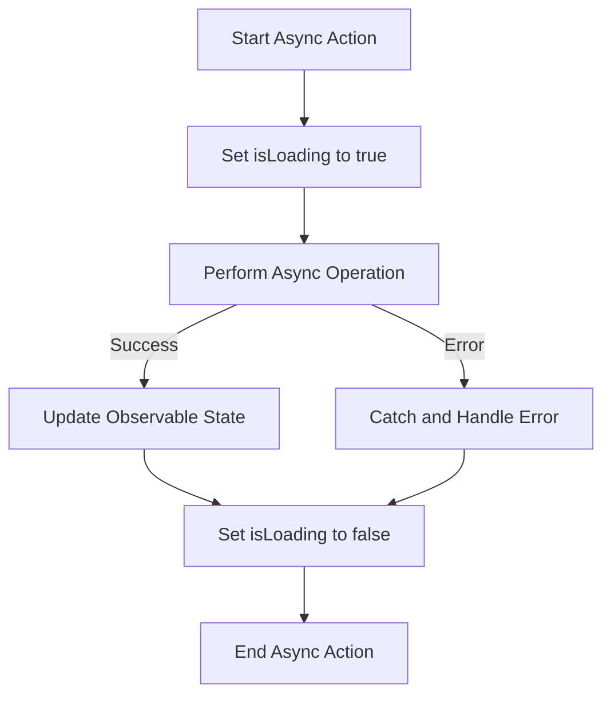

## 7.4.1 Asynchronous Actions

In the dynamic world of mobile app development, handling asynchronous operations efficiently is crucial for creating responsive and user-friendly applications. MobX, a popular state management library in Flutter, provides robust tools for managing asynchronous actions seamlessly. This section delves into the intricacies of asynchronous actions in MobX, offering insights, practical examples, and best practices to enhance your Flutter applications.

### Handling Async Operations

Asynchronous operations, such as fetching data from a server or performing long-running computations, are integral to modern apps. In MobX, these operations can be encapsulated within actions, allowing you to manage state changes predictably and efficiently.

#### Importance of Managing UI State

When performing asynchronous tasks, it's essential to manage the UI state to ensure a smooth user experience. This often involves displaying loading indicators while data is being fetched and updating the UI once the operation completes or fails. By managing UI state effectively, you can keep users informed and engaged, even during potentially lengthy operations.

### Example of an Async Action

Let's explore a practical example of an asynchronous action in MobX. Consider a scenario where you need to fetch a list of tasks from a server:

```dart
import 'package:mobx/mobx.dart';

// Include generated file
part 'task_store.g.dart';

// This is the class used by rest of your codebase
class TaskStore = _TaskStore with _$TaskStore;

// The store-class
abstract class _TaskStore with Store {
  @observable
  ObservableList<Task> taskList = ObservableList<Task>();

  @observable
  bool isLoading = false;

  @action
  Future<void> fetchTasksFromServer() async {
    isLoading = true;
    try {
      final tasksData = await api.getTasks();
      taskList = ObservableList.of(tasksData);
    } catch (error) {
      // Handle error
    } finally {
      isLoading = false;
    }
  }
}
```

In this example, the `fetchTasksFromServer` action:

- **Sets `isLoading` to `true`** before starting the asynchronous operation, signaling to the UI that data fetching is in progress.
- **Attempts to fetch tasks** from the server using `await api.getTasks()`.
- **Updates `taskList`** with the fetched data, wrapped in an `ObservableList` to ensure reactivity.
- **Handles errors** gracefully using a `try-catch` block.
- **Resets `isLoading` to `false`** in the `finally` block, ensuring the loading indicator is hidden regardless of success or failure.

### Error Handling in Async Actions

Handling errors effectively in asynchronous actions is crucial to maintaining app stability and providing meaningful feedback to users. In MobX, you can use `try-catch` blocks to manage exceptions and update the store with error messages if needed.

```dart
@observable
String errorMessage = '';

@action
Future<void> fetchTasksFromServer() async {
  isLoading = true;
  errorMessage = ''; // Reset error message
  try {
    final tasksData = await api.getTasks();
    taskList = ObservableList.of(tasksData);
  } catch (error) {
    errorMessage = 'Failed to fetch tasks: ${error.toString()}';
  } finally {
    isLoading = false;
  }
}
```

In this enhanced example, an `errorMessage` observable is used to store any error messages, which can be displayed in the UI to inform users of issues.

### Optimization

When dealing with asynchronous actions, optimization can significantly enhance performance and user experience. Here are some strategies:

- **Debouncing Actions:** If an action is triggered frequently (e.g., a search query as the user types), consider debouncing to limit the frequency of API calls.
- **Canceling Ongoing Operations:** If an operation becomes irrelevant (e.g., navigating away from a page), cancel it to save resources.

### Best Practices

To ensure your MobX-based Flutter applications remain responsive and robust, consider the following best practices:

- **Keep UI Responsive:** Use loading indicators and disable UI elements as needed during async operations.
- **Handle Errors Gracefully:** Provide meaningful error messages and fallback options to users.
- **Optimize Performance:** Implement debouncing and cancellation strategies where applicable.

### Visualizing Async Action Flow

To better understand the flow of an asynchronous action, consider the following Mermaid.js diagram illustrating the process from initiation to completion, including error handling:



### Key Takeaways

- **Effective Management:** Asynchronous actions in MobX allow for efficient state management during operations like data fetching.
- **Error Handling:** Proper error handling ensures app stability and user satisfaction.
- **Optimization Techniques:** Implementing debouncing and cancellation can improve performance.
- **Best Practices:** Keeping the UI responsive and handling errors gracefully are crucial for a seamless user experience.

By mastering asynchronous actions in MobX, you can create Flutter applications that are not only functional but also provide a smooth and engaging user experience. As you continue to explore MobX, remember to experiment with different strategies and adapt them to your specific project needs.

## Quiz Time!



### What is the primary purpose of using `@action` in MobX?

- [x] To define a method that modifies observable state
- [ ] To create a new observable
- [ ] To handle exceptions in asynchronous operations
- [ ] To automatically generate UI components

> **Explanation:** The `@action` decorator is used to define methods that modify observable state in MobX, ensuring state changes are tracked and can trigger reactions.

### Why is it important to manage UI state during asynchronous operations?

- [x] To keep the user informed and engaged
- [ ] To reduce the app's memory usage
- [ ] To increase the app's startup time
- [ ] To prevent network requests

> **Explanation:** Managing UI state during asynchronous operations, such as showing loading indicators, keeps the user informed and engaged, improving the overall user experience.

### How can you handle errors in asynchronous actions in MobX?

- [x] By using try-catch blocks and updating an error message observable
- [ ] By ignoring the errors and proceeding with the next operation
- [ ] By restarting the app
- [ ] By logging errors to a file

> **Explanation:** Using try-catch blocks allows you to handle exceptions and update an error message observable, which can be displayed to inform users of issues.

### What is debouncing in the context of asynchronous actions?

- [x] Limiting the frequency of action triggers
- [ ] Increasing the speed of network requests
- [ ] Caching the results of asynchronous operations
- [ ] Automatically retrying failed requests

> **Explanation:** Debouncing is a technique used to limit the frequency of action triggers, especially useful for actions that are called frequently, such as search queries.

### Which observable is used in the example to indicate the loading state?

- [x] isLoading
- [ ] errorMessage
- [ ] taskList
- [ ] api

> **Explanation:** The `isLoading` observable is used to indicate the loading state, helping manage UI elements like loading indicators.

### What is the purpose of the `finally` block in the async action example?

- [x] To ensure `isLoading` is set to false regardless of success or failure
- [ ] To catch errors that were not handled in the try block
- [ ] To execute code only if the try block succeeds
- [ ] To initialize variables before the try block

> **Explanation:** The `finally` block is used to ensure that `isLoading` is set to false, regardless of whether the asynchronous operation succeeds or fails.

### What does the `ObservableList.of(tasksData)` line do in the async action?

- [x] It wraps the fetched data in an observable list to ensure reactivity
- [ ] It converts the data to a JSON format
- [ ] It sends the data back to the server
- [ ] It logs the data to the console

> **Explanation:** The `ObservableList.of(tasksData)` line wraps the fetched data in an observable list, ensuring that any changes to the list trigger reactions in the UI.

### Why might you want to cancel ongoing async operations?

- [x] To save resources when the operation is no longer needed
- [ ] To increase the operation's priority
- [ ] To ensure the operation completes faster
- [ ] To prevent data from being fetched

> **Explanation:** Canceling ongoing async operations can save resources when the operation is no longer needed, such as when navigating away from a page.

### What is the role of the `errorMessage` observable in the async action example?

- [x] To store and display error messages to the user
- [ ] To log errors to a server
- [ ] To retry failed operations
- [ ] To convert errors into warnings

> **Explanation:** The `errorMessage` observable is used to store error messages, which can then be displayed to the user to inform them of issues.

### True or False: MobX automatically handles all asynchronous operations without any additional code.

- [ ] True
- [x] False

> **Explanation:** False. While MobX provides tools to manage asynchronous operations, developers must implement the logic, such as using `@action` and handling errors, to ensure proper state management.


